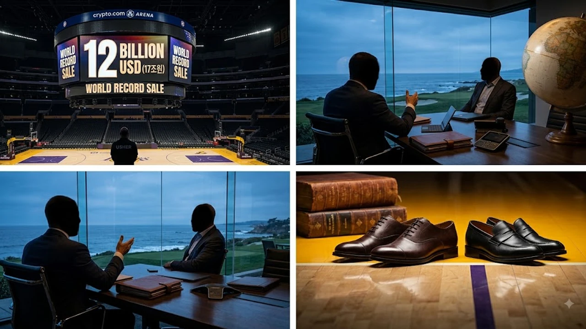

2026년 8월, **LA 레이커스 매각** 건이 공식 확정되며 전 세계 스포츠 자본 시장에 커다란 충격을 던졌다. 무려 **120억 달러(약 17조 원)**라는 천문학적인 액수에 타결된 이번 거래는 스포츠 프랜차이즈 가치 평가 기준을 통째로 바꿔놓았다. 글로벌 콘텐츠 제국을 이끈 인물과 대형 벤처캐피털이 손을 잡은 만큼, 단순한 구단주 교체를 넘어 미디어 IP 사업 전반에 거대한 지각변동이 불어닥칠 전망이다.

---

## 120억 달러의 충격: 스포츠 구단 역대 최고가 경신

### 최고가 매각 기록 비교와 시장의 반응

전 세계 단일 구단 매각 대금이 **120억 달러**를 넘어선 사례는 스포츠 역사상 최초다. 이전 최고 기록이었던 NFL 워싱턴 커맨더스 인수 금액(약 60억 5천만 달러)을 순식간에 2배 가까이 뛰어넘었다.

| 구단명 | 종목 | 매각 금액(달러) | 거래 시점 |
| :--- | :--- | :--- | :--- |
| **LA 레이커스** | NBA | **120억 달러** | 2026년 8월 |
| 워싱턴 커맨더스 | NFL | 60억 5천만 달러 | 2023년 |
| 덴버 브롱코스 | NFL | 46억 5천만 달러 | 2022년 |
| 피닉스 선즈 | NBA | 40억 달러 | 2023년 |

월스트리트저널과 ESPN 등 주요 매체는 초인플레이션 시대에 스포츠 프랜차이즈가 지닌 독보적인 자산 가치와 실시간 인공지능 시대의 대체 불가능한 콘텐츠로서의 위상을 연일 조명하고 있다.

### 마크 월터 인수 1년 만에 20% 폭등한 이유

불과 1년 전 LA 다저스 대주주 마크 월터가 레이커스 지분을 살 때만 해도 구단 평가액은 약 100억 달러 수준이었다. 불과 12개월 만에 **구단 몸값이 20% 뛰었다**.

* **글로벌 브랜드 프리미엄**: 전 세계 스포츠 팀을 통틀어 소셜미디어 언급량 및 굿즈 매출 최상위권 고수
* **천문학적 미디어 중계권**: NBA 차세대 중계권 계약에 따라 매년 폭발적으로 늘어나는 배당금 수입
* **IP 크로스오버 가능성**: 단순 경기 관람을 넘어 가상 공간 및 체험형 테마파크를 통한 직간접 수익화 창출

### 17조 원 가치 평가가 글로벌 스포츠 시장에 미칠 영향

이 거대한 거래는 유럽 축구 빅클럽이나 타 북미 메이저 스포츠 프랜차이즈의 M&A 협상 테이블 기준점(Benchmark)을 한 단계 높였다. 축구계에서도 자본 재편이 한창인 가운데, 최근 [2026 월드컵 바뀌는 32강 방식 완벽 정리](/posts/sports/worldcup-2026-format-32games-change/) 등의 이슈와 맞물려 메이저 스포츠의 상업적 가치는 한층 가파른 상승 곡선을 그리는 중이다.

---

## 밥 아이거와 조슈아 쿠슈너: 거물들의 연합 배경

### 전 월트디즈니 CEO 밥 아이거의 엔터테이닝 전략

이번 거래의 중심에는 월트디즈니를 거대 미디어 공룡으로 일군 **밥 아이거(Bob Iger)**가 있다. 그는 레이커스를 코트 위에서 공을 튀기는 농구팀에 돌려놓지 않고, **글로벌 엔터테인먼트 프랜차이즈**로 체질을 개선할 방침이다.

> *"스포츠 구단은 단순한 승패 기록을 넘어 라이브 스트리밍 시대에 가장 확실한 몰입감을 선사하는 실시간 스토리텔링 플랫폼이다."*

아이거는 레이커스 브랜드를 활용한 글로벌 미디어 다큐멘터리 제작, 비시즌 이벤트 사업, 자체 디지털 채널 확장에 속도를 낼 예정이다.

### 벤처캐피털 스라이브캐피털의 공격적 투자 의도

실질적인 자금줄을 쥔 **조슈아 쿠슈너(Joshua Kushner)**의 스라이브캐피털(Thrive Capital)은 테크 및 미디어에 집중해 온 초대형 VC다.

- **디지털 팬덤 커뮤니티 개발**: 전 세계 팬을 묶어주는 구독형 플랫폼 구축 및 독점 콘텐츠 제공
- **데이터 기반 수익 구조 혁신**: AI 기술을 결합한 티켓팅 시스템 및 개별화된 마케팅 타겟팅
- **자산 유동성 확보**: 인플레이션 헤지 수단으로서 실물 스포츠 자산이 지닌 안정적 리스크 분산

### 구단 경영권 구조 변화와 팬들의 기대감

인수 후에도 레이커스 특유의 전통을 살리기 위해 프런트 오피스 뼈대는 유지하되, 이사회에는 미디어와 테크 전문가를 전면 배치한다. 현지 팬들 역시 첨단 훈련 시설 확충과 과감한 선수단 투자 소식에 뜨거운 기대감을 내비치고 있다.

---

## NBA 구단 가치 폭등의 3가지 핵심 동력

### 신규 중계권 계약 및 미디어 파이프라인의 영향

NBA가 새롭게 체결한 글로벌 중계권 계약은 매년 각 구단에 흘러들어가는 분배금을 비약적으로 늘렸다. 레거시 TV 방송을 넘어 글로벌 OTT 플랫폼 간의 중계권 확보 전쟁이 치열해지면서 라이브 스포츠 희소성이 극대화된 결과다.

### 글로벌 팬덤 확장과 디지털 콘텐츠 수익성

북미 시장에 그치지 않고 아시아, 유럽, 남미로 넓게 퍼진 팬덤은 구단 수익 기반을 더욱 든든하게 받친다.

- **모바일 커머스와 유니폼 판매**: 글로벌 배송망 확충으로 매년 35% 이상 성장세 지속
- **소셜미디어 IP 수익**: 소셜플랫폼 기반의 숏폼 및 하이라이트 영상 자산화를 통한 추가 매출 확보

### LA 시장이 가진 독보적인 브랜드 프리미엄

로스앤젤레스는 세계 미디어와 문화의 중심축이다. 할리우드 스타들의 경기장 방문, 문화적 상징성, 압도적인 지역 소비력이 얽히며 'LA 레이커스'라는 이름 자체에 막대한 프런티어 프리미엄이 부여된다.

---

## LA 레이커스의 향후 전망과 유의할 변수

### 선수단 구성 및 파이낸셜 페어플레이(CBA) 영향

NBA 노사협약(CBA)의 2차 에이프런(Apron) 규제 등 촘촘한 사치세 징수 시스템은 오직 자본력만으로 우승 트로피를 사 오려는 행위를 엄격히 막아선다. 자본력과 별개로 수뇌부의 영리한 캡 매니지먼트 역량이 시험대에 올랐다.

### 구단주 변경에 따른 명문 구단 브랜딩 방향성

새 경영진이 주도할 테크 중심의 데이터 운용과 레이커스 특유의 화려한 전통('Showtime' 문화)이 얼만큼 매끄럽게 조화를 이룰지가 핵심이다. 급격한 상업화 과정에서 코어 팬층의 반발을 줄이는 정교한 스킨십이 요구된다.

### 스포츠 자산 투자 시장의 다음 타자는 누구인가

이번 17조 원 매각은 글로벌 스포츠 M&A 시장의 판도를 완전히 재편했다. 축구와 야구 등 타 메이저 종목의 빅클럽 가치도 일제히 상승 기류를 타고 있다. 대형 자본의 스포츠 유입 트렌드가 더 궁금하다면 [스포츠 전체 글 보기](/posts/sports/)에서 최신 현황을 확인할 수 있다.

#LALakers #LA레이커스 #LA레이커스매각 #NBA #밥아이거 #조슈아쿠슈너 #스포츠비즈니스 #구단가치17조원