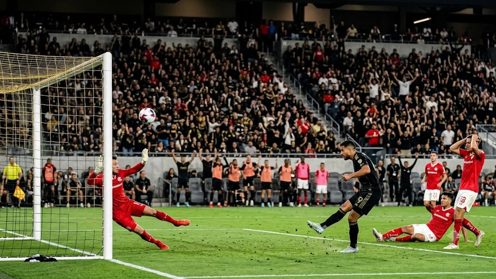

2026년 8월 9일 펼쳐진 리그스컵 페이즈1 2차전에서 로스앤젤레스 FC(LAFC)가 데포르티보 톨루카를 1-0으로 꺾고 극적인 승리를 거머쥐었습니다. 이날 스타팅 라인업에 이름을 올린 **손흥민 톨루카**전 매치에서는 상대 수비진의 질식 수비로 인해 슈팅을 때리지 못했지만, 전방에서 쉼 없이 움직이며 상대 수비 라인을 균열시켰습니다. 치열한 미국 무대 일정 속에서도 손흥민이 가진 공격의 축으로서의 존재감은 팀 승리의 확실한 발판이 되었습니다.

## LAFC vs 톨루카 리그스컵 2차전 주요 경기 결과 요약

### 경기 스코어 및 타임라인 주요 순간 정리
휘슬이 울리자마자 멕시코의 톨루카는 강한 신체 접촉을 마다치 않으며 LAFC의 허리를 끊어내는 데 집중했습니다. 양 팀은 90분 내내 육탄전을 불사하며 치열한 공방전을 펼쳤습니다.

* 전반 30분: LAFC 다비드 마르티네스 경고
* 후반 12분: 톨루카 에베라도 로페즈 경고
* 후반 19분: 톨루카 페데리코 비냐스 경고
* 후반 23분: LAFC 손흥민 교체 아웃
* 후반 46분: LAFC 에디 세구라 결승골 폭발

### 세구라의 후반 46분 극적 결승골 상황 분석
경기 종료 직전 얻어낸 세트피스 혼전 상황에서, 후반 추가시간 2분 에디 세구라가 집요하게 공을 밀어 넣으며 골망을 갈랐습니다. 비디오 판독(VAR)을 거쳐 정당한 골로 판정되자 경기장은 뜨거운 환호성으로 가득 차올랐습니다.

### CONCACAF 챔피언스컵 패배 설욕과 조별리그 순위 변화
지난 5월 CONCACAF 챔피언스컵에서 톨루카에 당했던 뼈아픈 패배를 되갚아준 LAFC는 이번 승리로 귀중한 승점 3점을 챙겼습니다. 이로써 리그스컵 A조 최상위권 싸움에서 한발 앞서 나가며 토너먼트 진출 가능성을 훤히 열었습니다.

## 손흥민 선발 출전 경기력 및 기록 비교분석

### 상대 수비진의 집중 견제와 슈팅 0개의 원인
톨루카 중앙 수비진은 손흥민에게 공이 투입되는 순간 2~3명이 동시에 겹겹이 싸먹는 밀착 수비를 펼쳤습니다. 슈팅 공간을 아예 내주지 않으려는 전술적 덫 때문에 위협적인 유효슈팅을 쏘지 못했고, 후반 23분 체력 안배 차원에서 체포 코치에 의해 교체되었습니다.

> "상대의 집중적인 견제 속에서도 손흥민은 동료들에게 수많은 공간을 만들어주었다. 슈팅 숫자로만 선수의 가치를 전부 평가할 수는 없다." — LAFC 경기 후 현지 미디어 평가

### 패스 성공률 90% 및 전방 연계 플레이 역할 평가
비록 슈팅은 없었으나 68분간 피치를 누비며 패스 성공률 90%를 찍었습니다. 최전방과 측면을 넘나들며 동료들에게 송곳 같은 패스를 찔러넣었고, 강한 전방 압박으로 상대 수비진의 빌드업 줄기를 끊어내는 실속 있는 역할을 해냈습니다. 대표팀에서의 전술적 배치가 궁금하다면 [2026 FIFA 월드컵 한국 대표팀, 16강 넘을 수 있을까](/posts/sports/worldcup-2026-korea-preview/) 글에서 함께 확인해볼 수 있습니다.

### MLS 리그전 연속 골 행진과 리그스컵 무득점 기록 비교
최근 MLS 정규 리그 경기에서는 매서운 골 감각을 과시했으나, 이번 리그스컵 2경기에서는 거친 파울 전술에 묶여 무득점에 그쳤습니다. 그럼에도 본인이 미끼 역할을 수행하며 팀 승리를 견인하고 있다는 점은 긍정적인 신호입니다.

## 상대 팀 톨루카의 거친 전술 대응 장단점

### 주심 휘슬 성향과 톨루카의 물리적 압박 전술
톨루카는 관대한 주심의 성향을 미리 파악한 듯 경기 초반부터 강도 높은 바디 체킹을 시도했습니다. 손흥민을 비롯한 LAFC 공격진의 리듬을 깨뜨리기 위해 거친 플레이를 교묘하게 활용했습니다.

### 전반 PK 수비 판정 번복과 경기 흐름의 변화
전반전 한때 톨루카의 핸드볼 파울을 두고 주심이 페널티킥을 선언했으나, VAR 판독 결과 취소되는 아쉬운 장면이 연출되었습니다. 이 판정 이후 경기는 더욱 과열 양상으로 치달았습니다.

### LAFC 교체 카드가 가져온 피지컬 대응 승리 요인
후반 중반 이후 LAFC는 체력이 소진된 손흥민과 마르티네스를 빼고 피지컬이 좋은 자원들을 대거 투입했습니다. 공중볼 경합과 세트피스 상황에서 물리적 우위를 점한 전략이 결국 후반 46분 세구라의 득점으로 결실을 맺었습니다.

## LAFC의 향후 리그스컵 토너먼트 전망과 과제

### 손흥민 묶였을 때 공격 다변화 가능성 점검
상대 팀들의 손흥민 전담 마크가 갈수록 심해질 것이 명확한 만큼, 2선 자원들과의 스위칭 및 세트피스 무기 다변화가 필수적입니다. 손흥민이 수비를 끌고 다닐 때 반대편 측면이 빈 공간을 허무는 패턴이 완전히 자리를 잡아야 합니다.

### 부앙가·마르티네스 측면 삼각편대 호흡 가이드
드니 부앙가, 다비드 마르티네스, 손흥민으로 이어지는 삼각 편대의 호흡은 경기를 거듭할수록 날카로워지고 있습니다. 좌우 전환 패스 속도를 한 단계 올린다면 상대의 밀집 수비를 한층 쉽게 허물 수 있습니다. 다른 세계적 스타들의 공격 행보가 궁금하다면 [메시 음바페 월드컵 득점왕 경쟁, 2026 골든부트는 누구?](/posts/sports/worldcup-2026-golden-boot-race-messi-mbappe/) 분석도 함께 둘러보시길 추천합니다.

### 다음 경기 일정 및 리그스컵 8강 진출 시나리오
LAFC는 조별리그 1승 1무 이상을 확보하며 토너먼트 8강 진출의 매우 유리한 위치에 섰습니다. 다음 경기에서 손흥민의 부담을 줄이는 전술 변화가 이뤄진다면 우승 도전도 충분히 가능합니다.

#손흥민 #LAFC #MLS리그스컵 #해외축구 #스포츠뉴스 #손흥민톨루카 #스포츠
