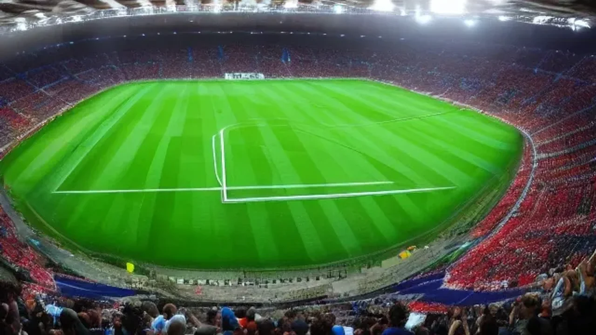

2026 북중미 월드컵 개막이 코앞으로 다가온 지금, 전 세계 축구 팬들의 이목이 프랑스 파리 생제르맹(PSG)에서 활약 중인 이강인 선수에게 집중되고 있습니다. 최근 유럽 현지에서 동시다발적으로 터져 나온 **이강인 이적설**은 단순한 루머를 넘어 구체적인 구단 이름과 이적료가 거론되며 이적시장을 뜨겁게 달구는 중입니다. 이번 글에서는 월드컵 직전 발생한 이강인 이적설의 배경과 유력 행선지, 그리고 향후 커리어에 미칠 파급력을 심층 분석합니다.

## 2026 북중미 월드컵 직전 터진 이강인 이적설 배경

### PSG 내 입지 변화와 유니폼 마케팅 파급력
프랑스 리그앙의 명문 PSG에서 이강인의 위상은 경기장 내 공격포인트를 넘어 상업적 파급력으로 증명됩니다. 2025/2026 시즌 기준 이강인은 킬리안 음바페가 레알 마드리드로 떠난 빈자리를 메우며 **팀 내 유니폼 판매량 1위**를 독식하는 중입니다. 파리 메가스토어와 아시아 전역 공식 매장에서 발생하는 매장 매출은 구단 수뇌부의 핵심 자산입니다. 다만 전술적으로 루이스 엔리케 감독의 로테이션 시스템 탓에 확실한 붙박이 선발 자리를 완벽히 꿰차지 못하면서, 선수 본인의 도약을 위해 이적 스탠스를 취해야 한다는 주장이 설득력을 얻고 있습니다.

### 아틀레티코 마드리드(ATM)가 이강인을 원하는 진짜 이유
스페인 라리가의 거함 아틀레티코 마드리드는 마요르카 시절부터 이강인을 끈질기게 추적해 왔습니다. 디에고 시메오네 감독은 선수의 정교한 왼발 킥과 압박 능력이 팀의 전술 색채에 딱 들어맞는다고 확신합니다. 프랑스 유력지 '르 파리지앵'의 보도에 따르면, ATM은 앙투안 그리즈만의 장기적인 대체자이자 중원의 창의성을 불어넣을 에이스로 이강인을 낙점했습니다. 기술적인 플레이메이커가 갈급한 현재 스쿼드 구조상 이강인의 합류는 시메오네 전술의 치명적인 약점을 보완할 해결책입니다.

### 프리미어리그(EPL) 빅클럽들의 아시아 마케팅 타겟팅 전략
오일 머니와 막강한 자본력을 앞세운 뉴캐슬 유나이티드와 토트넘 홋스퍼 역시 영입 경쟁에 합류했습니다. EPL 구단들이 매력을 느끼는 지점은 이강인이 지닌 **압도적인 아시아 시장 지배력**과 검증된 스타성입니다. 손흥민의 뒤를 이을 차세대 아이콘을 선점해 중계권, 스폰서십, 프리시즌 투어 등 막대한 부가가치를 짜내겠다는 명확한 비즈니스 계산이 깔려 있습니다. 스포츠 비즈니스 전문가들은 EPL 구단들이 제시할 이적료가 PSG의 방어선을 흔들 가장 유력한 카드라고 짚었습니다.

## 이강인 영입을 노리는 유력 구단별 장단점

### 스페인 라리가 복귀 시 얻을 수 있는 전술적 이점
스페인 무대는 이강인에게 앞마당과 다름없습니다. 발렌시아와 마요르카를 거치며 라리가 특유의 거친 압박과 거친 템포를 몸소 겪어낸 상태입니다. ATM으로 둥지를 옮길 경우 적응기 없이 즉시 전력으로 투입될 수 있으며, 특유의 탈압박과 송곳 패스가 스페인 기술 축구 속에서 더욱 만개할 여지가 큽니다. 언어 장벽이 전혀 없고 익숙한 기후를 누릴 수 있다는 점은 선수가 온전히 그라운드에만 집중할 수 있는 최적의 안식처가 됩니다.

### EPL 거함 구단 이적 시 우려되는 주전 경쟁 리스크
세계에서 가장 거칠고 빠른 템포를 요구하는 EPL로의 이적은 명확한 리스크를 동반합니다. 뉴캐슬이나 토트넘 같은 구단은 매 시즌 천문학적인 자금을 쏟아붓기 때문에, 단 몇 경기만 삐끗해도 주전 경쟁에서 미려나는 냉혹한 현실을 마주합니다. 

> "EPL은 피지컬적 압박과 공수 전환 속도가 세계에서 가장 빠른 리그다. 이강인의 천재적인 패스 센스가 빛을 발하려면 템포 적응과 체력적 한계 극복이 선행되어야 한다." - 영국의 축구 통계 매체 오프사이드 리포트

치열한 벤치 싸움 속에서 출전 시간이 줄어들 경우, 한창 전성기를 구가해야 할 나이에 성장세가 정체될 수 있다는 치명적인 단점이 존재합니다.

### 프랑스 잔류와 이적, 이강인 커리어에 미칠 득과 실
PSG에 잔류하는 선택도 나쁜 카드는 아닙니다. 세계 최고 수준의 동료들과 매 경기 호흡을 맞추며 유럽축구연맹(UEFA) 챔피언스리그 대권에 도전할 수 있는 확실한 플랫폼이기 때문입니다. 매 시즌 우승컵을 들어 올릴 수 있는 리그앙의 환경은 안정적인 커리어를 쌓기에 유리합니다. 반면 벤치와 선발을 오가는 로테이션 멤버에 머무른다면, 에이스로서 팀을 진두지휘하고자 하는 선수의 야망을 채우기 어렵습니다. 안정적인 트로피냐, 확실한 에이스로의 도약이냐를 두고 커리어의 분수령을 맞이했습니다.

## 유럽 현지 기자들이 바라보는 이강인 몸값과 이적료 전망

### 로마노 등 공신력 높은 기자들의 실시간 트윗 교차 검증
이적시장 전문가 파브리시오 로마노는 이강인의 이적 가능성에 대해 "PSG는 선수의 마케팅 가치와 잠재력을 높게 평가하고 있어 쉽게 내주지 않을 것"이라고 언급하면서도, "선수 측 대리인이 이미 스페인과 잉글랜드 클럽 관계자들과 미팅을 가졌다는 점은 부인할 수 없는 사실"이라고 전했습니다. 데이비드 온스테인 등 공신력 1티어 기자들의 보도를 종합하면, 단순한 찌라시를 넘어 구단 간 공식 제안서(Official Bid)가 오가기 직전의 단계인 것으로 파악됩니다. [관련 글 보기](/posts/sports/)

### PSG 보드진이 책정한 바이아웃 금액과 협상 테이블의 숨은 진실
PSG가 마요르카에 지급했던 이적료는 약 2,200만 유로였습니다. 그러나 현재 이강인의 가치는 최소 3배 이상 폭등한 상태입니다. 현지 매체들의 분석에 따르면 PSG 보드진이 원하는 최소 이적료는 **6,000만 유로(한화 약 900억 원)** 수준으로 알려졌습니다. 이 금액은 웬만한 빅클럽들도 쉽게 지출하기 어려운 거액이지만, 계약서에 명시된 숨은 바이아웃 조항이나 보너스 옵션 발동 여부에 따라 협상 테이블의 판도가 완전히 뒤바뀔 수 있는 여지가 남았습니다.

### 과거 이적 시장 데이터로 보는 2026년 이강인의 진짜 가치
과거 아시아 축구선수 역대 최고 이적료 기록은 손흥민이 토트넘으로 이적할 당시 기록한 3,000만 유로, 그리고 김민재가 바이에른 뮌헨으로 향하며 기록한 5,000만 유로였습니다. 이강인의 나이가 2026년 기준 20대 중반에 접어들며 전성기에 진입했다는 점, 그리고 미드필더 포지션의 희소성을 고려하면 김민재의 기록을 깨고 **역대 아시아 선수 이적료 1위**를 달성할 확률이 매우 희박하지 않다는 것이 시장의 전반적인 평가입니다.

## 이강인 이적설이 2026 월드컵 대표팀에 미칠 영향과 중계 시청 가이드

### 멘탈 관리가 핵심, 월드컵 조별리그 경기력에 미칠 변수
큰 대회를 앞두고 터지는 이적설은 선수에게 양날의 검으로 작용합니다. 자신의 가치를 세계 무대에서 증명해야 한다는 강력한 동기부여가 될 수 있는 반면, 미래에 대한 불확실성으로 인해 경기 집중력이 흐려질 위험도 공존합니다. 대한민국 축구 국가대표팀의 핵심 플레이메이커인 이강인의 활약 여부에 따라 대표팀의 월드컵 성적이 좌우되는 만큼, 대표팀 코칭스태프 역시 선수가 심리적 안정감을 유지할 수 있도록 특별 관리에 들어간 상태입니다.

### 축구 팬을 위한 실시간 유럽 이적시장 찌라시 팩트체크 방법
이적시장 기간에는 수많은 가짜 뉴스와 과장된 보도가 쏟아집니다. 축구 팬들이 혼란을 겪지 않기 위해서는 정보의 출처를 명확히 구별하는 안목이 요구됩니다. 

* **1티어 공신력:** 파브리시오 로마노, 데이비드 온스테인, BBC, 디 애슬레틱
* **2티어 공신력:** 스카이스포츠, 마르카, 아스, 르 파리지앵
* **주의 요망 (황색 언론):** 더 선, 돈 발론, 커트오프사이드

구단의 공식 발표(Official)가 나오기 전까지는 1티어 기자들의 "Here we go" 문구를 확인하는 습관이 불필요한 감정 소모를 줄이는 가장 확실한 길입니다.

### 쿠팡플레이 및 OTT 플랫폼을 활용한 이강인 출전 경기 실시간 시청 팁
북중미 월드컵 경기와 이강인의 향후 프리시즌 매치는 국내 주요 OTT 플랫폼을 통해 생중계됩니다. 쿠팡플레이는 대한민국 대표팀의 월드컵 예선 및 본선 경기를 고화질로 송출하며, 티빙과 스포티비 나우는 각각 프랑스 리그앙과 스페인 라리가, EPL 주요 경기를 독점 중계합니다. 이용 중인 스마트폰이나 태블릿 PC의 알림 설정을 켜두면 새벽 시간에 열리는 주요 경기와 이적 관련 긴급 속보를 실시간으로 받아볼 수 있어 편리합니다.

**함께 읽으면 좋은 글**
- [메시 음바페 월드컵 득점왕 경쟁, 2026 골든부트는 누구?](/posts/sports/worldcup-2026-golden-boot-race-messi-mbappe/)
- [2026 월드컵 바뀌는 32강 방식 완벽 정리](/posts/sports/worldcup-2026-format-32games-change/)

#이강인이적설 #2026월드컵 #이강인몸값 #PSG방출 #아틀레티코마드리드 #EPL이적 #파브리시오로마노 #이강인유니폼 #축구이적시장 #쿠팡플레이생중계