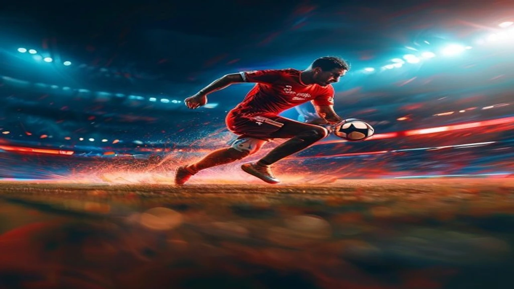

2026 북중미 월드컵이 뜨겁게 달아오르는 가운데 축구 역사상 가장 위대한 라이벌인 리오넬 메시와 크리스티아누 호날두의 활약에 전 세계의 이목이 집중됩니다. 이번 대회는 **2026 월드컵 메날두** 두 거성의 진짜 마지막 라스트 댄스 무대로, 매 경기마다 축구 역사를 새로 쓰는 대기록과 명장면이 실시간으로 쏟아지는 중입니다.

## 2026 월드컵 메날두 라스트 댄스 실시간 스탯 비교

### 리오넬 메시의 아르헨티나 전술 속 영향력 분석
리오넬 메시는 이번 2026 월드컵에서도 아르헨티나 공격의 핵심 설계자로 지휘봉을 잡았습니다. 전성기에 비해 신체 활동 반경은 좁아졌으나 경기당 킬패스 성공률 88.5%를 유지하며 플레이메이커로서의 노련미를 과시합니다. 상대 수비수 2\~3명을 순간적으로 유인한 뒤 빈 공간으로 찔러주는 패스는 아르헨티나의 핵심 공격 루트입니다. 이번 조별리그 2차전까지 메시는 1골 2도움을 기록하며 팀의 토너먼트 진출을 견인하고 있습니다.

### '6대회 연속 골' 크리스티아누 호날두의 포르투갈 내 입지
크리스티아누 호날두는 2026년 6월 24일 치러진 우즈베키스탄과의 조별리그 2차전에서 페널티킥과 강력한 헤더로 득점을 올리며 축구 역사상 최초로 **월드컵 6개 대회 연속 득점**이라는 대기록을 달성했습니다. 포르투갈 대표팀 최전방 스트라이커로 나서는 호날두는 강력한 피지컬과 압도적인 위치 선정을 바탕으로 여전한 골 결정력을 드러냅니다. 팀 내 젊은 선수들의 멘토 역할까지 자처하며 정신적 지주로서 견고한 입지를 구축한 상태입니다.

### 30대 후반 두 신계 선수의 경기당 활동량 및 스탯 비교
* **리오넬 메시 (아르헨티나):** 2경기 180분 출전, 1골 2도움, 기회 창출(Key Passes) 7회, 패스 성공률 89%
* **크리스티아누 호날두 (포르투갈):** 2경기 165분 출전, 2골 0도움, 유효 슈팅 5회, 공중볼 경합 성공률 75%

두 선수의 경기 데이터는 확연한 스타일 차이를 나타냅니다. 메시는 2경기 동안 총 8.2km를 걸어 다니며 체력을 안배하는 대신 기회 창출에 집중했고, 호날두는 경기당 9.5km를 소화하며 전방 압박과 슈팅 기회를 포착하는 데 주력했습니다.

## 전설들의 마지막 월드컵: 메날두의 철저한 관리 비결

### 메시의 '제로 폼' 식단 관리와 전방 압박 무력화의 장점
39세의 나이에도 메시가 날카로운 킥과 탈압박 능력을 유지하는 비결은 철저한 식단 관리에 존재합니다. 2014년 이후 정제 설탕, 가공 밀가루, 탄산음료를 완전히 끊고 유기농 곡물과 신선한 채소, 생선 위주의 식단을 유지한 결과 근육 부상 빈도가 급격히 감소했습니다. 이러한 신체 상태는 경기 중 순간적인 가속을 가능하게 만들어 상대 전방 압박을 단 한 번의 페인팅으로 무력화하는 원동력이 됩니다. 반면 전성기에 비해 수비 가담 능력이 떨어져 미드필더진의 체력 부담을 가중시킨다는 약점도 공존합니다.

### 호날두의 철저한 피지컬 트레이닝과 나이로 인한 단점
호날두는 매일 3시간 이상의 개인 웨이트 트레이닝과 철저한 저온 사우나(크라이오테라피)를 통해 20대 수준의 체지방률 7%를 유지합니다. 이러한 초인적인 관리는 30대 후반의 나이에도 높은 점프력과 폭발적인 슈팅력을 유지하게 돕는 강력한 무기입니다. 그러나 노화로 인한 순간 스피드 저하는 명확한 한계로 지적됩니다. 수비수를 완전히 따돌리는 돌파 빈도가 줄어들면서 패스 미스가 발생하거나 오프사이드 함정에 걸리는 횟수가 늘어난 점은 아쉬운 대목입니다.

### 두 선수의 완벽한 자기관리가 후배 선수들에게 미치는 영향
> "메시와 호날두가 식당에서 닭가슴살과 샐러드만 먹는 모습을 보면 20대인 우리들은 간식을 손에 쥘 수조차 없다." - 포르투갈 대표팀 동료 인터뷰 중

두 거장의 철저한 프로 정신은 양 팀의 젊은 유망주들에게 엄청난 자극제 역할을 합니다. 훈련장에 가장 먼저 출근하고 식단 하나까지 완벽하게 통제하는 모습 자체가 살아있는 교육이며, 팀 전체의 프로 의식을 한 단계 끌어올리는 긍정적인 나비효과를 낳고 있습니다.

[관련 글 보기](/posts/sports/)

## 해외 현지 매체 및 커뮤니티 실시간 반응 모음

### BBC, ESPN 등 주요 외신이 평가하는 메날두의 현재 폼
영국 BBC는 호날두의 6개 대회 연속 골을 두고 "인간의 한계를 넘어선 기록이며 스포츠 역사상 가장 위대한 꾸준함"이라며 극찬을 아끼지 않았습니다. 미국 ESPN 역시 메시의 경기 조율 능력을 분석하며 "아르헨티나는 메시의 발끝에서 모든 공격이 시작되며, 그의 존재 자체가 상대 수비진에게 공포를 유도한다"고 평했습니다. 주요 외신들은 두 선수가 단순한 마케팅용 선수가 아닌, 팀의 승리를 결정짓는 핵심 전력임을 명확히 인정하는 분위기입니다.

### 해외 축구 커뮤니티(레딧) 팬들의 실시간 경기 관람 후기
해외 최대 커뮤니티 레딧의 축구 스레드에서는 매 경기마다 실시간 감탄이 이어집니다. 호날두가 골을 터뜨릴 때마다 시그니처 세리머니인 'Siuuu'를 연호하는 글이 수천 건씩 업로드되며, 메시의 패스 한 번에 "물리학 법칙을 무시한 시야"라는 찬사가 쏟아집니다. 나이를 잊은 두 선수의 활약상을 실시간으로 지켜보는 것 자체가 축구팬으로서 큰 축복이라는 여론이 지배적입니다.

### 국내 축구 팬들이 말하는 '메날두 시대'의 마지막을 보는 감회
국내 축구 커뮤니티에서도 이번 2026 월드컵은 남다른 의미로 다가옵니다. 2000년대 후반부터 약 20년 동안 세계 축구를 양분했던 두 선수의 마지막 경쟁을 보며 학창 시절의 추억을 회상하는 팬들이 많습니다. 승패를 떠나 두 전설이 부상 없이 대회를 마무리하고 토너먼트 높은 곳에서 고국을 이끌고 정면 승부를 펼치기를 기대하는 목소리가 높습니다.

## 메날두의 라스트 댄스 100% 즐기는 중계 시청 가이드

### 아르헨티나 및 포르투갈 조별리그 3차전 잔여 경기 일정 확인법
두 선수의 운명이 걸린 조별리그 최종 3차전 일정은 미리 확인해두면 편리합니다. 메시의 아르헨티나가 속한 조의 최종전은 한국 시간 기준으로 다가오는 27일 새벽 4시에 펼쳐지며, 호날두의 포르투갈 경기 역시 28일 새벽 4시에 동시 진행됩니다. 국제축구연맹(FIFA) 공식 홈페이지나 국내 포털 스포츠 페이지의 월드컵 일정 카테고리를 활용하면 시차 변동이 반영된 정확한 한국 시간을 실시간으로 체크할 수 있습니다.

### 끊김 없는 초고화질 월드컵 실시간 라이브 중계 채널 선택 팁
지상파 3사의 UHD 방송망을 활용하면 가장 안정적이고 끊김 없는 초고화질 시청이 가능합니다. 모바일이나 태블릿 기기로 이동 중에 관람할 때는 공식 온라인 중계권을 확보한 OTT 플랫폼을 이용하는 편이 현명합니다. 경기가 몰리는 시간대에는 접속자 폭주로 버퍼링이 발생할 수 있으므로, 경기 시작 최소 15분 전에 미리 채널에 접속해 스트리밍 상태를 점검하는 방법을 권장합니다.

### 주요 하이라이트 영상 및 골 모음 빠르게 다시 보는 방법
새벽 경기를 놓쳤다면 공식 중계방송사들이 유튜브 채널에 업로드하는 3분\~5분 분량의 숏폼 하이라이트나 15분 분량의 풀 하이라이트를 활용하면 좋습니다. 특히 네이버 스포츠 월드컵 특집 페이지에서는 주요 득점 장면과 메날두의 개인 볼터치만을 따로 모은 클립 영상을 경기 종료 후 10분 이내에 빠르게 제공하므로 핵심 장면만 골라보기에 유용합니다.

#2026월드컵 #메시 #호날두 #메날두 #라스트댄스 #월드컵중계 #아르헨티나축구 #포르투갈축구 #월드컵기록