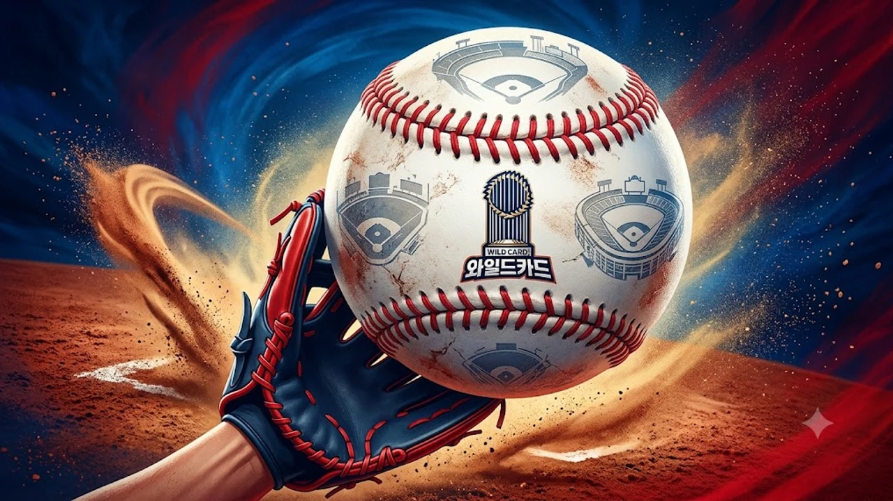

2026 MLB 포스트시즌 와일드카드 시리즈가 본격적인 막을 올리면서 전 세계 메이저리그 팬들의 시선이 가을야구 무대로 집중되고 있습니다. 단 3전 2선승제로 다음 라운드 진출 팀을 가리는 단기전 특성상, 1차전 기선 제압 여부에 따라 시리즈의 운명이 송두리째 바뀝니다. 이번 포스팅에서는 양대 리그 대진표 구성과 함께 관전의 핵심이 될 매치업 포인트를 빠짐없이 짚어냅니다.

## 2026 MLB 와일드카드 시리즈 개막 대진 및 최신 일정

### 아메리칸리그 와일드카드 매치업: 양키스 vs 레드삭스 격돌
아메리칸리그에서는 전통의 숙적인 뉴욕 양키스와 보스턴 레드삭스가 단기전 외나무다리에서 마주쳤습니다. 정규시즌 내내 한 치 앞을 내다보기 힘들었던 아메리칸리그 동부지구의 혈투가 가을야구 첫 관문에서 그대로 이어지는 구도입니다. 또 다른 대진에서는 꾸준한 저력을 보여준 휴스턴 애스트로스가 패기 넘치는 시카고 화이트삭스를 상대로 디비전시리즈 진출권을 다툽니다.

### 내셔널리그 와일드카드 매치업: 필리스 vs 브레이브스 등 격전지
내셔널리그 역시 정규시즌 라이벌리가 그대로 살아난 대진으로 채워졌습니다. 필라델피아 필리스와 애틀랜타 브레이브스의 격돌은 막강한 선발 로테이션과 화력전이 동시에 맞부딪히는 격전지입니다. 한편 김하성의 친정팀으로 국내 팬들에게 친숙한 샌디에이고 파드리스는 시카고 컵스를 홈으로 불러들여 초반 기선 제압에 나섭니다.

### 한국 시간 기준 1·2·3차전 경기 시간표 총정리
모든 와일드카드 경기는 상위 시드 팀의 홈구장에서 3연전으로 연속 진행됩니다. 한국 시간 기준으로 주요 매치업은 오전 4시부터 정오에 걸쳐 순차적으로 시작하므로 출근길과 오전 시간을 활용해 실시간 흐름을 챙겨보기 좋습니다. 
- 1차전: 10월 1일(한국 시간)
- 2차전: 10월 2일(한국 시간)
- 3차전: 10월 3일(필요시 진행)

## 전통의 라이벌전 양키스 대 레드삭스 관전 포인트

### 가을야구에서 다시 만난 앙숙: 정규시즌 전적과 분위기
두 팀의 맞대결은 가을야구 흥행을 책임지는 최대 빅매치입니다. 정규시즌 맞대결 전적에서도 승패 차이가 거의 나지 않을 만큼 팽팽한 호각세를 유지했습니다. 단 3판 2선승 단기전에서는 정규시즌 누적 성적보다 당일 라인업의 타격감과 수비 집중력 한 방이 승패를 곧장 결정짓습니다.

### 핵심 전력 변수: 애런 저지의 컨디션과 타선의 홈런포
양키스 타선의 중심은 단연 애런 저지입니다. 상대 배터리가 저지를 어떻게 견제하느냐, 혹은 정면 승부를 피했을 때 후속 타선이 해결사 역할을 해내느냐가 양키스 득점 루트의 알파이자 오메가입니다. 레드삭스는 집요한 볼 배합으로 출루를 억제하고 장타를 원천 차단하는 전략을 들고나올 가능성이 높습니다.

### 단기전 승부를 가를 선발 마운드와 불펜 운용 비교
> 단기전 승부의 8할은 마운드 운영에서 갈린다. 선발 투수의 이닝 소화력보다 퀵후크 타이밍과 필승조의 연투 능력이 승부를 결정짓는다.

양 팀 모두 1차전 선발에게 긴 이닝을 맡기기보다는 주자가 쌓이는 위기 상황에서 즉각 불펜을 가동하는 속도전을 택할 확률이 큽니다. 불펜진의 평균자책점과 승계 주자 실점률 관리가 양 팀 벤치의 가장 큰 숙제입니다. [스포츠 전체 글 보기](/posts/sports/)를 통해 다른 종목의 시즌 분석 흐름도 함께 확인할 수 있습니다.

## 언더독의 반란 가능성과 1차전 결과 분석

### 시카고 화이트삭스 vs 휴스턴 애스트로스 승부처
가을야구 경험치 측면에서는 휴스턴 애스트로스가 확실한 우위를 점하고 있습니다. 하지만 화이트삭스의 젊은 선발진이 초반 기세를 탈 경우, 예측을 깨는 반전 시나리오가 충분히 쓰일 수 있습니다. 단기전에서는 한 번 터진 분위기가 2경기 만에 시리즈를 끝내버리는 일이 빈번합니다.

### 샌디에이고 파드리스 타선 폭발과 시카고 컵스 반격 시나리오
샌디에이고의 강점은 상하위 타선의 유기적인 연결력입니다. 펫코 파크 특유의 투수 친화적 환경을 감안할 때, 대량 득점보다는 찬스에서의 집중타와 기동력이 승패를 가릅니다. 컵스는 특유의 끈끈한 출루 능력을 앞세워 파드리스 불펜을 일찌감치 소모시키는 작전을 펼칠 전망입니다.

### 1차전 승리 팀의 디비전시리즈(DS) 진출 확률 비교
- 와일드카드 시리즈 1차전 승리 팀의 시리즈 통과 확률: **약 70% 이상**
- 이동일 없는 3연전 구조상 1차전 패배 팀이 느끼는 투수진 운용 압박: 극대화

1차전을 내준 팀은 2차전에 모든 필승 카드를 쏟아부어야 하므로, 투수진 로테이션이 완전히 꼬이게 됩니다. 첫 판을 잡는 팀이 사실상 디비전시리즈 티켓의 절반 이상을 손에 쥐는 셈입니다.

## 2026 포스트시즌 중계 시청 방법 및 하이라이트 확인 팁

### 국내 온라인·TV 공식 생중계 채널 안내
국내 메이저리그 중계권은 스포츠 전문 OTT 플랫폼인 SPOTV NOW 및 TV 채널 SPOTV Prime을 통해 실시간 송출됩니다. 모바일과 PC 환경에서 끊김 없이 고화질로 시청하려면 플랫폼 멤버십 상태를 미리 점검해두는 편이 좋습니다.

### 놓치기 아쉬운 주요 경기 하이라이트 바로보기
새벽이나 오전 생중계를 놓쳤다면 MLB 공식 유튜브 채널과 공식 홈페이지(MLB.com)를 확인하면 됩니다. 경기 종료 후 30분 이내에 8~10분 분량의 압축 하이라이트가 업로드되어 주요 승부처 장면을 빠르게 복기할 수 있습니다.

### 향후 디비전시리즈 및 월드시리즈 전체 일정 가이드
와일드카드 시리즈가 종료되면 각 지구 우승을 차지한 상위 1, 2번 시드 팀들이 기다리는 디비전시리즈가 곧바로 이어집니다. 이후 7전 4선승제의 챔피언십시리즈를 거쳐 대망의 월드시리즈까지 10월 한 달 내내 숨 가쁜 일정이 이어집니다.

가을야구 직관이나 홈 응원 분위기를 제대로 내고 싶다면 팀별 굿즈를 갖춰보는 것도 좋습니다. [MLB 공식 모자 및 야구용품 쿠팡에서 보기](https://www.coupang.com/np/search?q=MLB%EC%95%BC%EA%B5%AC%EC%9A%A9%ED%92%88&sourceType=affiliate&trackingCode=AF8691300)

#2026MLB #MLB포스트시즌 #와일드카드 #가을야구 #양키스레드삭스 #메이저리그중계 #MLB일정 #야구분석