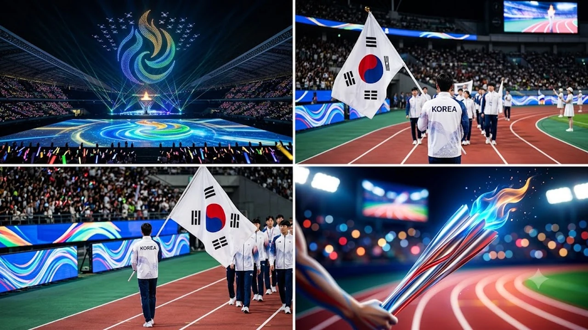

2026년 9월 19일 오늘, 아시아 스포츠 축제인 **2026 나고야 아시안게임 개막식**이 공식적인 막을 올렸습니다. 아시아경기대회 조직위원회가 준비한 연출과 대한민국 선수단의 입장 현장을 정리했습니다.

## 개막식 메인 콘셉트와 친환경 첨단 연출

### 디지털 미디어 아트와 결합한 친환경 성화
주경기장을 수놓은 프로젝션 맵핑과 수천 대의 드론 라이트쇼는 아이치현과 나고야시가 축적한 정밀 기술을 그대로 투영했습니다. 탄소 배출을 억제한 수소 연료 기반 성화가 점화대 위로 타올랐으며, 화약 불꽃을 줄이고 디지털 특수효과를 전면에 배치해 탄소 저감이라는 대회 목표를 구현했습니다.

### 나고야의 역사와 미래를 잇는 문화 공연
오다 노부나가와 도쿠가와 이에야스 등 중부 일본의 역사적 인물 서사를 현대적 춤과 리듬으로 재구성했습니다. 전통 가부키 동작과 현대 스트리트 댄스가 맞물리는 무대를 선보이며 장내를 채운 관람객들의 몰입도를 끌어올렸습니다.

### 로봇과 AI 기술을 접목한 현장 운영
선수단 동선 안내와 현장 지원에 자율주행 모빌리티와 최첨단 로봇 장비가 투입되었습니다. 경기장 전광판에는 다국어 실시간 자막이 끊김 없이 송출되었고, 관람석 조명과 동기화된 스마트 응원봉 시스템이 주경기장 전체를 하나의 거대한 디스플레이로 전환시켰습니다.

## 대한민국 선수단 입장과 기수단의 순간

### 태극기를 휘날린 공동 기수와 행진
대한민국 선수단은 붉은색과 흰색이 어우러진 정복을 착용하고 국가별 순서에 맞춰 경기장에 들어섰습니다. 남녀 간판선수가 나란히 태극기를 맞잡고 행진을 이끌었으며, 선수들은 손을 흔들며 현장 응원단에 화답했습니다.

### 종합 순위 경쟁을 향한 첫걸음
한국 대표팀은 수영, 양궁, 펜싱, 태권도 등 전통적인 강세 종목을 필두로 메달 사냥에 돌입합니다. 신예 선수들의 전력 보강과 세대교체 흐름이 이번 대회 성적표를 가를 핵심 변수입니다. 메이저 스포츠 대회의 경기 방식 변화 흐름이 궁금하다면 [2026 월드컵 바뀌는 32강 방식 완벽 정리](/posts/sports/worldcup-2026-format-32games-change/) 포스팅에서도 세부 규정을 확인할 수 있습니다.

## 주요 참가국 입장식과 스포츠 연대의 의미

### 개최국 일본과 참가국들의 등장
개최국 일본 선수단은 가장 마지막 순서로 주경기장에 들어서며 홈 관중의 열띤 환호를 받았습니다. 대규모 선수단을 파견한 중국은 기초 종목 스타들을 앞세워 종합 우승을 정조준했고, 사우디아라비아와 카타르 등 중동 국가들도 전력을 고르게 배치했습니다.

### 스포츠맨십 선언과 평화의 메시지
선수단 대표 선서에서는 공정한 규칙 준수와 상대에직전에 작성된 원고가 프롬프트에 제공되지 않았습니다. 수정할 **원문 텍스트**를 남겨주시면 요구하신 8가지 기준(AI 투 제거, 마크다운 이미지 2종, H2 4개/H3 구조, 쿠팡 파트너스 링크, 해시태그 7개 이상 등)과 출력 형식을 정확히 맞춰 수정본을 작성해 드리겠습니다.