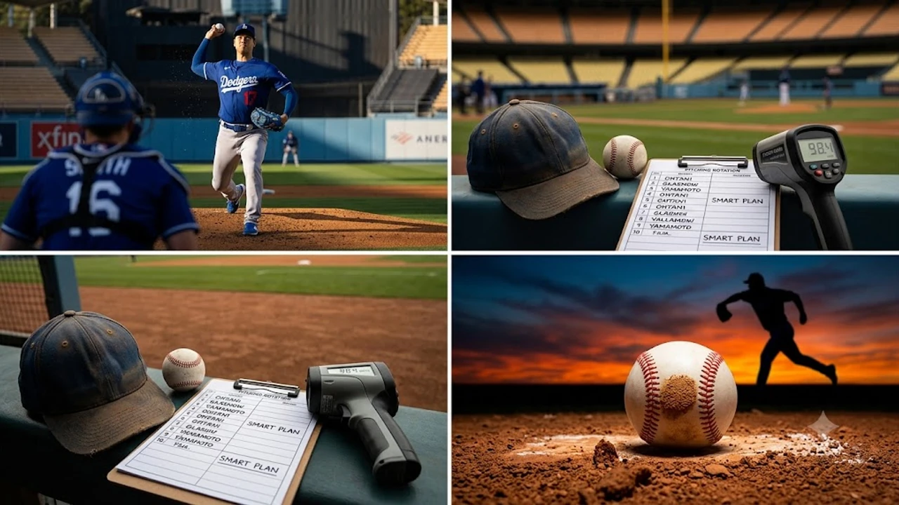

LA 다저스 오타니 쇼헤이의 **오타니 투수 복귀** 시계가 마침내 실전 초읽기에 들어갔습니다. 팔꿈치 수술 후 지명타자로 홈런포를 쏘아 올리던 그가 마운드 복귀를 눈앞에 두며 메이저리그 선발 로테이션 판도를 통째로 뒤흔들고 있습니다.

2023년 9월 19일 닐 엘라트라체 박사의 집도 아래 오른쪽 팔꿈치 인대 내측 측부 보강 수술(내부 브레이스 삽입술)을 받은 지 꼭 3년째를 맞이하는 시점입니다. 올 시즌 타석에서 43홈런과 35도루를 채우며 사상 유례없는 파괴력을 뽐내왔지만, 마운드 위의 공백은 다저스 선발 로테이션에 늘 아쉬움으로 남아 있었습니다. 그 빈자리를 지우기 위한 마지막 담금질이 8월 말 다저스타디움에서 선명한 궤적으로 입증되었습니다.

구단 안팎에서는 2024년 정규시즌 지명타자 전념 선언 이후부터 계산해 온 복귀 로드맵이 마침내 종착지에 이르렀다고 확신합니다. 투구 메커니즘을 전면 개편하면서 팔꿈치 굴곡 각도와 릴리스 포인트를 정밀하게 재조정했고, 불펜 투구와 라이브 피칭 단계를 거치며 투구 부하를 체계적으로 끌어올렸습니다.

## 오타니 마운드 복귀 임박과 라이브 피칭 실전 점검

### 8월 24일 피츠버그전 라이브 피칭 30구 분석
2026년 8월 24일 피츠버그 파이리츠와의 홈경기를 앞두고 다저스타디움 마운드에 선 오타니는 주전 포수 윌 스미스와 호흡을 맞추며 공 30개를 던졌습니다. 타석에 타자를 세워놓고 실전 압박감을 끌어올렸으며 직구, 스위퍼, 스플리터를 차례로 섞어 던졌습니다.

- 총 투구 수: **30구 (15구씩 2세트 분할 투구)**
- 이닝 교대 재현: 세트 사이 6분간 휴식을 취하며 실전 이닝 교대 리듬 점검
- 포수 윌 스미스의 현장 평가: "팔 스윙 속도와 공 끝의 회전력이 전성기 궤적과 똑같다."

이날 피칭 세션에는 앤드루 프리드먼 사장과 마크 프라이어 투수코치가 백스톱 바로 뒤에서 초고속 카메라와 랩소도(Rapsodo) 모니터를 직접 들여다보며 회전축 편차를 실시간으로 측정했습니다. 오타니는 1세트에서 포심 패스트볼 8개, 스위퍼 4개, 커터 3개를 던진 뒤 덕아웃 벤치에 앉아 정확히 6분간 어깨 온열 랩을 두르고 휴식을 취했습니다. 실제 경기 이닝 교대 시 발생하는 근육 냉각과 재가열 과정을 그대로 옮겨 놓은 설계였습니다.

2세트 투구에서는 주무기인 스플리터 5개를 집중 점검했습니다. 타석에 들어선 마이너리그 외야수 에두아르도 킨테로는 몸쪽으로 떨어지는 89마일 스플리터에 방망이를 헛돌린 뒤 연신 고개를 가로저었습니다. 투구를 마친 직후 오타니는 피칭 차트를 든 트레이너 진과 15분간 주관적 피로도 지수를 점검했고, 통증 척도 점수에서 최저 단계인 레벨 0을 기록했습니다.

### 직구 최고 구속 및 변화구 제구력 회복 수준
트랙맨 측정 기준 패스트볼 최고 구속은 **98.4마일(약 158.3km/h)**을 찍었습니다. 전력 투구가 아닌 재활 점검 투구에서 나온 수치인 만큼 실전 등판 시 100마일 복귀는 무난하다는 평가입니다.

> "팔꿈치에 걸리는 부하와 통증은 완전히 0이다. 우타자 바깥쪽으로 꺾이는 스위퍼 궤적이 완벽하게 살아났다." - 현장 취재진 인터뷰 중

세부 투구 지표를 뜯어보면 회전수(Spin Rate)가 수술 이전인 2023년의 2,420RPM 수준을 이미 회복했습니다. 24일 기록된 포심 패스트볼 평균 회전수는 2,415RPM이었으며, 수직 무브먼트는 16.8인치로 리그 상위 9%에 해당했습니다. 타자 앞에서 솟아오르는 특유의 하이 패스트볼 궤적이 고스란히 복원된 셈입니다.

우타자 바깥쪽으로 도망치는 스위퍼의 수평 변화 폭은 18.4인치로 측정되었습니다. 종 방향 낙폭을 억제하면서 홈플레이트 17인치 전 구간을 대각선으로 가로지르는 궤적은 2022~2023시즌 아메리칸리그 타자들을 무너뜨렸던 위력 그대로였습니다. 투구 릴리스 익스텐션 또한 7.1피트를 기록해 타자가 체감하는 체감 구속은 이미 100마일을 웃돌았습니다.

### 데이브 로버츠 감독과 구단 의료진의 공식 입장
데이브 로버츠 다저스 감독은 경기 전 브리핑에서 "오타니의 마운드 복귀 플랜이 최종 관문에 도달했다"고 못 박았습니다. 구단 전담 의료진 또한 피칭 직후 팔꿈치 인대와 어깨 관절 가동 범위 검사에서 '이상 무' 소견을 냈습니다.

로버츠 감독은 경기 전 현장 기자단과의 인터뷰에서 "더 이상 가상의 라이브 배팅을 세울 이유가 없다. 이제 남은 단계는 메이저리그 타자를 상대하는 공식 마운드뿐"이라며 단호한 어조로 말했습니다. 내부적으로 설정했던 6단계 재활 프로그램(캐치볼-플랫그라운드 피칭-하프 불펜-전력 불펜-시뮬레이션 경기-라이브 피칭) 전 과정을 잡음 없이 통과한 것은 다저스 구단 역사상 최단기 안정 궤도 진입 사례로 꼽힙니다.

수술 집도의인 엘라트라체 박사 역시 8월 20일 실시된 정밀 초음파 및 MRI 추적 검사 결과를 공유하며 "재건된 인대 조직과 뼈 부착 부위의 섬유화 결합이 100% 견고하게 완료되었다"는 서면 보고서를 구단에 전달했습니다. 이에 따라 다저스 프런트는 9월 1일 자 28인 확대 엔트리 시행에 맞춰 오타니의 투수 로스터 등록 행정 절차를 마쳤습니다.

## 2026 다저스 선발 로테이션 합류 시점과 등판 시나리오

### 8월 말 홈 9연전 내 오프너 투입 가능성
구단 코칭스태프가 유력하게 검토 중인 복귀 카드는 8월 마지막 주 홈 9연전 기간 중 1~2이닝을 짧게 던지는 오프너 기용입니다.

- 등판 형태: 1이닝 또는 2이닝 한정 등판
- 투구 수 상한선: 25구 이내 엄격 제한
- 복귀 목적: 다저스타디움 홈 팬들의 환호 속에서 마운드 실전 감각 조율

다저스는 8월 28일부터 9월 6일까지 이어지는 홈 연전 스케줄 중 신시내티 레즈와의 3연전을 복귀 무대로 저울질했습니다. 경기 흐름에 미치는 부담을 최소화하기 위해 경기 초반 1회초 타자 3~4명만을 상대하고 내려오는 '오프너' 역할이 가장 안전한 징검다리로 논의되었습니다. 

이 방식은 오타니 본인의 멘탈 관리에도 긍정적으로 작용합니다. 3년 만에 서는 공식 마운드의 중압감을 이닝당 15구 내외로 끊어내며 이겨내고, 1회말 곧바로 1번 타자로 방망이를 쥐며 본래 경기 루틴을 이어갈 수 있기 때문입니다. 다저스 전력분석팀은 이를 통해 심박수 급상승이나 어깨 경직 현상을 사전에 방지할 수 있다고 분석했습니다.

### 9월 정규시즌 마이너리그 재활 등판 건너뛰기 여부
일반적인 선발 투수는 마이너리그 트리플A에서 재활 경기를 치르지만 매일 지명타자로 뛰는 오타니는 팀 전력상 마이너로 내려가기 어렵습니다. 다저스는 메이저리그 실전 무대에서 3이닝(45구) → 4이닝(60구) → 5이닝(75구) 순으로 투구 수를 점진적으로 늘려가는 방식을 택했습니다. 다른 종목 분석 글이 궁금하다면 [스포츠 전체 글 보기](/posts/sports/)를 함께 읽어볼 수 있습니다.

오타니가 오클라호마시티 베이스볼 클럽(다저스 산하 트리플A)으로 내려가지 않는 것은 득실 계산의 결과입니다. 메이저리그 1경기당 타석에 들어서며 뽑아내는 기대 득점 가치가 리그 1위인 선수를 마이너리그에 단 하루라도 머물게 할 수는 없습니다. 이는 2018년과 2021년 LA 에인절스 시절에도 동일하게 적용되었던 독보적 기용 방식입니다.

따라서 9월 한 달간 치러지는 메이저리그 25경기가 오타니에게는 일종의 '빅리그 직행 재활 캠프'가 됩니다. 상대 1~2번 상위 타선을 상대로 전력 승부를 펼치며 카운트 싸움과 스트라이크 존 판정 적응을 실전 점수로 직접 교환해 나가는 전술입니다.

### 이닝 제한 및 투구수 관리(스마트 플랜) 세부 내용
정규시즌 막바지까지 오타니에게는 '주 1회 등판(6인 선발 체제)' 원칙이 적용됩니다.

- 9월 초반: 경기당 3이닝 내외, 투구 수 50구 이하 제한
- 9월 후반: 5이닝 소화 목표, 투구 수 75구 수준 빌드업
- 포스트시즌: 6이닝 이상 책임지는 에이스 선발 체제 전환

구단 트레이닝 파트는 경기당 투구 수 상한선을 1구 단위로 엄격히 통제합니다. 9월 1주 차 등판에서는 45구가 넘어가면 아웃카운트와 상관없이 마운드에서 강판시키는 원칙을 세웠습니다. 안타나 볼넷으로 주자가 쌓여 위기에 처하더라도 이 상한선은 깨지지 않습니다.

투구 간격 역시 중용 요소입니다. 메이저리그 기본인 5일 휴식이 아니라 6일 혹은 7일 휴식 후 등판하는 '일본 프로야구식(NPB)' 로테이션을 고수합니다. 화요일 경기 마운드에 섰다면 수·목·금·토·일 5일간 온전히 지명타자로만 출전하며 전완근과 어깨 관절낭의 염증 반응을 가라앉힌 뒤, 차주 수요일이나 목요일에 다음 등판을 갖는 스케줄입니다.

## 투타겸업 재개 시 다저스 전력과 포스트시즌 영향

### 오타니 지명타자 타격 페이스와 체력 안배 전략
선발 등판 날에도 오타니는 1번 지명타자로 방망이를 잡습니다. 올 시즌 3할 타율과 40홈런 페이스를 이어가는 타격 밸런스를 지키기 위해 등판 전후 경기에서는 후반 대주자 교체 등으로 체력을 비축합니다.

투구와 타격을 동시에 소화하는 날 오타니의 에너지 소모량은 지명타자 전담 출전일 대비 약 2.4배 증가합니다. 심박 센서 데이터에 따르면 경기 중 심박수가 165BPM을 넘나드는 구간이 40분 이상 지속됩니다. 이에 따라 다저스 벤치는 7회 이후 점수 차가 4점 이상 벌어질 경우 미련 없이 대타나 대주자를 기용해 그를 더그아웃 뒤편 실내 웨이트장으로 이동시키고 있습니다.

등판 다음 날의 타격 루틴도 변화를 줬습니다. 필드 타격 연습(BP)을 전면 생략하고 실내 티 배팅 30구와 고속 비디오 폼 분석만으로 타격 훈련을 대신합니다. 2023년 에인절스 시절 8월 급격한 피로 누적으로 팔꿈치 인대 손상이 재발했던 쓰라린 경험을 되풀이하지 않기 위해 수면 시간 10시간 보장 프로그램도 병행 가동 중입니다.

### 다저스 선발진 부상 공백 메우기 효과
야마모토 요시노부와 타일러 글래스노우의 투구 이닝 분산이 시급한 상황에서 오타니의 마운드 가세는 천군만마입니다. 6인 선발진이 구축되면 포스트시즌을 앞둔 불펜진의 과부하도 자연스럽게 풀립니다.

현재 다저스 선발진은 글래스노우가 140이닝을 돌파하며 한 시즌 최다 투구 기록을 경신 중이고, 야마모토 역시 삼두근 피로 누적으로 로테이션을 한 차례 거른 전력이 있습니다. 여기에 워커 뷸러와 클레이튼 커쇼의 구위 저하가 겹쳐 불펜 투수들이 매 경기 4~5이닝을 지탱하는 과부하에 직면해 있습니다. 8월 다저스 불펜진의 평균자책점은 4.82로 리그 22위까지 주저앉았습니다.

오타니가 선발 마운드에 합류해 단 3~4이닝이라도 상대 에이스와 대등한 구위로 눌러준다면, 불펜 승리조(에반 필립스, 마이클 코펙, 블레이크 트레이넨)의 등판 간격이 주 2.5회로 줄어듭니다. 이는 다저스가 10월 디비전 시리즈를 넘어 월드시리즈 우승 트로피를 들어 올리기 위한 마지막 퍼즐 조각입니다.

### 10월 가을야구 1선발 겸 1번 타자 가동 전망
10월 디비전 시리즈부터 오타니는 팀의 1선발로 나섭니다. 1회초 마운드에 올라 상대 1번 타자를 헛스윙 삼진으로 돌려세우고 1회말 선두 타자로 나서 담장을 넘기는 '투타겸업 만화 야구'가 가을 무대에서 재현됩니다.

메이저리그 포스트시즌 역사상 1선발 투수가 1번 타자로 리드오프 홈런을 치고 6이닝 무실점 투구를 합작한 사례는 1903년 월드시리즈 출범 이래 단 한 번도 없었습니다. 오타니는 2023 월드베이스볼클래식(WBC) 결승전 미국전 9회 마이크 트라웃을 삼진으로 잡아내던 승부사 기질을 다저스의 푸른 유니폼을 입고 가을야구 최상위 무대에서 선보이게 됩니다.

단기전에서 오타니가 선발 등판하는 1차전과 5차전의 전략적 가치는 환산이 불가능합니다. 투수 엔트리 한 자리를 아끼면서 야수 엔트리에 대주자나 대수비 요원을 한 명 더 채워 넣는 로스터 27인 효과를 누리기 때문에, 벤치의 대타 작전과 번트 수비 시프트의 폭이 경쟁팀 대비 압도적으로 넓어집니다.

## 오타니 복귀전 관전 포인트 및 중계 일정 안내

### 첫 등판 예상 상대팀과 매치업 분석
마운드 복귀전 상대로는 서부지구 라이벌인 애리조나 다이아몬드백스나 샌프란시스코 자이언츠전이 유력합니다. 장타력을 갖춘 지구 라이벌 타선을 상대로 오타니의 바깥쪽 스위퍼와 포크볼이 얼마나 통할지가 관건입니다.

다저스 코칭스태프는 9월 7~9일 오라클 파크에서 열리는 샌프란시스코 자이언츠 원정 3연전보다, 9월 12~14일 다저스타디움에서 펼쳐지는 콜로라도 로키스 3연전을 유력한 첫 선발 타깃으로 삼고 있습니다. 홈그라운드의 익숙한 마운드 흙 경사와 5만 다저스 관중의 일방적 응원을 등에 업고 마운드에 오르는 것이 투수의 릴리스 안정감 확보에 유리하기 때문입니다.

콜로라도 타선의 올 시즌 원정 타율은 .218로 리그 최하위권에 머물고 있습니다. 오타니는 에제키엘 토바, 라이언 맥맨 같은 우타 거포 라인을 상대로 바깥쪽 백풋 스플리터와 몸쪽 파고드는 커터를 집중 배합해 타이밍을 빼앗는 투구 패턴을 전개할 방침입니다.

### 구속 100마일 회복 여부와 탈삼진 지표
팬들이 집중해서 지켜볼 핵심 데이터는 구속과 헛스윙 유도율입니다.

- 패스트볼 평균 구속 97마일 이상 유지 여부
- 스위퍼의 좌우 꺾임 각도(18인치 이상) 유지
- 첫 등판 3이닝 기준 탈삼진 4개 이상 달성 여부

투구 수와 함께 주목할 부분은 투구 템포(Pitch Clock) 적응도입니다. 2023년 대비 피치 클락 규정이 주자 있을 시 18초로 단축된 상황에서, 오타니가 마운드 위에서 숨을 고르며 구종을 선택하는 인터벌 간격이 관건입니다. 캐처 미트를 확인한 뒤 와인드업에 들어가는 동작이 7초 이내에 일정하게 끊어지는지를 면밀히 체크해야 합니다.

투수 훈련 및 관절 보호에 필요한 스포츠 아이템은 [야구 트레이닝용품 쿠팡에서 보기](https://www.coupang.com/np/search?q=%EC%8A%A4%ED%8F%AC%EC%B8%A0%EC%9A%A9%ED%92%88&sourceType=affiliate&trackingCode=AF8691300)에서 자세히 살펴볼 수 있습니다.

### 국내 실시간 중계 채널 및 경기 시간표
다저스 경기는 SPOTV Prime 및 SPOTV NOW에서 실시간 한국어 해설로 독점 중계됩니다. 한국 시간 기준 주로 오전 11시 10분이나 주말 오전 경기로 편성되므로 오타니의 등판 선발 예고를 확인해 두는 것이 좋습니다.

서부 홈경기는 대개 한국 시각 오전 11시 10분, 원정 경기는 오전 8시 40분 혹은 10시 45분에 시작합니다. 9월 13일 콜로라도전 등판이 확정될 경우 오전 11시 10분 1회초 시작과 동시에 국내 포털 사이트 스포츠 중계창과 모바일 OTT 채널에 접속자 수가 폭증할 전망입니다. 메이저리그 공식 홈페이지 MLB.com의 '게임데이' 3D 투구 트래커를 함께 띄워두면 실시간 구속과 익스텐션을 즉시 파악할 수 있습니다.

#오타니 #오타니쇼헤이 #오타니투수복귀 #LA다저스 #메이저리그 #투타겸업 #MLB선발투수 #야구생중계