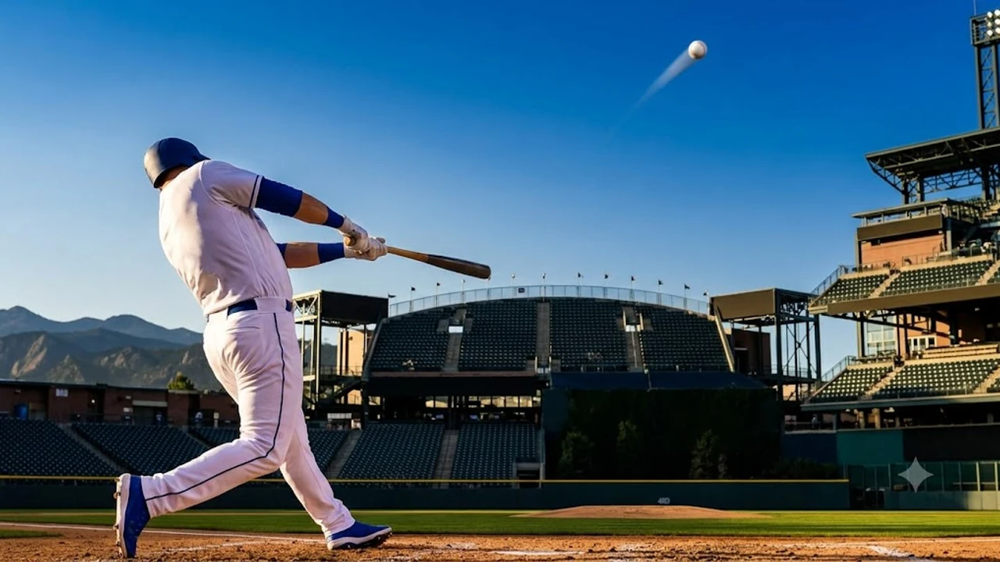

메이저리그의 살아있는 전설 오타니 쇼헤이가 2026년 8월 19일 마침내 시즌 **오타니 30홈런** 고지에 올라서며 6년 연속 30홈런이라는 금자탑을 쌓았습니다. LA 다저스 타선의 핵심 축으로 활약 중인 그는 콜로라도 로키스와의 원정 경기에서 시원한 아치를 그리며 메이저리그 연속 시즌 기록을 한 단계 끌어올렸습니다. 정교한 콘택트 능력과 폭발적인 파워를 동시에 입증한 이번 대기록은 단순한 홈런 하나 이상의 묵직한 역사적 가치를 품고 있습니다.

## 쿠어스필드를 가른 한 방, 6년 연속 30홈런의 순간

### 136m 대형 아치와 2026 시즌 30호 홈런 기록
2026년 8월 19일 미국 콜로라도주 덴버 쿠어스필드에서 열린 경기에서 오타니는 3회초 무사 1루 상황에 타석에 들어섰습니다. 상대 선발 투수가 던진 시속 151km 바깥쪽 직구를 가볍게 밀어쳐 가운데 담장을 훌쩍 넘기는 **비거리 136m 대형 2점 홈런**을 작렬했습니다. 타구 속도는 시속 178km에 달했고, 배트 중심에 정확히 얹힌 타구는 순식간에 관중석 깊숙한 곳으로 사라졌습니다. 

이 한 방으로 오타니는 2021년 에인절스 시절(46홈런)부터 2022년(34홈런), 2023년(44홈런), 2024년(54홈런), 2025년(48홈런)에 이어 **6년 연속 30홈런**을 완성했습니다.

### 다저스 구단 역사 25년 만에 등장한 3년 연속 30홈런
다저스 프랜차이즈 역사에서도 손꼽히는 순간입니다. 다저스 유니폼을 입고 3년 연속 30홈런 이상을 쏘아 올린 타자는 2001년 게리 셰필드 이후 무려 25년 만에 처음입니다.

> "매 타석 내 스윙 궤적과 타이밍에만 집중했다. 기록은 팀 승리를 위해 집중한 결과로 자연스럽게 따라왔다."

오타니는 경기 후 인터뷰에서 개인 기록보다 팀 승리에 무게를 둔 소감을 밝혔습니다. 다저스 타선 전체의 득점력을 홀로 견인하는 간판타자의 면모를 유감없이 발휘하고 있습니다.

## 2021년부터 이어진 꾸준함, 대기록 달성의 기술적 요인

### 장타율과 타구 속도를 유지하는 타격 메커니즘
오타니가 장기간 흔들림 없이 홈런 페이스를 이어가는 비결은 단단한 하체 중심 이동과 간결한 손목 턴에 있습니다. 

- **배트 스피드 극대화**: 상체 회전 반경을 최소화하고 골반 회전 속도를 폭발적으로 끌어올려 강력한 타구를 만듭니다.
- **배럴 타구 생산율**: 타구 각도 25~30도 구간에 공을 정확히 맞히는 배럴 타구 비율이 리그 상위 1%를 지킵니다.
- **스트라이크 존 공략**: 존 안으로 들어오는 패스트볼을 놓치지 않고 장타로 연결하는 집중력이 독보적입니다.

### 지명타자 전담 출전과 체력 관리 루틴의 상관관계
타격에 오롯이 몰입하는 환경은 체력 소모를 덜고 타석에서의 순간 집중도를 끌어올리는 바탕이 되었습니다. 경기 전 철저한 영상 분석과 스트레칭 루틴을 거치며 매 경기 최상의 밸런스를 지켜냅니다. 8월 한여름 혹서기에도 타구 비거리가 줄어들지 않는 탄탄한 하체 보강 훈련이 긴 정규시즌 레이스를 버텨내는 원동력입니다.

### 부상 방지를 위한 스윙 궤적의 미세 변화
상대 배터리의 집요한 몸쪽 승부에 대처하고자 스윙 궤적을 정교하게 다듬었습니다. 강하게 당겨치기만 하던 과거 방식에서 벗어나 바깥쪽으로 흘러나가는 공을 결대로 밀어쳐 장타를 뽑아내는 유연성을 갖췄습니다. 헛스윙 삼진을 줄이고 배트와 공의 유효 접촉 면적을 넓혀 기복 없는 타격 수치를 쌓아가는 비결입니다.

## 베이브 루스와의 비교, 현대 야구에서 갖는 역사적 가치

### 6년 연속 30홈런이 메이저리그 역사에서 드문 이유
현대 야구는 투수들의 구속 비약과 고도화된 수비 시프트, 정밀한 데이터 분석 탓에 매년 30개 이상의 홈런을 때려내기 어려운 환경입니다. 메이저리그 역사상 6년 연속 30홈런 고지를 밟은 선수는 행크 애런, 배리 본즈, 알렉스 로드리게스 등 손에 꼽힙니다. 오타니는 아시아 출신 타자 최초로 이 전설적인 대열에 합류하며 독보적인 족적을 새겼습니다.

축구계에서 [메시 음바페 월드컵 득점왕 경쟁, 2026 골든부트는 누구?](/posts/sports/worldcup-2026-golden-boot-race-messi-mbappe/)와 같은 세기의 대결이 펼쳐지듯, 야구계에서는 오타니가 남기는 누적 스탯 하나하나가 야구 역사를 실시간으로 새로 쓰는 과정입니다.

### 단일 시즌 폭발력 vs 수년간 지속되는 누적 생산성
오타니의 진가는 단기 몰아치기에 그치지 않고 매 시즌 OPS 0.950 이상을 꾸준히 찍어낸다는 점에 있습니다. 

| 구분 | 2021~2023 시즌 (에인절스) | 2024~2026 시즌 (다저스) |
| :--- | :--- | :--- |
| **평균 홈런 수** | 시즌당 41.3개 | 시즌당 44.0개 (진행 중) |
| **주요 역할** | 투타겸업 핵심 에이스 | 지명타자 및 타선 중심 |
| **타격 생산성** | 리그 최상위권 장타율 | 역대급 순수 타격 지표 달성 |

부상 없이 매 타석을 책임지며 팀 공격력을 끌어올리는 내구성과 생산성이 돋보입니다.

### 2026 정규시즌 MVP 레이스에 미칠 영향
이번 30홈런 달성으로 오타니는 내셔널리그 MVP 레이스에서 선두 자리를 굳혔습니다. 쟁쟁한 경쟁자들의 맹추격 속에서도 홈런, 장타율, OPS 전 부문에서 압도적인 수치를 이어가며 MVP 투표인단의 표심을 단단히 붙잡고 있습니다.

## 포스트시즌을 향한 다저스와 오타니의 다음 목표

### 40홈런-40도루 재도전 가능성과 잔여 경기 일정
정규시즌 잔여 일정이 남아있는 상황에서 오타니의 시선은 40홈런 고지를 향해 달립니다. 도루 페이스 역시 흔들림 없이 유지하고 있어 호타준족의 상징인 40-40 클럽 가입 여부가 뜨거운 화두로 떠올랐습니다. 

- 남은 경기 동안 철저한 타격 밸런스 유지
- 경기 후반 승부처에서의 과감한 주루 플레이
- 상대 배터리의 견제를 뚫어내는 기민한 베이스 러닝

### 가을야구 진출을 앞둔 다저스 타선의 시너지 효과
오타니의 불붙은 타격감은 무키 베츠, 프레디 프리먼 등 다저스 상위 타선과의 시너지로 이어집니다. 중심 타선에서 확실한 장타를 터뜨려주면서 후속 타자들의 득점 기회가 크게 늘어났습니다. 정규시즌 우승을 넘어 월드시리즈 제패를 노리는 다저스에게 오타니의 6년 연속 30홈런 페이스는 포스트시즌 최고의 공격 옵션입니다.

#오타니 #오타니30홈런 #메이저리그 #LAD다저스 #오타니홈런기록 #쿠어스필드 #MLB홈런순위 #야구대기록 #오타니쇼헤이