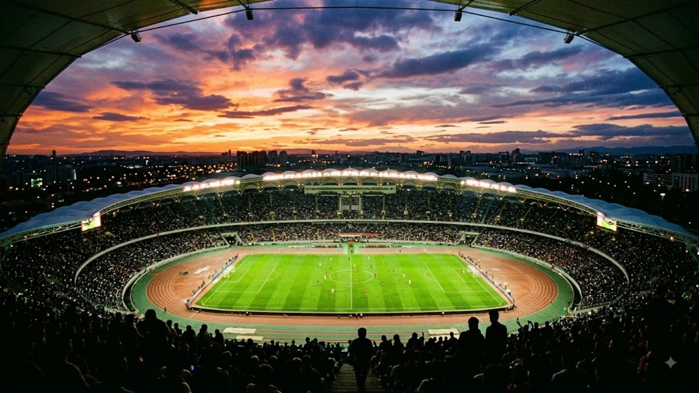

2026 UEFA 슈퍼컵 PSG의 우승 트로피 수집 행진이 새 시즌 시작과 함께 다시 불붙었습니다. 파리 생제르맹(PSG)은 오스트리아 잘츠부르크 레드불 아레나에서 열린 애스턴 빌라와의 단판 승부에서 2-1 승리를 거두며 유럽 챔피언의 저력을 입증했습니다. 이번 승리로 파리는 대회 2연패를 달성함과 동시에 구단 통산 61번째 공식 트로피를 장식했습니다.

## 2026 UEFA 슈퍼컵 결승 리뷰와 PSG의 2연패 달성

### 오스트리아 잘츠부르크에서 펼쳐진 치열한 결승 매치업
오스트리아 잘츠부르크 레드불 아레나에 모인 2만 9천여 관중 앞에서 UEFA 챔피언스리그 챔피언 PSG와 UEFA 유로파리그 우승팀 애스턴 빌라가 맞붙었습니다. 경기 초반은 팽팽한 중원 압박 싸움으로 흘러갔으나, 빠른 템포의 측면 전환을 통해 서서히 파리가 주도권을 장악했습니다.

### 크바라츠켈리아와 데지레 두에의 결정적인 연속골
파리의 선제골은 전반 38분 크비차 크바라츠켈리아의 발끝에서 터졌습니다. 왼쪽 측면을 허문 뒤 시도한 감각적인 오른발 감아차기 슛이 골문 구석을 갈랐습니다. 후반 14분에는 신예 데지레 두에가 문전 혼전 상황을 놓치지 않고 침착하게 밀어 넣으며 2-0으로 격차를 벌렸습니다.

### 애스턴 빌라의 막판 추격전과 실점 방어
애스턴 빌라는 후반 36분 코너킥 세트피스 상황에서 만회골을 터뜨리며 거세게 추격했습니다. 하지만 파리의 수비 라인은 추가시간 5분 동안 침착하게 상대의 롱볼 공격을 차단하며 1골 차 리드를 지켜냈습니다.

## PSG 승리를 이끈 핵심 전술 포인트 3가지

### 측면 과부하를 이용한 박스 타격
루이스 엔리케 감독은 좌우 윙포워드에게 넓은 공간을 맡기며 풀백과의 연계 플레이를 집중 지시했습니다. 빌라의 좁은 수비 블록을 바깥쪽으로 끌어낸 뒤, 하프스페이스로 침투하는 미드필더들에게 슈팅 찬스를 만든 전술이 적중했습니다.

> "상대의 촘촘한 밀집 수비를 깨뜨리기 위해선 측면에서 수비를 끌어낸 뒤 순간적으로 발생하는 중앙 틈새를 공략해야 했다."

### 후방 빌드업 안정감과 압박 분쇄
애스턴 빌라 특유의 높은 전방 압박을 무력화한 것은 PSG 수비진의 탈압박 능력이었습니다. 골키퍼부터 시작되는 짧은 패스 워크로 1차 압박 라인을 벗겨낸 뒤, 곧바로 전방 공격진에게 롱 패스를 전달하는 속도전이 빌라의 수비 복귀 타이밍을 흔들었습니다.

### 후반 교체 타이밍을 통한 경기 템포 조율
엔리케 감독은 후반 20분 이후 공격진과 중원의 기동력을 유지하기 위해 발 빠른 교체 카드를 꺼냈습니다. 체력 소모가 극심했던 시점에 투입된 자원들이 전방 압박을 재가동하면서 상대의 빌드업 전개를 효과적으로 지연시켰습니다.

## 애스턴 빌라의 분전과 드러난 한계점

### 에메리 감독의 실리 축구와 날카로운 역습
우나이 에메리 감독은 강력한 피지컬을 앞세워 실리적인 맞불을 놓았습니다. 특히 볼 탈취 직후 전방으로 한 번에 연결되는 직선적인 역습은 파리 수비진의 간담을 서늘하게 만드는 장면을 여러 차례 연출했습니다.

### 세트피스 집중력과 결정력의 아쉬움
빌라는 후반 세트피스에서 위협적인 득점을 뽑아냈으나, 전반전에 찾아온 2차례의 결정적인 단독 찬스를 놓친 점이 뼈아팠습니다. 유럽 최정상 팀과의 대결에서 찾아오는 결정적 찬스를 살리지 못하면 승부를 뒤집기 어렵다는 사실을 다시 확인했습니다.

### 유럽 대항전 경쟁력 입증과 남은 과제
슈퍼컵 트로피는 놓쳤지만, 애스턴 빌라는 지난 시즌 유로파리그 우승에 이어 챔피언스리그 무대에서도 통할 수 있는 팀 조직력을 과시했습니다. 다만 시즌 개막을 앞두고 측면 수비의 커버 범위 보완과 90분 내내 유지할 수 있는 경기 템포 유지가 숙제로 남았습니다.

## 2026-27 시즌 유럽 축구 판도와 PSG의 전망

### 통산 61번째 트로피 획득이 주는 상징성
파리 생제르맹은 이번 슈퍼컵 타이틀을 더해 구단 역사상 61번째 우승을 완성했습니다. 프랑스 리그1을 넘어 유럽 대항전에서도 꾸준히 정상급 경쟁력을 증명하며 세계적인 빅클럽으로서의 입지를 더욱 확고히 굳혔습니다. 지난여름 각국 스타들이 출전했던 [2026 월드컵 바뀌는 32강 방식 완벽 정리](/posts/sports/worldcup-2026-format-32games-change/) 흐름 속에서도 주전 선수들의 피로도를 훌륭히 관리한 결과입니다.

### 리그1 개막전과 챔피언스리그 2연패 도전
슈퍼컵을 기분 좋게 마무리한 파리는 이제 리그1 타이틀 방어와 챔피언스리그 2연패라는 대장정에 나섭니다. 두에와 크바라츠켈리아 등 젊은 에이스들의 폼이 최고조에 달해 있어 시즌 초반부터 강력한 순위 경쟁을 펼칠 전망입니다.

### 글로벌 축구 팬들이 주목하는 2026-27 시즌 관전 포인트
새 시즌 유럽 축구는 클럽대항전의 개편된 일정과 더불어 주요 빅클럽들의 치열한 전력 보강으로 그 어느 때보다 예측하기 어려운 승부가 이어질 것으로 보입니다. 슈퍼컵을 통해 기선 제압에 성공한 PSG가 과연 유럽 무대 정상의 자리를 굳건히 지켜낼지 전 세계 축구 팬들의 이목이 쏠립니다.

#PSG #2026UEFA슈퍼컵 #파리생제르맹 #애스턴빌라 #크바라츠켈리아 #데지레두에 #루이스엔리케 #유럽축구