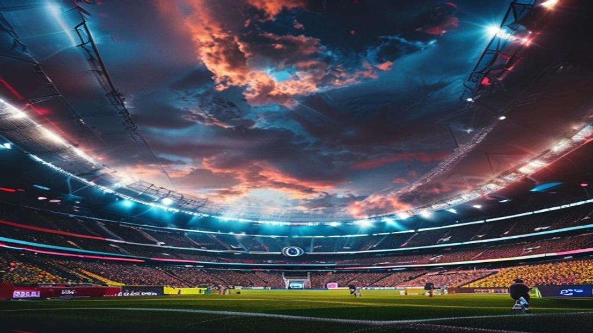

2026 북중미 월드컵 결승전에서 스페인이 아르헨티나를 꺾고 최고 존엄의 자리에 올랐습니다. 2026-07-20 메트라이프 스타디움 현장은 전 세계 축구 팬들의 함성으로 뒤흔들렸고, **2026 월드컵 스페인 우승**이라는 역사적 이정표와 함께 리오넬 메시의 라스트 댄스 역시 마침표를 찍었습니다. 연장 후반 106분에 터진 페란 토레스의 극적인 결승골은 무적함대의 완전한 부활을 알린 한 방이었습니다.

## 16년 만의 정상 복귀, 스페인의 2026 월드컵 결승전 전술 완벽 정리

### 아르헨티나 맞춤형 압박 전술과 메시 봉쇄 전략
스페인 대표팀은 결승전 kickoff 직후부터 강력한 중원 압박을 가해 아르헨티나의 1차 빌드업 길목을 철저히 차단했습니다. 특히 상대의 기점 역할을 맡은 미드필더진을 1차 압박선에 가두며 전진 패스 시도 자체를 무력화했습니다.

* **중원 점유율 완승**: 스페인은 경기 점유율을 58%까지 끌어올리며 피치 위 주도권을 독점했습니다.
* **패스 길목 차단**: 아르헨티나 특유의 측면 전환 패스를 선제 차단해 상대 공격 템포를 완전히 무너뜨렸습니다.

### 연장 후반을 지배한 세대교체의 힘과 체력적 우위
젊은 선수 위주로 라인업을 개편한 스페인은 연장전으로 접어들수록 압도적인 체력 격차를 드러냈습니다. 90분 내내 이어진 유기적인 위치 선정과 스위칭 플레이는 체력이 고갈된 아르헨티나 포백 수비진에 균열을 만들어냈습니다.

> "스페인의 세대교체는 단순한 인적 쇄신을 넘어 전술적 완성도를 극한으로 끌어올린 분수령이었다." - 현지 스포츠 분석가

### 페란 토레스의 극적인 결승골 순간 분석
연장 후반 106분 승부의 추를 기울인 페란 토레스의 득점은 이번 결승전의 백미였습니다. 우측 공간을 순식간에 파고든 뒤 시도한 반박자 빠른 템포의 슈팅은 상대 골키퍼의 다이빙 반경을 벗어나 골문 구석 구석을 정확히 찔렀습니다.

---

## 메시의 마지막 라스트 댄스는 왜 아쉬움을 남겼나?

### 아르헨티나 공격진의 체력적 한계와 메시 의존도
아르헨티나는 메시의 발끝에서 시작되는 공격 전개가 봉쇄되자 해법을 찾지 못하고 고전했습니다. 대회 후반부로 갈수록 베테랑 주전진의 피로도가 가중되었고, 이는 결정적인 순간 전진 패스 미스와 수비 실책으로 표출되었습니다. [메시 음바페 월드컵 득점왕 경쟁, 2026 골든부트는 누구?](/posts/sports/worldcup-2026-golden-boot-race-messi-mbappe/) 포스팅에서 다뤘듯, 메시에게 쏠린 기량 의존도가 경기 막판 극복하기 힘든 과제로 다가왔습니다.

### 대회 기간 보여준 '라스트 댄스'의 명장면과 성과
비록 우승 트로피는 놓쳤으나 메시가 이번 대회에서 선보인 기량은 라스트 댄스라는 이름값에 걸맞았습니다. 토너먼트 매 라운드마다 결정적인 공격 포인트를 올리며 팀을 결승까지 견인한 집념은 축구 역사에 남을 명장면을 만들었습니다.

### 엔소 페르난데스 퇴장 등 경기 막판 결정적 악재
아르헨티나는 연장 후반 경고 누적으로 엔소 페르난데스가 퇴장당하며 수적 불리라는 치명상을 입었습니다. 수비 밸런스가 무너진 상태에서 동점골을 노려야 했던 아르헨티나는 스페인의 노련한 경기 운영에 가로막혀 무릎을 꿇었습니다.

---

## 현지 미디어 및 해외 반응으로 본 우승 분수령

### 글로벌 축구 팬들과 외신의 실시간 반응 총정리
경기 종료 직후 외신들은 스페인의 패스 축구가 한 단계 더 진화했다고 평가했습니다. 소셜 미디어상에서도 스페인의 성공적인 세대교체와 전술적 우위에 대한 찬사가 이어졌습니다.

* **BBC**: "무적함대의 복귀, 전술적 판정승이었다."
* **L'Équipe**: "스페인의 피지컬과 패기가 아르헨티나의 노련함을 압도했다."

### 메트라이프 스타디움 현장 열기와 우승 세레머니
미국 메트라이프 스타디움은 8만여 관중이 내뿜는 열기로 가득 찼습니다. 시상식에서 스페인 선수단이 트로피를 들어 올리는 순간, 밤하늘을 수놓은 폭죽과 함께 무적함대의 왕좌 귀환을 알리는 축제가 펼쳐졌습니다.

### 주요 외신들이 꼽은 경기 MVP와 명장면
결승골의 주인공 페란 토레스뿐만 아니라, 경기 내내 3선을 지키며 아르헨티나의 공세를 차단한 스페인의 미드필더진이 숨은 MVP로 지목되었습니다. 한편, 이번 대회 변경된 세부 규정과 진행 방식이 궁금하다면 [2026 월드컵 바뀌는 32강 방식 완벽 정리](/posts/sports/worldcup-2026-format-32games-change/) 글을 통해 확인할 수 있습니다.

---

## 월드컵 종료 직후 시작되는 유럽 여름 이적시장 관전 포인트

### 월드컵 활약으로 몸값 급상승한 스페인 신예 스타들
대회가 막을 내림과 동시에 유럽 빅클럽들의 타깃이 된 유망주들의 이적설이 표출되고 있습니다. 특히 월드컵이라는 큰 무대에서 기량을 검증받은 스페인의 신예들은 이번 여름 이적시장에서 가장 뜨거운 매물로 평가받고 있습니다.

### 빅클럽들의 주요 선수 영입 경쟁 전망 및 체크리스트
레알 마드리드, 맨체스터 시티, 바르셀로나 등 매머드급 구단들은 월드컵 스타들을 선점하기 위해 거액의 이적료를 장전하고 있습니다.

- **체크리스트 1**: 선수별 바이아웃(최저 이적료) 조항 및 계약 만료일
- **체크리스트 2**: 빅클럽들의 FFP(재정적 페어플레이) 규정 충족 여부
- **체크리스트 3**: 팀 내 주전 경쟁 구도와 선수 본인의 이적 선호도

### 2026-2027 시즌 개막 전 꼭 확인해야 할 축구 뉴스 검색법
이적시장 속보는 구단 공식 발표나 공신력 높은 취재 기자의 오피셜 보도를 확인하는 것이 가장 확실합니다. 출처가 불분명한 찌라시성 뉴스에 휘둘리지 말고 오피셜 마크가 명시된 뉴스를 필터링하여 추적하는 노하우가 필요합니다.

#2026월드컵 #스페인우승 #페란토레스 #메시라스트댄스 #월드컵결승전 #북중미월드컵 #축구이적시장 #무적함대