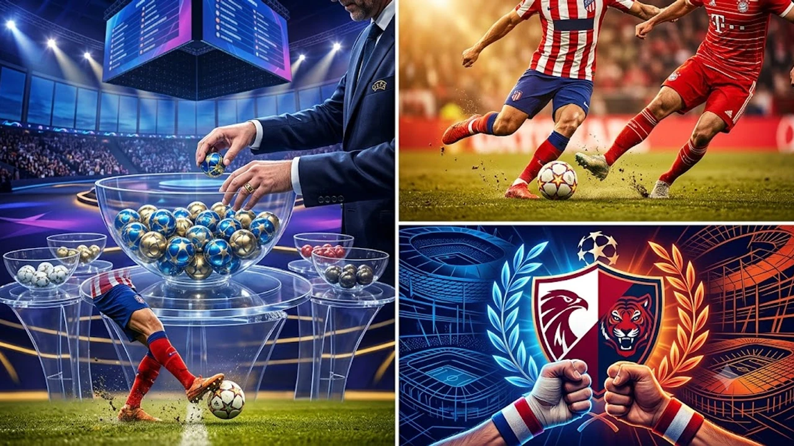

2026-27 시즌 유럽 축구 최고 권위의 무대인 **UCL 대진 확정** 소식이 발표되며 축구계가 요동치고 있습니다. 36개 팀 단일 리그 체제로 치러지는 이번 챔피언스리그 추첨 결과, 한국 축구를 대표하는 두 간판스타의 정면 승부가 성사되었습니다. 별들의 전쟁 한가운데서 격돌하는 두 선수의 맞대결 관전 포인트와 전체 대진 흐름을 정리합니다.

## 2026-27 UEFA 챔피언스리그 본선 대진 추첨 결과 분석

### 단일 리그 페이즈 도입 3년 차, 달라진 대진 방식
UEFA가 전통적인 32강 조별리그를 폐지하고 36개 팀 단일 리그 페이즈(Swiss Model)를 정착시킨 세 번째 시즌입니다. 모든 참가 팀은 추첨으로 정해진 홈 4경기와 원정 4경기를 치러 1위부터 36위까지 단일 순위표로 경쟁합니다.

- **1위~8위**: 16강 토너먼트 직행 티켓 확보
- **9위~24위**: 홈 앤드 어웨이 녹아웃 플레이오프 진출
- **25위~36위**: 유로파리그 강등 없이 유럽 대항전 즉시 탈락

승점 1점과 골득실 하나로 8위 직행과 24위 탈락의 희비가 엇갈리는 만큼, 매 라운드가 단두대 매치나 다름없습니다.

### 포트별 주요 빅클럽 추첨 결과 요약
포트 1부터 포트 4까지 고르게 강팀들이 얽히며 초반부터 빅매치 일정이 빽빽하게 들어찼습니다. 레알 마드리드, 맨체스터 시티, 바이에른 뮌헨, 아틀레티코 마드리드 등 우승 후보군이 16강 직행을 두고 초반부터 전력을 쏟아부어야 하는 구조입니다. 국가대표팀에서 핵심 축으로 호흡을 맞춘 주역들이 이번엔 소속팀의 생존을 걸고 격돌하게 되며, 지난 대표팀 흐름은 [2026 FIFA 월드컵 한국 대표팀, 16강 넘을 수 있을까](/posts/sports/worldcup-2026-korea-preview/)에서 확인할 수 있습니다.

## 별들의 전쟁서 펼쳐지는 코리안 더비: 이강인 vs 김민재

### 아틀레티코 마드리드 이강인의 전술적 핵심 역할
디에고 시메오네 감독 체제에서 이강인은 2선과 중앙을 넘나드는 핵심 플레이메이커 역할을 수행합니다. 수비 전환 후 빠른 역습 상황에서 상대 압박을 벗겨내고 찔러주는 침투 패스는 팀 공격의 시발점입니다. 높은 수비 라인을 형성하는 뮌헨의 뒷공간을 공략할 때 이강인의 정교한 왼발 궤적은 승부를 가를 결정타가 됩니다.

### 바이에른 뮌헨 철벽 수비 김민재와의 맞대결 관전 포인트
바이에른 뮌헨의 수비 라인을 지키는 김민재는 넓은 수비 반경과 폭발적인 전진 차단 능력을 자랑합니다.

> "이강인이 하프스페이스에서 볼을 잡는 찰나의 순간, 김민재가 전진 압박으로 차단하느냐 이강인이 탈압박으로 벗겨내느냐의 타이밍 승부가 핵심이다."

단 한 번의 볼 터치 실수나 템포 차이로 득점과 실점이 직결되는 최정상급 공격과 수비의 격돌입니다.

### 두 선수의 상대 전적 및 최근 경기력 점검
유럽 클럽 대항전 본선 무대에서 선발 맞대결을 펼치는 것은 두 선수 커리어 사상 최초입니다. 대표팀에서 수년간 호흡을 맞추며 서로의 움직임 패턴과 볼 줄기를 완벽히 파악하고 있는 만큼 치열한 수 싸움이 예고됩니다.

## 2026-27 UCL 조별 주요 매치업 및 죽음의 대진

### 레알 마드리드와 맨시티 등 우승 후보들의 맞대결 일정
리그 페이즈 초반부터 강력한 우승 후보인 레알 마드리드와 맨체스터 시티의 리턴 매치가 잡히며 팬들의 기대를 모으고 있습니다. 승점 관리가 까다로운 단일 리그제 특성상 조기 16강 안착을 위해 양 팀 모두 총력전을 펼칠 수밖에 없습니다.

### 16강 직행 티켓 8장을 둘러싼 치열한 승점 싸움 전망
과거 조별리그처럼 4~5차전에 16강행을 확정 짓고 주전을 쉬게 하는 여유는 사라졌습니다. 하위권 팀을 상대로도 대량 득점을 노려 골득실 마진을 벌려두어야 8위 이내 안착이 가능합니다.

## 2026-27 챔피언스리그 중계 일정 및 시청 가이드

### 국내 중계권 플랫폼 및 실시간 시청 방법
2026-27 시즌 UEFA 챔피언스리그 국내 중계는 공식 스포츠 OTT 플랫폼을 통해 실시간 라이브 및 VOD 하이라이트로 서비스됩니다. 모바일과 스마트 TV 앱 모두 지원하므로 원하는 기기로 실시간 관전이 가능합니다.

### 주요 경기 킥오프 시간대 및 핵심 일정 확인 팁
본선 경기는 한국 시간 기준 평일 새벽 4시(일부 경기 새벽 1시 45분)에 킥오프합니다. 새벽 시간대 시청에 맞춘 컨디션 조절과 경기 일정 알림 설정이 필수입니다.

[챔피언스리그 공식 축구공 쿠팡에서 보기](https://www.coupang.com/np/search?q=%EC%B1%94%ED%94%BC%EC%96%B8%EC%8A%A4%EB%A6%AC%EA%B7%B8%EC%B6%95%EA%B5%AC%EA%B3%B5&sourceType=affiliate&trackingCode=AF8691300)

#UCL대진확정 #챔피언스리그조추첨 #이강인 #김민재 #코리안더비 #아틀레티코마드리드 #바이에른뮌헨 #챔피언스리그일정