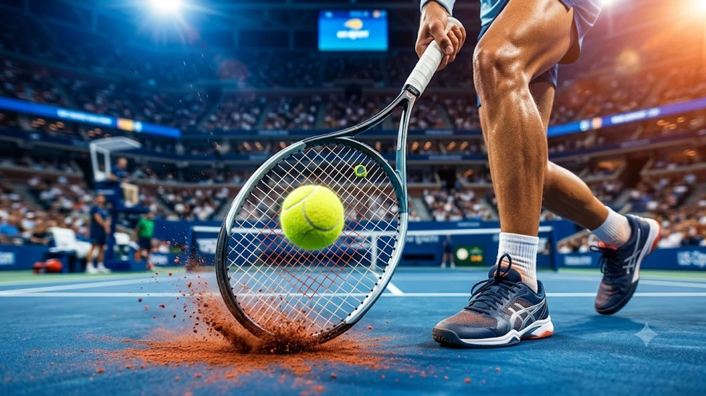

2026 US오픈 결승 무대에서 얀니크 신네르가 압도적인 경기력으로 트로피를 들어 올리며 하드코트 최강자의 입지를 굳혔다. 이번 결승전은 단순한 1승을 넘어 현대 테니스 남자 단식의 전술 패러다임이 어떻게 진화했는지 보여준 상징적인 승부였다. 베이스라인 공방전의 정밀함과 위기관리 능력이 완벽하게 맞물린 이번 매치는 테니스 팬들에게 깊은 인상을 남겼다.

## 베이스라인을 장악한 스트로크와 템포 조절
신네르의 플레이에서 가장 돋보인 지점은 깊숙하고 묵직하게 꽂히는 스트로크였다. 상대에게 코트 안쪽으로 파고들 틈을 전혀 주지 않고 철저하게 뒤로 밀어내는 전략을 고수했다.

### 좌우 코너를 찌르는 백핸드 다운더라인
신네르 특유의 양손 백핸드는 랠리가 길어질 때마다 결정적인 샷으로 작용했다. 크로스 랠리 도중 각도를 급격히 바꾸는 다운더라인 공격은 상대의 예측 타이밍을 완전히 무너뜨렸다. 상대가 네트 대시를 시도하려 할 때마다 발밑에 떨어지는 패싱 샷 역시 정교했다.

### 포핸드 톱스핀의 반발력과 궤적
상대방의 짧아진 리턴을 놓치지 않고 강력한 톱스핀 포핸드로 연결해 주도권을 빼앗았다. 높은 바운드로 튀어 오르는 포핸드는 상대가 공격적인 맞받아치기를 시도하기 어렵게 만들었다. 랠리가 길어질수록 샷의 속도와 회전량을 끌어올려 상대를 체력적으로 지치게 만들었다.

## 서브 성공률과 브레이크 위기 탈출 능력

이번 결승전 승패를 가른 또 다른 핵심 축은 결정적인 순간마다 터져 나온 서브였다. 듀스 상황이나 브레이크 포인트에 몰렸을 때도 흔들리지 않고 공격적인 첫 서브를 구사했다.

### 와이드 코스를 파고드는 플랫 서브
신네르는 상대의 백핸드 쪽을 겨냥한 와이드 플랫 서브를 적재적소에 꽂아 넣었다. 리턴이 불안정하게 넘어오는 순간 곧바로 3구째 공격으로 포인트를 매듭지었다. 코트 양쪽을 넓게 활용하는 서브 패턴 덕분에 리시브 위치 선정을 까다롭게 만들었다.

### 세컨드 서브 시 킥서브의 안정감
첫 서브가 빗나갔을 때도 무리하게 스피드를 내기보다 높은 바운드의 킥서브로 안전망을 확보했다. 깊은 코스로 들어간 세컨드 서브 덕분에 상대의 공격적인 리턴 에이스 시도를 철저히 차단했다. 서브 게임을 지켜내는 운영 능력이 한층 더 단단해진 셈이다. 다른 메이저 종목 트렌드가 궁금하다면 [스포츠 전체 글 보기](/posts/sports/)를 참고할 수 있다.

## 신체 밸런스와 무결점 풋워크의 조화
하드코트 특유의 강한 반발력 속에서도 신네르는 안정적인 하체 중심을 유지했다. 빠른 템포의 공방에서도 상체가 흔들리지 않아 샷의 일관성을 끝까지 지켜냈다.

### 오픈 스탠스에서의 빠른 방향 전환
슬라이딩을 섞어가며 깊은 공을 걷어 올린 뒤 곧바로 코트 중앙으로 복귀하는 회복 속도가 탁월했다. 수비에서 공격으로 전환되는 템포가 반 박자 빨라 상대에게 압박감을 주기에 충분했다. 극단적인 앵글 샷을 허용한 상황에서도 침착하게 로브를 띄우거나 깊은 슬라이스로 시간을 벌었다.

### 체력 안배와 집중력 유지
5세트 매치에 대비해 매 포인트마다 불필요한 에너지 소모를 줄이는 노련함이 돋보였다. 랠리 템포를 본인 페이스로 늦추거나 서브 전 루틴을 일정하게 가져가며 멘탈 흔들림을 막았다. 큰 점수 차로 앞서갈 때도 방심하지 않고 포인트 하나하나에 집중하는 태도를 유지했다.

## 하드코트 지배력과 앞으로의 과제
이번 우승을 기점으로 신네르는 빠른 코트 환경에서 적수가 드물다는 사실을 재입증했다. 다만 시즌 후반기로 갈수록 누적되는 신체 피로와 부상 관리는 여전히 넘어야 할 산이다.

### 잔디와 클레이 코트 대응 전략
하드코트에서의 압도적인 폼을 클레이나 잔디 시즌까지 이어가기 위한 샷 다변화가 요구된다. 슬라이스와 드롭샷의 빈도를 적절히 섞는 플레이가 완성된다면 전 코트 올라운더로서의 완성도가 더욱 높아질 것이다. 서브 앤 발리 빈도를 소폭 늘리는 전술적 유연성도 기대해 볼 만하다.

### 투어 정상급 라이벌들과의 상대 전적
차세대 테니스계를 이끌어가는 라이벌들과의 맞대결에서는 결국 경기 당일의 컨디션과 멘탈 싸움이 승부를 가를 전망이다. 상위 랭커들의 집요한 분석을 이겨내기 위해 매 대회마다 서브 패턴과 리턴 위치를 미세 조정하는 치밀함이 필요하다.

[테니스 라켓 및 용품 쿠팡에서 보기](https://www.coupang.com/np/search?q=%ED%85%8C%EB%8B%88%EC%8A%A4%EB%9D%BC%EC%BC%93&sourceType=affiliate&trackingCode=AF8691300)

#2026US오픈결승 #얀니크신네르 #US오픈테니스 #신네르우승 #테니스결승분석 #남자테니스 #테니스전술분석