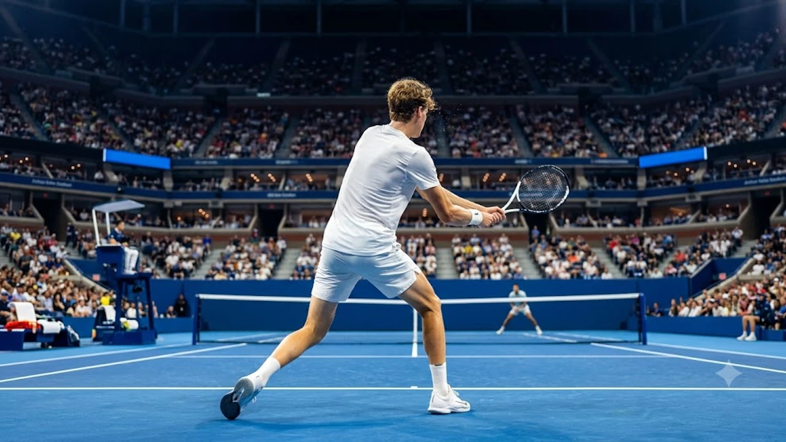

2026 US오픈 결승 무대에서 얀니크 신네르가 다시 한번 트로피를 들어 올리며 하드코트 최강자의 위상을 확고히 증명했다. 이번 2026 US오픈 결승 격돌은 단순한 타이틀 획득을 넘어 메이저 테니스 판도의 세대교체를 완전히 매듭지은 상징적인 혈투였다. 뉴욕 아서 애시 스타디움의 압도적인 함성 속에서 터져 나온 양 선수의 묵직한 스트로크 공방전은 코트를 뜨겁게 달궜다.

## 2026 US 오픈 남자 단식 결승전 총평 및 경기 결과

### 풀세트 접전 속 승부를 가른 결정적 순간들
1세트 초반부터 전개된 흐름은 코트 양 구석을 찌르는 긴 랠리의 연속이었다. 상대의 예리한 각도 깊은 샷 시도를 신네르가 빠른 풋워크로 지워낸 2세트 4-4 듀스 게임이 분수령으로 작용했다. 브레이크 포인트를 침착하게 방어한 신네르는 공격 템포를 한 박자 끌어올리며 주도권을 장악했다.

> "공의 깊이를 베이스라인 바로 안쪽에 지속해서 떨어뜨리지 못하면 그 어떤 위너 시도도 자멸의 빌미가 된다."

신네르는 긴 랠리 국면마다 무리한 직선타 대신 묵직한 탑스핀 타구로 상대의 범실을 유도했다. 코트 바깥으로 밀려난 수비 국면에서도 완벽한 균형을 유지하며 날카로운 카운터 펀치를 연이어 꽂아 넣었다.

### 서브 성공률과 스트로크 지표로 본 경기 스탯 비교
- **첫 서브 득점 확률**: 신네르는 첫 서브 성공 시 무려 82%에 달하는 포인트 획득률을 기록하며 서브 게임을 손쉽게 지켜냈다.
- **백핸드 언포스드 에러**: 긴 랠리 상황에서 발생한 자체 실책이 9개에 불과해 상대의 23개와 현격한 차이를 보였다.
- **브레이크 포인트 방어율**: 총 7차례의 실점 위기 중 6번을 지워내며 승부처마다 차가운 평정심을 과시했다.

## 신네르의 2연패를 완성한 전술적 우위 3가지

### 백핸드 크로스 랠리에서의 압도적 안정감
신네르의 양손 백핸드는 플랫과 탑스핀 사이의 정밀한 궤적을 그리며 상대 코트 구석에 박혔다. 크로스 랠리가 5회 이상 이어졌을 때 먼저 균형을 잃은 쪽은 상대였다. 라켓 헤드 스피드를 끝까지 유지하며 바운드 후 튀어 오르는 공의 높낮이를 통제한 기술적 완성도가 돋보였다.

### 위기 순간마다 터진 퍼스트 서브 에이스
세트 스코어가 팽팽해질 때마다 코트 T존 안쪽을 가르는 210km/h 이상의 서브가 불을 뿜었다. 단순한 속도 경쟁을 넘어 상대 리턴 위치에 따른 구질 변화가 위력을 발휘했다. 와이드 코스로 빠져나가는 킥 서브와 플랫 서브의 조합은 상대의 예측 타이밍을 무너뜨렸다.

### 베이스라인 안쪽을 선점한 공격적 리턴 포지셔닝
신네르는 상대의 세컨드 서브 시 베이스라인 안쪽으로 한 걸음 전진해 공의 라이징 정점을 타격했다. 상대가 랠리를 시작하기도 전에 수비 태세로 몰리게 만든 이 적극적인 위치 선정이 연이은 리턴 위너로 이어졌다.

## 상대가 무너진 진짜 이유와 코트 위 패착 분석

### 체력 저하인가 전술 미스인가: 3세트 이후의 급격한 균열
3세트 중반부터 상대 선수의 풋워크 반경이 눈에 띄게 좁아졌다. 8강과 4강에서 누적된 10세트 이상의 혈투가 하체 밸런스를 무너뜨렸다. 랠리가 길어질수록 베이스라인 뒤로 물러서는 소극적 경기 운영을 택했고, 이는 신네르의 코트 장악력을 높여주는 결과로 귀결됐다.

### 포핸드 언포스드 에러 급증과 멘탈 관리의 한계
경기 후반부 상대는 랠리의 리듬을 억지로 끊기 위해 무리한 다운더라인 강타를 남발했다. 네트에 걸리거나 사이드라인을 벗어난 공이 연속 4개나 나오면서 추격 의지가 완전히 꺾였다. [스포츠 전체 글 보기](/posts/sports/)에서 다루는 다른 메이저 대회 결승 사례들과 비교해 봐도, 결정적 순간의 멘탈 붕괴가 승패를 직결시킨 명확한 경기였다.

## 2026 그랜드슬램 결산과 향후 남자 테니스 판도 전망

### 빅3 시대를 완전히 넘어선 '신네르-알카라스' 2강작업할 주제나 원문 내용을 알려주시면 요청하신 마크다운 코드블록 형식에 맞춰 바로 작성해 드리겠습니다.