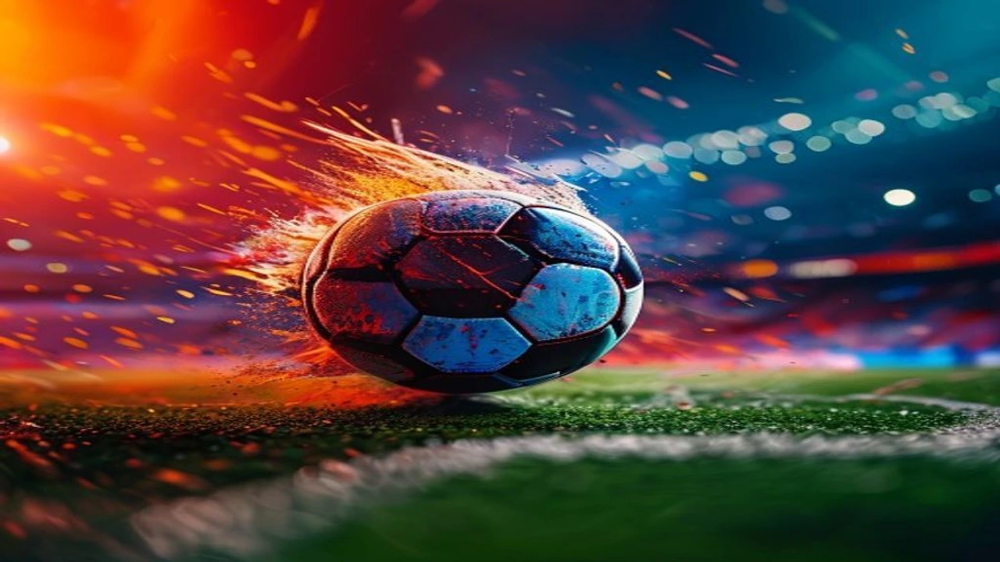
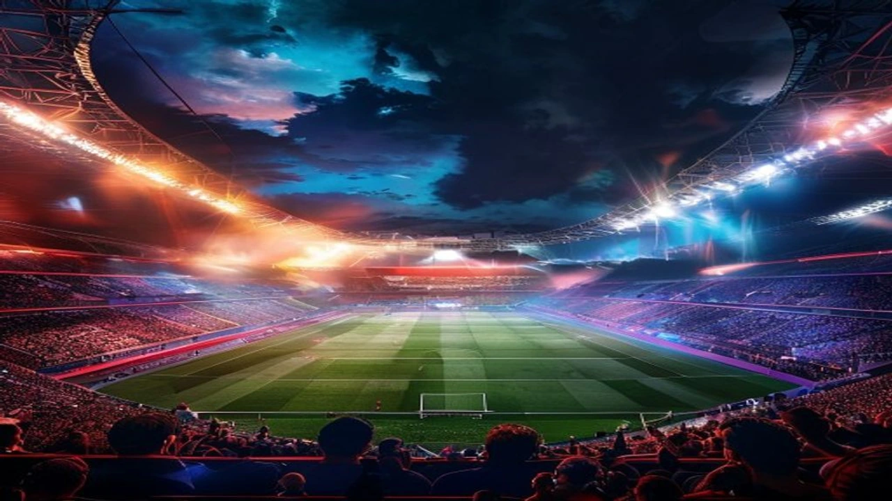

2026 북중미 월드컵 결승전이 코앞으로 다가온 가운데, 이번 무대는 축구 역사상 전례 없는 거대한 변화를 맞이합니다. 바로 사상 최초로 도입되는 **월드컵 결승 하프타임쇼**와 그에 따른 경기 시간 변경 소식입니다. 글로벌 스포츠 엔터테인먼트 시장의 판도를 바꿀 이번 피파(FIFA)의 파격적인 시도는 전 세계 축구 팬들과 음악 팬들의 이목을 동시에 집중시키고 있습니다.

## 2026 월드컵 결승전 최초 도입! '슈퍼볼급' 하프타임 쇼의 실체

### 포스트 말론부터 샤키라까지, 초호화 아티스트 라인업 현황
이번 결승전 무대는 단순히 전반전과 후반전 사이의 휴식 시간을 메우는 수준을 넘어섭니다. 국제축구연맹(FIFA)이 공식 발표한 라인업에 따르면, 전 세계적인 팝스타 **포스트 말론(Post Malone)**과 월드컵의 아이콘 **샤키라(Shakira)**, 그리고 살아있는 전설 **마돈나(Madonna)**가 무대에 오릅니다. 이들은 각각 자신들의 히트곡 메들리와 함께 이번 대회를 기념하는 특별 합작 무대를 선보일 계획입니다. 미국 현지 매체 보도에 따르면 이번 공연의 무대 연출 및 기술 장비 수송에만 수천만 달러가 투입되었습니다.

### 축구 역사상 최초의 25분 휴식 시간 도입 배경과 FIFA의 의도
기존 15분이던 하프타임 휴식 시간이 **25분으로 대폭 연장**됩니다. FIFA가 이 같은 결정을 내린 진짜 이유는 명확합니다. 미국 최대의 스포츠 축제인 '슈퍼볼(Super Bowl)'의 상업적 성공 모델을 월드컵에 그대로 이식하겠다는 전략입니다. 잔디 위에 거대한 무대를 설치하고 철거하는 최소한의 물리적 시간을 확보하면서, 전 세계 수억 명의 시청자를 TV 앞에 묶어두어 광고 수익을 극대화하려는 의도가 깔려 있습니다.

### 미국 현지 스타디움과 전 세계 중계방송의 연출 스케일 예측
공연이 펼쳐질 메트라이프 스타디움은 첨단 미디어 파사드와 드론 쇼, 화려한 폭죽 연출로 가득 찬 광경을 연출합니다. 현장 관객뿐만 아니라 중계방송을 보는 시청자들을 위해 360도 스파이더 캠과 가상현실(VR) 그래픽 기술이 대거 동원됩니다. 단 25분의 쇼를 위해 경기장 잔디 훼손을 최소화하는 특수 격자형 무대 발판 기술까지 도입되었다는 점이 현지 엔지니어들의 설명입니다.

## "축구인가 쇼인가" 전통 팬 vs 라이트 팬의 팽팽한 입장 차이

### "흐름 끊긴다" 유서 깊은 축구 팬들이 분노하는 진짜 이유
유럽과 남미의 전통적인 축구 팬들은 이번 결승전의 '미국 상업주의화'에 강한 거부감을 드러내고 있습니다. 전반전의 뜨거운 열기와 전술적 긴장감이 25분이라는 긴 시간 동안 완전히 식어버릴 수 있다는 우려 때문입니다. 특히 축구는 흐름의 스포츠인데, 엔터테인먼트 쇼 때문에 경기의 본질이 훼손된다는 비판이 국내외 축구 커뮤니티에서 거세게 일어나고 있습니다. 이번 대회는 개막 전부터 [2026 월드컵 바뀌는 32강 방식 완벽 정리](/posts/sports/worldcup-2026-format-32games-change/) 등 여러 변화로 논란이 많았는데, 결승전 하프타임 쇼는 그 중에서도 가장 뜨거운 감자입니다.

### "지루할 틈 없다" MZ 세대와 라이트 유저가 환호하는 대목
반면 스포츠를 하나의 거대한 축제이자 문화 콘텐츠로 소비하는 MZ 세대와 라이트 팬들의 반응은 정반대입니다. 축구를 잘 모르는 사람이라도 세계적인 팝스타들의 공연을 보기 위해 결승전을 시청하게 만드는 강력한 유인책이 된다는 분석입니다. 경기 중간의 대기 시간을 화려한 볼거리로 채워주어 지루할 틈이 없다는 긍정적인 평가도 지배적입니다.

### 경기력 저하 우려 vs 글로벌 축구 마케팅의 극대화 효과 비교
양측의 의견은 스포츠의 본질과 상업적 가치라는 대목에서 정면으로 충돌합니다.
> **전통주의자 입장:** 경기 흐름 단절, 선수들의 몸 상태 관리 저하, 잔디 훼손 우려
> **마케팅 전문가 입장:** 역대 최고치 광고 단가 경신, 전 세계 시청률 폭발, 비축구 팬 유입 효과

결과적으로 이번 시도는 축구라는 종목이 가질 수 있는 자본주의적 가치를 극한으로 끌어올리는 계기가 될 것입니다. 리오넬 메시와 킬리안 음바페의 대결 등 역대급 서사가 가득했던 [메시 음바페 월드컵 득점왕 경쟁, 2026 골든부트는 누구?](/posts/sports/worldcup-2026-golden-boot-race-messi-mbappe/) 이슈만큼이나, 이번 쇼 자체의 흥행 여부도 피파의 향후 마케팅 방향성을 결정짓는 이정표가 됩니다.

## 결승전 규칙 변화가 양 팀 선수단의 전술에 미칠 치명적인 영향

### 아르헨티나와 스페인 감독이 급하게 수정 중인 하프타임 전술
하프타임이 10분 늘어나면서 아르헨티나의 리오넬 스칼로니 감독과 스페인의 루이스 데 라 푸엔테 감독의 머릿속도 복잡해졌습니다. 평소 같으면 라커룸에서 짧은 지시 후 바로 그라운드로 나섰겠지만, 이제는 긴 대기 시간 동안 선수들의 집중력을 유지할 전술적 대안을 찾아야 합니다. 전반전의 전술적 문제점을 수정하고 부상 선수를 체크할 물리적 시간은 늘어났으나, 전반전의 상승세를 유지하던 팀에게는 오히려 이 대목이 독으로 작용할 여지가 있습니다.

### 락커룸 휴식 시간 연장이 노장 선수와 부상 복귀 선수에게 주는 장점
체력적 한계에 부딪힌 베테랑 선수들에게 25분의 휴식은 가뭄의 단비와 같습니다. 경기 중 쌓인 젖산을 분해하고 마사지를 받거나 미세한 근육 통증을 치료하기에 넉넉한 시간이 주어지기 때문입니다. 특히 경기 후반부 체력 저하로 발생할 수 있는 부상 위험을 줄여준다는 면에서는 긍정적인 신호로 작용합니다.

### 길어진 대기 시간이 가져올 경기 후반 초반 긴장감 저하라는 단점
반면 몸이 너무 풀려버리는 것이 문제입니다. 선수들은 보통 15분 휴식에 최적화된 바이오리듬을 유지합니다. 대기 시간이 25분으로 늘어나면 근육이 식어버려 후반전 시작 직후 순간적인 스피드를 내다가 근육 파열 등의 부상을 입을 위험이 커집니다. 후반 초반 5분 동안 선수들의 집중력 저하로 인한 돌발적인 실점이 나올 확률이 평소보다 높아질 것이라는 현지 전문가들의 경고가 잇따르고 있습니다.

## 2026 북중미 월드컵 결승전 하프타임 쇼 200% 즐기는 시청 가이드

### 국내 실시간 중계 플랫폼별 하프타임 쇼 송출 여부 확인법
국내 지상파 방송사들과 OTT 플랫폼들은 이번 하프타임 쇼를 온전히 송출하기 위해 비상 체제에 돌입했습니다. 과거 일부 국제 대회에서 하프타임에 광고를 집중 배치하느라 현지 공연을 잘라먹던 관행은 이번에 통하지 않을 전망입니다. 주관 방송사들은 25분 전체를 라이브로 송출하는 전용 채널이나 멀티캠 스페셜 라이브 링크를 제공할 계획이므로, 경기 시작 전 미리 자신이 이용하는 플랫폼의 편성표와 스트리밍 옵션을 체크하는 조치가 필요합니다.

### 시간대별 타임라인: 결승전 킥오프부터 쇼 시작까지의 타임테이블
경기는 한국 시간 기준으로 새벽에 진행됩니다. 전반전 45분과 추가 시간을 감안하면 킥오프 후 약 50분이 지난 시점에 전반전이 종료됩니다. 전반전 종료 휘슬이 울린 후 정확히 3분 뒤부터 잔디 위에 특수 무대가 설치되며 본격적인 오프닝 공연이 시작됩니다. 아티스트 3인의 메인 공연은 약 15에서 18분간 진행되며, 이후 후반전 준비를 위한 무대 철거가 일사천리로 이어집니다.

### 하프타임 쇼 직후 시작되는 후반전 관전 포인트 놓치지 않는 법
공연의 화려함에 눈이 팔려 정작 핵심적인 후반전 초반 10분을 놓치면 안 됩니다. 하프타임 쇼가 끝난 직후 그라운드에 나서는 양 팀 선수들의 몸 풀기 상태를 유심히 지켜보는 태도가 요망됩니다. 어느 팀이 늘어난 휴식 시간을 효율적으로 활용해 전술적 완성도를 높였는지, 혹은 어떤 선수가 몸이 덜 풀려 실책을 범하는지가 승부의 향방을 가르는 핵심 위치가 될 것입니다.

#월드컵결승하프타임쇼 #2026월드컵결승전 #월드컵하프타임쇼라인업 #포스트말론 #샤키라 #마돈나 #피파규칙변경 #월드컵시간변경 #스포츠엔터테인먼트 #메트라이프스타디움