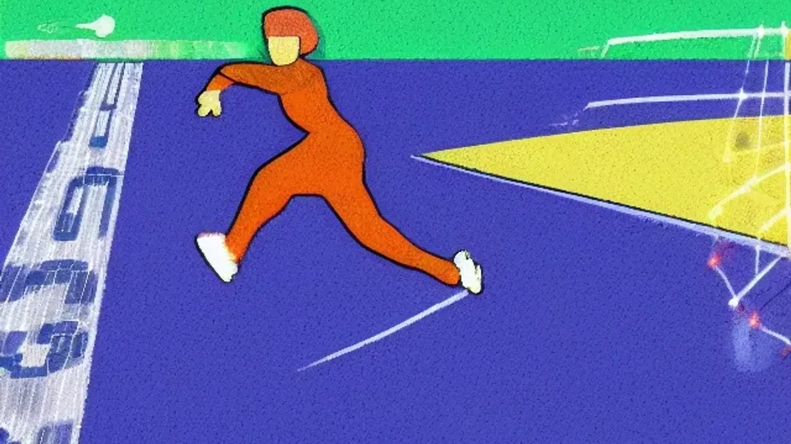

2026 FIFA 북중미 월드컵이 역사상 최초로 48개국 본선 진출 체제로 개막하면서 전 세계 축구 팬들의 이목이 집중되고 있습니다. 이번 대회부터 경기 방식이 전면 개편됨에 따라 **2026 월드컵**의 핵심 관전 포인트인 32강 토너먼트 진출권 경쟁은 역대 가장 치열하고 복잡한 양상을 띨 전망입니다. 새롭게 바뀐 규칙과 통과 기준을 명확히 파악해야만 한 달간 펼쳐질 총 104경기의 대장정을 완벽하게 즐길 수 있습니다.

## 48개국 체제의 서막: 무엇이 어떻게 달라졌나

### 32개국에서 48개국으로: 참가국 확대의 배경과 의미
국제축구연맹(FIFA)은 축구 변방국가들에게 기회를 제공하고 글로벌 마켓을 확장하기 위해 본선 참가국 수를 기존 32개국에서 48개국으로 50% 늘렸습니다. 아시아(AFC) 배정 티켓이 4.5장에서 8.5장으로 늘어났고, 아프리카(CAF) 역시 9.5장을 확보하는 등 대륙별 본선 진출국 수가 대폭 증가했습니다. 이는 월드컵 무대의 외연을 확장하는 동시에, 조별리그부터 전 세계 축구 팬들의 유입을 극대화하는 상업적·스포츠적 전환점이 됩니다.

### 조별리그 12개 조 편성: 3개국이 아닌 4개국 조 편성으로 선회한 이유
당초 FIFA는 3개국씩 16개 조를 구성하는 방안을 유력하게 검토했으나, 조별리그 최종전의 담합 가능성과 박진감 저하라는 치명적인 단점이 지적되었습니다. 이에 따라 전통적인 방식인 **4개국 12개 조 편성**으로 최종 확정되었습니다. 4개국 체제는 각 팀이 최소 3경기를 보장받으며, 조별리그 최종전이 동시에 치러지기 때문에 스포츠의 공정성과 극적인 긴장감을 그대로 유지하는 효과를 발휘합니다.

### 총 경기 수 104경기 시대: 전체 토너먼트 일정의 변화 흐름
참가국과 조가 늘어나면서 총 경기 수는 기존 64경기에서 104경기로 무려 40경기가 증가했습니다. 대회 기간 역시 기존 28일 안팎에서 39일로 대폭 늘어났으며, 우승팀이 트로피를 들어 올리기까지 치러야 하는 경기 수도 기존 7경기에서 8경기로 늘어났습니다. 험난해진 일정 속에서 선수들의 체력 관리와 두터운 스쿼드 확보가 우승을 향한 필수 조건으로 부각됩니다.

## 지옥의 조별리그 탈락 규칙: '죽음의 조'는 사라졌을까

### 각 조 1, 2위 직행과 '조 3위 와일드카드' 8개 팀의 생존 조건
새로운 방식의 가장 큰 특징은 조 3위를 기록해도 토너먼트에 진출할 일말의 희망이 남는다는 점입니다. 12개 조의 **1위와 2위(총 24개 팀)는 32강 라운드에 직행**합니다. 남은 8자리는 **각 조 3위 파일 중 성적이 좋은 상위 8개 팀**에게 와일드카드 형태로 배정됩니다. 조 3위 간의 순위를 가릴 때는 승점, 골득실, 다득점 순으로 비교하므로, 약팀을 상대로 얼마나 많은 골을 넣었느냐가 생존을 가르는 결정적 열쇠가 됩니다.

### 승점 동률 시 순위 결정 최신 기준: 골득실과 다득점, 그리고 페어플레이 점수
조별리그가 끝난 후 승점이 같은 팀이 나올 경우 순위를 꼼꼼하게 따져야 합니다. 첫 번째 기준은 조별리그 전 경기에서의 **골득실차(득점-실점)**이며, 이마저도 같다면 **전 경기 총 다득점**을 비교합니다. 만약 두 팀이 골득실과 다득점까지 완벽하게 일치한다면 승자승(동률 팀 간의 경기 결과)을 보고, 최종적으로는 경고와 퇴장 누적 점수를 계산하는 **페어플레이 점수**로 운명이 갈립니다. 카드 한 장이 32강 진출 여부를 바꾸는 결정타가 될 수 있습니다.

### 느슨해진 조별리그? 경기 수가 늘어나며 발생한 장단점 집중 분석
조 3위까지 기회가 주어지면서 강팀들이 조별리그에서 탈락할 확률은 눈에 띄게 낮아졌습니다. 이로 인해 초반 긴장감이 다소 떨어질 수 있다는 비판이 존재합니다. 반면, 약팀 입장에서는 단 1승만 거두어도 와일드카드를 통해 토너먼트에 턱걸이할 수 있어 매 경기 포기하지 않는 끈질긴 승부가 연출됩니다. 강팀은 체력을 안배하며 32강 이후를 도모할 여유가 생겼고, 언더독 팀들은 역사적인 토너먼트 진출을 노릴 발판이 마련되었습니다.

## 최초 도입된 32강 토너먼트 라운드 완벽 시뮬레이션

### 16강 전 단계의 신설: 32강 매치업은 어떻게 구성되는가
과거에는 조별리그를 통과하면 곧바로 16강전으로 진입했으나, 이번 대회부터는 **'32강 토너먼트(Round of 32)'** 단계가 새롭게 추가되었습니다. 12개 조의 1, 2위 24개 팀과 와일드카드 8개 팀이 섞여 단판 승부를 벌입니다. 대진표는 대륙별 안배와 조별리그 성적을 고려한 사전 배정 공식에 따라 채워지며, 조별리그에서 만났던 팀과는 결승 전까지 다시 만나지 않도록 구획이 나뉩니다.

### 토너먼트 대진표 배치 원리와 결승전까지의 예상 타임라인
32강전이 신설되면서 토너먼트 전체 일정이 촘촘하게 맞물려 돌아갑니다. 조별리그가 종료된 직후 숨 돌릴 틈 없이 하루에 4경기씩 32강전이 펼쳐지며, 여기서 승리한 팀들만이 익숙한 16강 무대를 밟습니다. 결승전까지 가는 길목에 단판 승부가 한 단계 더 추가되었기 때문에, 이변이 일어날 확률이 배가 되었고 축구 팬들이 느끼는 긴장감의 유효기간도 훨씬 길어졌습니다.

### 단판 승부의 묘미: 연장전 및 승부차기 규정 체크리스트
> 월드컵 토너먼트의 묘미는 무승부가 없는 끝장 승부에 있습니다. 32강전부터는 전·후반 90분 동안 승부를 가리지 못할 경우, **전·후반 각 15분씩 총 30분의 연장전**을 치릅니다. 연장전에서도 승패가 나지 않으면 축구 역사상 가장 잔인한 룰로 불리는 **승부차기(Penalty Shootout)**로 돌입하여 다음 라운드 진출자를 가립니다. 체력이 바닥난 상태에서 치러지는 32강 연장전은 스쿼드가 얇은 팀에게 엄청난 재앙으로 다가올 것입니다.

[관련 글 보기](/posts/sports/)

## 역대급 스케일의 북중미 월드컵 현장 관전 포인트

### 3개국 공동 개최가 만든 살인적인 이동 거리와 시차 변수
미국, 캐나다, 멕시코 대륙을 아우르는 광활한 개최지는 선수들에게 상상을 초월하는 피로도를 안겨줍니다. 동부와 서부를 오가는 비행시간만 5~6시간에 달하며, 지역에 따라 최대 3시간의 시차가 발생합니다. FIFA는 이동 동선을 최소화하기 위해 조별리그를 서부, 중부, 동부 등 권역별로 묶어 진행하지만, 토너먼트에 진입하는 순간부터는 장거리 비행과 기후 변화에 빠르게 적응하는 팀이 절대적인 우위를 점하게 됩니다.

### 무더위 속 '의무적 워터 브레이크'와 쿨링 타임이 경기 흐름에 미치는 영향
북중미의 6월과 7월은 기록적인 폭염과 높은 습도로 악명이 높습니다. 특히 멕시코시티나 미국 남부 지역의 경기장에서는 낮 기온이 섭씨 35도를 웃도는 경우가 빈번합니다. 이에 따라 선수 보호 차원에서 전·후반 각각 30분 전후로 **의무적인 워터 브레이크(Cooling Break)**가 시행됩니다. 3분간 주어지는 이 휴식 시간은 단순히 목을 축이는 수준을 넘어, 감독들이 전술을 전면 수정하고 흐름을 끊어가는 제2의 작전 타임으로 활용됩니다.

### 라스트 댄스 대 세대교체: 놓치면 안 될 개막 주간 빅매치 추천
이번 대회는 축구계의 거성들이 마지막 불꽃을 태우는 무대이자 10대 슈퍼 유망주들이 반란을 일으키는 역사의 현장입니다. 사실상 마지막 월드컵에 나선 리오넬 메시의 아르헨티나, 크리스티아누 호날두의 포르투갈 경기는 조별리그 첫 경기부터 매진 행렬을 기록 중입니다. 동시에 스페인의 신성 라민 야말처럼 새롭게 떠오르는 젊은 피들이 변형된 32강 체제 안에서 어떤 변수를 만들어낼지 지켜보는 과정은 이번 대회를 즐기는 가장 흥미로운 방법이 됩니다.

#2026월드컵 #월드컵32강 #월드컵조편성 #북중미월드컵 #월드컵규칙 #축구토너먼트 #와일드카드 #월드컵개막 #스포츠트렌드