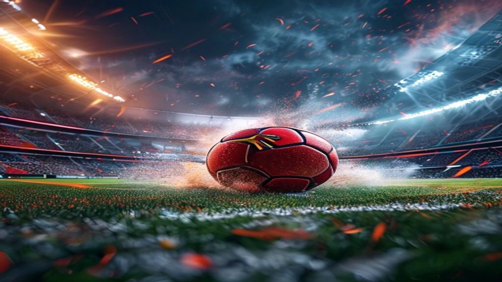

2026 북중미 월드컵이 치열했던 32강전을 마치고 본격적인 16강 토너먼트 라운드에 돌입하면서 세계 축구팬들의 이목이 집중되고 있습니다. 역대 가장 예측 불가능한 대회라는 평가 속에서도 최고 골잡이에게 주어지는 **월드컵 득점왕** 타이틀을 향한 레이스는 그 어느 때보다 뜨겁게 달아오르는 중입니다. 역사상 최초의 통산 20호 골 대기록을 작성한 리오넬 메시와 프랑스의 무결점 공격수 킬리안 음바페가 나란히 선두권을 형성하며 축구 역사의 한 페이지를 새로 쓰고 있습니다.

## 월드컵 득점왕 레이스 현황과 메시·음바페의 기록 분석

### 메시 vs 음바페: 16강 진출 시점의 득점 및 어시스트 지표
32강전이 모두 종료된 현재, 리오넬 메시(아르헨티나)와 킬리안 음바페(프랑스)는 각각 **6골**을 기록하며 공동 선두를 달리고 있습니다. 다만 세부 지표를 뜯어보면 두 선수의 스타일 차이가 극명하게 드러납니다. 메시는 6골과 더불어 3개의 도움(어시스트)을 기록하며 팀 공격의 시발점 역할을 동시에 수행한 반면, 음바페는 6골 1도움으로 철저하게 전방 해결사 역할에 집중하는 모습을 보였습니다. 피파(FIFA)의 공식 타이틀 산정 기준에 따르면 득점 수가 같을 경우 어시스트 개수가 많은 선수가 상위에 랭크되므로, 현재 시점의 순수 타이틀 경쟁에서는 메시가 다소 유리한 고지를 점했습니다.

### 경기당 유효 슈팅 및 xG(기대 득점) 데이터 비교
스포츠 통계 전문 매체 '옵타(Opta)'가 제공한 32강 종료 시점의 데이터에 따르면, 음바페의 경기당 유효 슈팅은 **4.2회**로 대회 전체 1위입니다. 그의 xG(기대 득점) 총합은 4.85로, 자신이 마주한 기회보다 약 1.15골을 더 집어넣는 탁월한 골 결정력을 증명했습니다. 반면 메시의 경기당 유효 슈팅은 2.8회로 음바페보다 적지만, xG 총합은 3.92를 기록했습니다. 이는 메시가 상대의 집중 견제 속에서도 기회가 왔을 때 놓치지 않는 극도의 효율성을 발휘했음을 의미합니다.

### 패널티킥(PK) 성공률과 필드골 기여도가 미치는 변수
이번 대회에서 메시는 6골 중 2골을 패널티킥으로 성공시켰으며, 음바페는 6골 모두를 필드골로 기록했습니다. 토너먼트 단계부터는 단 한 번의 실수가 탈락으로 이어지기 때문에 패널티킥 획득 빈도가 높아집니다. 아르헨티나의 전담 키커인 메시가 기회를 안정적으로 성공시킨다면 득점 추가에 유리하겠지만, 순수 필드골 파괴력에서는 프랑스의 빠른 공수 전환 속에서 기회를 잡는 음바페가 매서운 기세를 보여줍니다.

## 리오넬 메시의 라스트 댄스: 통산 20호 골의 의미와 강점

### 카보베르데전 연장 혈투 속에서 빛난 베테랑의 결정력
아르헨티나와 카보베르데의 32강전은 이번 대회 최고의 명승부였습니다. 탄탄한 조직력으로 무장한 카보베르데의 수비망에 막혀 2-2로 팽팽하던 연장 후반 115분, 메시는 아크 정면에서 수비수 두 명을 따돌리는 정교한 왼발 감아차기 슛으로 결승골을 터뜨렸습니다. 이 골은 그의 이번 대회 6번째 골이자, **월드컵 통산 20호 골**이라는 전대미문의 대기록을 완성하는 순간이었습니다. 경기장을 가득 채운 관중들이 그의 이름을 연호하는 모습은 큰 전율을 선사했습니다.

> "메시는 단순히 축구를 잘하는 단계를 넘어섰다. 체력이 고갈된 연장전에서도 경기 전체를 지배하는 시야와 찰나의 기회를 골로 연결하는 결정력은 왜 그가 고트(GOAT)인지 증명한다." - BBC 축구 해설가 앨런 시어러

### 아르헨티나 전술에서 메시의 포지셔닝과 프리롤의 장단점
리오넬 스칼로니 감독이 이끄는 아르헨티나는 메시의 체력을 안배하면서 그의 천재성을 극대화하는 4-3-1-2 포메이션을 가동합니다. 메시는 수비 가담을 최소화하는 대신 미드필드와 최전방을 자유롭게 오가는 프리롤 역할을 수행합니다. 
- **장점:** 상대 수비 진형을 무너뜨리는 킬패스와 순간적인 침투로 예측 불가능한 공격 경로 생성
- **단점:** 메시가 전방에 머무는 시간이 길어질수록 나머지 미드필더 3명의 수비 가방 활동량이 극단적으로 늘어남

### 전 세계 축구팬이 열광하는 메시의 ‘마지막 월드컵’ 서사
1982년생 동갑내기 스타들의 황혼기와 비교했을 때 메시의 행보는 독보적입니다. 사실상 자신의 마지막 월드컵이 될 이번 대회에서 득점 선두에 올라 있는 서사 자체가 엄청난 흥행 요소입니다. 팬들은 매 경기마다 역사가 새로 쓰이는 현장을 실시간으로 목격하고 있으며, 이는 아르헨티나 대표팀 전원에게 "메시에게 두 번째 우승 트로피와 골든부트를 안기겠다"라는 강력한 동기부여로 작용합니다.

## 킬리안 음바페의 독주 체제: 프랑스 황금 세대의 전폭적 지원

### 전성기 기량의 음바페가 가진 스피드와 공간 침투 역량
전성기 나이에 접어든 킬리안 음바페는 압도적인 신체 능력과 스피드로 상대 측면을 초토화합니다. 32강전까지 측정된 음바페의 최고 속도는 **시속 35.3km**로, 수비수가 미리 자리를 잡고 있더라도 순간적인 가속도만으로 뒷공간을 완전히 허무는 모습을 자주 연출했습니다. 좁은 공간에서 동료를 활용한 원투 패스 이후 때리는 강력한 오른발 슈팅은 골키퍼가 손을 쓰기 어려운 궤적으로 빨려 들어갑니다.

### 그리즈만·뎀벨레 등 프랑스 2선 지원 유무에 따른 득점 확률
음바페가 득점 선두를 달릴 수 있는 비결은 프랑스의 화려한 미드필더 및 공격진 덕분입니다. 앙투안 그리즈만이 정교한 패스로 조율하고, 반대편 측면에서 우스만 뎀벨레가 상대 수비를 분산시켜 주기 때문에 음바페에게 일대일 기회가 자주 찾아옵니다. 프랑스 대표팀의 경기당 크로스 성공률은 **38%**에 육박하며, 이 중 절반 이상이 페널티 박스 왼쪽에 위치한 음바페의 발밑을 겨냥합니다.

[관련 글 보기](/posts/sports/)

### 홀란·케인의 추격 속에서 음바페가 우위를 점할 수 있는 이유
노르웨이의 엘링 홀란과 인도의 돌풍을 잠재운 잉글랜드의 해리 케인이 각각 5골로 바짝 추격하고 있지만, 음바페는 토너먼트 경험이라는 강력한 무기를 가졌습니다. 이미 2018년과 2022년 대회에서 결승전 무대를 밟으며 월드컵 통산 18골을 기록 중인 음바페는 큰 경기에서 오는 압박감을 이겨내는 능력이 탁월합니다. 팀 스쿼드의 두터움 면에서도 프랑스가 노르웨이나 잉글랜드보다 우위에 있어, 음바페가 더 많은 경기를 치르며 득점을 추가할 확률이 확연히 높습니다.

## 16강 토너먼트 대진표로 보는 최종 골든부트(득점왕) 예측 가이드

### 대진표 상 유리한 고지를 선점한 팀과 예상 경기 수 계산법
월드컵 득점왕을 차지하기 위한 첫 번째 조건은 팀이 높은 단계까지 살아남아 더 많은 경기를 소화하는 것입니다. 이번 16강 대진표를 살펴보면 프랑스는 비교적 수비 조직력이 약한 팀들과 대진이 짜인 반면, 아르헨티나는 까다로운 남미 국가 및 유럽의 복병들을 연속해서 만나야 하는 험난한 일정이 기다리고 있습니다. 결승전이나 3·4위전까지 진출해 총 7경기를 꽉 채워 치를 가능성은 현재로서 프랑스가 조금 더 높다는 전망이 지배적입니다.

### 토너먼트 특유의 수비 위주 전술이 공격수들에게 미치는 영향
단판 승부인 16강부터는 조별리그처럼 라인을 올리고 공격적으로 맞불을 놓는 팀을 찾기 어렵습니다. 대부분의 팀이 '선수비 후역습' 형태의 끈적한 두 줄 수비를 구축하므로 공격수들이 활용할 공간이 극도로 제한됩니다. 이러한 환경에서는 음바페처럼 속도를 활용하는 선수보다, 메시처럼 좁은 공간에서 원타임 슈팅을 가져가거나 세트피스를 골로 연결하는 선수가 높은 효율을 낼 가능성이 존재합니다.

### 라이트 팬도 쉽게 따라가는 실시간 월드컵 득점 순위 추적 팁
치열한 골든부트 경쟁을 제대로 즐기려면 단순 득점 수 외에 피파(FIFA) 공식 홈페이지의 실시간 스탯 보드를 함께 확인하는 방식이 효과적입니다. 출전 시간 대비 득점 비율이 핵심 변수로 작용하기 때문입니다. 만약 16강전에서 메시나 음바페 중 한 명이라도 멀티골을 터뜨리며 격차를 벌린다면, 이번 2026 북중미 월드컵 최고의 개인 타이틀 레이스는 예상보다 빠르게 한쪽으로 기울 수도 있습니다.

#월드컵득점왕 #2026월드컵 #메시 #음바페 #골든부트 #북중미월드컵 #아르헨티나축구 #프랑스축구 #월드컵16강 #축구통계