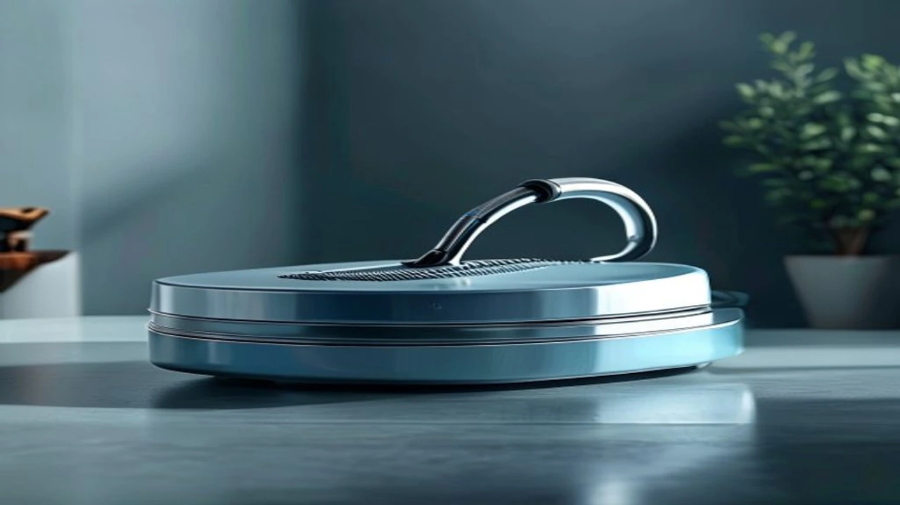
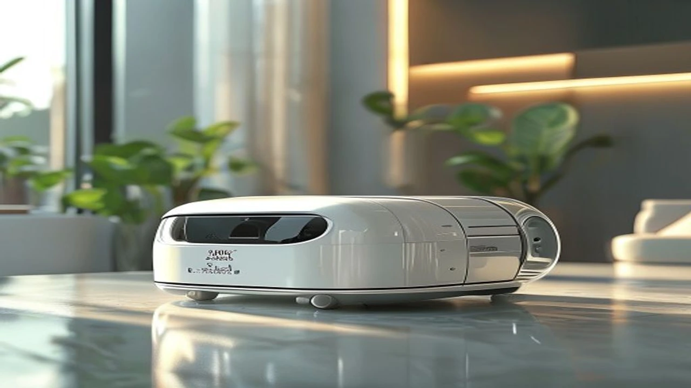

## 1. 지금 이 카테고리가 뜨는 이유

바쁜 일상에서 집안일 손실을 줄이려는 소비자가 폭증하면서 올인원 로봇청소기는 가전 시장의 절대강자로 자리 잡았습니다. 단순히 흡입과 걸레질을 동시에 해주는 수준을 넘어, 먼지 비움, 걸레 세척, 온풍 건조, 자동 세제 투입까지 청소의 전 과정을 알아서 처리합니다.

특히 여름철 습한 기후로 인해 걸레에서 발생하는 냄새와 세균 번식 문제가 구매 판단의 핵심으로 부상했습니다. 이에 맞춰 최신 프리미엄 라인업은 70\~100°C 고온수 및 스팀 세척 기능을 기본으로 탑재해 위생 이슈를 완벽히 털어냈습니다. 오수통을 직접 비울 필요가 없는 직배수 시스템 설치율이 크게 늘어난 점도 시장 성장을 견인하고 있습니다.

---

## 2. TOP3 상품 스펙 비교

시장 점유율과 만족도 측면에서 최상위를 기록 중인 올인원 로봇청소기 3종을 한눈에 비교할 수 있도록 정리했습니다.

| 모델명 | 가격대 | 핵심 스펙 | 추천 대상 |
| :--- | :--- | :--- | :--- |
| **삼성전자 비스포크 AI 스팀 울트라** | 160만 원대 (일반형) / 160\~180만 원대 (직배수) | 100°C 스팀 세척, RGB AI 카메라, 삼성 Knox 보안 칩 | 국내 AS 편의성과 100°C 스팀 살균 위생을 최고 우선시하는 가구 |
| **로보락 S10 MaxV Ultra** | 160만 원대 (일반형) / 180만 원대 (직배수) | 36,000Pa 흡입력, FlexiArm 모서리 확장, 8.8cm 이중 문턱 등반 | 강력한 먼지 흡입력과 문턱 통과, 장애물 회피 기술이 필요한 집 |
| **에코백스 디봇 T90 프로 옴니** | 90만\~110만 원대 | 30,000Pa 흡입력, 27cm 와이드 롤러, 70°C 온수 세척 | 100만 원 내외 예산에서 최고급 올인원 스펙을 갖추려는 가성비 유저 |

---

## 3. 예산대별 추천 상품 상세 분석

### 1) 삼성전자 비스포크 AI 스팀 울트라 (VR90F01AAG / VR90F01SAG)

* **가격대:** 160만 원대 (일반형) / 160\~180만 원대 (직배수)
* **핵심 스펙:**
  * **100°C 고온 스팀 세척:** 물걸레에 살포되는 100°C 스팀으로 오염물 분해 및 냄새 원인균 99.99% 살균
  * **AI 사물 인식 및 보안:** RGB 카메라 기반 3D 센서로 1cm 미만의 작고 가느다란 케이블까지 인지, 삼성 Knox 보안 칩 탑재
* **장점:**
  * 전국 100여 개 이상의 오프라인 AS 센터망과 무상 방문 설치 서비스 제공
  * 100°C 스팀 살균 방식으로 여름철 걸레 쉰내와 오수통 악취 발생을 완벽 차단
* **단점:**
  * 본체 및 스테이션 규격(가로 42\~45cm 내외)이 커서 좁은 공간 설치 시 부담 감수 필요
* **이런 사람에게 추천:** 로봇청소기를 처음 사용하거나 해외 브랜드의 보안 및 사후 지원(AS)을 우려하는 가구

👉 [삼성전자 비스포크 AI 스팀 울트라 쿠팡에서 보기](https://www.coupang.com/np/search?q=삼성전자+비스포크+AI+스팀+울트라&sourceType=affiliate&trackingCode=AF8691300)

---

### 2) 로보락 S10 MaxV Ultra

* **가격대:** 160만 원대 (일반형) / 180만 원대 (직배수)
* **핵심 스펙:**
  * **36,000Pa 흡입력:** 기존 프리미엄급 대비 2\~3배 높은 수치로 마루 틈새 및 카펫 속 미세먼지 제거
  * **FlexiArm & 8.8cm 문턱 등반:** 구석 모서리 밀착 닦기용 스윙 암 및 이중 문턱 등반 시스템 적용
* **장점:**
  * 36,000Pa의 압도적 흡입 성능과 구석 모서리 걸레 돌출 기능이 결합되어 잔여 먼지 제거율이 우수함
  * AI 비전 카메라와 RGB 센서 기반으로 야간 조명 없이도 장애물을 실시간 회피함
* **단점:**
  * 출고가 160만\~180만 원대로 초기 진입 장벽이 높은 편
* **이런 사람에게 추천:** 카펫을 많이 쓰거나 집안에 2cm 이상의 높은 문턱, 복잡한 가구 배치가 많은 가구

👉 [로보락 S10 MaxV Ultra 쿠팡에서 보기](https://www.coupang.com/np/search?q=로보락+S10+MaxV+Ultra&sourceType=affiliate&trackingCode=AF8691300)

---

### 3) 에코백스 디봇 T90 프로 옴니

* **가격대:** 90만\~110만 원대
* **핵심 스펙:**
  * **30,000Pa BLAST 흡입력:** 대형 이물질까지 원샷으로 빨아들이는 흡입 모터 장착
  * **27cm 와이드 롤러 & 70°C 온수 세척:** 회전식 걸레 대신 27cm 실시간 세척 롤러 모듈 탑재
* **장점:**
  * 30,000Pa 흡입력, 70°C 온수 세척, 오토 먼지 비움 스펙을 100만 원 안팎 가격에 확보 가능
  * 27cm 폭의 와이드 롤러 구조로 30평형대 기준 청소 시간을 약 15\~20% 단축
* **단점:**
  * 롤러 세척 모듈 하부 트레이에 침전물이 쌓이므로 주 1회 직접 분리 세척 권장
* **이런 사람에게 추천:** 최상위 스펙을 경험하고 싶지만 150만 원 이상 지출은 원치 않는 실속형 구매자

👉 [에코백스 디봇 T90 프로 옴니 쿠팡에서 보기](https://www.coupang.com/np/search?q=에코백스+디봇+T90+프로+옴니&sourceType=affiliate&trackingCode=AF8691300)

---

## 4. 구매 전 반드시 확인할 체크포인트

올인원 로봇청소기는 고가 가전인 만큼 한 번 구매하면 3\~5년 이상 사용합니다. 결제 전 반드시 아래 항목들을 직접 점검하십시오.

1. **온수/스팀 세척 지원 유무 및 세척 온도 수치**
   찬물 세척 방식은 유분이나 음식물 오염을 제거하지 못해 걸레와 오수통에서 냄새가 발생합니다. 반드시 60°C 이상의 온수 세척이나 100°C 스팀 살균 기능을 갖췄는지 확인하십시오.

2. **직배수 설치 장소의 규격 및 배관 수치**
   직배수키트 모델은 정수·오수 통을 비울 필요가 없으나, 싱크대 하부장이나 세탁실 주변에 최소 가로 45cm·높이 50cm 이상의 공간 및 수도관과의 거리가 3m 이내인지 사전 측정해야 합니다.

3. **AS 망 수치 및 사후 서비스**
   센서 오작동, 배터리 효율 저하 등 전자 부품 관련 고장 가능성이 존재합니다. 무상 보증 기간(기본 1\~2년, 모터 10년 등)과 거주지 인근 공식 서비스 센터 존재 여부를 확인하십시오.

4. **문턱 높이 및 본체 두께 측정**
   집안 내 문턱이나 발판 높이가 2cm를 초과하는지 체크하십시오. 침대 및 소파 밑 진입을 원한다면 상단 센서 타워를 포함한 로봇청소기 본체 높이(8.8cm\~10cm 수준)보다 가구 하부 높이가 여유 있는지 측정해야 합니다.

#트렌드상품 #쿠팡추천 #올인원로봇청소기 #로봇청소기추천 #비스포크AI스팀 #로보락S10 #에코백스T90 #신혼가전추천