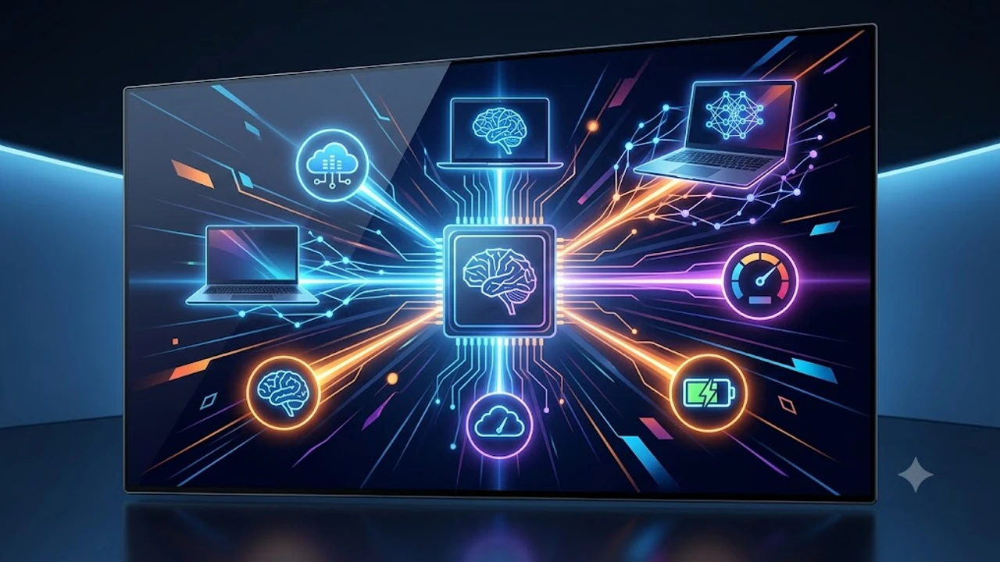

온디바이스 NPU(신경망처리장치) 탑재 유무가 노트북 작업 생산성을 가르는 기준이 되었습니다. 클라우드 연결 대기 시간 없이 기기 자체에서 문서 요약, 실시간 녹취 텍스트 변환, 이미지 업스케일링을 단독 처리하는 2026년형 고효율 모델 3종을 정밀 비교했습니다.

## 지금 AI 노트북으로 교체해야 하는 이유

데스크톱급 NPU 연산 능력이 저전력 폼팩터로 안착하면서 실무 작업 환경에 근본적인 변화가 생겼습니다.

* **온디바이스 연산 가속**: 클라우드 서버 통신 없이 40 TOPS 이상의 로컬 NPU로 기기 자체에서 프롬프트를 연산해 데이터 유출 위험을 차단하고 딜레이를 없앱니다.
* **전력 소모 절감**: 전용 NPU가 백그라운드 AI 작업을 도맡아 배터리 소모량을 줄여 실사용 연속 구동 시간을 13시간에서 18시간 선까지 확보합니다.
* **휴대 장비 간소화**: 거대한 충전 어댑터 대신 65W급 초소형 PD 충전기 하나로 충분해 이동 부담이 줄어듭니다. 가벼운 모바일 오피스 세팅에는 손목 피로를 줄여주는 [2026 무선 버티컬 마우스 추천 TOP3](/posts/trending-picks/wireless-vertical-mouse-top3-2026/)를 함께 조합하는 편이 효율적입니다.

---

## TOP3 상품 스펙 및 가격 비교

| 모델명 | 가격대 | 핵심 스펙 | 추천 대상 |
| :--- | :--- | :--- | :--- |
| **레노버 씽크북 14 Gen 7** | 90만 원\~110만 원대 | 인텔 코어 울트라 5 125H / 16GB DDR5 / 14인치 2.8K 120Hz / 1.42kg | 예산 100만 원 안팎의 실속형 직장인·대학생 |
| **ASUS 젠북 S 14 OLED** | 180만 원\~210만 원대 | 인텔 코어 울트라 7 258V(47 TOPS) / 32GB LPDDR5X / 14인치 3K 120Hz / 1.2kg | 외근이 잦고 디스플레이 화질을 중시하는 기획자 |
| **애플 맥북에어 15 M3** | 190만 원\~220만 원대 | Apple M3(16코어 Neural Engine) / 16GB 통합 메모리 / 15.3인치 Liquid Retina / 1.51kg | 무소음 팬리스와 압도적 배터리 타임을 원하는 크리에이터 |

---

## 예산대별 추천 모델 실사용 분석

### 1. 레노버 씽크북 14 Gen 7 (100만 원 내외 가성비형)
* **실제 모델명**: 레노버 씽크북 14 G7 IML-21MR
* **가격대**: 980,000원 \~ 1,120,000원
* **핵심 스펙**: 인텔 코어 울트라 5 125H 프로세서, 16GB DDR5 5600MHz RAM(듀얼 슬롯 교체 가능), 14인치 16:10 비율 2.8K(2880x1800) 120Hz IPS 패널(밝기 400nits), 60Wh 배터리, 무게 1.42kg
* **장점**:
  - 온보드 납땜 방식이 아니라 RAM 슬롯 2개와 M.2 NVMe 슬롯 2개를 제공해 추후 64GB까지 자가 증설 가능
  - 100만 원 안팎 가격대에서 보기 드문 400nits 밝기 및 120Hz 고주사율 2.8K 해상도 디스플레이 채택
* **단점**:
  - 알루미늄 상판 대비 하판 마감재 일부에 플라스틱 소재가 혼용되어 고급스러운 질감은 부족
* **추천 대상**: 100만 원 전후 한정된 예산으로 문서 작성, 코딩, 데이터 분석을 처리할 가성비 머신을 찾는 직장인 및 전공 대학생
* **쿠팡 구매 링크**: [레노버 씽크북 14 Gen 7 쿠팡에서 보기](https://www.coupang.com/np/search?q=레노버+씽크북+14+Gen7&sourceType=affiliate&trackingCode=AF8691300)

### 2. ASUS 젠북 S 14 OLED UX5406 (100만 원대 후반 밸런스형)
* **실제 모델명**: ASUS 젠북 S 14 OLED UX5406SA-PZ258W
* **가격대**: 1,890,000원 \~ 2,090,000원
* **핵심 스펙**: 인텔 코어 울트라 7 258V(루나레이크, 단독 NPU 47 TOPS), 32GB LPDDR5X 8533MHz 온보드 RAM, 1TB PCIe 4.0 NVMe SSD, 14인치 3K(2880x1800) 120Hz Lumina OLED 패널(최대 500nits, DCI-P3 100%), 72Wh 배터리, 두께 1.1cm, 무게 1.2kg
* **장점**:
  - 세라믹과 알루미늄을 결합한 세랄루미늄 바디로 지문이 묻지 않고 1.2kg 초슬림 외형 구현
  - 47 TOPS NPU 단독 연산 덕분에 인터넷 연결 없이 마이크로소프트 코파일럿+ 기능을 실시간 지연 없이 완벽 구동
* **단점**:
  - 얇은 두께 설계로 인해 풀사이즈 HDMI 포트와 USB-A 단자가 각 1개씩만 제공되어 주변기기 직결 확장성이 제한적
* **추천 대상**: 외부 미팅과 출장이 잦아 1.2kg 이하의 가벼운 무게와 긴 배터리 유지력이 필수적인 기획자, 마케터, 전문직 실무자
* **쿠팡 구매 링크**: [ASUS 젠북 S 14 OLED 쿠팡에서 보기](https://www.coupang.com/np/search?q=ASUS+젠북+S+14+OLED&sourceType=affiliate&trackingCode=AF8691300)

### 3. 애플 맥북에어 15 M3 (200만 원대 프리미엄 롱라이프형)
* **실제 모델명**: Apple 2024 맥북에어 15 M3 (MC9E4KH/A 기준)
* **가격대**: 1,980,000원 \~ 2,260,000원
* **핵심 스펙**: Apple M3 칩(8코어 CPU / 10코어 GPU / 16코어 Neural Engine), 16GB 통합 메모리, 512GB SSD, 15.3인치 Liquid Retina 디스플레이(2880x1864, 500nits 밝기, P3 색영역), 66.5Wh 배터리, 무게 1.51kg
* **장점**:
  - 냉각 팬이 전혀 없는 팬리스 구조로 도서관이나 조용한 회의실에서도 소음이 0dB로 완전 무소음 유지
  - 완충 시 웹 서핑 기준 실측 15시간 이상 버티는 전력 효율로 하루 종일 전원 어댑터 지참 불필요
* **단점**:
  - 구매 후 메모리나 SSD 확장이 불가능하며, 외장 모니터 연결 시 2대까지만 지원(노트북 상판을 닫은 클램쉘 모드 조건)
* **추천 대상**: 정숙한 작업 환경에서 4K 영상 컷 편집, 고화질 사진 보정, 긴 텍스트 작성을 장시간 이어가는 크리에이터
* **쿠팡 구매 링크**: [애플 맥북에어 15 M3 쿠팡에서 보기](https://www.coupang.com/np/search?q=애플+맥북에어+15+M3&sourceType=affiliate&trackingCode=AF8691300)

---

## 구매 전 반드시 확인할 체크포인트

* **NPU 연산 규격(최소 40 TOPS 이상 확인)**: 윈도우 진영의 차세대 코파일럿+ 로컬 AI 가속 기능을 원활히 쓰려면 NPU 단독 성능이 40 TOPS 이상이어야 합니다. 단순 CPU 클럭 숫자만 보지 말고 NPU 스펙 시트를 확인해야 합니다.
* **메모리(RAM) 최소 16GB 확보**: 온디바이스 언어 모델과 AI 이미지 생성은 메모리 상주 용량이 큽니다. 8GB 사양은 백그라운드 프로세스 처리 시 가상 메모리 병목 현상이 발생하므로 최소 16GB, 온보드 고정 모델은 32GB 선택이 안전합니다.
* **패널 밝기(400nits 이상 권장)**: 외부 카페나 채광이 강한 공유 오피스에서 작업하는 비중이 높다면 250\~300nits 패널은 빛 반사로 시인성이 떨어집니다. 최소 400nits 이상의 밝기와 안티글레어 코팅 여부를 점검해야 합니다.
* **장시간 데스크 작업 환경 점검**: 고성능 노트북으로 장시간 고정 작업을 이어갈 때는 올바른 자세 유지와 하체 피로 누적 방지를 돕는 [무선 무릎 마사지기 TOP3 비교 추천](/posts/trending-picks/wireless-knee-massager-top3-2026/) 같은 웰니스 장비를 함께 고려하면 신체 부담을 줄일 수 있습니다.

---

> 이 포스팅은 쿠팡 파트너스 활동의 일환으로, 이에 따른 일정액의 수수료를 제공받습니다.

#트렌드상품 #쿠팡추천 #AI노트북추천 #씽크북14 #젠북S14 #맥북에어15 #온디바이스AI #코파일럿PC