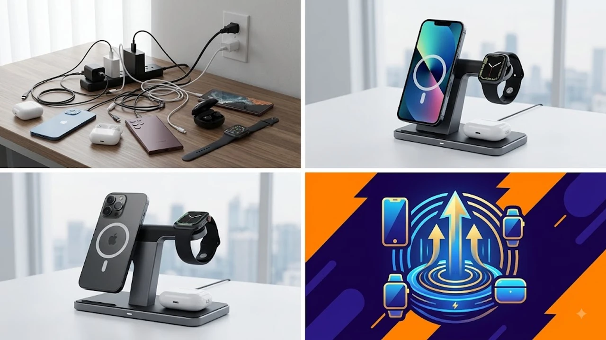

스마트폰, 스마트워치, 무선 이어폰까지 매일 충전해야 하는 기기만 최소 3개에 달하는 시대다. 침대 협탁이나 책상 위에 늘어진 C타입 케이블과 전용 충전선 때문에 지저분한 데스크 환경에 스트레스를 받는 유저가 한둘이 아니다. 이 문제를 말끔하게 해결해 주는 아이템이 바로 3in1 맥세이프 무선충전기다.

단 하나의 케이블만 연결해 두면 기기 3개를 동시에 깔끔하게 충전할 수 있어 데스크테리어의 필수품으로 자리 잡았다. 요즘 시장에서 가장 높은 판매량과 유저 만족도를 기록 중인 베스트 3개 모델을 전격 비교한다.

---

## 1. 지금 3in1 무선충전기가 뜨는 이유

최근 스마트 모빌리티와 테크 기기의 대중화로 1인당 보유한 모바일 디바이스 수가 크게 늘었다. 개별 충전기를 일일이 플러그에 꽂는 방식은 전기 콘센트 공간을 과도하게 차지하고 선 꼬임 현상을 유발한다.

첫째, **데스크 공간의 극단적 단순화**다. 3in1 충전 스탠드는 단 1개의 어댑터 선만으로 3가지 기기를 거치와 동시에 충전하므로 책상 위 선 정리가 단번에 해결된다. 최근 홈오피스 구축이나 미니멀 데스크셋업 인스타 트렌드와 맞물려 수요가 급증했다.

둘째, **맥세이프(MagSafe) 자력 방식의 정착**이다. 과거 일반 패드형 무선충전기는 위치를 조금만 잘못 놓아도 충전이 중단되는 단점이 있었다. 반면 맥세이프 방식은 코일 위치에 자석으로 정확히 밀착되므로 충전 실패율이 zero에 가깝다. 충전 중 세로나 가로로 올려두고 영상을 감상하기도 편리하다.

셋째, **여행 및 출장용 라이프스타일의 변화**다. 외부 활동이 늘어나면서 접이식(폴더블) 구조의 3in1 충전기를 파우치에 넣어 다니는 유저들이 급증했다. [트렌드 상품 추천 TOP3](/posts/trending-picks/trending-picks-20260727/) 중에서도 실용성 면에서 단연 높은 지지를 받는 이유다.

---

## 2. TOP3 대표 상품 스펙 비교

세 제품 모두 스마트폰, 스마트워치, 무선 이어폰을 동시에 충전할 수 있으나 가격대와 구조, 충전 속도 및 인증 여부에서 확실한 차이를 보인다.

| 모델명 | 가격대 | 핵심 스펙 | 추천 대상 |
| :--- | :--- | :--- | :--- |
| **신지모루 3in1 맥세이프 무선 고속충전기** | 3만원대 | 스마트폰 최대 15W, N52 네오디뮴 자석, 스탠드형 | 가성비와 강력한 자력을 최우선으로 치는 입문자 |
| **만랩 3in1 폴더블 무선 고속충전기** | 4만원대 | 180도 완전 접이식 구조, 최대 15W 출력, 각도 조절 | 출장·여행이 잦거나 이동하며 충전할 일이 많은 유저 |
| **아트뮤 3in1 맥세이프 인증 무선충전기** | 7\~8만원대 | Apple 공식 MFM 인증, 25W 전체 총출력, 쿨링 설계 | 기기 배터리 수명 보호 및 프리미엄 고속 충전을 원하는 유저 |

---

## 3. 예산대별 추천 (실제 쿠팡 검색 모델)

### [가성비 추천] 신지모루 3in1 맥세이프 무선 고속충전기

* **가격대**: 32,000원 \~ 36,000원
* **핵심 스펙**: 
  - 스마트폰 출력 최대 15W (아이폰 7.5W / 갤럭시 10\~15W 지원)
  - N52급 최고 등급 네오디뮴 자석 적용
  - 하단 고무 패드 미끄럼 방지 및 LED 충전 상태 표시등 탑재

* **장점**:
  1. 가격 대비 자력이 대단히 강력하다. 두꺼운 맥세이프 케이스를 씌운 상태에서도 흔들림 없이 착 붙는다.
  2. 스탠드 각도가 60도 눈높이에 맞춰져 있어 충전 중 세로 모드로 알림을 확인하거나 가로 모드로 숏폼 및 영상을 시청하기 용이하다.
* **단점**:
  - 스탠드 봉이 일체형 고정 구조라 접어서 가방에 넣고 다니기에는 부피를 차지한다.
* **이런 사람에게 추천**:
  책상이나 침대 옆 협탁에 fixed로 두고 쓸 가성비 높은 고정형 충전기를 찾는 유저.

👉 [신지모루 3in1 맥세이프 무선 고속충전기 쿠팡에서 보기](https://www.coupang.com/np/search?q=신지모루 3in1 맥세이프 무선 고속충전기&sourceType=affiliate&trackingCode=AF8691300)

---

### [휴대성/중간대 추천] 만랩 3in1 폴더블 무선 고속충전기

* **가격대**: 43,000원 \~ 48,000원
* **핵심 스펙**: 
  - 180도 완전 접이식(폴더블) 슬림 패널 구조 (두께 15mm)
  - 스마트폰 15W + 워치 2.5W + 이어폰 5W 동시 충전 (총 22.5W)
  - 알루미늄 합금 바디 적용으로 발열 해소 강화

* **장점**:
  1. 완전히 납작하게 접히기 때문에 전용 파우치나 슬림 가방에 부담 없이 들어간다. 출장, 여행, 카페 작업 시 높은 휴대성을 발휘한다.
  2. 스마트폰 거치 각도를 0도부터 90도까지 미세하게 자유 조절할 수 있어 반사 각도나 거치 높이를 입맛대로 변경 가능하다.
* **단점**:
  - 힌지 조임 방식이라 오래 사용 시 각도 고정력이 처음보다 살짝 헐거워질 수 있다.
* **이런 사람에게 추천**:
  장소 이동이 잦은 프리랜서, 출장길에 기기 충전 케이블을 주렁주렁 들고 다니기 싫은 디지털 노마드.

👉 [만랩 3in1 폴더블 무선 고속충전기 쿠팡에서 보기](https://www.coupang.com/np/search?q=만랩 3in1 폴더블 무선 고속충전기&sourceType=affiliate&trackingCode=AF8691300)

---

### [프리미엄 추천] 아트뮤 3in1 맥세이프 인증 무선충전기

* **가격대**: 79,000원 \~ 85,000원
* **핵심 스펙**: 
  - 애플 공식 MFM(Made for MagSafe) 모듈 인증 완료
  - 아이폰 15W 정속 고속 충전 및 팝업 애니메이션 완벽 지원 (전체 총출력 25W)
  - 저발열 스마트 IC 회로 및 독립형 코일 설계

* **장점**:
  1. 애플 공식 인증 모듈을 사용하여 충전 중 발생하는 발열이 타사 미인증 제품에 비해 적다. 배터리 열화 현상을 저하시킨다.
  2. 415g의 묵직한 하중 설계로 스마트폰을 한 손으로 떼어낼 때 충전기 본체가 함께 딸려 올라오지 않고 바닥에 안정적으로 고정된다.
* **단점**:
  - 가격대가 3in1 충전기 기준 다소 비싼 편이며 전용 어댑터(PD 30W 이상)를 별도 준비해야 제 성능이 나온다.
* **이런 사람에게 추천**:
  소중한 스마트폰 배터리 수명을 정밀하게 관리하고 싶고, 끊김 없는 정품 모듈 고속 충전을 원하는 완벽주의 테크 유저.

👉 [아트뮤 3in1 맥세이프 인증 무선충전기 쿠팡에서 보기](https://www.coupang.com/np/search?q=아트뮤 3in1 맥세이프 인증 무선충전기&sourceType=affiliate&trackingCode=AF8691300)

---

## 4. 구매 전 반드시 확인할 체크포인트

3in1 무선충전기를 결제하기 전 다음 3가지 사항을 점검하지 않으면 제대로 된 충전 속도가 나오지 않거나 기기와 호환되지 않아 환불하는 사태가 벌어진다.

### 1) 전용 워치 충전 모듈의 호환 브랜드 (애플워치 vs 갤럭시워치)
3in1 충전기의 워치 충전부에 배치된 독(Dock)은 규격이 완전히 다르다. 애플워치 전용 모듈에 갤럭시워치를 올리면 자력이 붙지 않거나 충전 에러가 난다. 반대 경우도 마찬가지다. 본인이 보유한 스마트워치가 애플워치인지 갤럭시워치인지에 맞춰 상세 페이지의 워치 지원 모델을 정확히 매칭해야 한다.

### 2) 초고속 충전 지원 어댑터(QC 3.0 / PD 30W 이상) 사용 유무
3개의 기기를 한 번에 무선으로 공급하려면 충전기에 공급되는 입력 전력이 충분해야 한다. 기존에 사용하던 5W, 10W짜리 일반 어댑터에 3in1 스탠드를 연결하면 폰 하나만 겨우 충전되거나 3개가 동시에 올라갔을 때 충전이 끊기는 현상이 발생한다. **반드시 최소 25W\~30W 이상의 PD/QC 고속 충전 어댑터**를 연결해야 스펙상의 충전 속도가 구현된다.

### 3) 발열 제어 및 FOD(이물질 감지) 회로 탑재
무선 충전 기술은 전자기 유도로 작동하므로 일정 수준의 열 발생이 불가피하다. 충전기와 기기 사이에 동전이나 열쇠 같은 금속 물질이 들어갔을 때 이를 자동으로 감지하여 전류를 차단하는 FOD(Foreign Object Detection) 기능이 있는지 꼭 체크하자. 또한 과전압 차단 및 온도 센서 회로가 내장되어 있어야 자는 동안 기기를 올려두어도 안심할 수 있다.

데스크 위를 깔끔하게 정리하는 것 외에도 힐링 및 건강 가전에 관심이 있다면 [무선 종아리 마사지기 TOP3 가성비 비교](/posts/trending-picks/wireless-calf-massager-top3-2026/) 글이나 집안일을 획기적으로 줄여주는 [창문 로봇청소기 TOP3 추천 가성비 비교](/posts/trending-picks/smart-window-cleaner-robot-top3-2026/) 포스팅도 함께 참고하기 바란다.

---

> 이 포스팅은 쿠팡 파트너스 활동의 일환으로, 이에 따른 일정액의 수수료를 제공받습니다.

#트렌드상품 #쿠팡추천 #3in1무선충전기추천 #맥세이프무선충전기 #데스크테리어 #고속무선충전기 #신지모루맥세이프 #아트뮤맥세이프 #만랩충전기