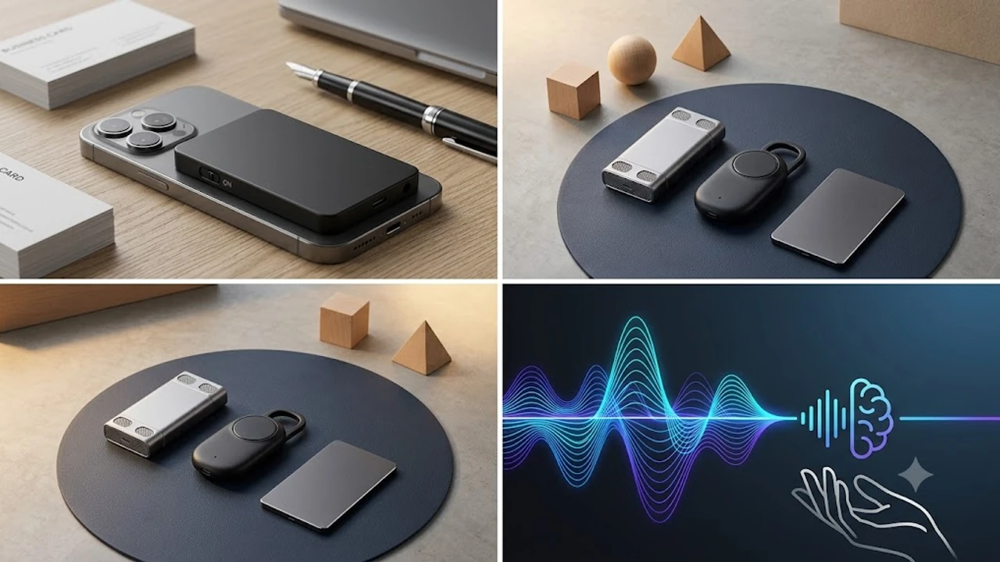

회의가 끝난 뒤 녹음 파일을 다시 들으며 일일이 타이핑하는 작업은 업무 효율을 갉아먹는 주범입니다. 1시간짜리 미팅을 텍스트로 풀고 핵심 안건을 정리하는 데만 최소 2시간 이상 소요됩니다. 2026년 하반기 직장인과 프리랜서들 사이에서 AI 보이스레코더가 필수 생산성 기기로 자리 잡은 이유가 여기에 있습니다. 전용 하드웨어 센서로 잡음 없이 통화와 대면 대화를 기록하고, 스마트폰 앱을 통해 1\~2분 만에 발화자 구분과 회의록 요약까지 끝내줍니다.

## 1. 지금 AI 보이스레코더가 뜨는 이유

스마트폰 기본 음성 메모나 통화 녹음 기능이 있는데도 외장형 AI 레코더 수요가 폭발하는 배경에는 하드웨어와 소프트웨어의 명확한 한계 극복이 있습니다.

첫째는 **통화 녹음의 안정성과 음질**입니다. 특히 아이폰 사용자는 별도의 서드파티 앱이나 스피커폰 통화 없이 깔끔한 녹음 환경을 구축하기 어려웠습니다. 최신 카드형 AI 레코더는 스마트폰 후면에 맥세이프로 부착한 뒤 진동 감지 센서(VCS)를 통해 기기 내부 진동을 직접 수음하므로, 주변 소음이 섞이지 않고 상대방 목소리와 내 목소리가 모두 선명하게 기록됩니다.

둘째는 **LLM 기반 요약 파이프라인의 완성도**입니다. 단순 음성-텍스트 변환(STT) 수준에 머물던 과거와 달리, 최신 기기들은 ChatGPT나 독자 대형 언어 모델과 직접 연동됩니다. 대화 내용 중 날짜, 결정 사항, 액션 아이템, 마인드맵 형태로 구조화해 즉시 노션이나 슬랙으로 공유할 수 있는 수준까지 진화했습니다.

셋째는 **기동성과 휴대성**입니다. 2.9mm 수준의 얇은 알루미늄 카드 폼팩터로 지갑이나 스마트폰 뒷면에 붙여두었다가, 미팅 시작 전 스위치 하나만 올리면 즉각 녹음이 시작됩니다. 스마트폰 화면을 켜서 앱을 찾고 녹음 버튼을 누르는 번거로운 과정 자체가 사라집니다.

---

## 2. TOP3 상품 스펙 비교

| 모델명 | 가격대 | 핵심 스펙 | 추천 대상 |
| :--- | :--- | :--- | :--- |
| **플라우드 노트 (Plaud Note)** | 229,000원 | 64GB 저장, 두께 2.9mm, 듀얼 센서(공기전도+VCS) | 아이폰 사용자, 비즈니스 미팅 및 마인드맵 요약 필수자 |
| **아이플라이텍 스마트 AI 레코더 A1** | 149,000원 | 32GB 저장, 지향성 듀얼 마이크, 실시간 다국어 번역 | 현장 인터뷰가 잦은 프리랜서, 외근 및 해외 바이어 미팅 실무자 |
| **픽스 스마트 AI 텍스트 녹음기** | 98,000원 | 32GB 저장, 무게 36g 소형 바 타입, 원터치 즉시 녹음 | 대학생 강의 필기, 저비용으로 STT 요약 입문하려는 구매자 |

책상 위에서 장시간 타이핑과 회의록 정리를 병행하는 분들은 손목 피로도를 낮추기 위해 [2026 무선 버티컬 마우스 추천 TOP3](/posts/trending-picks/wireless-vertical-mouse-top3-2026/) 글도 함께 참고하면 업무 데스크 환경을 훨씬 쾌적하게 구성할 수 있습니다.

---

## 3. 예산대별 추천 모델 상세 분석

### ① 프리미엄형: 플라우드 노트 (Plaud Note)

맥세이프 카드형 AI 레코더 시장을 개척한 대표 플래그십 모델입니다. 스마트폰 후면에 부착해도 손에 걸리지 않는 얇은 알루미늄 합금 바디를 갖췄습니다.

* **가격대**: 229,000원
* **핵심 스펙**:
  * 2.9mm 초슬림 두께, 30g 초경량 설계
  * 듀얼 픽업 엔진: 대면 미팅용 듀얼 MEMS 마이크 + 통화 녹음용 VCS 진동 센서
  * 내장 64GB 메모리 (최대 480시간 오디오 저장), 400mAh 배터리 (연속 30시간 녹음 지원)
* **장점**:
  * 물리 스위치 하나로 통화 녹음 모드와 일반 미팅 녹음 모드를 직관적으로 전환할 수 있어 조작 실수가 없습니다.
  * 전용 앱의 ChatGPT 연동 요약 기능이 뛰어납니다. 회의록, 통화 브리핑, 강의 노트, 마인드맵 등 원하는 템플릿 형태로 즉시 재가공해 줍니다.
* **단점**:
  * 매월 기본 제공되는 300분 무료 변환 시간 소진 후 대량 변환 시 연간 멤버십 구독 비용이 발생합니다.
* **추천 대상**:
  * 전화 통화와 대면 미팅이 잦은 영업직, 컨설턴트, 통화 녹음 품질이 필요한 아이폰 직장인

👉 [플라우드 노트 쿠팡에서 보기](https://www.coupang.com/np/search?q=플라우드노트&sourceType=affiliate&trackingCode=AF8691300)

---

### ② 밸런스형: 아이플라이텍 스마트 AI 레코더 A1

음성 인식 원천 기술을 보유한 아이플라이텍의 스테디셀러로, 한국어 인식률과 노이즈 제거 기술이 돋보이는 모델입니다.

* **가격대**: 149,000원
* **핵심 스펙**:
  * 고감도 듀얼 실리콘 마이크 탑재 (360도 전방향 최대 5m 원거리 수음)
  * 32GB 로컬 저장 공간 + 전용 클라우드 동기화 지원
  * 550mAh 배터리 내장 (최대 25시간 연속 녹음, 대기 시간 최대 20일)
* **장점**:
  * 카페나 야외 등 주변 소음이 심한 환경에서도 화자 목소리를 분리해내는 알고리즘이 안정적입니다.
  * 다국어 음성 인식 및 실시간 번역 기능을 지원하여 외국계 기업 미팅이나 어학 학습용으로 쓰임새가 넓습니다.
* **단점**:
  * 스틱형 디자인이라 스마트폰 뒷면에 자석으로 부착해 다니기에는 15mm 수준의 두께감이 있습니다.
* **추천 대상**:
  * 현장에서 인터뷰를 자주 진행하는 기자, 리서처, 합리적 가격대에 정확한 한국어 STT 성능을 원하는 실무자

👉 [아이플라이텍 스마트 AI 레코더 A1 쿠팡에서 보기](https://www.coupang.com/np/search?q=아이플라이텍A1&sourceType=affiliate&trackingCode=AF8691300)

---

### ③ 가성비 입문형: 픽스 스마트 AI 텍스트 녹음기

10만원 언더의 진입 장벽으로 스마트폰 연동 STT 텍스트 변환 핵심 기능만 알차게 담아낸 실속형 기기입니다.

* **가격대**: 98,000원
* **핵심 스펙**:
  * 36g 초경량 콤팩트 바디
  * 원터치 슬라이드 녹음 방식 (전원 오프 상태에서도 1초 만에 녹음 구동)
  * 32GB 내장 플래시 메모리 탑재
* **장점**:
  * 기기 자체 조작법이 매우 직관적이어서 IT 기기에 익숙하지 않은 사람도 수령 즉시 사용할 수 있습니다.
  * 10만원 미만의 가격으로 강의 녹음이나 일상 아이디어 메모용으로 부담 없이 선택할 수 있습니다.
* **단점**:
  * 복잡한 마인드맵 생성이나 심층 분석 요약 템플릿은 지원하지 않으며 기본 텍스트 변환에 집중되어 있습니다.
* **추천 대상**:
  * 대학교 전공 강의 필기를 자동화하고 싶은 학생, 고가 구독형 디바이스가 부담스러운 AI 레코더 입문자

👉 [픽스 스마트 AI 녹음기 쿠팡에서 보기](https://www.coupang.com/np/search?q=픽스스마트AI녹음기&sourceType=affiliate&trackingCode=AF8691300)

---

## 4. 구매 전 반드시 확인할 체크포인트

기기를 결제하기 전 아래 4가지 항목을 점검해야 불필요한 지출을 막을 수 있습니다.

1. **통화 녹음 전용 하드웨어 센서 유무**:
단순 마이크로 스피커 소리를 다시 따는 방식은 주변 하울링과 잡음이 섞여 AI 인식률이 떨어집니다. 스마트폰 통화 녹음이 주 목적이라면 기기 진동을 직접 읽는 VCS 진동 감지 센서가 탑재되었는지 확인해야 합니다.
2. **한국어 STT 인식률과 화자 분리**:
2인 이상 다자간 회의가 잦다면 말하는 사람이 바뀔 때 줄바꿈이 정상적으로 이루어지는지 확인해야 합니다. 화자 1, 화자 2로 구분되지 않으면 긴 줄글 텍스트를 다시 읽으며 발화자를 일일이 찾아야 합니다.
3. **월간 무료 변환 시간 및 구독 요금 체계**:
AI 레코더는 클라우드 서버에서 LLM 연산을 거치기 때문에 대부분 월간 무료 사용 시간(매월 300\~600분)을 둡니다. 본인의 한 달 평균 회의 시간을 계산해 기본 제공량 안에서 소화할 수 있는지, 초과 시 분당 결제 정책이 합리적인지 체크해야 합니다.
4. **배터리 지속 시간과 원터치 기동성**:
회의나 인터뷰는 예고 없이 길어질 수 있습니다. 최소 연속 20시간 이상 구동을 보장하는 배터리 스펙인지, 스마트폰 잠금을 풀지 않고도 물리 스위치로 즉각 켜지는지 확인하는 것이 실사용 만족도를 결정합니다.

퇴근 후 하루 동안 누적된 피로를 풀고 내일 미팅을 준비할 컨디션을 만들고 싶다면 [무선 종아리 마사지기 TOP3 가성비 비교](/posts/trending-picks/wireless-calf-massager-top3-2026/)도 함께 확인해 보세요.

---

> 이 포스팅은 쿠팡 파트너스 활동의 일환으로, 이에 따른 일정액의 수수료를 제공받습니다.

#트렌드상품 #쿠팡추천 #AI보이스레코더 #플라우드노트 #아이플라이텍 #음성녹음기 #회의록요약 #스마트오피스 #직장인필수템