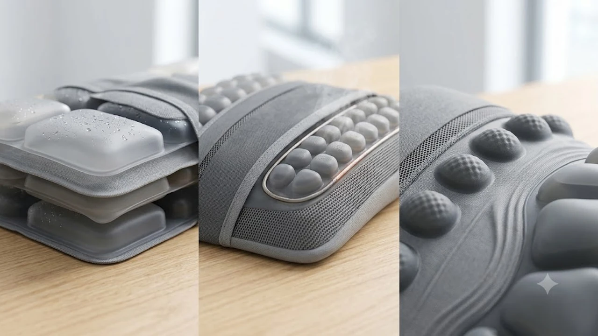

하루 종일 모니터를 내려다보며 일하다 보면 퇴근 무렵 목덜미가 돌덩이처럼 굳고 어깨까지 뻐근해집니다. 손으로 주무르거나 딱딱한 폼롤러 위에 누워 비벼봐도 그때뿐이고, 자칫 목뼈에 무리가 가 오히려 통증이 심해지기도 합니다.

최근 2026년 9월 명절 시즌과 맞물려 부모님 선물 겸 직장인 필수 아이템으로 급부상한 제품군이 에어 챔버형 '경추 온열 스트레칭 베개'입니다. 물리적인 모터 롤러로 뼈를 때리는 방식 대신, 공기 주머니가 부풀어 오르며 목을 위로 들어 올려 C자 커브를 회복시켜 줍니다. 시중에 나온 수많은 기기 중 사용자 만족도가 높고 완성도가 검증된 대표 모델 3종을 골라 스펙과 장단점을 비교했습니다.

---

## 1. 지금 이 카테고리가 뜨는 이유

사무직 직장인과 학생들의 일자목·거북목 문제는 만성적인 고민거리입니다. 업무 환경을 개선하려고 [2026 무선 버티컬 마우스 추천 TOP3](/posts/trending-picks/wireless-vertical-mouse-top3-2026/) 등을 도입해 손목 부담을 덜더라도, 앞으로 쏠린 목과 굳어버린 경추는 물리적인 견인 이완 없이는 풀리지 않습니다.

과거에는 수백만 원대 전신 안마의자를 찾았지만, 공간 차지와 가격 부담 탓에 10만 원 안팎의 콤팩트한 전용 기기로 소비 패턴이 이동했습니다. 기존 회전형 마사지기는 뼈가 돌출된 목 부위에 직접 타격을 주어 통증을 유발하는 한계가 명확했습니다. 반면 에어 리프트 방식은 공기압으로 목 뒤를 받쳐 올려 경추 1번부터 7번까지의 마디를 자연스럽게 견인합니다.

여기에 초가을 환절기 근육 긴장을 풀어주는 급속 온열 기능이 더해지면서 9월 쇼츠와 릴스 등에서 "15분 누워있으면 목이 가벼워진다"는 실사용 영상이 높은 조회수를 기록했습니다. 가벼운 무게와 부담 없는 가격 덕분에 명절 부모님 효도 선물이나 지인 선물로 구매 전환율이 빠르게 오르고 있습니다.

---

## 2. TOP3 상품 스펙 비교

세 모델 모두 목을 들어 올리는 견인 원리를 쓰지만, 에어셀의 배치와 지압 범위, 온도 설정에서 뚜렷한 차이를 보입니다.

| 모델명 | 가격대 | 핵심 스펙 | 추천 대상 |
| :--- | :--- | :--- | :--- |
| **클럭 스트레칭 목베개 프로** | 12만 원대 | 듀얼 독립 에어셀, 최대 10cm 견인, 45°C 온열 | 깊은 C커브 견인력을 원하는 만성 일자목 직장인 |
| **풀리오 넥 앤 숄더 릴렉서** | 10만 원대 | 복합 에어포켓+승모근 지압돌기, 48°C 온열, C타입 충전 | 목과 승모근 결림을 동시에 풀고 싶은 분 |
| **바디픽셀 에어트랙 경추 스트레처** | 7만 원대 | 3단계 수직 에어 챔버, 42°C 온열, 메모리폼 일체형 | 실속 있는 가격으로 입문하려는 수험생 및 직장인 |

---

## 3. 예산대별 추천 모델 상세 분석

### 1) 클럭 스트레칭 목베개 프로 (프리미엄 정밀형)

* **실제 모델명 / 브랜드:** 클럭(Klug) 스트레칭 목베개 프로
* **실시간 가격대:** 12만 원대 후반
* **핵심 스펙:**
  * 상·하단 듀얼 독립 에어셀 탑재로 최대 10cm 수직 견인
  * 3단계 온도 조절 (최고 45°C 급속 온열)
  * 완충 시 15분 기준 최대 6회 무선 구동 가능한 2,000mAh 배터리
* **장점:**
  * 에어셀이 위아래로 나뉘어 경추 상부와 하부를 교차로 밀어 올려주는 스트레칭 모드가 압도적으로 개운합니다.
  * 머리를 받쳐주는 측면 지지대 설계가 단단해 견인 중 고개가 옆으로 꺾이지 않습니다.
* **단점:**
  * 타사 기기 대비 본체 무게감이 있어 출장이나 여행 시 휴대하기에는 부피를 차지합니다.
* **이런 사람에게 추천:** 정형화된 C자 곡선 회복이 절실한 만성 일자목 사용자나 강력한 지압력과 높은 견인 높이를 선호하는 분.

👉 [클럭 스트레칭 목베개 프로 쿠팡에서 보기](https://www.coupang.com/np/search?q=클럭+스트레칭+목베개+프로&sourceType=affiliate&trackingCode=AF8691300)

---

### 2) 풀리오 넥 앤 숄더 릴렉서 (밸런스 인기형)

* **실제 모델명 / 브랜드:** 풀리오(PULIO) 넥 앤 숄더 릴렉서
* **실시간 가격대:** 10만 원대 초반
* **핵심 스펙:**
  * 목 견인 에어백 + 상부 승모근 압박 핑거 지압 돌기 일체형 구조
  * 2단계 파워 온열 모드 (최대 48°C 고온 찜질 지원)
  * 직관적인 원터치 무선 컨트롤러 탑재
* **장점:**
  * 목뿐만 아니라 목 아랫부분과 승모근 상단을 묵직하게 눌러주어 승모근 뭉침 해소에 탁월합니다.
  * 온열 도달 속도가 1분 이내로 빨라 목 뒤에 따뜻한 찜질팩을 얹은 듯한 이완감을 줍니다.
* **단점:**
  * 체구가 작은 체형의 경우 승모근 지압 돌기 간격이 다소 넓게 느껴질 수 있습니다.
* **이런 사람에게 추천:** 평소 목 결림과 함께 어깨가 솟아오르고 승모근 통증을 자주 겪는 직장인. 하체 피로 완화를 위해 [무선 종아리 마사지기 TOP3 가성비 비교](/posts/trending-picks/wireless-calf-massager-top3-2026/) 기기를 병행하는 분들에게 이상적인 세팅입니다.

👉 [풀리오 넥 앤 숄더 릴렉서 쿠팡에서 보기](https://www.coupang.com/np/search?q=풀리오+넥+앤+숄더+릴렉서&sourceType=affiliate&trackingCode=AF8691300)

---

### 3) 바디픽셀 에어트랙 경추 스트레처 (가성비 입문형)

* **실제 모델명 / 브랜드:** 바디픽셀(Bodypixel) 에어트랙 경추 스트레처
* **실시간 가격대:** 7만 원대 중반
* **핵심 스펙:**
  * 3단계 공기압 조절 수직 리프팅 시스템 (최대 높이 8.5cm)
  * 38°C\~42°C 체온 맞춤형 안정 온열 설계
  * 고밀도 저반발 메모리폼 베이스 바디
* **장점:**
  * 외곽 프레임이 부드러운 메모리폼으로 마감되어 기기 전원을 끈 상태에서도 기본 경추 베개로 목을 탄탄히 받쳐줍니다.
  * 7만 원대의 진입 장벽 없는 가격대로 부모님이나 수험생 선물용으로 부담이 없습니다.
* **단점:**
  * 에어백 견인 높이가 최대 8.5cm 수준이라 강한 물리적 꺾임을 원하는 숙련자에게는 자극이 완만합니다.
* **이런 사람에게 추천:** 강한 압박에 거부감이 있어 부드러운 이완을 원하거나 가성비 좋은 입문용 기기를 찾는 분.

👉 [바디픽셀 에어트랙 경추 스트레처 쿠팡에서 보기](https://www.coupang.com/np/search?q=바디픽셀+에어트랙+경추+스트레처&sourceType=affiliate&trackingCode=AF8691300)

---

## 4. 구매 전 반드시 확인할 체크포인트

### 1) 최대 견인 높이와 조절 단계
체형과 목 유연성에 맞춰 적정 견인 높이를 골라야 합니다. 처음부터 10cm 이상 무리하게 들어 올리면 경추 후관절에 무리가 가므로, 5cm부터 10cm까지 최소 3단계 이상 압력 조절을 지원하는 제품을 선택해야 합니다.

### 2) 안전 온열 제어 및 자동 꺼짐 타이머
목덜미는 피부층이 얇아 지속적인 고온 노출 시 저온 화상 위험이 있습니다. 15\~20분 단위로 전원이 꺼지는 자동 차단 타이머를 갖추었는지, 온도가 45\~48°C를 초과하지 않도록 센서 제어가 작동하는지 점검해야 합니다.

### 3) 완전 무선 방식과 배터리 구동 시간
유선 케이블 방식은 거실 바닥이나 침대에서 사용 시 배선에 걸려 목 자세가 비뚤어지기 십상입니다. USB-C 타입 충전을 지원하며 완충 상태에서 최소 60분(약 4회 이상) 연속 사용 가능한 배터리 스펙을 확인해야 합니다.

### 4) 위생적인 커버 분리 세탁 여부
목 부위는 땀과 피부 유분이 직접 닿습니다. 피부가 닿는 패브릭 커버를 지퍼로 분리해 세탁할 수 있거나, 방오 코팅 가죽이 적용되어 물티슈로 상시 관리가 가능한지 따져보는 것이 청결 유지의 핵심입니다.

---

> 이 포스팅은 쿠팡 파트너스 활동의 일환으로, 이에 따른 일정액의 수수료를 제공받습니다.

#트렌드상품 #쿠팡추천 #경추온열스트레칭베개 #목스트레칭기 #거북목교정기 #부모님추석선물 #클럭스트레칭목베개 #풀리오넥앤숄더 #바디픽셀에어트랙