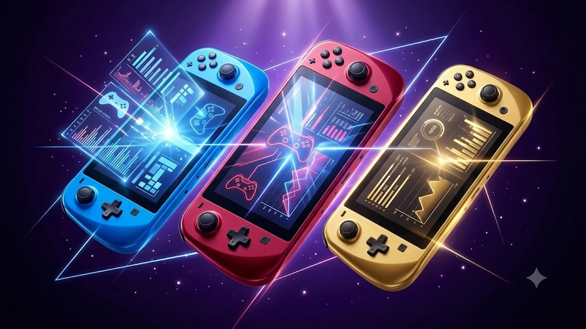

대중교통 이동 중이나 침대 위에서 PC 스팀 라이브러리를 그대로 구동하는 핸드헬드 게이밍 PC 시장이 빠르게 커졌습니다. 초저전력 APU 아키텍처의 비약적 진화 덕분에 벽돌 같던 휴대용 기기에서도 1080p 고화질 60프레임 방어가 현실이 되었습니다.

## 1. 지금 UMPC 휴대용 콘솔이 급부상한 배경

휴대용 PC 게이밍 환경은 단순 타협용 기기를 벗어나 완전한 주류 플랫폼으로 안착했습니다.

* **초저전력 아키텍처 혁신**: 15W\~25W 저전력 TDP 구간에서도 최신 RDNA 그래픽 기반 APU가 뛰어난 프레임 유지력을 증명했습니다.
* **통합 PC 생태계 연결**: 별도 콘솔 타이틀을 다시 구매할 필요 없이 기존 스팀, 에픽게임즈, 엑스박스 게임패스 세이브 파일을 클라우드로 즉각 동기화합니다.
* **거치형 하이브리드 확장성**: USB4 및 OCuLink 인터페이스 보급으로 집에서는 외장 eGPU 독에 물려 4K 데스크톱 환경으로 즉각 전환됩니다.

장시간 패드를 잡고 게임을 즐기거나 정밀한 데스크 작업을 병행한다면 손목 부담을 줄여주는 [2026 무선 버티컬 마우스 추천 TOP3](/posts/trending-picks/wireless-vertical-mouse-top3-2026/) 가이드를 함께 참고해 보길 권합니다.

---

## 2. 2026 TOP3 핵심 스펙 및 모델별 상세 분석

| 모델명 | 실구매 가격대 | 핵심 스펙 | 추천 대상 |
| :--- | :--- | :--- | :--- |
| **밸브 스팀덱 OLED 512GB** | 80만 원대 중반 | 7.4인치 90Hz HDR OLED, 50Wh 배터리, 640g | 콘솔식 편의성과 긴 배터리 타임을 원하는 입문자 |
| **ASUS ROG Ally X** | 110만\~120만 원대 | Ryzen Z1 Extreme, 24GB LPDDR7X, 80Wh, 120Hz VRR | 안티치트 온라인 게임과 고주사율 플레이 선호자 |
| **GPD WIN Max 2 (2025/2026)** | 190만\~210만 원대 | Ryzen AI 9 HX 370, 32GB RAM, 10.1인치, OCuLink | 외장 그래픽 연결 및 코딩·문서 작업을 겸하는 헤비유저 |

### 밸브 스팀덱 OLED 512GB (Valve Steam Deck OLED)
* **가격대**: 80만 원대 중반
* **핵심 스펙**: 7.4인치 90Hz OLED 패널(최대 1,000니트 HDR), 6nm 공정 커스텀 AMD APU, 50Wh 대용량 배터리, 무게 640g
* **장점**: 
  - OLED 특유의 완벽한 블랙 표현력과 압도적인 암부 대비감 덕분에 시각적 몰입감이 뛰어납니다.
  - 리눅스 기반 SteamOS의 완성도가 높아 콘솔 게임기처럼 전원 버튼 하나로 즉각 슬립 및 재개가 가능합니다.
* **단점**: 
  - 넥슨, 라이엇 등 윈도우 커널 레벨 안티치트가 필요한 국내 온라인 게임 구동이 기본 상태에서 불가능합니다.
* **추천 대상**: 복잡한 윈도우 세팅 없이 스팀 패키지 게임과 인디 게임을 침대에서 쾌적하게 즐기고 싶은 분
* [스팀덱 OLED 쿠팡에서 보기](https://www.coupang.com/np/search?q=스팀덱+OLED&sourceType=affiliate&trackingCode=AF8691300)

### 에이수스 ROG 엘라이 X (ASUS ROG Ally X)
* **가격대**: 110만\~120만 원대
* **핵심 스펙**: AMD Ryzen Z1 Extreme, 24GB LPDDR7X 7500MHz 메모리, 80Wh 리튬이온 배터리, 7.0인치 FHD 120Hz VRR 디스플레이, 678g
* **장점**: 
  - 24GB 넉넉한 램 용량 덕분에 VRAM을 8GB 이상 할당해도 시스템 메모리 부족 병목이 전혀 발생하지 않습니다.
  - 전작 대비 2배로 늘어난 80Wh 대용량 배터리를 탑재해 고사양 게임 구동 시에도 외부 전원 없이 2시간 이상 연속 플레이가 보장됩니다.
* **단점**: 
  - 전작 대비 두께와 그립이 대폭 개선되었으나 여전히 678g 무게로 인해 누워서 장시간 플레이하기에는 손목에 누적 피로가 발생합니다.
* **추천 대상**: FC 온라인, 로스트아크 같은 윈도우 기반 게임부터 최신 고사양 AAA 타이틀까지 프레임 드랍 없이 돌리고 싶은 분
* [ASUS ROG Ally X 쿠팡에서 보기](https://www.coupang.com/np/search?q=ROG+Ally+X&sourceType=affiliate&trackingCode=AF8691300)

### GPD WIN Max 2
* **가격대**: 190만\~210만 원대
* **핵심 스펙**: AMD Ryzen AI 9 HX 370 프로세서, 32GB LPDDR5X 메모리, 10.1인치 IPS 터치스크린, OCuLink 포트 내장, 67Wh 배터리, 1,005g
* **장점**: 
  - 내장 쿼티 물리 키보드와 터치패드가 기본 탑재되어 게임 컨트롤러 커버를 닫으면 완벽한 휴대용 미니 노트북으로 변신합니다.
  - 전용 OCuLink 64Gbps 다이렉트 PCIe 포트를 기본 지원해 데스크톱용 eGPU 도킹 스테이션과 연결 시 성능 손실이 극도로 적습니다.
* **단점**: 
  - 본체 무게가 1kg을 넘어가므로 손에 단독으로 들고 조작하는 핸드헬드 형태로는 사용이 거의 불가능하며 책상이나 무릎 거치가 필수입니다.
* **추천 대상**: 코딩, 문서 편집, 영상 컷편집 등 생산성 작업과 고사양 PC 게이밍을 기기 한 대로 끝내려는 하이엔드 파워유저
* [GPD WIN Max 2 쿠팡에서 보기](https://www.coupang.com/np/search?q=GPD+WIN+Max+2&sourceType=affiliate&trackingCode=AF8691300)

기기 내부 쿨링팬의 먼지 관리가 고민된다면 흡기구 청소에 유용한 [무선 에어건 제트팬 추천 TOP3 비교](/posts/trending-picks/wireless-turbo-jet-air-duster-top3-2026/) 분석도 확인해 보길 바랍니다.

---

## 3. 예산대별 맞춤 선택 기준

* **80만 원대 가성비 & 입문**: 최적화가 완성된 스팀덱 OLED를 권장합니다. 리눅스 기반 슬립 모드의 배터리 보존율이 월등하며 스팀 라이브러리 연동 편의성이 가장 뛰어납니다.
* **100만 원대 초중반 표준 올라운더**: 윈도우 11 환경이 필수적이라면 ASUS ROG Ally X가 확실한 답입니다. 80Wh 배터리와 24GB 통합 램 구성을 갖춰 하드웨어 완성도가 가장 균형 잡혀 있습니다.
* **200만 원 내외 종결급 하이브리드**: 외부 그래픽카드 확장을 통한 데스크톱 대체 및 타이핑 작업을 원한다면 풀사이즈 키보드와 OCuLink 규격을 내장한 GPD WIN Max 2가 독보적인 선택지입니다.

---

## 4. 구매 전 반드시 확인해야 할 4가지 체크포인트

* **운영체제(OS) 호환성**: 콘솔 형태의 직관적인 인터페이스와 즉시 절전 복귀를 원하면 SteamOS, 넥슨 계열 게임이나 배틀넷·치트 방지 엔진 탑재 타이틀 구동이 목적이라면 Windows 11 탑재기를 골라야 합니다.
* **화면 주사율과 VRR(가변 주사율) 지원 여부**: 30\~50프레임 구간에서 프레임 출렁임이 심할 때 화면 찢어짐(티어링)과 스터터링을 잡아주는 FreeSync VRR 지원 유무는 실제 체감 부드러움에 막대한 차이를 만듭니다.
* **배터리 용량(Wh)**: 핸드헬드 기기의 전력 소모량은 15W\~30W에 달합니다. 본체 배터리 용량이 최소 50Wh 이상인지 확인해야 야외에서 실사용 2시간 이상을 확보할 수 있습니다.
* **eGPU 포트 규격**: 거치형 셋업을 고려할 때 썬더볼트4/USB4(40Gbps) 대비 유효 대역폭이 64Gbps로 넓고 병목 현상이 적은 OCuLink 단자가 장착되어 있는지 점검하는 것이 유리합니다.

---

> 이 포스팅은 쿠팡 파트너스 활동의 일환으로, 이에 따른 일정액의 수수료를 제공받습니다.

#트렌드상품 #쿠팡추천 #UMPC #핸드헬드PC #스팀덱OLED #ROG엘라이X #게이밍기어