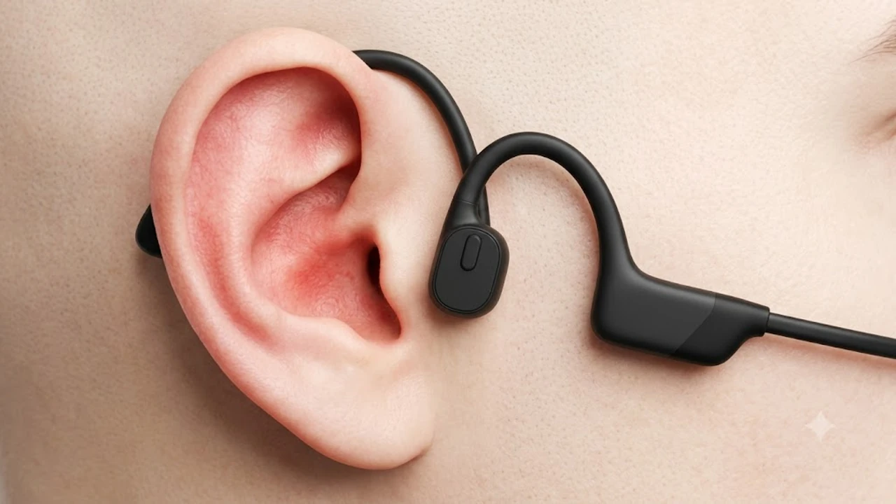

야외 러닝과 라이딩 시즌이 본격화되면서 귀를 막지 않고 주변 환경음을 그대로 들을 수 있는 골전도 이어폰 수요가 급증했습니다. 외이도염 걱정 없이 장시간 쾌적하게 착용할 수 있어 운동 마니아뿐만 아니라 장시간 통화가 필요한 직장인들의 필수 아이템으로 자리 잡았습니다.

## 1. 지금 골전도 블루투스 이어폰이 뜨는 이유

귓구멍을 꽉 막는 커널형 이어폰을 오래 착용해 귓속 염증을 호소하는 사례가 늘면서 귀를 개방하는 오픈형 구조를 찾는 소비자가 눈에 띄게 늘었습니다. 특히 도심 로드 러닝이나 자전거 주행 시 뒤에서 접근하는 차량, 킥보드 경적음을 즉각 인지할 수 있어 안전 장비로서의 인식이 확고해졌습니다.

음질 기술의 진화도 검색량 급증의 핵심 요인입니다. 골전도 특유의 빈약한 저음과 진동 간지러움을 보완하기 위해 골전도 진동판과 공기전도 저음 드라이버를 결합한 하이브리드 설계가 도입되었습니다. 야외 운동 중 안전을 확보하면서도 풍성한 사운드를 즐길 수 있게 되어, 가벼운 조깅부터 하프 마라톤 준비까지 폭넓은 유저층이 유입되고 있습니다.

## 2. 골전도 블루투스 이어폰 TOP3 스펙 비교

| 모델명 | 가격대 | 핵심 스펙 | 추천 대상 |
| :--- | :--- | :--- | :--- |
| **브리츠 BZ-BONE X5** | 3만 원대 | Bluetooth 5.3, IPX5 방수, 연속 재생 6시간 | 가성비 입문자, 실내 홈트레이닝 위주 유저 |
| **샥즈 오픈런 S805** | 10만 원대 중후반 | Bluetooth 5.1, IP67 완전 방수, 무게 26g, 8시간 재생 | 데일리 야외 러너, 사이클 동호인 |
| **샥즈 오픈런 프로 2 S820** | 20만 원대 중반 | 하이브리드 듀얼 드라이버, USB-C 직결 충전, 12시간 재생 | 음질 타협 없는 장거리 마라토너 및 아웃도어 스포츠 마니아 |

## 3. 예산대별 추천 상품 상세 분석

### 브리츠 BZ-BONE X5 (3만 원대)
* **핵심 스펙**: 최신 블루투스 5.3 칩셋 탑재, 무게 28g, IPX5 생활 방수, 완충 시 최대 6시간 연속 재생.
* **장점**: 3만 원대의 뛰어난 가성비로 골전도 방식을 부담 없이 체험할 수 있으며, 28g 경량 설계로 관자놀이 압박감이 적습니다.
* **단점**: 볼륨을 70% 이상 올릴 경우 진동감이 체감되며 베이스 음역대의 타격감이 다소 얇습니다.
* **추천 대상**: 골전도 이어폰을 처음 입문하거나 헬스장 웨이트, 실내 스트레칭용 세컨드 이어폰을 찾는 분에게 적합합니다.
* [브리츠 BZ-BONE X5 쿠팡에서 보기](https://www.coupang.com/np/search?q=%EB%B8%8C%EB%A6%AC%EC%B8%A0+BZ-BONE+X5&sourceType=affiliate&trackingCode=AF8691300)

### 샥즈 오픈런 S805 (10만 원대 중후반)
* **핵심 스펙**: 티타늄 풀 프레임 26g 초경량, IP67 완전 방진·방수 등급, 10분 급속 충전으로 1.5시간 사용, 최대 8시간 배터리.
* **장점**: IP67 등급 방수로 폭우가 쏟아지는 러닝이나 땀을 많이 흘리는 격한 트레이닝 후 흐르는 물에 직접 세척할 수 있으며, 26g 무게로 착용감이 우수합니다.
* **단점**: 전용 마그네틱 충전 케이블을 사용하므로 외출 시 전용 케이블을 챙겨야 하는 번거로움이 있습니다.
* **추천 대상**: 정기적인 야외 러닝, 로드 자전거 라이딩을 즐기며 강력한 내구성과 방수 성능을 원하는 분에게 추천합니다.
* [샥즈 오픈런 S805 쿠팡에서 보기](https://www.coupang.com/np/search?q=%EC%83%89%EC%A6%88+%EC%98%A4%ED%94%88%EB%9F%B0+S805&sourceType=affiliate&trackingCode=AF8691300)

### 샥즈 오픈런 프로 2 S820 (20만 원대 중반)
* **핵심 스펙**: 골전도+공기전도 듀얼 드라이버 탑재, 범용 USB-C 충전 포트, 1회 충전 시 최대 12시간 재생, 듀얼 노이즈 캔슬링 마이크.
* **장점**: 저음 전용 드라이버가 분리되어 골전도 특유의 음질 왜곡 없이 단단한 저음을 출력하며, 12시간의 넉넉한 배터리로 풀코스 마라톤이나 장거리 라이딩도 여유롭습니다.
* **단점**: 골전도 카테고리 내에서 20만 원대 중반으로 초기 구매 비용이 높은 편입니다.
* **추천 대상**: 선명한 음질과 장시간 배터리를 최우선으로 고려하는 야외 스포츠 마니아 및 통화량이 많은 운전자에게 최적입니다.
* [샥즈 오픈런 프로 2 S820 쿠팡에서 보기](https://www.coupang.com/np/search?q=%EC%83%89%EC%A6%88+%EC%98%A4%ED%94%88%EB%9F%B0+%ED%94%84%EB%A1%9C+2+S820&sourceType=affiliate&trackingCode=AF8691300)

## 4. 골전도 블루투스 이어폰 구매 전 필수 체크포인트

* **방수 등급 (IPX5 vs IP67)**: 땀이 많은 편이거나 비 오는 날 야외 운동을 병행한다면 물 세척이 가능한 IP67 등급 이상을 선택해야 고장을 예방합니다.
* **충전 단자 규격**: 외부 이동이 잦다면 범용 USB-C 포트가 적용된 모델이 편리하며, 전용 마그네틱 포트 방식은 케이블 분실 시 추가 구매가 필요합니다.
* **안경 및 헬멧 착용 간섭**: 안경 다리나 자전거 헬멧 스트랩과 닿는 후크 부분의 유연성을 확인해야 귀 뒤쪽 통증을 줄일 수 있습니다.

운동 전후 피로 관리에 관심이 있다면 [무선 종아리 마사지기 TOP3 가성비 비교](/posts/trending-picks/wireless-calf-massager-top3-2026/) 글과 [트렌드 상품 추천 TOP3](/posts/trending-picks/trending-picks-20260826/) 글도 함께 참고해 보세요.

---

> 이 포스팅은 쿠팡 파트너스 활동의 일환으로, 이에 따른 일정액의 수수료를 제공받습니다.

#트렌드상품 #쿠팡추천 #골전도블루투스이어폰 #샥즈오픈런프로2 #샥즈오픈런 #브리츠골전도이어폰 #러닝이어폰 #스포츠이어폰