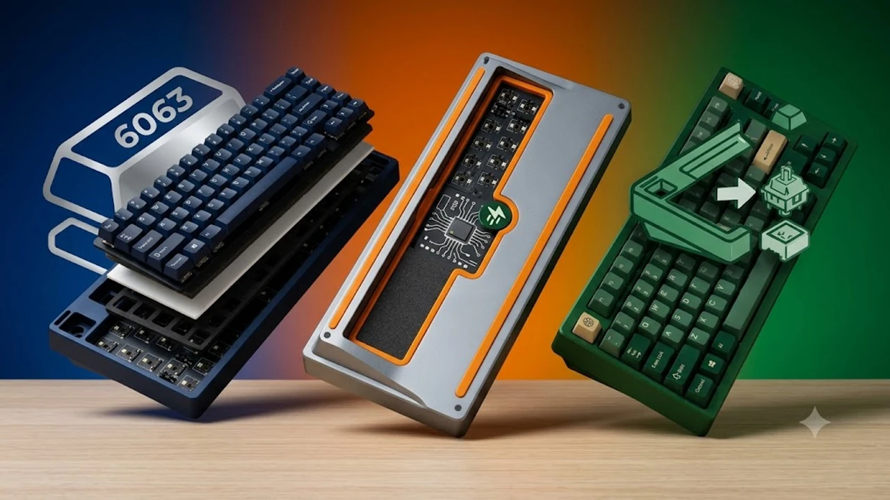

플라스틱 하우징 특유의 텅텅거리는 통울림과 찰랑거리는 철심 소리는 장시간 타이핑 시 귀와 손가락 피로를 가중시킵니다. 과거 20\~30만 원을 훌쩍 넘던 CNC 풀 알루미늄 커스텀 키보드가 대량 양산화되면서 이제 5만\~10만 원대 예산으로도 단단하고 정갈한 조약돌 타건음을 손에 넣을 수 있게 되었습니다. 묵직한 알루미늄 상하판이 불필요한 공진을 잡고, 다중 흡음재와 가스켓 마운트가 충격을 분산해 손끝에 전해지는 반발력을 부드럽게 완화합니다.

손목 부담을 근본적으로 덜어내고 작업 생산성을 끌어올리고 싶다면 [2026 무선 버티컬 마우스 추천 TOP3](/posts/trending-picks/wireless-vertical-mouse-top3-2026/) 글을 참고해 마우스 그립까지 함께 정렬하면 작업 피로도를 대폭 낮출 수 있습니다. 현재 시장에서 검증된 대표 풀알루미늄 기계식 키보드 3종의 구체적인 스펙과 실사용 특성을 비교 분석합니다.

---

## 1. 지금 풀알루미늄 기계식 키보드가 뜨는 이유

* **커스텀 공방급 빌드의 완제품화:** CNC 가공 6063 알루미늄 바디, 5중 흡음 패드(포론·IXPE·PET·EPDM), 가스켓 마운트, 핫스왑 소켓이 기본 조립된 완제품 형태로 출고되어 별도 튜닝 수고가 없습니다.
* **숏폼 ASMR 바이럴 열풍:** 유튜브 쇼츠와 릴스 등에서 마이크를 바짝 대고 들려주는 일명 '폼떡 조약돌 타건음' 영상이 누적 수백만 회를 기록하며 대중적인 인지도를 확보했습니다.
* **오피스용 저소음 스위치 선택지 확장:** 알루미늄 바디의 높은 밀도감과 저소음 피치축·저소음 바다축이 결합하면서, 조용한 사무실에서도 눈치 보지 않고 쓸 수 있는 고품질 키보드 수요가 폭발했습니다.

---

## 2. TOP3 상품 스펙 비교

| 모델명 | 가격대 | 핵심 스펙 | 추천 대상 |
| :--- | :--- | :--- | :--- |
| **WOB Rainy 75** | 99,000원 \~ 125,000원 | CNC 알루미늄, 1.8\~2.0kg, 7,000mAh 배터리 | 정갈한 조약돌 타건음의 완성형을 원하는 분 |
| **MCHOSE GX87** | 78,000원 \~ 95,000원 | 87키 텐키리스, 2.1kg, 퀵릴리즈 하우징 분해 구조 | 텐키리스 배열과 빠른 분해/스위치 교체를 선호하는 분 |
| **AULA F75** | 45,000원 \~ 62,000원 | 가스켓 마운트, 4,000mAh, 사이드 RGB 바 | 풀알루 입문 전 극가성비로 폼떡 타건감을 맛보고 싶은 분 |

---

## 3. 예산대별 추천 모델 상세 분석

### WOB Rainy 75 (레이니 75)
* **가격대:** 99,000원 \~ 125,000원
* **핵심 스펙:** 6063 알루미늄 합금 아노다이징 하우징, 실측 무게 1.84kg, 7,000mAh 대용량 배터리(프로 모델 기준), 블루투스 5.0 / 2.4GHz 무선 / 유선 C타입 3모드 지원, JWK 스위치 탑재
* **장점:** 공장 윤활 상태와 보강판 밸런스가 완벽에 가까워 상자에서 꺼내자마자 별도 손질 없이 두각을 나타내는 도각도각 소리를 들려줍니다. 내부 배터리 용량이 넉넉해 무선 RGB 오프 상태에서 최대 3\~4주 연속 작업이 가능합니다.
* **단점:** 75% 특유의 압축 배열로 인해 우측 쉬프트 및 방향키 주변 키 간격에 적응하는 기간이 필요합니다.
* **추천 대상:** 데스크 위 공간을 넓게 쓰면서 타건음과 타건감 모두에서 확실한 상급 체감을 원하는 사용자
* [Rainy 75 쿠팡에서 보기](https://www.coupang.com/np/search?q=Rainy+75&sourceType=affiliate&trackingCode=AF8691300)

### MCHOSE GX87 (마키스 GX87)
* **가격대:** 78,000원 \~ 95,000원
* **핵심 스펙:** 표준 87키 텐키리스 배열, 풀 CNC 알루미늄 바디, 2.1kg 묵직한 하중 설계, 무나사 퀵릴리즈(Catch-ball) 상판 분리 구조, 8,000mAh 듀얼 배터리
* **장점:** 나사를 풀지 않고도 걸쇠 방식으로 상판을 손쉽게 분리할 수 있어 스위치 교체 및 청소가 매우 간편합니다. 표준 텐키리스 레이아웃을 채택해 키캡 호환성이 뛰어나고 문서 작업 시 적응이 즉각적입니다.
* **단점:** 2.1kg에 달하는 묵직한 무게로 휴대는 불가능하며 책상 위 고정형으로만 활용해야 합니다.
* **추천 대상:** 압축 배열이 불편해 익숙한 87키 텐키리스 레이아웃을 유지하면서 풀알루미늄의 단단함을 누리고 싶은 사무직 직장인
* [MCHOSE GX87 쿠팡에서 보기](https://www.coupang.com/np/search?q=MCHOSE+GX87&sourceType=affiliate&trackingCode=AF8691300)

### AULA F75 (독거미 F75)
* **가격대:** 45,000원 \~ 62,000원
* **핵심 스펙:** 75% 콤팩트 레이아웃, 5중 흡음재 가스켓 구조, 4,000mAh 배터리, 회전형 볼륨 노브 장착, LEOBOG 황축/그레이축 탑재
* **장점:** 5만 원 안팎의 가격에도 불구하고 다중 폼떡 구조를 갖춰 상위 알루미늄 키보드에 버금가는 매끄러운 조약돌 타건음을 구현합니다. 상단 우측에 금속 노브가 달려 있어 PC 볼륨을 직관적으로 조절하기 좋습니다.
* **단점:** 하우징 소재가 고강도 플라스틱(ABS) 기반이라 상위 풀알루미늄 바디 모델 대비 손끝에서 느껴지는 하부 단단함과 무게감은 다소 가볍습니다.
* **추천 대상:** 기계식 키보드에 큰돈을 들이지 않고 5만 원대 전후에서 최상의 타건 사운드를 경험해보고 싶은 실속파 입문자
* [AULA F75 쿠팡에서 보기](https://www.coupang.com/np/search?q=AULA+F75&sourceType=affiliate&trackingCode=AF8691300)

---

## 4. 구매 전 반드시 확인할 체크포인트

* **배열 선택 (75% vs 87키 텐키리스):** 75% 배열은 가로 폭이 좁아 마우스 이동 반경이 넓어지지만 Del, Home, End 키가 일렬로 붙어 있어 오타율이 발생할 수 있습니다. 엑셀 수식이나 문서 단축키 사용이 잦다면 표준 87키 배열을 고르는 편이 안정적입니다.
* **스위치 타건음 성향:** 통통 튀는 하이피치 타건음을 원한다면 HMX 계열 스위치를, 낮게 깔리는 로우피치 묵직한 사운드를 선호한다면 JWK 또는 극저소음 계열(오트축, 피치축)을 사전에 점검해야 방출 위험을 줄일 수 있습니다.
* **무게와 팜레스트 구비:** 풀알루미늄 키보드는 자체 무게가 최소 1.8kg에서 2.2kg에 달해 안정적인 타이핑을 돕지만 전고(앞쪽 높이)가 18\~20mm 수준으로 높은 편입니다. 손목 꺾임을 방지하기 위해 1.5\~2cm 두께의 원목이나 아크릴 팜레스트를 필수로 병행 배치해야 장시간 타이핑 시 건초염을 방지할 수 있습니다.

---

> 이 포스팅은 쿠팡 파트너스 활동의 일환으로, 이에 따른 일정액의 수수료를 제공받습니다.

#트렌드상품 #쿠팡추천 #풀알루미늄기계식키보드 #기계식키보드추천 #Rainy75 #GX87 #AULAF75 #데스크테리어