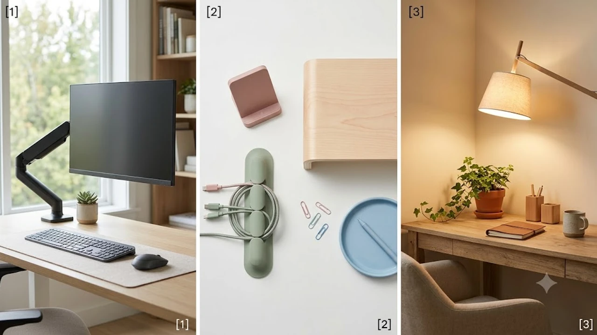

## 지금 데스크테리어가 뜨는 이유

최근 직장인과 프리랜서 사이에서 **선 없는 깔끔한 작업 공간**을 완성하는 미니멀 데스크셋업 열풍이 거세게 불고 있습니다. 모니터 주변에 무분별하게 얽힌 충전 케이블과 좁은 책상 공간은 업무 집중도를 떨어뜨리고 시각적 피로감을 가중시킵니다. 이에 따라 필요한 기능을 최소한의 면적에 일체화한 스마트 아이템들이 대세로 자리 잡았습니다.

* **선 정리와 공간 활용의 극대화:** 좁은 책상 위에서 스탠드 조명과 충전선이 차지하던 자리를 없애고, 거치 기능과 결합한 올인원 기기 수요가 늘었습니다.
* **눈 피로 감소와 작업 효율:** 스크린 반사 없는 비대칭 광학 조명 기술처럼 실질적인 작업 환경을 개선해 주는 기능성 장비가 필수재로 부상했습니다.
* **SNS 룸투어 및 데스크샷 트렌드:** 인스타그램과 유튜브를 중심으로 깔끔한 셋업 인증 사진이 인기를 끌면서 디자인과 실용성을 갖춘 제품 검색량이 꾸준히 증가하고 있습니다.

이와 함께 실내 청결 환경을 책임지는 [2026 올인원 로봇청소기 TOP3 비교](/posts/trending-picks/2026-all-in-one-robot-vacuum-top3/) 글이나 기타 [트렌드 상품 추천 TOP3](/posts/trending-picks/trending-picks-20260727/) 관련 소식도 참고해 보면 스마트한 라이프스타일을 구상하는 데 도움이 됩니다.

---

## TOP3 데스크테리어 상품 스펙 비교

시장에서 검증받은 대표 데스크테리어 아이템 3종의 스펙과 특징을 가공 없이 비교 정리했습니다.

| 모델명 | 가격대 | 핵심 스펙 | 추천 대상 |
| :--- | :--- | :--- | :--- |
| **지니비 GBT-D300 모듈형 매트** | 22,900원 | PU 가죽 재질, 마그네틱 케이블 홀더, 800×400mm 규격 | 책상 위 구획 정리 및 선 정리가 시급한 입문자 |
| **베이서스 i-Wok 2세대 LED 라이트바** | 31,500원 | 450mm 길이, 비대칭 광학 설계, Touch 무단계 조광 | 밤샘 작업이 잦고 스탠드 자리가 부족한 직장인 |
| **신지모루 M 트리 맥세이프 3in1 무선충전기** | 42,800원 | Qi2 15W 고속 무선충전, 3기기 동시 충전, 자성 거치 | 아이폰·워치·에어팟을 한 번에 정돈하려는 사용자 |

---

## 예산대별 추천 데스크셋업 아이템

### 1. [가성비 / 22,900원] 지니비 GBT-D300 모듈형 매트

> **"오염 걱정 없이 책상 영역을 깔끔하게 구획하는 기본 매트"**

책상 전체의 톤앤매너를 잡아주면서 마그네틱 모듈로 케이블 흐름을 다잡는 데스크 매트입니다. 음료를 쏟아도 즉시 닦아낼 수 있는 고급 PU 가죽 표면 처리가 특징입니다.

* **핵심 스펙:** 800mm×400mm 규격 / 방수 방오 PU 가죽 / 마그네틱 클립 내장
* **장점 1:** 바닥면 미끄럼 방지 패드 덕분에 키보드 타건 시 매트가 밀리지 않고 안정적으로 고정됩니다.
* **장점 2:** 기본 제공되는 자성 케이블 홀더로 충전 선이 책상 뒤로 떨어지는 현상을 완벽히 막아줍니다.
* **단점:** 초기 개봉 시 합성 가죽 특유의 냄새가 며칠간 잔여할 수 있어 하루 정도 통풍이 필요합니다.
* **이런 사람에게 추천:** 책상 위 케이블 굴러다님을 방지하고 깔끔한 바탕색을 깔고 싶은 실속파 구매자.

[지니비 GBT-D300 모듈형 매트 쿠팡에서 보기](https://www.coupang.com/np/search?q=%EC%A5%80%EB%8B%88%EB%B9%84+GBT-D300+%EB%AA%A8%EB%93%8D%ED%98%95+%EB%A7%A4%ED%8A%B8&sourceType=affiliate&trackingCode=AF8691300)

---

### 2. [실속형 / 31,500원] 베이서스 i-Wok 2세대 LED 모니터 라이트바

> **"모니터 상단 거치로 책상 면적을 100% 활용하는 비대칭 스크린바"**

기존 탁상용 스탠드가 차지하던 바닥 공간을 완전히 비워주는 모니터 전용 걸이형 조명입니다. 화면에 빛이 반사되어 눈이 부시는 현상을 차단하고 책상 바닥면만 정밀하게 비춰줍니다.

* **핵심 스펙:** 가로 길이 450mm / USB-C 5V 전원 입력 / 3000K\~6500K 3단계 색온도 조절
* **장점 1:** 비대칭 광학 설계로 모니터 화면 반사광을 없애 장시간 모니터 주시 시 눈의 피로를 낮춥니다.
* **장점 2:** 상단 집게형 스프링 거치 구조로 두께 0.5cm\~4cm 사이의 대부분의 평면 모니터에 도구 없이 쉽게 장착됩니다.
* **단점:** 두께가 극도로 얇거나 후면이 굴곡진 커브드 모니터의 경우 거치 안정성이 떨어질 수 있습니다.
* **이런 사람에게 추천:** 좁은 책상 공간 때문에 스탠드를 치우고 싶거나 야간 작업 시 눈 건강을 챙기려는 사용자.

[베이서스 i-Wok 2세대 LED 모니터 라이트바 쿠팡에서 보기](https://www.coupang.com/np/search?q=%EB%B2%A0%EC%9D%B4%EC%84%9C%EC%8A%A4+i-Wok+2%EC%84%B8%EB%8C%80+LED+%EB%AA%A8%EB%8B%88%ED%84%B0+%EB%9D%BC%EC%9D%B4%ED%8A%B8%EB%B0%94&sourceType=affiliate&trackingCode=AF8691300)

---

### 3. [프리미엄 / 42,800원] 신지모루 M 트리 맥세이프 3in1 무선충전기

> **"지저분한 충전선 3개를 하나로 줄여주는 무선 충전 거치대"**

스마트폰, 스마트워치, 무선 이어폰을 한 자리에 흡착하여 충전하는 스탠드형 거치대입니다. 맥세이프 강력 자력을 활용해 가로·세로 자유롭게 각도를 변경하며 영상을 시청할 수도 있습니다.

* **핵심 스펙:** 스마트폰 최대 15W 고속 충전 지원 / 3기기 동시 무선 충전 / C타입 PD 입력
* **장점 1:** 단 한 개의 케이블 연결만으로 3가지 애플리케이션 장비를 한 번에 정돈 및 충전할 수 있습니다.
* **장점 2:** 거치대 하단 주중량 플레이트 배치로 스마트폰을 탈부착할 때 거치대가 함께 들려 올라가지 않습니다.
* **단점:** 3기기 동시에 고속 충전을 진행하려면 최소 30W 이상의 PD 충전 어댑터를 별도로 구비해야 합니다.
* **이런 사람에게 추천:** 스마트폰, 스마트워치, 무선 이어폰 충전선이 엉켜있어 책상이 지저분했던 사용자.

[신지모루 M 트리 맥세이프 3in1 무선충전기 쿠팡에서 보기](https://www.coupang.com/np/search?q=%EC%8B%A0%EC%A1%B0%EB%AA%A8%EB%A3%A8+M+%ED%8A%B8%EB%A6%AC+%EB%A7%A9%EC%84%B8%EC%9D%B4%ED%94%84+3in1+%EB%AC%B4%EC%84%A0%EC%B6%A9%EC%A0%84%EA%B8%B0&sourceType=affiliate&trackingCode=AF8691300)

---

## 구매 전 반드시 확인할 체크포인트

* **모니터 거치 가능 구조 여부:** 라이트바 구매 시 본인이 사용하는 모니터 상단 두께와 후면 곡률을 측정해야 합니다. 커브드 모니터 전용 거치 패드가 별도로 제공되는지 파악하는 편이 안전합니다.
* **무선 충전기 전원 어댑터 출력 규격:** 3in1 충전기는 본체만 구매할 경우 충전 속도가 나오지 않습니다. 반드시 25W\~30W 이상의 PD 3.0 지원 고속 충전기 어댑터를 혼용해야 제 성능을 발휘합니다.
* **책상 가로·세로 규격 측정:** 데스크 매트 구매 전 키보드, 마우스 장패드 영역과 모니터 받침대 거치 구역의 치수를 미리 계측하여 매트가 밖으로 튀어나가지 않는지 검증하세요.

---

> 이 포스팅은 쿠팡 파트너스 활동의 일환으로, 이에 따른 일정액의 수수료를 제공받습니다.

#트렌드상품 #쿠팡추천 #데스크테리어 #데스크셋업 #모니터조명 #무선충전기 #데스크매트