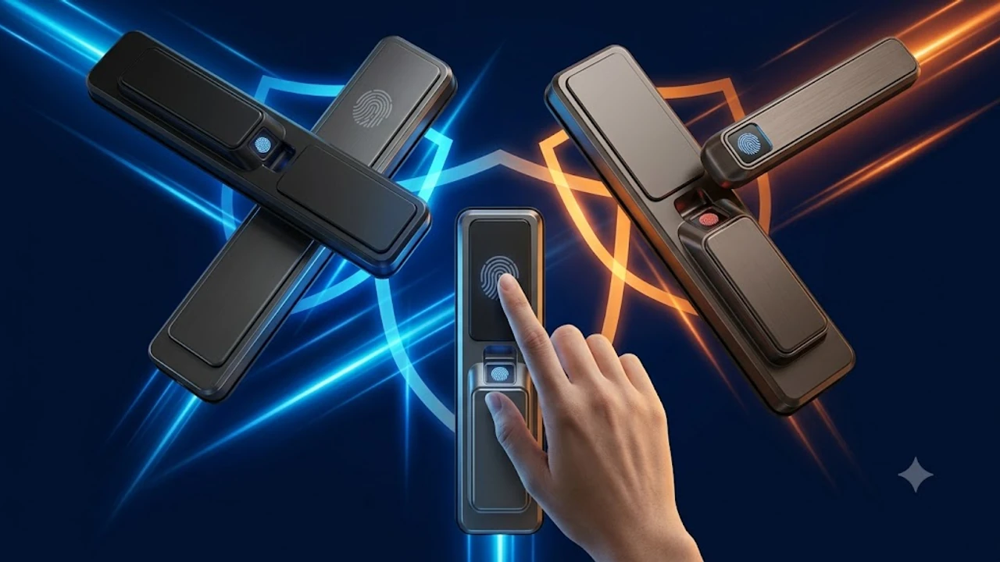

열쇠나 카드키를 챙기지 않아 문앞에서 낭패를 보거나, 퇴거할 때 문 손상 원상복구 비용 걱정으로 낡은 레버 손잡이를 그대로 쓰던 시대는 끝났습니다. 전동 드릴로 문에 구멍을 뚫지 않고도 십자드라이버 하나로 기존 손잡이 자리에 체결하는 무타공 푸시풀 지문인식 도어락이 원룸·오피스텔·전월세 가구의 필수 방범 아이템으로 확실히 자리 잡았습니다. 손잡이를 잡는 순간 0.5초 만에 잠금이 풀리는 직관적인 편리함과 침입 방지 보안성까지 챙긴 검증된 상위 3개 모델의 실측 수치와 장단점을 가감 없이 정리했습니다.

---

## 1. 지금 무타공 지문인식 도어락이 뜨는 이유

가을 이사철과 전월세 계약 갱신 시즌이 겹치면서 셀프 인테리어와 보안 강화를 노리는 1\~2인 가구의 수요가 폭발했습니다. 전세나 월세 임차인은 집주인의 동의 없이 현관 방화문에 32mm 추가 타공을 할 수 없어 노후 번호키나 열쇠 손잡이를 억지로 써야 하는 제약이 있었습니다. 하지만 최근 출시되는 3세대 무타공 규격은 표준 방화문의 기본 래치 구멍 하나만을 이용해 상하 흔들림 없이 밀착 고정되는 브라켓 시스템을 완성했습니다.

여기에 과거 30만원대 하이엔드 주키에만 들어가던 반도체 정전용량식 지문 모듈이 푸시풀 핸들 엄지 거치부에 기본 장착되었습니다. 기존 광학식 지문 센서처럼 손가락에 물기가 조금 있거나 각도가 틀어져도 오류가 나는 현상이 대폭 개선되어 98% 이상의 인식률을 보여줍니다. 번호판을 터치할 때 생기는 엿보기(패핑 숄더) 위협이나 잔류 지문으로 인한 비밀번호 노출 불안을 단번에 날려버렸다는 점이 실구매자들의 교체 후기에서 가장 크게 부각되는 포인트입니다.

---

## 2. TOP3 상품 한눈에 스펙 비교

자가설치 난이도, 지문 센서 반응 속도, 걸쇠 작동 메커니즘을 종합 검토해 선정한 세 제품의 핵심 요약표입니다.

| 모델명 | 가격대 | 핵심 스펙 | 추천 대상 |
| :--- | :--- | :--- | :--- |
| **밀레시스텍 ME-P71F** | 129,000원 | 반도체 지문 센서(100개 등록), 비상 9V 단자, AA 4개 구동 | 잔고장 없이 기본기에 충실한 가성비 자취족 |
| **현대HT TDL-P1102F** | 158,000원 | 1.0초 마그네틱 즉시잠김, 물리 비상키 2개, 안티패닉 푸시풀 | 문 닫힘 지연 불안이 큰 1인 여성 가구 및 가족형 세대 |
| **코콤 KDL-HP800F** | 194,000원 | 내장 2.4GHz Wi-Fi 모듈, 전용 앱 원격 제어, 임시 일회용 비밀번호 | 외부 방문자 출입 관리가 잦은 스마트홈 유저 |

---

## 3. 예산대별 무타공 도어락 상세 분석

### 가성비 픽: 밀레시스텍 무타공 지문인식 푸시풀 도어락 (ME-P71F)

* **실구매가:** 129,000원
* **핵심 스펙:**
  * 인식률 99% 반도체 에어리어 센서 탑재 (최대 100개 지문 등록 가능)
  * 비밀번호 4\~12자리 설정 및 최대 20자리 허수 입력 지원
  * 전원 방전 시 외부 9V 사각 건전지 비상 전원 공급 단자 기본 장착
* **장점:**
  1. 기계식 내구성이 우수해 배터리 소모가 적고, 1.5V AA 배터리 4개로 하루 10회 작동 기준 12개월 이상 안정적으로 구동됩니다.
  2. 부품 설계가 단순해 공구 다루기가 서툰 초보자도 십자드라이버 하나로 20분 내외에 자가설치를 끝낼 수 있습니다.
* **단점:**
  * 스마트폰 앱 제어나 블루투스·Wi-Fi 연동 기능이 완전히 빠져 있어 현관문 앞에서 직접 인증하는 방식으로만 써야 합니다.
* **추천 대상:**
  원룸이나 투룸에 거주하며 앱 연동 같은 부가 기능 없이, 오직 빠르고 정확한 지문 인식과 견고한 잠금 성능만을 원하는 실속형 자취생에게 알맞은 선택입니다.
* [밀레시스텍 ME-P71F 쿠팡에서 보기](https://www.coupang.com/np/search?q=밀레시스텍+ME-P71F&sourceType=affiliate&trackingCode=AF8691300)

---

### 밸런스 픽: 현대HT 즉시잠김 지문인식 푸시풀 도어락 (TDL-P1102F)

* **실구매가:** 158,000원
* **핵심 스펙:**
  * 마그네틱 자석 감지 기반 1.0초 즉시잠김(오토 퀵 래치) 메커니즘
  * 핸들 일체형 0.5초 원스텝 원터치 지문 모듈
  * 디지털 오류 및 방전 대비용 기계식 특수 비상키 2개 기본 동봉
* **장점:**
  1. 문이 닫히자마자 걸쇠가 1.0초 만에 튀어나와 잠기므로, 일반 번호키처럼 2\~3초간 열려 있는 동안 뒤따라 들어오는 괴한 침입 위험을 차단합니다.
  2. 안쪽에서 밀기만 하면 바로 잠금이 풀리는 안티패닉(Anti-panic) 래치가 적용되어 화재나 비상 탈출 상황에서 대처가 매우 빠릅니다.
* **단점:**
  * 즉시 잠김 마그네틱 센서의 위치가 문틀 스트라이커 규격과 정확히 맞물려야 하므로, 문 유격이 5mm 이상 벌어진 노후 방화문은 동봉된 조절 와셔로 단차를 맞추는 세팅 작업이 필요합니다.
* **추천 대상:**
  늦은 밤 귀가 시 문이 완전히 잠길 때까지 뒤를 돌아보며 서성이던 1인 가구나 자녀의 귀가 안전이 최우선인 가정에 가장 적합합니다.
* [현대HT TDL-P1102F 쿠팡에서 보기](https://www.coupang.com/np/search?q=현대HT+TDL-P1102F&sourceType=affiliate&trackingCode=AF8691300)

---

### 프리미엄 픽: 코콤 IoT 지문인식 푸시풀 도어락 (KDL-HP800F)

* **실구매가:** 194,000원
* **핵심 스펙:**
  * 별도 허브 없는 본체 내장형 2.4GHz Wi-Fi 모듈 기본 탑재
  * 스마트폰 전용 앱 연동 실시간 출입 이력 추적 및 0.1초 푸시 알림
  * 가사도우미/택배/손님용 일회용 임시 비밀번호 원격 발급 기능
* **장점:**
  1. 5\~8만원 상당의 추가 게이트웨이를 살 필요 없이 집 안 공유기와 직접 연결되어 외부에서도 가족 귀가 상태를 실시간 확인하고 원격으로 문을 열어줄 수 있습니다.
  2. 알루미늄 다이캐스팅 풀메탈 프레임이 적용되어 외관 마감이 단단하고 침입 시도 충격에도 본체 변형이 없습니다.
* **단점:**
  * Wi-Fi 통신을 상시 유지하는 특성상 배터리 소모가 일반 모델보다 빨라 7\~9개월 주기로 8개의 AA 건전지를 교체해 주어야 합니다.
* **추천 대상:**
  출퇴근길에 가족의 안전 귀가를 스마트폰으로 확인하고 싶거나, 주기적으로 청소 매니저나 손님이 방문해 일회용 비밀번호 발급이 잦은 스마트홈 유저에게 제격입니다.
* [코콤 KDL-HP800F 쿠팡에서 보기](https://www.coupang.com/np/search?q=코콤+KDL-HP800F&sourceType=affiliate&trackingCode=AF8691300)

집안 청결과 쾌적한 데스크 작업 공간을 함께 관리하고 싶다면 문틈이나 키보드 먼지를 순식간에 날려주는 [무선 에어건 제트팬 추천 TOP3 비교](/posts/trending-picks/wireless-turbo-jet-air-duster-top3-2026/) 포스팅도 유용한 팁이 될 수 있습니다.

---

## 4. 자가설치 전 무조건 확인해야 할 체크포인트

주문 전 딱 세 가지만 확인하면 제품 수령 후 반품하거나 기사를 불러 추가 출장비 4\~6만원을 지출하는 일을 방지할 수 있습니다.

1. **백셋(Backset) 70mm 표준 규격 확인:** 문 모서리 끝단에서 기존 손잡이 홀 중심부까지의 수평 거리를 줄자로 측정해야 합니다. 국내 아파트·오피스텔·빌라 표준 방화문은 70mm이며, 60mm 이하의 특수 섀시문이나 목문에는 무타공 모티스가 장착되지 않습니다.
2. **기존 상단 보조키 구멍 여부와 보강판:** 문 손잡이 윗부분에 별도의 타공 보조 번호키가 달려있던 문이라면, 기존 손잡이만 떼어내고 푸시풀을 달았을 때 상단 32mm 구멍이 노출됩니다. 이때는 1만원 안팎의 도어락 전용 마감 보강판을 함께 주문해 앞뒤로 덧대어 체결해야 합니다.
3. **문틀 스트라이커 유격 조절:** 문이 닫혔을 때 래치 볼트가 걸리는 문틀 쪽 쇠판(스트라이커)의 깊이가 맞지 않으면 문이 덜컥거리거나 자동 잠김 모터에 부하가 걸려 배터리가 급속 방전됩니다. 문을 닫았을 때 고무 패킹에 가볍게 밀착되는지 손으로 흔들어 확인해야 합니다.

손목과 관절에 무리를 주지 않는 홈오피스 셋업을 고민하고 있다면 손목 꺾임을 방지하는 [2026 무선 버티컬 마우스 추천 TOP3](/posts/trending-picks/wireless-vertical-mouse-top3-2026/) 글도 함께 확인해 보시기 바랍니다.

---

> 이 포스팅은 쿠팡 파트너스 활동의 일환으로, 이에 따른 일정액의 수수료를 제공받습니다.

#트렌드상품 #쿠팡추천 #무타공도어락 #지문인식도어락 #푸시풀도어락 #스마트홈추천 #현관보안 #자취필수템 #셀프인테리어