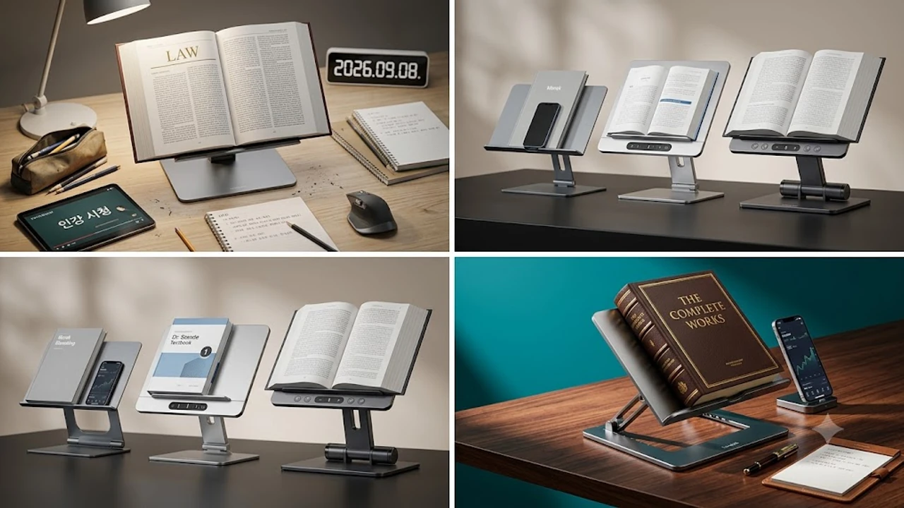

책상 앞에 앉아 1,000페이지가 넘는 두꺼운 기본서나 12.9인치 태블릿을 펼쳐놓고 장시간 책을 읽다 보면 어김없이 목 뒤가 뻐근해지고 승모근이 뭉쳐옵니다. 기존 수동 독서대는 양쪽 관절 나사를 손으로 억지로 풀고 조이느라 손목에 무리가 가고, 조금만 무거운 책을 얹으면 스르륵 주저앉는 일이 흔했습니다. 이러한 물리적 한계를 버튼 하나로 제어하는 전동 모터 구동으로 해결한 전동 독서대가 2026년 하반기 데스크테리어와 수험 시장의 판도를 완전히 바꾸고 있습니다.

## 1. 지금 전동 독서대가 뜨는 이유
가을로 접어드는 9월은 국가직·지방직 시험 준비생, 회계사·노무사 등 전문 자격증 수험생, 하반기 대기업 공채 취준생들의 데스크 체류 시간이 연중 가장 길어지는 시점입니다. 하루 10시간 이상 책상을 지켜야 하는 이들에게 목 통증과 역C자목 변형은 집중력을 직접적으로 갉아먹는 치명적인 장애물입니다.

기존 관절형 독서대는 각도를 조금만 바꾸려 해도 양손으로 용목을 쥐어짜듯 레버를 돌려야 했고, 독서대 위에서 태블릿 펜슬로 필기를 시작하면 덜컹거리는 유격 때문에 선이 빗나가는 일이 잦았습니다. 반면 최신 전동 독서대는 저소음 스텝 모터가 내장되어 버튼을 가볍게 터치하는 것만으로 1mm 단위 미세 높낮이 세팅을 마칠 수 있습니다.

단순히 편한 것을 넘어 책상 위에서 [2026 무선 버티컬 마우스 추천 TOP3](/posts/trending-picks/wireless-vertical-mouse-top3-2026/)와 함께 세팅했을 때 손목과 경추 각도를 안정적인 중립 상태로 유지해 주어 생산성 개선을 노리는 직장인과 수험생들의 필수 장비로 자리 잡았습니다.

---

## 2. TOP3 상품 스펙 비교

| 모델명 | 가격대 | 핵심 스펙 | 추천 대상 |
| :--- | :--- | :--- | :--- |
| **모락 엘리베이팅 전동 독서대** | 69,000원 | 최대 지지 하중 10kg / 38dB 저소음 모터 / USB-C 완충 대기 30일 | 전동 입문자, 인강 시청 및 서브 태블릿 거치 위주 사용자 |
| **닥터스탠드 스마트 전동 북스탠드** | 96,000원 | 최대 지지 하중 15kg / 3단계 높이 메모리 프리셋 / 35dB 초정밀 모터 | 1,000p 이상 전공서 정독 및 원터치 높이 변경 필요층 |
| **루나랩 듀얼모터 알루미늄 북스탠드** | 138,000원 | 최대 지지 하중 20kg / 좌우 독립 듀얼 리니어 모터 / 3.5mm 통 알루미늄 | 두꺼운 전문 서적 2권 병렬 거치 및 강한 압력 필기파 |

---

## 3. 예산대별 추천 모델 3종 심층 분석

### ① 가성비 입문형: 모락(morak) 엘리베이팅 전동 독서대
수동 독서대의 뻑뻑함에서 벗어나고 싶지만 10만 원이 넘는 지출은 부담스러운 소비자를 겨냥한 엔트리 모델입니다.

* **실제 가격대:** 69,000원
* **핵심 스펙:** 최대 지지 하중 10kg, 38dB 저소음 구동 모터, USB-C 1회 완충 기준 최대 30일 대기 내장 배터리
* **장점:** 
  * 가격 진입장벽이 낮고, 상판 무게를 1.2kg 수준으로 경량화하여 방과 거실 간 자리 이동이 수월합니다.
  * 받침대 하단에 탄성 고무 코팅 고정 핀이 장착되어 있어 얇은 수험서 페이지가 제멋대로 넘어가지 않습니다.
* **단점:** 
  * 베이스 하판이 알루미늄과 ABS 플라스틱 결합 구조라 12.9인치 이상 태블릿에 손을 얹고 강한 힘으로 필기할 때 미세한 진동이 발생합니다.
* **이런 사람에게 추천:** 아이패드나 갤럭시탭으로 인강을 주로 시청하며 500페이지 내외의 문제집을 올려두는 가성비 중심 구매자.
* [모락 엘리베이팅 전동 독서대 쿠팡에서 보기](https://www.coupang.com/np/search?q=모락+엘리베이팅+전동+독서대&sourceType=affiliate&trackingCode=AF8691300)

---

### ② 밸런스 중간형: 닥터스탠드(Dr.Stand) 스마트 전동 2단 북스탠드
모터 승강 구동 안정성과 사용자 맞춤형 프리셋 기능을 가장 균형감 있게 결합한 제품입니다.

* **실제 가격대:** 96,000원
* **핵심 스펙:** 최대 지지 하중 15kg, 3단계 높이 원터치 메모리 버튼, 35dB 저소음 모터 내장
* **장점:** 
  * 높이 저장 버튼이 있어 인강 시청 높이(1번 세팅)와 필기용 각도(2번 세팅)를 버튼 클릭 한 번으로 즉시 전환합니다.
  * 풀 알루미늄 아노다이징 프레임을 적용해 2.1kg의 묵직한 하중을 바탕으로 책장을 넘길 때 본체가 바닥에서 밀리지 않습니다.
* **단점:** 
  * 유선 케이블 상시 연결 방식으로만 모터가 작동해 책상 위에 C타입 전원선이 항시 노출됩니다.
* **이런 사람에게 추천:** 두꺼운 로스쿨·의대 전공서나 고시 기본서를 매일 펼쳐두고, 독서와 타이핑을 수시로 오가는 헤비 수험생.
* [닥터스탠드 스마트 전동 2단 북스탠드 쿠팡에서 보기](https://www.coupang.com/np/search?q=닥터스탠드+스마트+전동+2단+북스탠드&sourceType=affiliate&trackingCode=AF8691300)

---

### ③ 프리미엄 종결형: 루나랩(Lunalab) 듀얼모터 알루미늄 북스탠드
더 이상의 교체가 필요 없는 하이엔드 전동 거치대로, 완벽에 가까운 수평 유지력과 묵직한 마감을 제공합니다.

* **실제 가격대:** 138,000원
* **핵심 스펙:** 최대 지지 하중 20kg, 좌우 독립 제어 트윈 리니어 모터, 3.5mm 고강도 통 알루미늄 하판 베이스
* **장점:** 
  * 좌우 듀얼 모터 구조라 2,000페이지 분량의 법전이나 기술 서적 2권을 올려도 상판 처짐이나 모터 과열 멈춤 현상이 없습니다.
  * 3.5mm 두께의 통 알루미늄 바닥판 덕분에 애플펜슬이나 S펜으로 손목 체중을 전부 실어 필기해도 들뜸 없이 단단하게 버텨줍니다.
* **단점:** 
  * 본체 순수 무게만 약 3.8kg에 달해 독서실이나 스터디카페로 매일 들고 다니는 휴대 목적에는 적합하지 않습니다.
* **이런 사람에게 추천:** 고정된 전용 서재나 오피스 책상에서 고중량 서적을 펼치고 태블릿 정밀 필기를 병행하는 전문직 및 수험생.
* [루나랩 듀얼모터 알루미늄 북스탠드 쿠팡에서 보기](https://www.coupang.com/np/search?q=루나랩+듀얼모터+알루미늄+북스탠드&sourceType=affiliate&trackingCode=AF8691300)

---

## 4. 구매 전 반드시 확인할 3가지 체크포인트

### ① 모터 구동 소음 데시벨 (35dB 이하 기준)
도서관이나 스터디카페 열람실의 권장 배경 소음 기준은 35\~40dB 수준입니다. 저가형 감속 기어를 적용한 기기는 모터 회전 시 고주파 마찰음이 발생해 주변 열람객에게 방해가 될 수 있습니다. 제원표 기준 35dB 이하의 무소음·저소음 설계가 인증된 제품을 선택해야 실내 학습 공간에서 제약 없이 사용할 수 있습니다.

### ② 상판 및 하판의 강성 구조 (지지 하중 12kg 이상)
가벼운 소설책 위주라면 5kg 지지력으로도 충분하지만, 1,000페이지 이상의 공무원 기본서나 14인치급 포터블 모니터를 얹어 쓸 목적이라면 최소 12kg 이상, 하판 베이스 무게 1.5kg 이상의 제품을 선택해야 책장을 넘길 때 본체가 앞으로 쏠려 전복되는 사고를 막을 수 있습니다.

### ③ 전원 공급 방식 및 작업 환경 세팅
데스크 위 전선 노출을 원치 않는 미니멀 셋업 환경이라면 4,000mAh 이상 용량의 배터리가 탑재된 무선 충전식 모델이 적합합니다. 한편 책상 한자리에 장기간 거치해 두고 사용하는 작업 방식이라면 배터리 수명 저하 걱정이 없는 유선 상시 전원 방식이 모터 토크 유지에 훨씬 유리합니다. 장시간 착석 학습으로 하체 피로가 누적될 때는 [무선 종아리 마사지기 TOP3 가성비 비교](/posts/trending-picks/wireless-calf-massager-top3-2026/) 분석을 참고해 하체 혈액순환 케어를 병행하는 세팅도 권장합니다.

---

> 이 포스팅은 쿠팡 파트너스 활동의 일환으로, 이에 따른 일정액의 수수료를 제공받습니다.

#트렌드상품 #쿠팡추천 #전동독서대 #북스탠드추천 #데스크테리어 #거북목교정 #수험생필수템 #닥터스탠드 #루나랩독서대