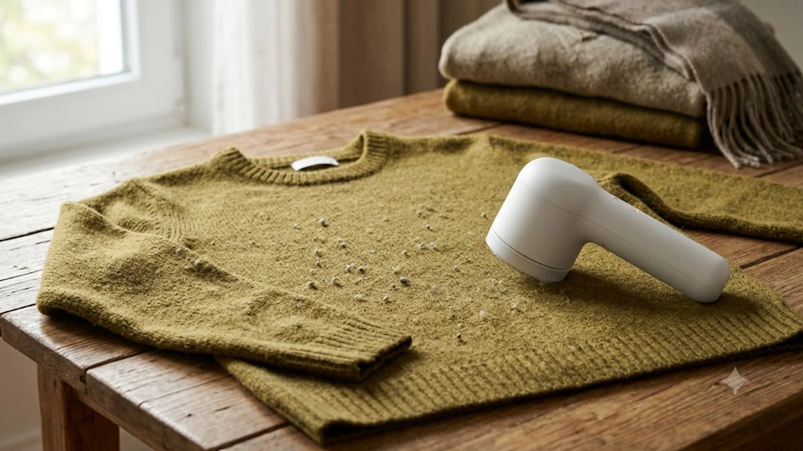

# 2026 보풀제거기 추천 TOP3 가성비 비교

아침저녁으로 찬 바람이 부는 10월 환절기에는 옷장에서 니트, 가디건, 기모 맨투맨, 캐시미어 코트를 꺼내게 됩니다. 하지만 지난겨울 입고 보관해 둔 옷깃과 소매 안쪽에 뭉친 보풀 덩어리를 마주하는 순간 한숨부터 나옵니다. 

손이나 테이프로 억지로 뜯어내면 원사 조직이 늘어나 옷을 버리게 되고, 일반 면도기로 긁어내다가는 비싼 니트에 구멍이 뚫리기 십상입니다. 회전력과 칼날 안전망이 검증된 전용 보풀제거기를 쓰면 3분 만에 세탁소 드라이클리닝을 갓 마친 새 옷 상태로 되돌립니다.

---

## 1. 지금 보풀제거기가 필수 월동템으로 뜨는 이유

10월 초는 기온이 급격히 내려가며 가을·겨울 의류 교체가 본격화되는 시기입니다. 포털 검색어와 커머스 지표에서 의류 케어 가전 검색량이 폭발적으로 치솟고 있습니다.

* **의류 물가 상승과 세탁비 절감:** 울 니트나 핸드메이드 코트 가격이 크게 오르면서 새 옷을 사기보다 기존 옷을 복원해 입는 알뜰 소비자가 늘었습니다. 세탁소에 벌당 1\~2만 원씩 지불하며 보풀 제거를 맡기는 대신, 기기 하나 값으로 수십 벌의 옷을 직접 관리하는 선택이 비용을 아낍니다.
* **숏폼 콘텐츠의 직관적 반응:** 유튜브 쇼츠와 인스타그램 릴스를 중심으로 하얗게 일어난 스웨터 표면을 기기가 훑고 지나가자마자 매끈하게 밀려 나가는 비포&애프터 영상이 수백만 조회수를 기록 중입니다. 눈으로 확인되는 직관적인 효과 덕분에 2040 직장인과 1인 가구 사이에서 필수 리빙템으로 자리 잡았습니다.
* **모터 출력과 칼날 기술의 상향 평준화:** 예전 건전지 방식 제품은 힘이 달려 모터가 멈추거나 뭉친 실밥을 뜯어먹는 대참사가 잦았습니다. 최근 출시된 모델들은 8,800\~9,500 RPM을 넘나드는 고속 토크 모터와 정밀 다이아몬드 코팅 6중날, 옷감 손상을 방지하는 미세 높낮이 조절 캡을 기본 장착해 실패 확률을 낮췄습니다.

---

## 2. TOP3 보풀제거기 핵심 스펙 비교

현재 시장에서 실사용 만족도가 가장 높고 불량률이 낮은 3개 대표 모델의 스펙과 포지션을 표로 정리했습니다.

| 모델명 | 가격대 | 핵심 스펙 | 추천 대상 |
| :--- | :--- | :--- | :--- |
| **필립스 8000시리즈 GC028/70** | 3만 원대 중후반 | 8,800 RPM / 6중 스테인리스 곡면날 / 90분 배터리 | 코트·두꺼운 니트 위주 관리 및 브랜드 내구성을 따지는 구매자 |
| **샤오미 미지아 2세대 MQXJQ02KL** | 1만 원대 중후반 | 7,000 RPM / 0.35mm 마이크로 아크 망 / 1,300mAh | 원룸·기숙사 거주 자취생, 가벼운 일상복 위주 실속파 |
| **아이랩 프로 터보 IL-LR900** | 4만 원대 초반 | 9,500 RPM / 3단 속도 조절 / 65mm 대구경 헤드 | 캐시미어 등 섬세한 원단부터 대형 침구류까지 손질할 파워 유저 |

작업 환경을 깔끔하게 유지하려면 책상 위 먼지나 기기 틈새 찌꺼기를 날려주는 장비도 함께 구비해두면 좋습니다. 데스크 먼지 청소에 특화된 장비는 [무선 에어건 제트팬 추천 TOP3 비교](/posts/trending-picks/wireless-turbo-jet-air-duster-top3-2026/) 글에서 제원을 확인할 수 있습니다.

---

## 3. 예산대별 추천 상품 상세 분석

### ① 필립스 8000시리즈 GC028/70

* **브랜드 및 모델명:** 필립스(Philips) GC028/70
* **가격대:** 35,000원 \~ 38,000원대
* **핵심 스펙:** 분당 8,800회 회전 모터, 6중 정밀 칼날, 최대 90분 연속 사용 USB-C 리튬이온 배터리
* **장점:** 
  1. 8,800 RPM 고출력 모터가 받쳐주어 굵은 아크릴 혼방이나 억센 펠트 보풀을 밀어도 모터가 멈추지 않고 튕김 없이 밀어냅니다.
  2. 절삭 헤드 면적이 넓어 롱코트 1벌의 면적을 5분 안에 끝내 손목 피로도가 적습니다.
* **단점:** 
  - 절삭력이 강해 얇은 레이온이나 실크 혼방 니트 작업 시 살짝 띄우지 않고 꾹 누르면 올이 튈 위험이 있습니다.
* **추천 대상:** 두꺼운 울 코트, 헤비게이지 스웨터를 자주 입고 안정적인 브랜드 AS를 선호하는 사용자.

👉 [필립스 GC028/70 쿠팡에서 보기](https://www.coupang.com/np/search?q=필립스%20GC028&sourceType=affiliate&trackingCode=AF8691300)

---

### ② 샤오미 미지아 2세대 MQXJQ02KL

* **브랜드 및 모델명:** 샤오미(Xiaomi) 미지아 2세대 MQXJQ02KL
* **가격대:** 15,000원 \~ 18,000원대
* **핵심 스펙:** 7,000 RPM 토크 모터, 0.35mm 벌집형 마이크로 아크 안전망, 1,300mAh 일체형 배터리
* **장점:** 
  1. 0.35mm 정밀 곡면망 마감이 매끄러워 얇은 가디건이나 티셔츠를 작업할 때 원단 걸림이 없습니다.
  2. 본체 무게 213g에 불과해 옷걸이에 옷을 걸어둔 채로 한 손으로 슥슥 다듬기 편합니다.
* **단점:** 
  - 먼지통 용량이 작아 두꺼운 앙고라 니트 1벌을 밀고 나면 먼지통을 중간에 한 번 비워내야 합니다.
* **추천 대상:** 1만 원대 극가성비로 기본기에 충실한 원룸 자취생 및 가벼운 일상복 위주 사용자.

👉 [샤오미 미지아 2세대 쿠팡에서 보기](https://www.coupang.com/np/search?q=샤오미%20미지아%20보풀제거기%202세대&sourceType=affiliate&trackingCode=AF8691300)

---

### ③ 아이랩 프로 터보 IL-LR900

* **브랜드 및 모델명:** 아이랩(iLab) 프로 터보 IL-LR900
* **가격대:** 41,000원 \~ 44,000원대
* **핵심 스펙:** 분당 9,500 RPM 3단계 디지털 가변 모터, 실시간 배터리 잔량 LED 디스플레이, 65mm 대구경 안전망
* **장점:** 
  1. 1단(섬세 원단 케어)부터 3단(헤비 아우터 전용)까지 속도 조절이 가능해 고가 캐시미어 니트도 올 뜯김 없이 다듬습니다.
  2. 전면 LED 창에 배터리 잔여 퍼센티지가 숫자로 표시되어 작업 도중 갑자기 전원이 나가는 일이 없습니다.
* **단점:** 
  - 65mm 대구경 헤드와 LED 회로 탑재로 본체 무게(약 260g)가 묵직해 장시간 연속 사용 시 무게감이 전해집니다.
* **추천 대상:** 고가 캐시미어·메리노울 의류 관리는 물론 소파 패브릭, 극세사 차렵이불까지 다용도로 손질하려는 사용자.

👉 [아이랩 프로 터보 IL-LR900 쿠팡에서 보기](https://www.coupang.com/np/search?q=아이랩%20프로%20터보%20보풀제거기&sourceType=affiliate&trackingCode=AF8691300)

장시간 앉아서 옷을 꼼꼼히 다듬다 보면 손목이나 관절에 뻐근함이 느껴질 수 있습니다. 데스크 작업 피로도를 줄여주는 기기는 [2026 무선 버티컬 마우스 추천 TOP3](/posts/trending-picks/wireless-vertical-mouse-top3-2026/) 포스팅에서 확인할 수 있습니다.

---

## 4. 원단 구멍 방지하는 실전 작업 수칙 3가지

* **바닥면 밀착 금지 및 평평한 작업대 유지:** 푹신한 침대나 소파 위에서 작업하면 원단이 아래로 눌리면서 칼망 틈새로 천이 씹혀 들어갑니다. 단단한 거실 바닥이나 다림질판에 옷을 반듯하게 펴고 손바닥으로 주름을 팽팽하게 고정한 상태에서 기기를 대야 합니다.
* **작은 원을 그리며 스치듯 이동:** 다리미처럼 힘주어 꾹 누르면 칼날이 얇은 실을 베어버립니다. 헤드를 옷감 표면에 살짝 얹어놓는다는 느낌으로 작은 원을 그리며 천천히 회전시켜야 칼날 6면에 보풀만 걸려 나갑니다.
* **먼지통 50% 시점 주기적 비움:** 내부 먼지통에 찌꺼기가 꽉 차면 역압력이 생겨 모터 회전축에 실밥이 엉키게 됩니다. 이는 모터 과열과 흡입력 저하의 직접적인 원인이 되므로, 먼지가 절반쯤 찼을 때 즉시 비워내야 모터 수명을 오래 유지합니다.

---

> 이 포스팅은 쿠팡 파트너스 활동의 일환으로, 이에 따른 일정액의 수수료를 제공받습니다.

#트렌드상품 #쿠팡추천 #보풀제거기추천 #보풀제거기비교 #니트관리법 #겨울의류케어 #생활가전추천 #필립스보풀제거기