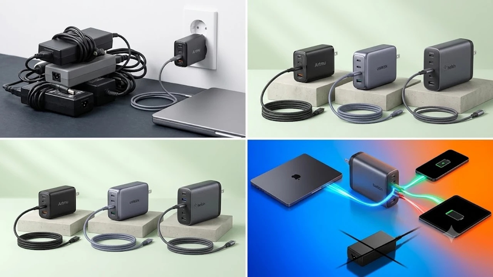

노트북 하나, 스마트폰 하나, 태블릿 하나 들고 카페나 출장을 나갈 때마다 벽돌만 한 어댑터를 3개씩 챙기던 번거로움은 끝났습니다. 질화갈륨(GaN) 반도체 소자가 상용화되면서 손바닥 절반 크기에 100W\~140W 고출력을 안정적으로 공급하는 어댑터가 데스크셋업의 표준으로 굳어졌습니다.

특히 최근 실사용자들이 가장 엄격하게 따지는 기준은 **접지(Grounding)** 플러그 유무입니다. 알루미늄 메탈 외장을 쓴 맥북이나 갤럭시북을 비접지 충전기에 꽂고 타이핑할 때 손목 끝이 찌릿하게 저리거나, 아이패드 액정 위에서 애플펜슬을 쓸 때 직선이 지그재그로 튀는 현상을 겪어봤다면 접지 충전기는 선택이 아닌 필수입니다.

단 하나의 어댑터로 케이블 지옥을 정리하고 기기 오작동을 차단해 줄 **2026년 기준 GaN 접지 멀티 고속 충전기 TOP3** 핵심 스펙과 실구매 가이드를 전달합니다.

---

## 1. 지금 GaN 접지 멀티 충전기가 뜨는 이유

* **기기별 전용 벽돌 어댑터의 완전한 퇴출:** USB-PD 3.0 및 차세대 PD 3.1 EPR 규격이 표준화되면서 각 제조사의 무거운 기본 충전기를 챙길 이유가 사라졌습니다. GaN 소자는 에너지 손실을 기존 실리콘 대비 30% 이상 줄여 어댑터 부피를 40%가량 압축합니다.
* **정전기 및 터치 오류를 막는 한국형 접지 플러그:** 비접지 충전기는 기기 표면으로 누설 전류가 흘러 불쾌한 진동감과 트랙패드 튐을 유발합니다. 접지 단자가 포함된 한국형 규격 충전기는 누설 전류를 콘센트 접지극으로 즉시 배출해 알루미늄 외장 쇼트와 펜슬 필기 끊김을 원천 차단합니다.
* **실시간 지능형 전력 배분 칩셋:** 과거 멀티 충전기는 새 기기를 꽂을 때마다 모든 포트의 전원이 1\~2초간 셧다운되었다가 켜지는 결함이 있었습니다. 최신 모델들은 파워 셰어링 칩을 탑재해 충전 중인 노트북 화면 깜빡임 없이 유연하게 출력을 재분배합니다.

---

## 2. TOP3 상품 스펙 비교

| 모델명 | 가격대 | 핵심 스펙 | 추천 대상 |
| :--- | :--- | :--- | :--- |
| **아트뮤 GS610** | 3만 7,900원 | 100W 총출력 / 3포트(C 2개+A 1개) / 한국형 접지 플러그 | 맥북 에어·14인치 프로 + 스마트폰 유저 |
| **유그린 Nexode Pro 100W** | 4만 2,900원 | 100W 총출력 / 3포트 / 무게 198g 초슬림 핏 | 출장과 외근이 잦아 백팩 무게를 줄여야 하는 유저 |
| **벨킨 WCH014kr** | 8만 9,000원 | 140W 총출력(PD 3.1) / 4포트(C 3개+A 1개) / 접지형 | 맥북 16인치 M3/M4 + 태블릿 4대 동시 구동자 |

---

## 3. 예산대별 맞춤 추천

### ① 실속형 접지 밸런스: 아트뮤(ARTMU) 100W 3포트 GaN 접지 충전기 GS610
국내 충전기 시장에서 접지 플러그 기술력으로 가장 높은 신뢰도를 쌓은 아트뮤의 대표 모델입니다.

* **실제 판매 가격대:** 3만 7,900원 선
* **핵심 스펙:**
  * 단일 USB-C1 포트 기준 단독 100W 출력 지원
  * 삼성 초고속 충전 2.0 (PPS 45W) 완벽 호환
  * 포트 구성: USB-C 2구 + USB-A 1구
* **장점:**
  * 콘센트에 꽂았을 때 처지거나 헐거워지지 않는 정밀한 플러그 규격 마감
  * 접지 설계를 통해 메탈 바디 노트북 타이핑 시 손목 찌릿함 완전 차단
* **단점:**
  * 내부 접지 모듈과 열전도 방열판 탑재로 본체 무게(약 235g)가 다소 묵직한 편
* **이런 사람에게 추천:**
  * 맥북, 갤럭시북 등 메탈 바디 노트북과 태블릿 필기 작업을 주로 하는 오피스·재택 직장인

👉 [아트뮤 100W 접지 충전기 GS610 쿠팡에서 보기](https://www.coupang.com/np/search?q=아트뮤+100W+접지+충전기+GS610&sourceType=affiliate&trackingCode=AF8691300)

---

### ② 초소형 휴대성 특화: 유그린(UGREEN) 넥소드 프로(Nexode Pro) 100W
글로벌 테크 브랜드 유그린의 초소형 고밀도 설계 라인업으로, 신용카드 면적에 근접한 사이즈를 자랑합니다.

* **실제 판매 가격대:** 4만 2,900원 선
* **핵심 스펙:**
  * Airpyra 차세대 패키징으로 기존 100W 어댑터 대비 부피 30% 축소
  * 단일 C1 포트 단독 100W, 동시 연결 시 65W + 30W 분배
  * 포트 구성: USB-C 2구 + USB-A 1구 / 무게 약 198g
* **장점:**
  * 파우치 앞주머니나 정장 포켓에 넣어도 부담 없는 얇고 가벼운 휴대성
  * 3개 기기를 2시간 연속 풀로드 충전해도 내부 온도를 60도 이하로 방열 제어
* **단점:**
  * 비접지형 슬림 핀 구조라 환경에 따라 메탈 표면 미세 잔류 전류가 발생할 수 있음
* **이런 사람에게 추천:**
  * 매일 노트북과 보조배터리를 가방에 넣고 이동하는 프리랜서 및 외근 영업직

👉 [유그린 넥소드 프로 100W 쿠팡에서 보기](https://www.coupang.com/np/search?q=유그린+넥소드+프로+100W&sourceType=affiliate&trackingCode=AF8691300)

---

### ③ 하이엔드 4포트 종결: 벨킨(Belkin) 부스트차지 프로 140W 4포트 GaN 충전기 WCH014kr
애플 공식 서드파티 파트너사 벨킨의 플래그십 모델로, 단일 포트에서 최대 140W를 밀어주는 하이엔드 충전기입니다.

* **실제 판매 가격대:** 8만 9,000원 선
* **핵심 스펙:**
  * PD 3.1 EPR 규격 지원 (C1 단독 사용 시 최대 140W)
  * 포트 구성: USB-C 3구 + USB-A 1구 (총 4포트)
  * 초당 수백 회 전압과 온도를 모니터링하는 지능형 전력 배분 칩셋
* **장점:**
  * 맥북 프로 16인치 M3/M4 모델을 정격 140W 풀스피드로 급속 충전
  * 2년 무상 보증 및 2,500달러(약 330만 원) 상당의 연결 기기 보증(CEW) 보험 기본 적용
* **단점:**
  * 일반 충전기 2개 값에 달하는 가격대와 300g 초반대의 묵직한 부피
* **이런 사람에게 추천:**
  * 영상 편집용 고사양 워크스테이션 랩톱과 태블릿, 보조배터리를 데스크에서 동시에 고속 구동해야 하는 전문 크리에이터

👉 [벨킨 140W 4포트 충전기 WCH014kr 쿠팡에서 보기](https://www.coupang.com/np/search?q=벨킨+140W+4포트+충전기+WCH014kr&sourceType=affiliate&trackingCode=AF8691300)

---

## 4. 구매 전 반드시 확인할 체크포인트

### 1) 단독 포트 출력과 총출력 표기 분별
패키지에 '100W'라고 적혀 있어도 전 포트 합산인지, 단일 C1 포트 단독 출력인지 확인해야 합니다. 14인치 이상 노트북을 정상 속도로 쓰려면 1번 C포트 단독 출력이 65W\~100W 이상이어야 합니다.

### 2) PPS 45W 프로토콜 호환
삼성 갤럭시 스마트폰 사용자는 PPS 45W 지원 여부가 속도를 가릅니다. 일반 PD 프로토콜만 있으면 15W\~25W 일반 고속으로 낮아져 충전 시간이 배로 늘어납니다.

### 3) 100W/240W 전용 E-Marker 케이블 매칭
아무리 어댑터가 100W 이상을 지원해도 케이블이 기본 60W(3A) 번들이라면 충전 속도는 60W로 제한됩니다. 어댑터 제 성능을 100% 뽑아내려면 **5A/100W 이상 지원 E-Marker 케이블**을 연결해야 합니다.

실내 작업 공간의 전체적인 효율을 끌어올리고 싶다면 [트렌드 상품 추천 TOP3](/posts/trending-picks/trending-picks-20260727/) 글이나, 번거로운 유리창 청소를 자동화해 주는 [창문 로봇청소기 TOP3 추천 가성비 비교](/posts/trending-picks/smart-window-cleaner-robot-top3-2026/) 리뷰도 함께 참고해 보세요.

---

> 이 포스팅은 쿠팡 파트너스 활동의 일환으로, 이에 따른 일정액의 수수료를 제공받습니다.

#트렌드상품 #쿠팡추천 #GaN접지멀티충전기 #100W초고속충전기 #맥북충전기 #아트뮤GS610 #벨킨140W #데스크테리어