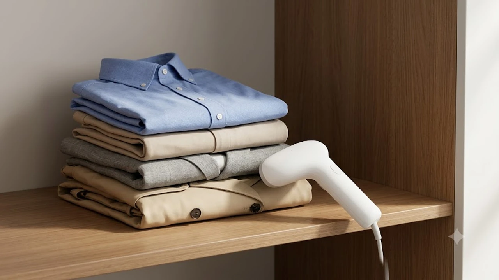

아침 출근길 현관을 나서기 직전, 옷장에서 꺼낸 셔츠 등판에 선명한 접힘 자국을 발견했을 때의 번거로움은 누구나 겪어봤을 상황입니다. 크고 무거운 다리미판을 펴고 바닥에 웅크려 앉아 물을 채우다 보면 10분이 훌쩍 지나갑니다. 옷걸이에 걸어둔 상태로 15초 만에 예열해 쓱 문지르고 바로 입고 나갈 수 있는 실속형 핸디 스팀다리미가 매년 환절기마다 장바구니 필수템 1위에 오르는 이유입니다.

## 1. 지금 핸디형 스팀다리미가 뜨는 이유

가을이 시작되는 9월은 옷차림이 급격히 달라지는 시기입니다. 얇은 반팔 티셔츠와 달리 옥스퍼드 셔츠, 슬랙스, 린넨 재킷, 트렌치코트는 장롱 속에 보관된 동안 깊은 구김이 자리 잡습니다. 일반 건조기 스팀 코스로는 해결되지 않는 잔주름을 빠르고 간편하게 펴려는 수요가 9월 중순부터 급증합니다.

1인 가구 증가와 오피스 출근 정상화도 한몫합니다. 원룸이나 좁은 드레스룸에서 기존 스탠드형 다리미는 공간 낭비가 큽니다. 반면 800g 내외의 가벼운 핸디형 기기는 서랍 한쪽에 넣어두었다가 출근 3분 전에 꺼내 쓰기 좋습니다. 

유튜브 쇼츠와 인스타그램 릴스에서 "출근 준비 30초 컷 주름 케어", "슬랙스 눕혀서 칼주름 잡는 법" 숏폼 영상이 바이럴되며 기존 저가형 모델의 단점이었던 물방울 튐(누수 현상)을 완벽히 잡은 최신 펌프식 기기들로 교체하는 소비자가 눈에 띄게 늘었습니다. 하루 종일 PC 앞에서 키보드와 마우스를 쥐며 손목 피로를 줄이고자 [2026 무선 버티컬 마우스 추천 TOP3](/posts/trending-picks/wireless-vertical-mouse-top3-2026/)를 찾아 세팅하듯, 옷차림 케어 역시 손목에 무리 없이 간결하게 끝내는 실용성을 추구하는 흐름입니다.

---

## 2. 핸디형 스팀다리미 TOP3 스펙 비교

| 모델명 | 가격대 | 핵심 스펙 | 추천 대상 |
| :--- | :--- | :--- | :--- |
| **홈플래닛 핸디형 스탠드 스팀다리미** | 2만 원대 초반 | 280ml 수조 / 예열 30초 / 소비전력 1400W | 가성비 원룸 자취생, 가벼운 주름 제거 |
| **보만 스탠드 스팀다리미 DB8230** | 3만 원대 중반 | 분당 25\~30g 분사 / 스테인리스 열판 / 260ml | 셔츠·블레이저를 매일 챙겨 입는 직장인 |
| **오스너 아이론스타 2in1 핸디형 다리미** | 5만 원대 후반 | 예열 15초 / 수평 다림질 지원 / 3단계 터보 분사 | 바지 칼주름 및 여행·출장 휴대 목적 |

---

## 3. 예산대별 추천 모델

**홈플래닛 핸디형 스탠드 스팀다리미 (2만 원대 초반)**
* **핵심 스펙:** 280ml 분리형 대용량 물통, 예열 30초, 소비전력 1400W, 본체 무게 약 800g
* **장점:** 
  * 2만 원대 초반의 압도적 가성비에 280ml 대용량 물통을 탑재해 중간에 물을 보충할 필요 없이 셔츠 3\~4벌을 연속으로 케어할 수 있습니다.
  * 원터치 연속 분사 고정 레버가 있어 검지손가락을 계속 누르고 버틸 필요가 없습니다.
* **단점:** 
  * 본체를 45도 이상 눕혀 다릴 경우 열판 노즐에서 간헐적으로 미세한 물방울이 튈 수 있어 반드시 옷걸이에 걸어 세워 다려야 합니다.
* **이런 사람에게 추천:** 다리미에 3만 원 이상 투자하기 아까운 대학생, 자취 초년생, 매일 입는 티셔츠와 셔츠 구김만 빠르게 펴고 싶은 실속파.
* [홈플래닛 핸디형 스탠드 스팀다리미 쿠팡에서 보기](https://www.coupang.com/np/search?q=홈플래닛+핸디형+스탠드+스팀다리미&sourceType=affiliate&trackingCode=AF8691300)

**보만 스탠드 스팀다리미 DB8230 (3만 원대 중반)**
* **핵심 스펙:** 분당 25\~30g 고압 스팀 분사, 내식성 스테인리스 스틸 열판, 260ml 수조, 순간/연속 2중 잠금 트리거
* **장점:** 
  * 플라스틱 헤드가 아닌 내구성 뛰어난 와이드 스테인리스 열판을 채택해 열전도율이 우수하며, 섬유 올 사이로 스팀이 깊숙이 침투합니다.
  * 하단 받침 무게 중심이 잘 잡혀 있어 다림질 도중 옷걸이를 고쳐 잡을 때 바닥에 쓰러지지 않고 똑바로 세워둘 수 있습니다.
* **단점:** 
  * 본체 자체 무게(약 880g)에 물 260ml를 꽉 채우면 체감 하중이 1kg을 넘어가므로 연속 3벌 이상 케어 시 손목 부담이 살짝 느껴집니다.
* **이런 사람에게 추천:** 직장용 와이셔츠와 슬랙스를 단정하게 유지해야 하는 직장인, 검증된 베스트셀러 모델을 선호하는 사용자.
* [보만 스탠드 스팀다리미 DB8230 쿠팡에서 보기](https://www.coupang.com/np/search?q=보만+스탠드+스팀다리미+DB8230&sourceType=affiliate&trackingCode=AF8691300)

**오스너 아이론스타 2in1 핸디형 다리미 (5만 원대 후반)**
* **핵심 스펙:** 15초 초고속 예열, 분당 최대 35g 3단계 압축 스팀, 누수 방지 펌프 시스템, 시판 생수병 100% 호환 어댑터 제공
* **장점:** 
  * 드립 스탑(누수 방지 전자식 펌프) 기술을 탑재해 180도 수평으로 눕혀 다려도 물방울이 전혀 흐르지 않아 바닥이나 침대 위에서 슬랙스 칼주름을 잡을 수 있습니다.
  * 일반 500ml 생수병을 직접 결합할 수 있는 커넥터를 지원해 출장이나 여행 가방에 본체만 콤팩트하게 챙겨가기 편리합니다.
* **단점:** 
  * 3단계 터보 모드로 작동 시 스팀 소모량이 빨라 10분 내외로 수조가 바닥납니다.
* **이런 사람에게 추천:** 정장 핏과 칼주름 라인을 포기할 수 없는 전문직, 국내외 출장이 잦은 비즈니스맨, 스팀과 열판 다림질을 한 기기로 끝내고 싶은 사용자.
* [오스너 아이론스타 2in1 핸디형 다리미 쿠팡에서 보기](https://www.coupang.com/np/search?q=오스너+아이론스타&sourceType=affiliate&trackingCode=AF8691300)

---

## 4. 구매 전 반드시 확인할 체크포인트

* **누수 방지(드립 스탑) 펌프 유무:** 단순 가열 비등식 모델은 스팀과 함께 끓는 물이 뿜어져 나와 밝은색 실크 블라우스나 면 셔츠에 얼룩을 남깁니다. 내부 모터가 일정한 압력으로 물을 밀어내는 펌프식 시스템인지 확인해야 옷 손상을 막을 수 있습니다.
* **수직·수평 겸용 지원 여부:** 티셔츠나 가벼운 블라우스는 옷걸이에 건 채 수직 스팀만으로 충분하지만, 정장 바지의 칼각선이나 두꺼운 셔츠 깃은 바닥에 눕혀 눌러주는 수평 다림질 기능이 반드시 뒷받침되어야 합니다.
* **물통 용량과 세척 편의성:** 150ml 미만의 초소형 물통은 셔츠 한 벌을 채 다리기 전에 물이 떨어집니다. 1인 가구 기준 최소 250ml 이상을 권장하며, 사용 후 잔수를 완전히 건조할 수 있도록 물 주입구 구경이 넓은 분리형 구조를 골라야 물때와 세균 번식을 예방합니다. 퇴근 후 지친 몸을 [무선 종아리 마사지기 TOP3 가성비 비교](/posts/trending-picks/wireless-calf-massager-top3-2026/)로 풀어주며 쉬는 저녁 시간처럼, 아침 의류 관리 루틴 역시 번거로운 물 채움 없이 한 번에 끝나야 생활 스트레스가 없습니다.

---

> 이 포스팅은 쿠팡 파트너스 활동의 일환으로, 이에 따른 일정액의 수수료를 제공받습니다.

#트렌드상품 #쿠팡추천 #핸디형스팀다리미 #스팀다리미추천 #보만스팀다리미 #홈플래닛다리미 #오스너아이론스타 #환절기옷관리 #출근룩필수템