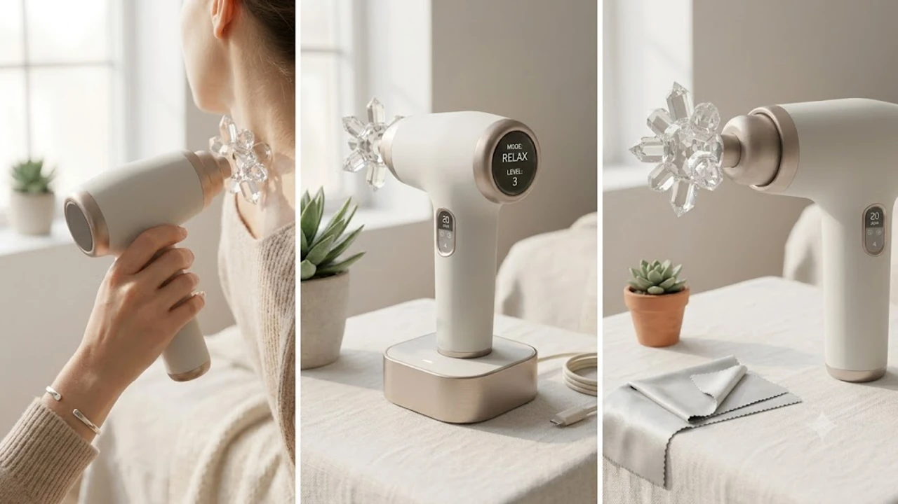

모니터와 스마트폰을 하루 8시간 이상 들여다보는 직장인과 수험생에게 안구 건조와 눈 주변부 뻐근함은 만성 통증에 가깝습니다. 손으로 눈가를 주무르거나 온찜질 팩을 전자레인지에 돌리는 방식은 번거롭고 금방 식어버립니다. 공기압 지압과 온열을 결합한 무선 눈 마사지기가 데스크 셋업과 수면 루틴의 필수 힐링 가전으로 자리 잡은 이유입니다.

오랜 시간 컴퓨터를 쓰면서 생기는 손목 통증을 [2026 무선 버티컬 마우스 추천 TOP3](/posts/trending-picks/wireless-vertical-mouse-top3-2026/) 글로 해결했다면, 눈의 피로는 물리적인 지압과 온열 기기로 직접 풀어내야 합니다. 시중에 출시된 무선 온열 눈 마사지기 중 실구매 데이터로 검증된 상위 3개 모델을 비교 분석했습니다.

---

## 지금 무선 온열 눈 마사지기가 주목받는 이유

* **VDT 증후군 및 눈 피로 호소층 증가:** 모니터 깜빡임과 블루라이트로 인한 안구 건조, 눈 떨림, 관자놀이 압박 통증을 즉각 완화하려는 2040 직장인과 수험생 수요가 집중되고 있습니다.
* **취침 전 15분 루틴 확산:** SNS와 숏폼 콘텐츠를 중심으로 암막 수면 안대 대신 공기압과 온열 기능을 갖춘 마사지기를 착용하고 잠자리에 드는 패턴이 확산되었습니다. 퇴근 후 하체를 [무선 종아리 마사지기 TOP3 가성비 비교](/posts/trending-picks/wireless-calf-massager-top3-2026/) 기기로 풀듯, 상체는 눈 마사지기로 마무리하는 조합이 인기입니다.
* **노-프레셔(No-Pressure) 에어셀 기술 안착:** 초기 제품들은 각막을 세게 눌러 시야 흐림이나 통증을 유발했습니다. 최신형은 안구 부위를 비워두고 눈썹 뼈와 관자놀이 라인만 공기압으로 지압하는 설계를 적용해 안전성을 대폭 끌어올렸습니다.

---

## 2026 무선 온열 눈 마사지기 TOP3 스펙 비교

| 모델명 | 가격대 | 핵심 스펙 | 추천 대상 |
| :--- | :--- | :--- | :--- |
| **바디프랜드 아이로보 (BF-E100)** | 78,000원 | 38\~42°C PTC 발열 / 4개 공기압 모드 / 1,200mAh 배터리 | 강력한 관자놀이 지압과 브랜드 AS망을 선호하는 분 |
| **오아 눈편한세상 PRO (OA-MA032)** | 45,900원 | 40\~42°C 정온 발열 / 270g 초경량 / 180° 반접이식 | 가벼운 착용감과 가성비, 휴대성을 중시하는 직장인·수험생 |
| **브레오 iSee M (BREE-ISEEM)** | 129,000원 | 블루투스 앱 커스텀 제어 / 고밀도 단백질 가죽 / 1,150mAh | 정밀한 압력 제어와 간편한 가죽 물세척 관리를 원하는 분 |

---

## 사용 목적과 예산대별 상세 분석

**바디프랜드 아이로보 (BF-E100)**
안마의자 전문 브랜드의 공기압 펌프 제어 기술을 축소 적용한 모델입니다. 관자놀이 부위를 양옆에서 조여주는 듀얼 에어백 설계로 지끈거리는 안구 주변부 피로에 직관적인 압박감을 전달합니다.

* **가격대:** 78,000원 선
* **핵심 스펙:**
  * 38°C\~42°C 2단계 정밀 온열 제어 (PTC 세라믹 히팅)
  * 4가지 자동 마사지 모드 (활력, 수면, 케어, 온열 단독)
  * 1,200mAh 리튬이온 배터리 탑재 (완충 시 15분 기준 8\~10회 사용)
* **장점:**
  * 관자놀이를 양옆에서 밀착 압박하는 공기압 세기가 동급 기기 중 가장 강합니다.
  * 작동 시작 후 30초 만에 40°C까지 도달해 예열 대기 시간이 매우 짧습니다.
* **단점:**
  * 모터 구동음과 에어 배출 소음(약 52dB)이 조용한 취침 직전 환경에서는 다소 거슬릴 수 있습니다.
* **추천 대상:** 하루 종일 모니터를 보며 관자놀이 뻐근함을 달고 사는 하드 워커.
* [바디프랜드 아이로보 쿠팡에서 보기](https://www.coupang.com/np/search?q=바디프랜드+아이로보&sourceType=affiliate&trackingCode=AF8691300)

---

**오아 눈편한세상 PRO (OA-MA032)**
가성비와 가벼운 무게에 집중한 데일리 아이템입니다. 270g 초경량 설계로 마사지기 착용 시 콧대와 광대뼈에 가해지는 하중 부담을 덜어냈습니다.

* **가격대:** 45,900원 선
* **핵심 스펙:**
  * 270g 초경량 무게 및 180도 반접이식 폴딩 구조
  * 40\~42°C 자동 항온 유지 열선 시스템
  * 범용 USB-C 충전 포트 지원 (완충 2시간 소요)
* **장점:**
  * 안면부 하중 분산 설계가 적용되어 마사지 후 눈가나 콧대에 눌림 자국이 남지 않습니다.
  * 반으로 접으면 손바닥 크기로 줄어들어 출장 가방이나 직장 서랍에 보관하기 좋습니다.
* **단점:**
  * 강한 압력을 선호하는 사용자에게는 최대 공기압 출력이 다소 부드럽게 느껴집니다.
* **추천 대상:** 점심시간 쪽잠이나 이동 중 가볍게 눈 피로를 풀고 싶은 실속파 구매자.
* [오아 눈편한세상 PRO 쿠팡에서 보기](https://www.coupang.com/np/search?q=오아+눈편한세상+PRO&sourceType=affiliate&trackingCode=AF8691300)

---

**브레오 iSee M (BREE-ISEEM)**
스마트폰 전용 모바일 앱과 연동되어 작동 시간, 공기압 강도, 온도를 1단계 단위로 조절하는 프리미엄 기기입니다. 피부와 직접 닿는 안쪽 라이닝이 친환경 단백질 가죽으로 마감되어 오염 관리가 간편합니다.

* **가격대:** 129,000원 선
* **핵심 스펙:**
  * 스마트폰 앱 연동 100% 커스텀 압력·온도 프로그래밍
  * 방오 방수 코팅 단백질 인조가죽 내피 적용
  * 300g 무게 및 1,150mAh 대용량 배터리
* **장점:**
  * 천 재질 내피와 달리 화장품이나 땀, 피지가 묻어도 물티슈로 닦아내면 얼룩 없이 유지됩니다.
  * 개인 두상 형태와 피로 부위에 맞춰 지압 패턴과 시간을 세밀하게 조율할 수 있습니다.
* **단점:**
  * 상위 스펙 대비 10만 원을 넘는 가격대로 초기 진입 장벽이 존재합니다.
* **추천 대상:** 가족 구성원이 함께 돌려쓰거나 위생 및 피부 트러블 관리에 민감한 분.
* [브레오 iSee M 쿠팡에서 보기](https://www.coupang.com/np/search?q=브레오+iSee+M&sourceType=affiliate&trackingCode=AF8691300)

---

## 구매 전 반드시 점검할 체크포인트

무선 온열 눈 마사지기를 선택할 때는 세 가지 기준을 확인해야 후회가 없습니다.

* **안구 비압박(노-프레셔) 설계 유무:** 저가형 기기는 에어백이 눈동자 자체를 눌러 각막에 무리를 주고 일시적인 시야 흐림을 유발합니다. 눈동자 부위는 완전히 비워두고 안와골 테두리와 관자놀이만 가압하는 형태인지 점검해야 합니다.
* **내피 소재 및 청결 관리 용이성:** 얼굴 유분과 땀, 기초 화장품이 닿는 부위이므로 벨벳이나 직물 소재는 오염 시 세척이 불가능해 세균 번식의 원인이 됩니다. 코팅 단백질 가죽이나 실리콘 소재를 골라야 합니다.
* **온열 도달 시간과 USB-C 충전 포트:** 최소 40°C 도달 시간이 1분 이내여야 15분 작동 시간 동안 온열 찜질 효과를 온전히 누릴 수 있습니다. 구형 micro 5핀이 아닌 USB-C 규격 포트를 탑재했는지도 확인 대상입니다.

퇴근 후 침대에서 눈 마사지와 함께 [무선 종아리 마사지기 TOP3 가성비 비교](/posts/trending-picks/wireless-calf-massager-top3-2026/)를 병행하면 상하체 긴장이 풀리며 숙면에 유리합니다. 다른 라이프스타일 꿀템 정보는 [트렌드 상품 추천 TOP3](/posts/trending-picks/trending-picks-20260828/)에서 확인할 수 있습니다.

---

> 이 포스팅은 쿠팡 파트너스 활동의 일환으로, 이에 따른 일정액의 수수료를 제공받습니다.

#트렌드상품 #쿠팡추천 #무선온열눈마사지기 #눈마사지기추천 #바디프랜드아이로보 #오아눈마사지기 #브레오눈마사지기 #안구피로회복 #직장인힐링템