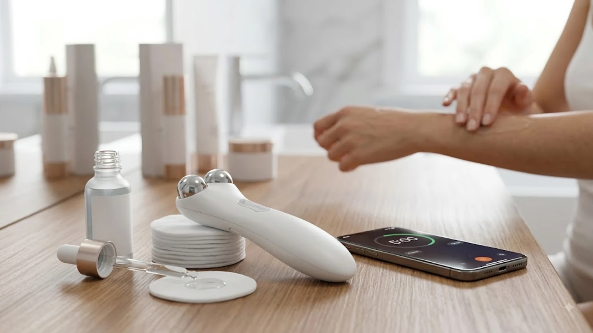

피부과 1회 레이저 시술 비용이 20\~30만 원을 넘어가면서, 매일 화장대 앞에서 관리하는 홈케어 디바이스가 자리 잡았습니다. 화장품 흡수율을 400% 끌어올리는 갈바닉 모드부터 처진 턱선을 당겨주는 EMS 미세전류까지, 손으로 바르던 스킨케어와는 체감 차이가 큽니다. 시중에 나온 수많은 기기 중 기술력과 실사용 데이터가 검증된 TOP3 모델을 정리했습니다.

---

## 1. 지금 홈케어 뷰티 디바이스가 뜨는 이유

바쁜 일상에서 피부과 예약과 대기 시간을 줄이고, 집에서 하루 5분 투자로 스킨케어 흡수율을 끌어올리려는 수요가 급증했습니다.

* **피부과 시술비 절감:** 100만 원대 패키지 결제 대신 기기 1대로 기초 흡수, 탄력, 모공을 직접 케어하는 가성비 소비가 늘었습니다.
* **숏폼 비포·애프터 바이럴:** 앰플 흡수 속도 비교와 턱선 리프팅 변화를 담은 영상이 인스타그램 릴스와 유튜브 쇼츠에서 수백만 조회수를 기록 중입니다.
* **올인원 융합 기술:** 과거 갈바닉 단일 기능에서 벗어나 고주파, 미세전류, 에어샷(모공), LED 파장 케어가 헤드 하나에 결합되었습니다.

집에서 간편하게 붓기를 빼는 [무선 종아리 마사지기 TOP3 가성비 비교](/posts/trending-picks/wireless-calf-massager-top3-2026/)처럼, 뷰티 디바이스 역시 손이 자주 가고 세척이 쉬운 제품이 실사용 만족도를 결정합니다.

---

## 2. TOP3 뷰티디바이스 스펙 비교

| 모델명 | 가격대 | 핵심 스펙 | 추천 대상 |
| :--- | :--- | :--- | :--- |
| **메디큐브 에이지알 부스터 프로** | 319,000원 | 4in1 모드(부스터·미세전류·더마샷·에어샷), 154g, 모바일 앱 연동 | 모공부터 탄력까지 한 번에 끝낼 올인원 기기를 찾는 분 |
| **센텔리안24 더마펄스 부스터 멀티샷** | 249,000원 | 3in1 모드(브라이트닝·흡수·탄력), 130g 초경량, 한국어 음성 안내 | 조작이 쉽고 손목 부담 없는 제약사 기술력 제품을 선호하는 분 |
| **마미케어 EMS 브이쎄라** | 79,000원 | 1KHz 중주파 EMS, 110g 괄사 일체형 헤드, 티타늄 코팅 | 턱선 리프팅과 아침 얼굴 붓기 관리에 집중할 입문자 |

---

## 3. 예산대별 상세 추천 분석

### 메디큐브 에이지알 부스터 프로 (하이엔드 올인원)
* **브랜드 / 모델명:** 에이피알 메디큐브 에이지알 부스터 프로 (ME-BPRO)
* **실구매 가격대:** 319,000원 선
* **핵심 스펙:** 부스터(광채)·미세전류(탄력)·더마샷(볼륨)·에어샷(모공) 4in1 기능, 154g 무게, 블루투스 전용 모바일 앱 연동 케어 리포트 제공
* **장점 1:** 전용 젤 구매가 강제되지 않아 평소 쓰던 수분크림, 비타민 앰플, 시트 마스크팩과 바로 호환됩니다.
* **장점 2:** 1초당 400만 회 진동 에어샷 모드가 들어가 있어 별도 모공 기기 없이도 세안 직후 요철을 정돈합니다.
* **단점:** 4가지 모드별 권장 주기(일일 케어/주 2\~3회 케어)가 달라 초기 적응 기간이 필요합니다.
* **추천 대상:** 복합적인 피부 고민(늘어진 모공, 속건조, 볼 탄력 저하)을 기기 1대로 끝내려는 분.

👉 [메디큐브 에이지알 부스터 프로 쿠팡에서 보기](https://www.coupang.com/np/search?q=메디큐브+에이지알+부스터+프로&sourceType=affiliate&trackingCode=AF8691300)

---

### 센텔리안24 더마펄스 부스터 멀티샷 (스탠다드 밸런스)
* **브랜드 / 모델명:** 동국제약 센텔리안24 더마펄스 부스터 멀티샷
* **실구매 가격대:** 249,000원 선
* **핵심 스펙:** 브라이트닝(각질/토닝)·흡수(EP)·탄력(MC) 3가지 모드, 130g 초경량 설계, 한국어 음성 안내 보이스 내장
* **장점 1:** 버튼을 누를 때마다 음성으로 작동 모드와 남은 권장 시간을 알려주어 거울을 보지 않고도 정확히 씁니다.
* **장점 2:** 스마트폰보다 가벼운 130g 무게로 눈가와 팔자주름 부위를 5분 이상 롤링해도 손목에 무리가 없습니다.
* **단점:** 모공 전용 에어샷 기능이 빠져 있어 피지 정리보다는 미백 앰플 흡수와 표정근 관리에 맞춰져 있습니다.
* **추천 대상:** 직관적인 조작을 선호하고 기초 화장품의 피부 속 도달률을 높이고 싶은 분.

👉 [센텔리안24 더마펄스 부스터 멀티샷 쿠팡에서 보기](https://www.coupang.com/np/search?q=센텔리안24+더마펄스+부스터+멀티샷&sourceType=affiliate&trackingCode=AF8691300)

---

### 마미케어 EMS 브이쎄라 (가성비 리프팅 입문)
* **브랜드 / 모델명:** 마미케어 EMS 브이쎄라 괄사 마사지기
* **실구매 가격대:** 79,000원 \~ 89,000원 선
* **핵심 스펙:** 1KHz 중주파 EMS 미세전류, 110g 콤팩트 규격, V라인 괄사 구조 티타늄 접촉 헤드
* **장점 1:** 턱 라인과 광대뼈, 승모근 림프선에 꼭 맞게 들어가는 곡선 헤드로 아침 3분 마사지만으로 붓기가 가라앉습니다.
* **장점 2:** 10만 원 미만의 가격으로 속근육을 자극하는 중주파 리프팅 효과를 직접 체감할 수 있습니다.
* **단점:** 갈바닉 유효성분 침투 기능이 없어 수분 앰플 흡수용 기기로는 적합하지 않습니다.
* **추천 대상:** 이중턱 라인 정리와 아침 얼굴 부기 완화가 최우선인 2030 직장인 및 홈케어 입문자.

👉 [마미케어 EMS 브이쎄라 쿠팡에서 보기](https://www.coupang.com/np/search?q=마미케어+EMS+브이쎄라&sourceType=affiliate&trackingCode=AF8691300)

---

## 4. 구매 전 필수 체크포인트

* **전용 카트리지·젤 강제 여부:** 기기 가격이 저렴해도 전용 소모품을 주기적으로 구매해야 하는 모델은 유지비가 커집니다. 기존 기초 화장품 사용 가능 여부를 먼저 확인해야 합니다.
* **피부 접촉 헤드 소재:** 민감성 피부에 지속적인 마찰을 주므로 의료용 서지컬 스틸이나 인체 친화적 티타늄 코팅이 적용되어 있는지 확인해야 합니다.
* **스마트 자동 셧다운 타이머:** 과도한 미세전류 자극은 피부 장벽을 무너뜨리므로 5분 또는 10분 후 전원이 차단되는 안전 타이머가 필수적입니다.

라이프스타일을 개선하는 다른 추천 아이템은 [트렌드 상품 추천 TOP3](/posts/trending-picks/trending-picks-20260727/)에서도 확인할 수 있습니다.

---

> 이 포스팅은 쿠팡 파트너스 활동의 일환으로, 이에 따른 일정액의 수수료를 제공받습니다.

#트렌드상품 #쿠팡추천 #홈케어뷰티디바이스 #메디큐브부스터프로 #센텔리안24멀티샷 #마미케어브이쎄라 #갈바닉마사지기 #피부홈케어