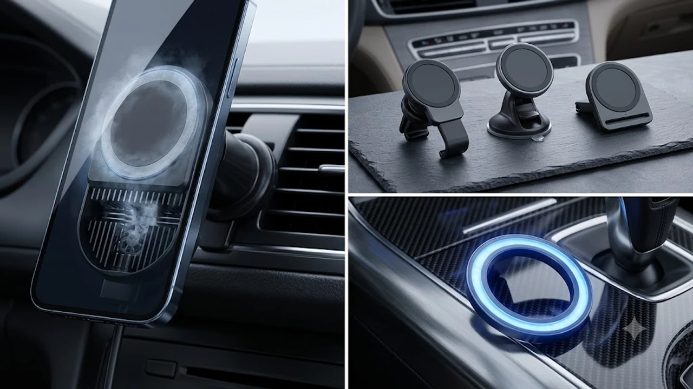

티맵이나 카카오내비를 켜고 30분만 운전해도 스마트폰이 뜨거워지면서 충전이 멈추거나 화면이 어두워지는 현상은 운전자라면 누구나 겪는 문제입니다. 단순 송풍 거치대는 에어컨을 끌 때 발열을 제어하지 못하므로, 차가운 냉각 패드로 열을 직접 식히는 펠티어 반도체 방식이 필수 장비로 자리 잡았습니다.

## 1. 펠티어 냉각 맥세이프 거치대가 필요한 이유

스마트폰은 배터리 온도가 35℃를 넘어서면 기기 보호를 위해 충전 속도를 강제로 5W 미만으로 떨어뜨립니다. 한여름 직사광선과 GPS 연산 과부하가 겹치는 차량 환경에서는 단순 냉각 팬만으로 열기를 감당하기 어렵습니다.

* **실시간 반도체 급속 냉각:** 전원을 켜는 즉시 접촉면 온도를 10\~15℃가량 낮춰 배터리 과열 알림과 충전 중단을 방지합니다.
* **15W 고속 충전 속도 유지:** 내비게이션과 음악 스트리밍을 동시에 켜도 배터리 소모량보다 충전량이 앞서 배터리 잔량을 안정적으로 채웁니다.
* **마그네틱 탈부착 편의성:** 거치 날개(오토 슬라이더)의 고장 위험 없이 1,200g 이상의 자력으로 한 손 탈부착이 가능합니다.

일상 속 생산성을 높여주는 [2026 무선 버티컬 마우스 추천 TOP3](/posts/trending-picks/wireless-vertical-mouse-top3-2026/)와 마찬가지로, 차량 내 환경 역시 확실한 스펙을 갖춘 장비를 갖춰야 스트레스를 줄일 수 있습니다.

## 2. TOP3 쿨링 맥세이프 거치대 스펙 비교

| 모델명 | 가격대 | 핵심 스펙 | 추천 대상 |
| :--- | :--- | :--- | :--- |
| **주파집 4세대 펠티어 C04** | 4만 원대 중반 | 최대 15W 출력 / 1,400g 자력 / 25dB 저소음 | 장거리 운전 및 견고한 체결력을 원하는 운전자 |
| **ESR 할로락 크라이오부스트** | 5만 원대 후반 | 최대 15W 출력 / 1,400g 자력 / CryoBoost 팬 | 아이폰 최적화 고성능과 글로벌 마감을 선호하는 유저 |
| **신지모루 M도넛 쿨링 거치대** | 3만 원대 초반 | 최대 15W 출력 / 1,200g 자력 / 콤팩트 원형 링 | 가성비와 깔끔한 데일리 출퇴근용을 찾는 운전자 |

## 3. 예산 및 주행 패턴별 상세 추천

### 1) 주파집 4세대 펠티어 차량용 무선충전기 C04
* **가격대:** 45,000원 선
* **핵심 스펙:** 15W 무선 급속 충전, 1,400g 지지력 네오디뮴 자석, 3단 락링 훅 마운트, 25dB 이하 저소음 모터
* **장점:**
  * 송풍구 날개를 꽉 조여주는 3단 스크류 훅 구조로 방지턱을 넘을 때도 처짐 현상이 없습니다.
  * 냉각 패드 표면 온도가 영하에 가깝게 떨어져 장거리 티맵 구동 시에도 발열을 원천 차단합니다.
* **단점:**
  * 본체 두께가 약 4.2cm로 일반 맥세이프 거치대 대비 다소 두껍습니다.
* **추천 대상:** 고속도로 주행이 잦고 요철 통과 시 흔들림 없는 고정력을 최우선으로 두는 실속파 운전자.
* [주파집 4세대 펠티어 차량용 무선충전기 C04 쿠팡에서 보기](https://www.coupang.com/np/search?q=주파집+4세대+펠티어+차량용+무선충전기+C04&sourceType=affiliate&trackingCode=AF8691300)

### 2) ESR 할로락 크라이오부스트 차량용 맥세이프 거치대
* **가격대:** 58,900원 선
* **핵심 스펙:** 15W 고속 무선충전, 1,400g 고정 자력, 정밀 쿨링팬 탑재, 볼조인트 360도 회전
* **장점:**
  * 아이폰 맥세이프 규격과의 결착 일체감이 뛰어나며 디자인 마감이 매끄럽습니다.
  * 과전압·과전류 방지 회로가 탄탄해 충전 효율 저하 없이 배터리 수명을 보호합니다.
* **단점:**
  * 펠티어 반도체 방식이 아닌 순수 팬 냉각 방식이라 햇빛 직사광선 아래에서는 냉각 속도가 펠티어 대비 반 박자 느립니다.
* **추천 대상:** 완성도 높은 빌드 퀄리티와 안정적인 글로벌 인증 브랜드를 신뢰하는 아이폰 유저.
* [ESR 할로락 크라이오부스트 차량용 맥세이프 거치대 쿠팡에서 보기](https://www.coupang.com/np/search?q=ESR+할로락+크라이오부스트+차량용+맥세이프+거치대&sourceType=affiliate&trackingCode=AF8691300)

### 3) 신지모루 M도넛 쿨링 맥세이프 거치대
* **가격대:** 32,900원 선
* **핵심 스펙:** 15W 충전, 1,200g 지지 자력, 원형 LED 펠티어 냉각 유닛, 메탈 갈고리 마운트
* **장점:**
  * 3만 원대 초반의 합리적인 가격에 펠티어 반도체 냉각 칩을 그대로 탑재했습니다.
  * 원형 콤팩트 디자인으로 송풍구를 가리는 면적이 적어 에어컨 바람 순환을 방해하지 않습니다.
* **단점:**
  * 자력이 1,200g으로 두꺼운 일반 케이스 부착 시 자력이 다소 약해질 수 있습니다.
* **추천 대상:** 도심 출퇴근 위주로 주행하며 가성비 있게 스마트폰 온도 상승을 막고 싶은 실속형 구매자.
* [신지모루 M도넛 쿨링 맥세이프 거치대 쿠팡에서 보기](https://www.coupang.com/np/search?q=신지모루+M도넛+쿨링+맥세이프+거치대&sourceType=affiliate&trackingCode=AF8691300)

더 많은 스마트 기기 비교는 [트렌드 상품 추천 TOP3](/posts/trending-picks/trending-picks-20260828/)에서도 확인할 수 있습니다.

## 4. 실패 없는 차량용 거치대 구매 체크리스트

* **시거잭 충전기 출력 규격 확인:** 거치대 본체가 15W를 지원하더라도 시거잭 어댑터가 18W(9V 2A) 또는 PD 20W 미만이면 냉각 팬과 무선 충전 코일이 동시에 작동하지 못합니다.
* **송풍구 블레이드 구조 점검:** 원형 터빈형 송풍구(일부 벤츠, 르노 차량 등)는 일반 갈고리 마운트 장착이 어려울 수 있으므로 원형 전용 어댑터 제공 여부를 확인해야 합니다.
* **마그네틱 링 정렬 상태:** 비 맥세이프 케이스를 사용하는 경우 부착하는 마그네틱 링 스티커의 위치가 무선 충전 코일 정중앙과 일치해야 충전 발열을 최소화할 수 있습니다.

---

> 이 포스팅은 쿠팡 파트너스 활동의 일환으로, 이에 따른 일정액의 수수료를 제공받습니다.

#맥세이프차량용충전기 #차량용무선충전기 #펠티어충전기 #주파집맥세이프 #ESR할로락 #신지모루M도넛 #차량용품추천 #쿠팡추천템 #내비발열해결