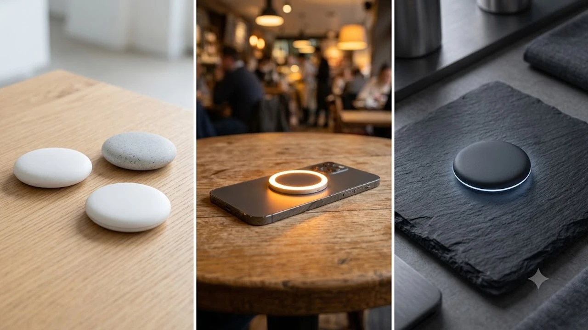

# 2026 맥세이프 보조배터리 TOP3 비교 추천

아이폰과 최신 안드로이드 기기를 사용하는 분들이라면 외출 시 거추장스러운 C타입 케이블을 주머니에 꼬아 넣는 불편함을 한 번쯤 겪으셨을 겁니다. 2026년 현재 스마트폰 악세서리 시장은 자석으로 착 붙는 **맥세이프 무선 보조배터리**가 완전히 점유했습니다.

스마트폰 카메라 성능 향상으로 영상 촬영이 늘어나고 야외 활동이 많아진 계절적 요인까지 맞물려, 휴대용 무선 충전기는 외출 필수품으로 완전히 자리를 잡았습니다. 최근 유행하는 [2026 스마트링 추천 TOP3 성능 비교](/posts/trending-picks/smart-ring-health-tracker-top3-2026/)나 [무선 종아리 마사지기 TOP3 가성비 비교](/posts/trending-picks/wireless-calf-massager-top3-2026/)처럼 무선의 편리함과 극대화된 모빌리티를 선호하는 소비자 흐름이 보조배터리 시장에도 그대로 반영된 결과입니다.

---

## 1. 지금 맥세이프 보조배터리가 뜨는 이유

기존 무선 보조배터리는 충전 속도가 7.5W 수준에 머물러 충전기라기보다는 '배터리 소모 방지용'에 가까웠습니다. 충전 중 발생하는 발열 때문에 속도가 떨어지거나 스마트폰 화면이 어두워지는 현상도 잦았습니다.

그러나 **Qi2 차세대 무선 충전 규격**이 완전히 상용화되면서 상황이 완전히 달라졌습니다.

* **15W 고속 무선 충전 실현:** 최신 Qi2 표준 인증을 받은 보조배터리는 아이폰과 갤럭시 가리지 않고 유선 충전 못지않은 15W 무선 충전 속도를 냅니다.
* **스탠드·디스플레이 결합형 구조:** 단순 배터리를 넘어 접이식 스탠드, 링 거치대, 배터리 잔량 및 충전 완료 시간을 분 단위로 보여주는 디지털 LCD 탑재 모델이 표준으로 정착했습니다.
* **초슬림·발열 제어 기술:** 내부 열 배출 구조를 개선해 스마트폰 뒷면에 붙인 채로 유튜브나 인스타그램 릴스를 감상해도 손에 느껴지는 불쾌한 열감이 획기적으로 줄었습니다.

---

## 2. TOP3 대표 상품 스펙 비교

시장에서 검증된 2만원대 입문 모델부터 6만원대 프리미엄 제품까지 한눈에 비교할 수 있도록 정리했습니다.

| 모델명 | 가격대 | 핵심 스펙 | 추천 대상 |
| :--- | :--- | :--- | :--- |
| **YINTO 맥세이프 초슬림 10000mAh (W18)** | 25,900원 | 10,000mAh / 무선 15W / 두께 15mm / 메탈 거치링 | 2만원대 예산과 초슬림 휴대성을 최우선시하는 분 |
| **쿡테크(CUKTECH) CP25 고속 배터리** | 43,800원 | 10,000mAh / 유선 55W / C타입 일체형 케이블 | 무선 충전과 노트북/태블릿 유선 충전을 병행할 분 |
| **앤커 맥고(Anker MagGo) A1664** | 69,900원 | 10,000mAh / Qi2 15W / 유선 30W / 스마트 LCD | 최상위 발열 제어와 정밀한 충전 잔량 확인이 필요한 분 |

---

## 3. 예산대별 추천 TOP3 상세 분석

### 🟢 실속형: YINTO 맥세이프 초슬림 C타입 무선 보조배터리 10000mAh (W18)

#### ① 가격 및 기본 스펙
* **가격대:** 25,900원 선
* **용량:** 10,000mAh (실제 유효 충전량 아이폰 15/16 기준 약 1.8회 완충)
* **출력 스펙:** 무선 최대 15W, 유선 PD 22.5W 지원
* **무게 및 두께:** 185g / 15mm

#### ② 장점과 단점
* **장점 1 (슬림한 그립감):** 10,000mAh 용량이면서 두께가 15mm에 불과해 스마트폰에 부착한 상태로 한 손에 쥐었을 때 이질감이 적습니다.
* **장점 2 (실용적인 메탈 거치링):** 후면에 메탈 링 스탠드가 내장되어 세로 모드 숏폼 시청 및 가로 모드 영상 감상 시 별도 거치대가 필요 없습니다.
* **단점 1 (연속 사용 시 충전 속도 스로틀링):** 장시간 15W 무선 충전을 유지할 때 하우징 온도가 상승하면서 충전 출력이 7.5W\~10W 수준으로 조정되는 현상이 있습니다.

#### ③ 이런 사람에게 추천
2만원대 예산으로 185g의 가벼운 무게, 단단한 자력, 거치 기능까지 갖춘 일상용 보조배터리를 찾으시는 실속파 구매자.

👉 [YINTO 맥세이프 보조배터리 쿠팡에서 보기](https://www.coupang.com/np/search?q=YINTO+맥세이프+보조배터리&sourceType=affiliate&trackingCode=AF8691300)

---

### 🟡 Balance 추천: 쿡테크(CUKTECH) CP25 55W 일체형 무선 보조배터리 10000mAh

#### ① 가격 및 기본 스펙
* **가격대:** 43,800원 선
* **용량:** 10,000mAh (고밀도 리튬이온 셀)
* **출력 스펙:** 유선 최대 55W 초고속 충전, 무선 최대 15W
* **무게 및 두께:** 210g / 일체형 C타입 직조 케이블 탑재

#### ② 장점과 단점
* **장점 1 (55W 유선 고출력):** 급할 때 C타입 내장 케이블을 연결하면 맥북 에어나 아이패드 프로, 갤럭시 S26 시리즈를 초고속으로 충전해 냅니다.
* **장점 2 (케이블 일체형 스트랩):** 튼튼한 직조 케이블이 본체에 손잡이 형태로 일체화되어 있어 별도로 C타입 케이블을 챙길 필요가 없습니다.
* **단점 1 (두꺼운 두께):** 고출력 회로와 케이블 수납 구조 때문에 앤커나 YINTO 제품 대비 묵직한 두께감이 느껴집니다.

#### ③ 이런 사람에게 추천
스마트폰 무선 충전은 물론, 출장이나 카페 작업 시 태블릿이나 서브 노트북까지 55W 고출력으로 충전하고 싶은 비즈니스 라이더 및 학생.

👉 [쿡테크 CP25 보조배터리 쿠팡에서 보기](https://www.coupang.com/np/search?q=쿡테크+CP25+보조배터리&sourceType=affiliate&trackingCode=AF8691300)

---

### 🔴 프리미엄 추천: 앤커 맥고(Anker MagGo) 파워뱅크 10000mAh 30W (A1664)

#### ① 가격 및 기본 스펙
* **가격대:** 69,900원 선
* **용량:** 10,000mAh
* **출력 스펙:** Qi2 공식 인증 무선 15W, 유선 PD 30W 입출력
* **부가기능:** 컬러 스마트 디스플레이(배터리 잔량 %, 남은 충전/방전 시간 분 단위 표시), 접이식 스탠드

#### ② 장점과 단점
* **장점 1 (Qi2 정식 인증 및 발열 제어):** 앤커 ActiveShield 2.0 센서가 초당 300회 이상 온도를 측정해 무선 충전 중 기기 가열을 최소화합니다.
* **장점 2 (직관적인 스마트 LCD):** 단순히 점 4개로 잔량을 보여주는 방식이 아니라, 현재 출력되는 W 수와 완충까지 남은 시간을 분 단위로 정밀 표시합니다.
* **단점 1 (6만원대 가격 부담):** 보조배터리 카테고리 내에서는 6만원대 후반의 가격대가 다소 부담스럽게 느껴질 수 있습니다.

#### ③ 이런 사람에게 추천
기기 안정성과 스마트폰 배터리 수명 보호를 최우선으로 생각하며, 최신 Qi2 15W 무선 고속 충전 성능을 100% 누리고 싶은 완벽주의 유저.

👉 [앤커 맥고 A1664 쿠팡에서 보기](https://www.coupang.com/np/search?q=앤커+맥고+A1664&sourceType=affiliate&trackingCode=AF8691300)

---

## 4. 구매 전 반드시 확인할 체크포인트

구매 버튼을 누르기 전, 본인의 사용 패턴에 맞는지 다음 4가지 핵심 기준을 점검하세요.

### 1) Qi2 인증 마크 유무 확인
단순 '맥세이프 호환'이라고 적힌 저가형 제품은 아이폰 연결 시 7.5W 전력으로 제한됩니다. **Qi2 공식 인증**을 받은 제품만 아이폰과 최신 안드로이드 기기에서 15W 무선 고속 충전 토글이 활성화됩니다. 빠른 무선 충전을 바란다면 스펙표에서 Qi2 문구를 필히 확인하세요.

### 2) 자력 세기 및 카메라 섬(카툭튀) 간섭
1,000g 이상의 인장력을 제공하는 N52 등급 네오디뮴 자석이 들어갔는지 체크하세요. 자력이 약하면 주머니에 넣고 빼는 과정에서 스마트폰과 배터리가 분리되어 낙하 파손 위험이 생깁니다. 또한 일반/노멀 크기의 스마트폰을 쓴다면 배터리 상단부가 카메라 섬 아래 테두리에 걸리지 않는 슬림 디자인인지 확인해야 합니다.

### 3) 실질 유효 용량 및 패스스루 지원
표기 용량이 10,000mAh라도 무선 충전 승압 과정에서 발생하는 손실(전환 효율 약 60\~65%) 때문에 실제 기기에 전달되는 에너지량은 약 6,000\~6,500mAh 수준입니다. 스마트폰을 약 1.5회\~1.8회 완충할 수 있는 양입니다. 또한 보조배터리를 충전하면서 동시에 스마트폰을 무선으로 충전할 수 있는 **패스스루(Pass-Through)** 기능 탑재 여부도 여행 시 유용합니다.

### 4) 유선 PD 충전 지원 여부
무선 충전은 편리하지만 급하게 10분 만에 20\~30%를 충전해야 하는 비상 상황에서는 유선 충전이 압도적으로 빠릅니다. C타입 포트로 최소 PD 20W 이상의 유선 출력을 함께 지원하는지 확인 후 선택하는 것이 현명합니다.

---

> 이 포스팅은 쿠팡 파트너스 활동의 일환으로, 이에 따른 일정액의 수수료를 제공받습니다.

#트렌드상품 #쿠팡추천 #맥세이프보조배터리 #무선보조배터리 #Qi2보조배터리 #보조배터리추천 #앤커맥고 #쿡테크보조배터리 #YINTO보조배터리 #전자기기추천