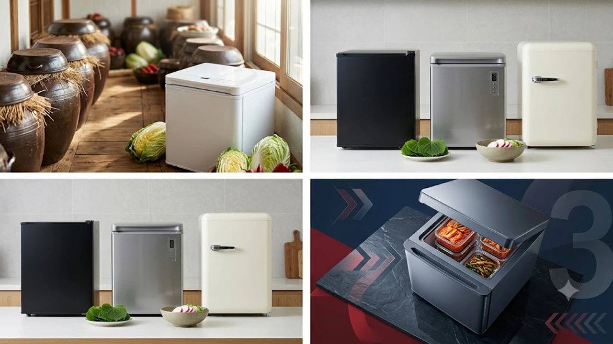

추석 명절을 앞두고 본가에서 보내준 김치통과 갈비 세트가 도착하면 냉장고 문을 열 때마다 한숨부터 나옵니다. 1\~2인 가구 원룸이나 소형 평수 아파트에서는 800L 대형 냉장고를 추가로 들여놓을 공간도, 100만 원이 훌쩍 넘는 김치냉장고를 살 여유도 부족합니다. 그렇다고 일반 냉장고에 김치를 보관하면 보름도 안 돼 시어 터지거나 냉장고 안 전체에 냄새가 배어버립니다.

이런 고민을 단번에 해결해 주는 대안이 바로 **미니 김치냉장고**입니다. 틈새 공간만 있으면 쏙 들어가고, 정밀한 정온 유지 기술로 김치 아삭함을 몇 달 동안 그대로 유지해 줍니다. 


---

## 1. 지금 미니 김치냉장고가 뜨는 이유

매년 9월 중순 추석 시즌부터 11월 김장철까지는 소형 저장 가전의 판매량이 1년 중 가장 가파르게 치솟는 시점입니다. 일반 냉장고는 문을 여닫을 때마다 내부 온도가 3\~5도 이상 요동치면서 김치가 금방 익어버립니다. 반면 김치 전용 냉각 장치는 냉기를 내부 벽면 전체로 감싸는 직접 냉각 방식을 채택해 내부 온도 편차를 1도 이내로 묶어둡니다.

여기에 2030 1인 가구의 라이프스타일 변화가 맞물렸습니다. 최근 자취방 인테리어 유행을 보면 부피가 크고 투박한 가전 대신 가구처럼 녹아드는 소형 오브제 가전이 대세입니다. 김치뿐 아니라 와인, 수제 캔맥주, 스테이크용 육류 숙성고로 겸용하는 활용법이 인스타그램 릴스와 유튜브 자취 룸투어 영상을 타고 퍼졌습니다. 평소 명절 선물 포장이나 집안일로 피로가 쌓여 [무선 종아리 마사지기 TOP3 가성비 비교](/posts/trending-picks/wireless-calf-massager-top3-2026/) 글을 찾아보며 힐링을 챙기듯, 주방에서도 불필요한 스트레스를 줄여주는 슬림 가전에 아낌없이 지갑을 여는 소비 흐름이 뚜렷합니다.

---

## 2. TOP3 상품 스펙 한눈에 보기



시중에서 가장 많이 팔리는 대표 3개 브랜드 모델을 한자리에 모았습니다. 용량, 냉각 기술, 소음 수준, 가격대를 직접 맞대어 비교했습니다.

| 모델명 | 가격대 | 핵심 스펙 | 추천 대상 |
| :--- | :--- | :--- | :--- |
| **쿠잉 레트로 미니 (CKF-100)** | 28만\~29만 원대 | 85L 용량, 직접 냉각, 38dB | 가성비와 넉넉한 수납을 원하는 자취생 |
| **미닉스 더 플랫 (MNX-KCR)** | 36만\~39만 원대 | 45L 용량, 인버터 제어, 31dB 저소음 | 원룸 침실 옆에 둘 초소형 무소음 가전 희망자 |
| **위니아 딤채 쁘띠 (WDS10GP)** | 57만\~62만 원대 | 102L 대용량, 1등급 소비효율, 정온 숙성 | 김치 맛 보존과 다용도 식자재 보관을 노리는 신혼부부 |

---

## 3. 예산대별 실전 추천 TOP3

### ① 쿠잉 레트로 미니 김치냉장고 85L (CKF-100) — 가성비 실속형

* **브랜드 / 모델명:** 쿠잉 (Cooing) / CKF-100
* **가격대:** 28만\~29만 원대
* **핵심 스펙:** 
  * 내부 실용량 85L (배추김치 4\~5포기 수납 가능)
  * 벽면 직접 냉각 방식 채택
  * 다이얼식 7단계 정밀 온도 제어 (-18℃ 냉동부터 4℃ 냉장까지 지원)
* **장점:**
  1. 20만 원대 후반 가격 대비 85L라는 여유로운 용량을 제공해 김치통뿐 아니라 대용량 음료와 반찬통까지 여유 있게 들어갑니다.
  2. 둥글둥글한 곡선 모서리와 크롬 핸들이 더해진 레트로 디자인 덕분에 칙칙한 주방 분위기를 감각적으로 바꿔줍니다.
* **단점:**
  * 컴프레서 가동 시 순간 소음이 약 38dB 수준으로 측정되어 침대 바로 옆에 배치하면 귀에 걸릴 수 있습니다.
* **추천 대상:**
  * 30만 원 이하 예산으로 명절 김치와 식재료를 넉넉하게 채워 넣을 서브 냉장고를 찾는 1인 가구.

👉 [쿠잉 레트로 미니 김치냉장고 쿠팡에서 보기](https://www.coupang.com/np/search?q=쿠잉+레트로+미니+김치냉장고&sourceType=affiliate&trackingCode=AF8691300)

---

### ② 미닉스 더 플랫 미니 김치냉장고 (MNX-KCR) — 공간 효율형

* **브랜드 / 모델명:** 미닉스 (Minix) / MNX-KCR
* **가격대:** 36만\~39만 원대
* **핵심 스펙:**
  * 가로 폭 39.5cm 초슬림 콤팩트 규격 및 실용량 45L
  * 인버터 컴프레서 기반 31dB 초저소음 설계
  * 4가지 전문 모드 탑재 (김치 강/중/약, 주류·음료 모드)
* **장점:**
  1. 두께가 얇고 바닥 면적을 거의 차지하지 않아 싱크대 옆 자투리 틈새나 거실 수납장 위에도 안정적으로 올라갑니다.
  2. 도서관 수준인 31dB 저소음 설계를 적용해 원룸 방 한가운데 놓아도 컴프레서 돌아가는 웅웅거림이 귀에 밟히지 않습니다.
* **단점:**
  * 45L 용량 한계상 전용 김치통 2\~3통(약 2\~3포기 분량)을 넣으면 공간이 꽉 차 대량 보관용으로는 부족합니다.
* **추천 대상:**
  * 좁은 원룸에서 소음 없이 조용하게 먹을 만큼의 김치와 주류만 신선하게```markdown
작성할 본문 내용의 주제나 초안을 알려주시면, 요구하신 형식에 맞춰 완성된 마크다운을 바로 생성해 드리겠습니다. 어떤 내용의 글을 준비해 드릴까요?