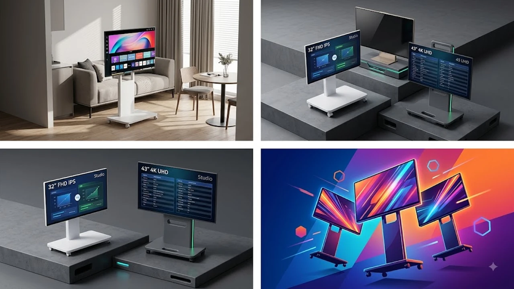

거실 소파에 앉아서 보던 유튜브 영상을 침대에 누워서 그대로 이어 보고 싶거나, 주방에서 요리하면서 OTT 시리즈를 끊김 없이 시청하고 싶은 순간이 많습니다. 하지만 벽걸이 TV는 위치를 바꿀 수 없고, 태블릿이나 스마트폰 화면은 10\~12인치 수준이라 몰입감이 떨어집니다. 이 고민을 해결해 주는 기기가 바퀴 달린 거치대와 결합한 '이동식 스마트 모니터(일명 삼탠바이미)'입니다.

초기에는 100만 원이 넘는 대기업 일체형 제품이 주류였으나, 최근에는 20만 원대 후반부터 60만 원대 예산으로 32인치 FHD 및 43인치 4K 대화면과 무빙 스탠드를 결합한 세트 상품이 실속파 자취생과 신혼부부 사이에서 선풍적인 인기를 끌고 있습니다. 복잡한 PC나 셋톱박스 연결 없이 전원 코드 하나만 꽂으면 자체 OS로 모든 콘텐츠를 재생할 수 있는 2026년 이동식 스마트 모니터 대표 모델 3종을 명확한 수치 기반으로 비교합니다.

---

## 1. 지금 이동식 스마트 모니터가 뜨는 이유

원룸이나 투룸 같은 소형 주거 공간에서는 가전제품 하나가 차지하는 바닥 면적이 큽니다. 거실 벽면을 고정 점유하는 대형 TV 대신, 필요할 때만 끌어다 쓰고 평소에는 구석으로 밀어둘 수 있는 무빙 스크린이 공간 효율성 면에서 실용적입니다.

여기에 32인치 FHD부터 43인치 4K UHD까지 고해상도 패널 보급이 확산되면서, 100만 원대 고가 일체형 제품 대비 50\~70% 수준의 비용으로 선명하고 넓은 화면을 확보할 수 있게 되었습니다. 스마트폰 미러링(삼성 스마트뷰, 애플 에어플레이 2), 홈 트레이닝 보조 화면, 콘솔 게임기 및 노트북 서브 모니터 연동 등 단일 기기로 누릴 수 있는 활용 범위가 넓다는 점도 가파른 수요 증가의 원인입니다.

퇴근 후 침대에 누워 [무선 종아리 마사지기 TOP3 가성비 비교](/posts/trending-picks/wireless-calf-massager-top3-2026/) 글에서 소개한 마사지기를 착용한 채, 눈높이에 맞춘 이동식 스마트 모니터로 드라마를 감상하는 형태가 1인 가구의 표준 휴식 패턴으로 정착했습니다.

---

## 2. 이동식 스마트 모니터 TOP3 스펙 비교

| 모델명 | 가격대 | 핵심 스펙 | 추천 대상 |
| :--- | :--- | :--- | :--- |
| **삼성전자 스마트모니터 M7 S43DM700 패키지** | 64만\~68만 원대 | 43인치 4K UHD / Tizen OS / USB-C 65W PD | 애플·갤럭시 기기 연동 및 노트북 충전 겸용 사용자 |
| **더함 43인치 4K 구글TV 이동식 세트** | 42만\~46만 원대 | 43인치 4K UHD / Google TV / 20W 돌비 사운드 | 40만 원대 예산으로 4K 대화면 OTT 감상에 집중할 구매자 |
| **한성컴퓨터 스마트 TFG32F07W 무빙패키지** | 28만\~31만 원대 | 32인치 FHD / 178도 광시야각 IPS / 안드로이드 OS | 20만 원대 예산으로 좁은 원룸 침대 옆에 둘 서브 스크린 구매자 |

---

## 3. 예산대별 추천 모델 3선

### ① 프리미엄 완성형: 삼성전자 스마트모니터 M7 43인치 무빙패키지 (S43DM700)
* **가격대:** 64만 원 \~ 68만 원대 (전용 무빙 스탠드 포함 세트 기준)
* **핵심 스펙:**
  * 화면 크기 및 해상도: 43인치(108cm) 4K UHD (3840 x 2160, 300nits 밝기)
  * 탑재 OS: 삼성 Tizen OS (스마트싱스 홈 IoT 허브, 삼성 TV Plus 무료 채널 탑재)
  * 연결 인터페이스: USB-C 1개 (4K 화면 출력 + 65W PD 급속 충전 동시 지원), HDMI 2.0 2개, USB-A 3개
* **장점:**
  * 갤럭시 스마트뷰와 아이폰·아이패드 에어플레이 2를 지연 시간 없이 무선 연결합니다.
  * 노트북을 C타입 단일 케이블로 연결하면 충전과 동시에 43인치 4K 보조 모니터로 화면이 전환되어 재택근무 편의성을 높입니다.
* **단점:**
  * 중소기업 구글 TV 패키지 대비 초기 구매 비용이 20만 원 이상 더 듭니다.
* **이런 사람에게 추천:** 스마트폰과 노트북 연동 빈도가 높고 대기업 AS망과 안정적인 OS 환경을 요구하는 직장인.

👉 [삼성전자 스마트모니터 M7 43인치 무빙패키지 쿠팡에서 보기](https://www.coupang.com/np/search?q=삼성전자+스마트모니터+M7+43인치+무빙패키지&sourceType=affiliate&trackingCode=AF8691300)

---

### ② 가성비 밸런스형: 더함 43인치 4K 구글TV 이동식 세트 (UA431UHD)
* **가격대:** 42만 원 \~ 46만 원대 (히든 휠 이동형 스탠드 결합 세트)
* **핵심 스펙:**
  * 화면 크기 및 해상도: 43인치 4K UHD (3840 x 2160, HDR10 및 돌비 비전 지원)
  * 탑재 OS: Google TV OS (구글 플레이 스토어 앱 설치 지원, 크롬캐스트 내장)
  * 오디오 출력: 20W (10W + 10W) 스테레오 스피커 (돌비 애트모스 튜닝)
* **장점:**
  * 40만 원대 초중반 가격으로 43인치 대화면 4K 화질과 구글 TV 전용 UI를 이용할 수 있습니다.
  * 음성 인식률이 높은 구글 어시스턴트 리모컨을 통해 타이핑 없이 유튜브와 영화를 검색합니다.
* **단점:**
  * 전원을 켤 때 첫 화면 진입까지 약 3\~4초가 소요되어 구동 속도가 대기업 제품보다 한 박자 느립니다.
* **이런 사람에게 추천:** 넷플릭스, 디즈니+, 유튜브 등 순수 영상 스트리밍 콘텐츠 감상에 집중하는 가성비 위주 구매자.

👉 [더함 43인치 4K 구글TV 이동식 세트 쿠팡에서 보기](https://www.coupang.com/np/search?q=더함+43인치+4K+구글TV+이동식+세트&sourceType=affiliate&trackingCode=AF8691300)

---

### ③ 콤팩트 입문형: 한성컴퓨터 스마트 TFG32F07W 무빙패키지
* **가격대:** 28만 원 \~ 31만 원대
* **핵심 스펙:**
  * 화면 크기 및 해상도: 32인치(80.1cm) FHD (1920 x 1080)
  * 패널: 상하좌우 178도 광시야각 IPS 패널 (75Hz 주사율)
  * 탑재 OS: Android TV OS (구글 플레이 및 넷플릭스·유튜브 기본 지원)
* **장점:**
  * IPS 패널을 채택하여 침대에 누워 올려다보거나 바닥에 앉아서 볼 때도 색 왜곡이 없습니다.
  * 32인치 규격이라 좁은 원룸 침대 옆 틈새 공간(너비 75cm 확보 시)에도 간섭 없이 배치할 수 있습니다.
* **단점:**
  * 해상도가 FHD에 머물러 있어 1m 이내 근거리에서 작은 텍스트를 읽을 때 4K 대비 픽셀 입자가 보입니다.
* **이런 사람에게 추천:** 43인치 대형 화면 배치가 부담스러운 6\~8평 원룸 거주자 및 20만 원대 예산으로 이동형 TV를 맞추려는 자취생.

👉 [한성컴퓨터 스마트 TFG32F07W 무빙패키지 쿠팡에서 보기](https://www.coupang.com/np/search?q=한성컴퓨터+스마트+TFG32F07W+무빙패키지&sourceType=affiliate&trackingCode=AF8691300)

---

## 4. 구매 전 반드시 확인할 체크포인트

이동식 스마트 모니터는 일반 TV와 달리 디스플레이와 스탠드가 결합된 가변형 가전이므로 아래 3가지 항목을 확인해야 선택 실수를 방지할 수 있습니다.

1. **시청 거리별 인치 수 기준:**
   침대 헤드나 책상 옆 1m 안팎 거리에서 시청한다면 32인치 FHD가 시야각 분산 없이 적합합니다. 거실 소파나 주방 식탁 등 2m 이상 떨어진 위치에서 시청한다면 43인치 4K UHD 모델을 골라야 자막 뭉개짐 없이 선명하게 볼 수 있습니다.

2. **스탠드 베이스 무게(최소 10kg 이상)와 저소음 우레탄 바퀴:**
   43인치 화면 본체 무게는 8\~10kg에 달하므로, 하부 원형 받침대 무게가 10\~12kg 이상으로 묵직해야 문턱을 넘을 때 넘어지지 않습니다. 층간소음과 장판 긁힘을 막기 위해 연질 우레탄 소재의 히든 캐스터(매립형 바퀴)인지 확인해야 합니다.

3. **기둥 내부 전원선 매립(인터널 와이어링) 구조:**
   모니터 뒷면 케이블이 외부로 노출되면 이동 중 바퀴에 선이 밟혀 단선될 위험이 큽니다. 스탠드 파이프 내부로 전원선을 통과시켜 하단 베이스로 배출하는 선 매립형 디자인인지 점검하는 것이 깔끔한 외관을 유지하는 핵심입니다.

생활 공간의 동선과 편의성을 함께 높이고 싶다면 [트렌드 상품 추천 TOP3](/posts/trending-picks/trending-picks-20260727/) 및 바닥 관리를 돕는 [창문 로봇청소기 TOP3 추천 가성비 비교](/posts/trending-picks/smart-window-cleaner-robot-top3-2026/) 글도 함께 확인해 보시기 바랍니다.

---

> 이 포스팅은 쿠팡 파트너스 활동의 일환으로, 이에 따른 일정액의 수수료를 제공받습니다.

#트렌드상품 #쿠팡추천 #이동식스마트모니터 #삼탠바이미 #스마트모니터추천 #무빙TV #원룸인테리어 #자취필수템