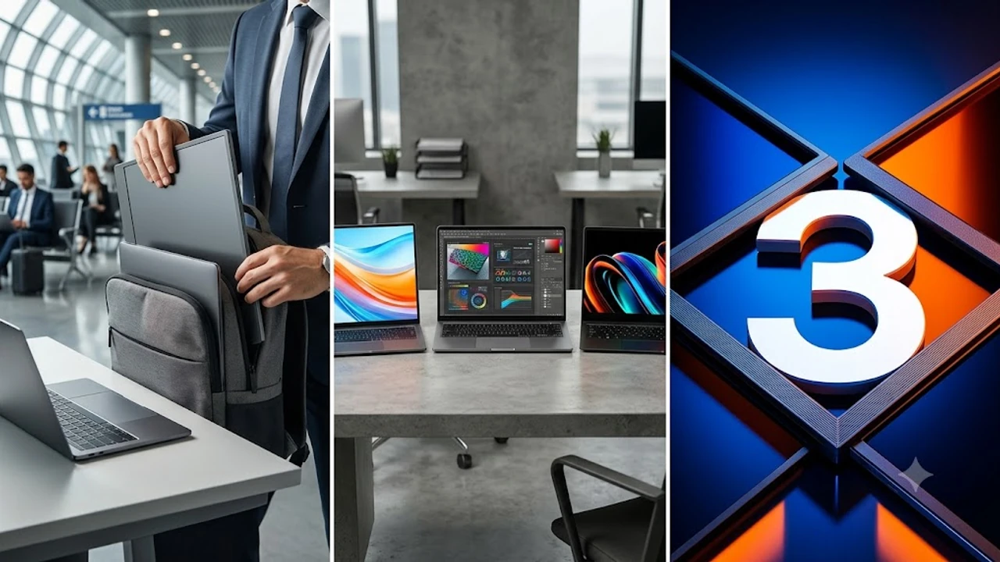

노트북 작은 화면 하나로 엑셀과 웹 브라우저를 번갈아 띄우며 일하다 보면 작업 흐름이 끊기기 일쑤입니다. 카페나 공유오피스, 출장지에서도 사무실 듀얼 모니터 환경을 그대로 재현하고 싶다면 C타입 케이블 하나로 바로 켜지는 포터블 모니터가 확실한 해결책이 됩니다.

## 1. 지금 포터블 모니터가 뜨는 이유

원격 근무와 거점 오피스 출근이 자리 잡으면서 무거운 외장 모니터 대신 가방에 쏙 들어가는 보조 화면을 찾는 직장인이 늘었습니다.

가장 큰 변화는 연결 방식입니다. 과거처럼 별도 전원 어댑터와 두꺼운 HDMI 선을 챙길 필요 없이, USB-C DP-Alt 단일 케이블로 전원 공급과 영상 출력을 동시에 끝냅니다. 스마트폰을 연결하면 삼성 DeX 모드로 미니 PC처럼 쓸 수 있고, 닌텐도 스위치나 스팀덱 같은 휴대용 게임기 화면도 시원하게 키워줍니다.

여기에 10만 원대 초중반까지 진입한 16인치 2.5K(QHD) 144Hz 패널의 가격 파괴가 더해지며 가성비 서브 모니터 시장이 빠르게 커지고 있습니다. 장시간 문서 작업 시 피로도를 줄여주는 [2026 무선 버티컬 마우스 추천 TOP3](/posts/trending-picks/wireless-vertical-mouse-top3-2026/)와 함께 노마드 작업 필수 세팅으로 꼽힙니다.

## 2. TOP3 대표 상품 스펙 비교

| 모델명 | 가격대 | 핵심 스펙 | 추천 대상 |
| :--- | :--- | :--- | :--- |
| **제우스랩 Z16P Pro** | 12만\~14만 원대 | 16인치 2.5K(2560x1600) / 144Hz / 500nits / sRGB 100% | 극가성비로 QHD 고해상도·고주사율을 원하는 사용자 |
| **주연테크 캐리뷰 V16FPGA-144** | 18만\~20만 원대 | 16인치 WQXGA / 144Hz / 400nits / 무게 750g | 신속한 국내 공식 AS와 안정성을 중시하는 직장인 |
| **한성컴퓨터 TFX156T OLED** | 25만\~28만 원대 | 15.6인치 FHD OLED / 10포인트 터치 / DCI-P3 100% | 정확한 색감과 터치 조작이 필수적인 크리에이터 |

---

### ① 제우스랩 Z16P Pro (16인치 2.5K 144Hz)

가성비 포터블 모니터 열풍을 이끈 대표 모델입니다. 12만\~14만 원대 가격에 2.5K 고해상도와 144Hz 주사율을 갖췄습니다.

* **브랜드/모델:** 제우스랩(ZEUSLAP) / Z16P Pro
* **가격대:** 12만\~14만 원대
* **핵심 스펙:** 16인치 16:10 비율(2560x1600), 144Hz 주사율, 500nits 밝기, sRGB 100%
* **장점:**
  * 16:10 화면비 덕분에 세로 문서나 코드 열람 시 스크롤 횟수가 줄고 작업 영역이 넓습니다.
  * 500nits 밝기로 채광이 강한 카페 창가 자리에서도 화면이 선명합니다.
* **단점:**
  * 기본 번들 스탠드 커버의 지지력이 약해 별도 알루미늄 거치대를 써야 안정적으로 고정됩니다.
* **이런 사람에게 추천:**  
  직구 배송 대기 기간을 감수하더라도 10만 원대 초반에 QHD 144Hz 사양을 맞추고 싶은 사용자.

👉 [제우스랩 Z16P Pro 쿠팡에서 보기](https://www.coupang.com/np/search?q=제우스랩+Z16P+Pro&sourceType=affiliate&trackingCode=AF8691300)

---

### ② 주연테크 캐리뷰 V16FPGA-144 (16인치 고주사율)

직구 제품의 사후지원 불안을 덜어내는 국내 정식 유통 모델입니다. 주연테크 본사 1년 무상 보증을 제공합니다.

* **브랜드/모델:** 주연테크 / 캐리뷰 V16FPGA-144
* **가격대:** 18만\~20만 원대
* **핵심 스펙:** 16인치 WQXGA(2560x1600), 144Hz 주사율, 400nits 밝기, 본체 실측 무게 750g
* **장점:**
  * 국내 서비스센터를 통해 초기 불량 교환과 패널 AS 처리가 빠릅니다.
  * 750g 가벼운 무게와 슬림 베젤 덕분에 일반 15\~16인치 백팩 노트북 수납칸에 바로 들어갑니다.
* **단점:**
  * 내장 듀얼 스피커의 저음 출력이 부족해 영상 편집이나 음악 감상 시 이어폰 연결이 필요합니다.
* **이런 사람에게 추천:**  
  회사 업무용 지출 증빙이 필요하거나, 기기 이상 시 즉각적인 국내 AS 처리를 원하는 직장인.

👉 [주연테크 캐리뷰 V16FPGA-144 쿠팡에서 보기](https://www.coupang.com/np/search?q=주연테크+캐리뷰+V16FPGA-144&sourceType=affiliate&trackingCode=AF8691300)

---

### ③ 한성컴퓨터 TFX156T OLED 포터블 (15.6인치 터치)

스펙과 화질 완성도를 높인 OLED 패널 탑재 모델입니다.

* **브랜드/모델:** 한성컴퓨터 / TFX156T OLED
* **가격대:** 25만\~28만 원대
* **핵심 스펙:** 15.6인치 FHD(1920x1080) OLED 패널, 10포인트 정전식 터치, DCI-P3 100%, 100,000:1 명암비
* **장점:**
  * OLED 특유의 완벽한 블랙 표현과 DCI-P3 100% 색재현율로 사진·영상 보정 시 정확한 톤을 확인합니다.
  * 10포인트 멀티터치를 지원해 스마트폰 연동 화면을 태블릿처럼 손가락으로 바로 제어합니다.
* **단점:**
  * 텍스트 위주 문서 작업 시 WQXGA 고해상도 패널 대비 FHD 해상도의 글자 가독성이 다소 떨어집니다.
* **이런 사람에게 추천:**  
  영상·사진 컬러 그레이딩 작업을 하거나 스마트폰 DeX 화면을 태블릿처럼 터치 조작하고 싶은 사용자.

👉 [한성컴퓨터 TFX156T OLED 쿠팡에서 보기](https://www.coupang.com/np/search?q=한성컴퓨터+TFX156T+OLED&sourceType=affiliate&trackingCode=AF8691300)

---

## 3. 예산대별 추천 선택 기준

* **10만 원 초반대 — 극가성비:** `제우스랩 Z16P Pro`  
  문서 작성과 웹서핑, 서브 화면 목적이라면 12\~14만 원대로 2.5K 144Hz를 쓸 수 있는 이 모델이 합리적입니다.
* **10만 원 후반대 — AS 보증 밸런스:** `주연테크 캐리뷰 V16FPGA-144`  
  고주사율·고해상도 스펙을 유지하면서 국내 정식 무상 보증 1년을 확보해 업무용으로 안전합니다.
* **20만 원 중후반대 — 화질·터치 중심:** `한성컴퓨터 TFX156T OLED`  
  IPS 패널이 내지 못하는 100,000:1 명암비와 터치 인터페이스가 필수라면 예산을 올려 OLED 모델을 선택하는 것이 맞습니다.

다른 가성비 테크 기기와 작업 환경 아이템 정보는 [트렌드 상품 추천 TOP3](/posts/trending-picks/trending-picks-20260727/) 글에서도 확인할 수 있습니다.

## 4. 구매 전 반드시 확인할 체크포인트

* **디바이스 Type-C DP-Alt 지원 확인:**  
  노트북이나 스마트폰의 C타입 포트가 화면 출력(DP-Alt Mode)을 지원해야 케이블 하나로 화면이 켜집니다. C타입 포트 옆에 디스플레이(D) 아이콘이나 번개(썬더볼트) 각인이 있는지 확인해야 합니다.
* **외부 전원 공급(PD 30W 이상 충전기 연결):**  
  노트북 배터리 전원만으로 모니터를 켜면 밝기가 30\~50% 수준으로 자동 제한됩니다. 최대 밝기(400\~500nits)를 쓰려면 30W 이상 PD 충전기를 모니터 전원 단자에 꽂아야 합니다.
* **화면비와 해상도 규격:**  
  문서·엑셀·코딩 작업 비중이 높다면 16:10 비율(2560x1600)을 선택하는 편이 유리합니다. 16:9 비율(1920x1080) 대비 세로 작업 영역이 약 11% 더 넓어 데이터 확인이 수월합니다.
* **VESA 홀 및 거치 규격(75x75mm):**  
  기본 자석 커버는 거치 각도 조절 폭이 좁습니다. 모니터 암 장착이나 세로 피벗 거치를 원한다면 75x75mm VESA 홀 유무를 반드시 확인해야 합니다.

---

> 이 포스팅은 쿠팡 파트너스 활동의 일환으로, 이에 따른 일정액의 수수료를 제공받습니다.

#트렌드상품 #쿠팡추천 #포터블모니터 #휴대용모니터 #서브모니터 #보조모니터 #제우스랩 #주연테크캐리뷰 #한성모니터