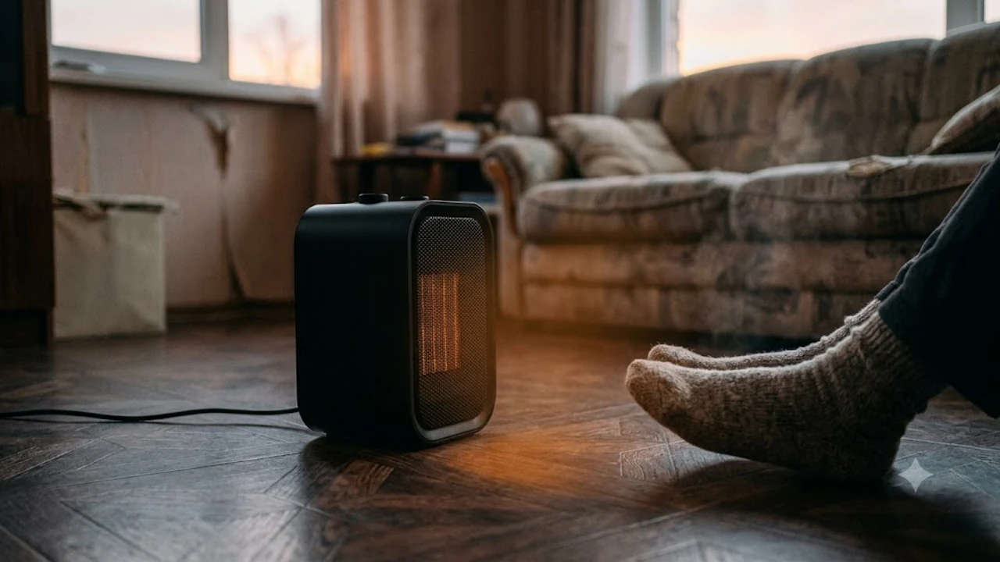

9월 말 아침저녁 기온이 15도 안팎으로 떨어지며 보일러를 틀기엔 과하고 그대로 버티기엔 손발이 시린 계절이 찾아왔다. 책상 아래나 침대 옆 1m 반경에 집중적으로 열기를 채워줄 컴팩트 난방기를 장만할 시점이다.

## 1. 2026 가을 미니 팬히터 검색량이 폭증하는 이유

환절기는 실내 난방 전환기다. 아파트 중앙난방이 가동되기 전이나 가스비 부담으로 보일러 가동을 미루는 시기에 1인 전용 소형 발열 기기를 찾는 수요가 급증한다.

가을 단풍 캠핑과 차박 수요도 맞물린다. 전국 오토캠핑장 사이트 규격은 소비전력 600W 이하로 제한되어 있어, 고출력 히터를 연결하면 캠핑장 차단기가 작동한다. 따라서 450W\~500W 내외로 작동하는 캠핑용 저전력 히터는 필수 준비물이다.

PTC(Positive Temperature Coefficient) 세라믹 발열 방식이 표준으로 자리 잡았다. 과거 니크롬선 열선 방식과 달리 산소 연소 과정이 없어 일산화탄소 배출 위험이 없다. 전원 버튼을 누른 뒤 3초 안에 최대 열량에 도달해 밀폐된 텐트나 원룸 데스크 아래에서 쓰기에 안전하다. 장시간 컴퓨터 작업으로 굳은 손목과 관절을 풀기 위해 [2026 무선 버티컬 마우스 추천 TOP3](/posts/trending-picks/wireless-vertical-mouse-top3-2026/)와 함께 데스크톱 셋업을 구성하는 추세다.

## 2. TOP3 미니 온풍기 핵심 스펙 비교

실제 쿠팡에서 판매 수량과 사용자 검증을 마친 대표 3종 모델의 핵심 제원이다.

| 모델명 | 가격대 | 핵심 스펙 | 추천 대상 |
| :--- | :--- | :--- | :--- |
| **툴콘 캠핑용 미니 팬히터 TP-500V** | 24,000원\~28,000원 | 1단 450W / 2단 800W, 무게 800g, 과열방지 바이메탈 | 오토캠핑장 600W 규격 준수, 초경량 배낭 패킹 |
| **신일 미니 PTC 온풍기 SEH-P800** | 43,000원\~49,000원 | 1단 800W / 2단 1,200W, 전도 안전센서, 3초 급속 발열 | 재택근무 데스크 발밑 난방, 원룸 서브 난방 |
| **샤오미 스마트 타워 팬히터 LPN-1** | 82,000원\~89,000원 | 최대 2,000W, 좌우 70도 자동 회전, Mi Home 원격 제어 | 4\~5평 침실 공기 대류 난방, 스마트홈 자동화 |

## 3. 예산대별 추천 모델 3종 상세 분석

### 툴콘 캠핑용 미니 팬히터 TP-500V
* **가격대:** 2만원대 중반
* **핵심 스펙:** 소비전력 1단 450W / 2단 800W, 중량 800g, 외형 130 x 95 x 180mm
* **장점:** 
  1. 1단 세팅 시 450W로 제한되어 전국 600W 규격 캠핑장 차단기 트립 현상을 방지한다.
  2. 본체 무게가 800g에 불과해 캠핑용 수납 가방이나 백팩에 부담 없이 들어간다.
* **단점:** 풍량 조절 단계가 세분화되지 않아 텐트 내부가 좁으면 1단에서도 건조감이 빠르게 발생한다.
* **이런 사람에게 추천:** 가을 캠핑이나 차박을 즐기며 사이트 허용 전력 기준을 반드시 지켜야 하는 야외 활동자.
* **구매 링크:** [툴콘 캠핑용 미니 팬히터 TP-500V 쿠팡에서 보기](https://www.coupang.com/np/search?q=툴콘+캠핑용+미니+팬히터+TP-500V&sourceType=affiliate&trackingCode=AF8691300)

---

### 신일 미니 PTC 온풍기 SEH-P800
* **가격대:** 4만원대 중후반
* **핵심 스펙:** 소비전력 1단 800W / 2단 1,200W, 3초 쾌속 히팅 코어, 소음 수치 42dB
* **장점:** 
  1. 바닥 접점 전도 오프 스위치를 내장해 본체가 15도 이상 기울어지면 즉각 전원이 차단된다.
  2. 세라믹 코어 토출구 설계로 예열 시간 없이 전원 인가 즉시 온풍을 전달한다.
* **단점:** 2단 구동(1,200W)을 하루 4시간 이상 유지할 경우 누진세 단계 진입으로 전기료 부담이 늘어난다.
* **이런 사람에게 추천:** 재택근무 데스크 아래 발밑 냉기를 없애고 전국 서비스센터 사후지원을 선호하는 1인 가구.
* **구매 링크:** [신일 미니 PTC 온풍기 SEH-P800 쿠팡에서 보기](https://www.coupang.com/np/search?q=신일+미니+PTC+온풍기+SEH-P800&sourceType=affiliate&trackingCode=AF8691300)

---

### 샤오미 스마트 타워 팬히터 LPN-1
* **가격대:** 8만원대
* **핵심 스펙:** 최대 소비전력 2,000W, 좌우 70도 와이드 회전, 저소음 팬 구동 38dB
* **장점:** 
  1. 좌우 70도 자동 회전 기능으로 공기를 실내 상하좌우로 순환시켜 난방 불감 지대를 없앤다.
  2. 스마트폰 Mi Home 앱으로 귀가 10분 전 미리 켜두거나 타이머 일정을 지정할 수 있다.
* **단점:** 타워형 높이가 50cm를 넘어 소형 모델 대비 부피를 차지하며 보관 파우치가 기본 제공되지 않는다.
* **이런 사람에게 추천:** 발밑 국소 부위 난방을 넘어 4\~5평 방 전체의 훈기를 일정하게 유지하려는 스마트홈 사용자. 가을철 찬 공기로 무릎 관절 통증을 함께 관리한다면 [무선 무릎 마사지기 TOP3 비교 추천](/posts/trending-picks/wireless-knee-massager-top3-2026/) 글도 참고할 만하다.
* **구매 링크:** [샤오미 스마트 타워 팬히터 LPN-1 쿠팡에서 보기](https://www.coupang.com/np/search?q=샤오미+스마트+타워+팬히터+LPN-1&sourceType=affiliate&trackingCode=AF8691300)

## 4. 구매 전 반드시 확인할 체크포인트

첫째, 사용 공간별 전력 제한 확인이다. 오토캠핑장은 법적 기준 사이트당 600W 제한이 걸려 있으므로 1단 구동 500W 이하 제품이 필수다. 일반 가정용은 800W\~1,200W 수준이면 발밑 냉기 차단용으로 적합하다.

둘째, 물리적 전도 안전장치 탑재 여부다. 작동 중 발로 차거나 반려동물이 밀어 기기가 넘어졌을 때 센서가 바닥 이탈을 감지해 0.1초 내로 전원을 끊는 덤블링 스위치(전도 스위치) 유무를 살펴야 화재 사고를 방지한다.

셋째, 작동 소음과 토출구 재질이다. 조용한 사무실이나 취침 공간에서 사용한다면 소음 수치가 45dB 이하인지 확인해야 한다. 플라스틱 그릴 대신 내열 난연성 소재와 금속 세라믹 메쉬망을 채택했는지 점검해야 장시간 사용 시 플라스틱 타는 냄새가 나지 않는다.

---

> 이 포스팅은 쿠팡 파트너스 활동의 일환으로, 이에 따른 일정액의 수수료를 제공받습니다.

#트렌드상품 #쿠팡추천 #미니온풍기팬히터 #소형팬히터 #캠핑용팬히터 #PTC온풍기 #책상발난로 #가을캠핑난방용품