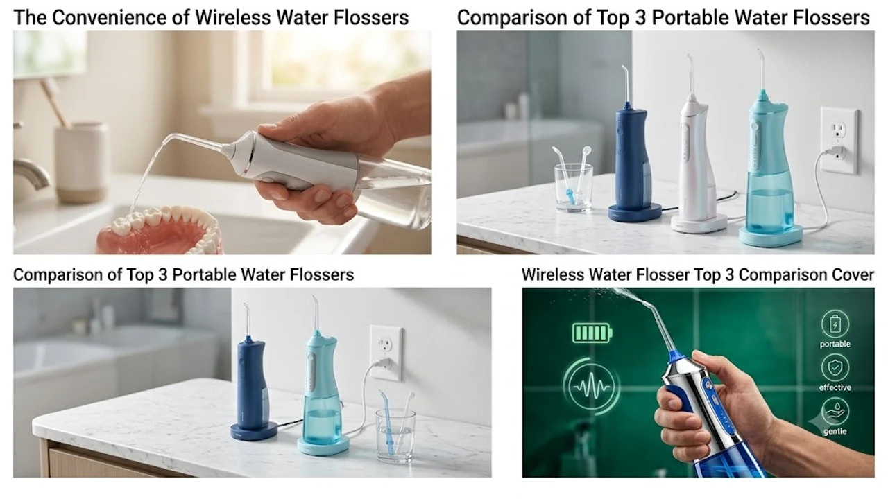

식후 치실질을 매번 챙기기 번거롭다면 물치실로 불리는 휴대용 무선 구강세정기가 가장 확실한 대안입니다. 칫솔모가 닿지 않는 치간 틈새와 잇몸 포켓의 고춧가루, 고기 찌꺼기를 강력한 미세 맥동 수류로 단 1분 만에 털어냅니다. 

최근 출시된 무선 제품들은 무겁고 자리 차지하던 거치형 물통을 없애고, 텀블러 크기의 본체에 C타입 충전 포트와 IPX7 완전 방수 설계를 기본 탑재해 사무실이나 헬스장, 출장지에서도 간편하게 쓸 수 있습니다. 일상 건강 관리를 위해 [무선 종아리 마사지기 TOP3 가성비 비교](/posts/trending-picks/wireless-calf-massager-top3-2026/)나 [트렌드 상품 추천 TOP3](/posts/trending-picks/trending-picks-20260727/) 글을 찾는 분들 사이에서도 위생 케어 필수템으로 손꼽힙니다. 실사용 후기와 스펙 검증을 거친 대표 3종을 정리했습니다.

---

## 1. 지금 무선 구강세정기가 대세인 이유

* **'식후 1분 셀프 치주 케어'의 일상화:** 손가락을 깊숙이 넣어 치실을 당기는 번거로움 없이, 노즐을 치아 사이에 대고 버튼만 누르면 이물질을 직관적으로 밀어냅니다.
* **치아 교정기 및 보철물 관리:** 브라켓 틈새나 임플란트 주변 치주포켓에 끼는 음식물은 일반 칫솔질로 제거하기 어렵기 때문에 치과에서도 구강세정기 병행 사용을 권장합니다.
* **배터리 효율과 방수 기술 안정화:** 1회 완전 충전 시 하루 2회 기준 3\~4주 연속 사용이 가능하며, 샤워 중에도 그대로 들고 쓸 수 있는 IPX7 완전 방수가 표준으로 자리 잡았습니다.

---

## 2. 무선 구강세정기 추천 TOP3 스펙 비교

실제 사용성에서 가장 호평받는 3개 모델의 핵심 규격과 타깃을 표로 대조했습니다.

| 모델명 | 가격대 | 핵심 스펙 | 추천 대상 |
| :--- | :--- | :--- | :--- |
| **샤오미 미지아 휴대용 2세대 (MEO705)** | 3만 원대 초반 | 140ml 슬라이딩 수조 / 140psi 수압 / 1,400회 맥동 | 파우치 휴대 필수인 직장인·학생 |
| **오아 클린이워터 B UV (OA-ET001)** | 5만 원대 중반 | 200ml 분리형 수조 / UV 살균 노즐캡 / 3단계 수압 | 곰팡이·위생 걱정 없는 표준형 찾는 분 |
| **필립스 소닉케어 무선 파워플로서 3000 (HX3826/31)** | 11만\~12만 원대 | 쿼드스트림 4방향 분사 / 250ml / 2개 세정 모드 | 잇몸이 약하거나 교정 브라켓 세척이 급한 분 |

---

## 3. 예산 및 용도별 TOP3 상세 리뷰

### 1) 샤오미 미지아 휴대용 구강세정기 2세대 (MEO705)
주머니나 파우치에 들어가는 초소형 슬라이딩 설계를 채택한 엔트리 모델입니다. 본체를 아래로 당기면 140ml 물통이 확장되고, 노즐을 본체 상단에 수납할 수 있어 외출 시 짐을 최소화합니다.

* **핵심 스펙:** 분당 1,400회 맥동수, 140psi 수압 제어 칩, 완충 시 약 30일 사용 가능
* **장점:** 
  * 접었을 때 스마트폰보다 작은 부피로 사무실이나 외식 자리 휴대성이 뛰어납니다.
  * 3만 원대 가격 대비 안정적인 정전압 펌프를 탑재해 배터리가 닳아도 수압이 급격히 떨어지지 않습니다.
* **단점:** 
  * 140ml 용량 특성상 구강 전체를 구석구석 세정하려면 중간에 물을 1\~2회 보충해야 합니다.
* **추천 대상:** 가방 무게를 줄이고 싶은 보급형 입문자, 점심 식후 가볍게 쓸 서브 구강세정기를 찾는 직장인.
* **구매처:** [샤오미 미지아 휴대용 구강세정기 2세대 쿠팡에서 보기](https://www.coupang.com/np/search?q=샤오미+미지아+휴대용+구강세정기+2세대&sourceType=affiliate&trackingCode=AF8691300)

### 2) 오아 클린이워터 B UV 무선 구강세정기 (OA-ET001)
국내 사용자들이 가장 민감하게 생각하는 '물때와 세균 번식' 문제를 해결한 밸런스형 제품입니다. 노즐 보관캡에 자외선(UV-C) 살균 LED를 내장해 젖은 팁을 보관해도 세균 증식을 억제합니다.

* **핵심 스펙:** 200ml 완전 분리형 수조, 분당 최대 1,800회 맥동수, 3가지 맞춤 세정 모드(소프트/노멀/펄스)
* **장점:** 
  * 수조가 밑판까지 통째로 분리되어 내부 물때와 침전물을 손이나 브러시로 직접 닦아낼 수 있습니다.
  * UV LED 살균 케이스 일체형이라 습한 욕실에 보관해도 위생적입니다.
* **단점:** 
  * 샤오미에 비해 바디 두께감이 있어 작은 파우치에는 수납이 빡빡합니다.
* **추천 대상:** 물통 청소 위생을 1순위로 두는 분, 가족 공용으로 노즐만 바꿔가며 쓸 무선 제품을 찾는 분.
* **구매처:** [오아 클린이워터 B UV 구강세정기 쿠팡에서 보기](https://www.coupang.com/np/search?q=오아+클린이워터+B+UV+구강세정기&sourceType=affiliate&trackingCode=AF8691300)

### 3) 필립스 소닉케어 무선 파워플로서 3000 (HX3826/31)
기존 일자형 단일 물줄기가 아닌, X자 형태로 퍼져나가는 '쿼드스트림(Quad Stream)' 특허 팁을 장착한 프리미엄 기기입니다. 넓은 면적을 한 번에 감싸며 치간을 훑고 지나가므로 세정 시간이 1분 안팎으로 단축됩니다.

* **핵심 스펙:** 쿼드스트림 4방향 수류 분사 노즐, 250ml 대용량 사이드 도어 수조, 3단계 강도 조절 및 2개 모드(클린/딥클린)
* **장점:** 
  * 수류가 잇몸에 닿을 때 찌르는 통증 없이 부드럽게 감싸주어 잇몸 출혈 빈도가 현저히 낮습니다.
  * 250ml 넉넉한 수조 덕분에 한 번 급수로 추가 리필 없이 상하악 전체 세정을 끝낼 수 있습니다.
* **단점:** 
  * 10만 원이 넘는 초기 구매 비용과 정품 전용 노즐 교체 단가가 높은 편입니다.
* **추천 대상:** 치아 교정 와이어 사이 음식물 제거가 급한 분, 잇몸이 약해 날카로운 물줄기에 통증을 느끼는 분.
* **구매처:** [필립스 소닉케어 무선 파워플로서 3000 쿠팡에서 보기](https://www.coupang.com/np/search?q=필립스+소닉케어+무선+파워플로서+3000&sourceType=affiliate&trackingCode=AF8691300)

---

## 4. 무선 구강세정기 실패 없이 고르는 체크포인트

* **수조 분리 및 세척 편의성:** 물을 항상 담아두는 기기 특성상, 수조 내부를 브러시로 직접 닦을 수 없는 밀폐형 모델은 피해야 합니다. 상하판 완전 개방형인지 점검하십시오.
* **수압 조절 단계와 맥동 분사 방식:** 잇몸 상태에 맞춰 강도를 낮출 수 있는 소프트 모드가 있는지, 잇몸에 무리를 주지 않는 분당 1,400\~1,800회 수준의 맥동수를 지원하는지 확인해야 합니다.
* **IPX7 완전 방수 지원 여부:** 욕실 환경에서 본체를 통째로 물세척하거나 샤워 중에 사용하려면 수심 1m에서 30분간 침수를 견디는 IPX7 등급 획득 여부를 반드시 확인해야 합니다.

---

> 이 포스팅은 쿠팡 파트너스 활동의 일환으로, 이에 따른 일정액의 수수료를 제공받습니다.

#무선구강세정기 #휴대용물치실 #구강세정기추천 #샤오미구강세정기 #오아클린이워터 #필립스파워플로서 #치아교정필수템 #구강위생용품