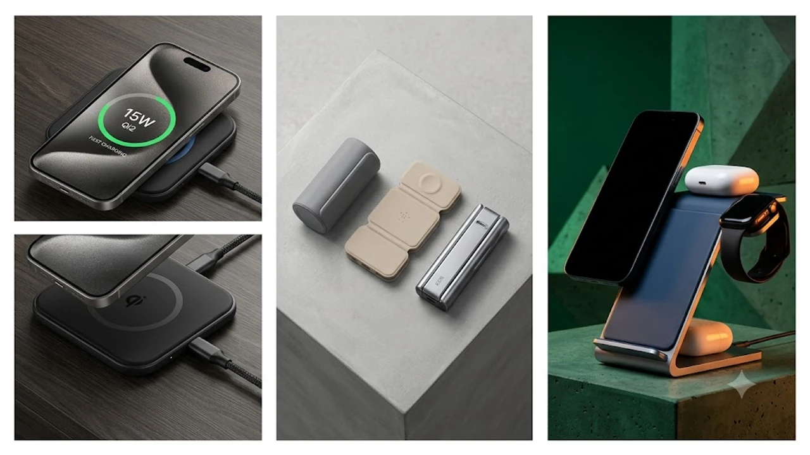

침대 협탁과 가방 속을 어지럽히던 케이블 세 줄을 주머니만 한 크기 하나로 끝내는 장비가 나왔습니다. 최근 전자기기 유저들 사이에서 구형 7.5W 무선 충전기를 처분하고 Qi2 규격 접이식 충전기로 갈아타는 흐름이 뚜렷합니다.

## 1. 지금 Qi2 폴더블 무선 충전기로 판도가 바뀐 이유

* **정품 맥세이프와 대등한 15W 충전 속도 보장:** 기존 비인증 마그네틱 무선 충전기는 아이폰 충전 시 7.5W 제한에 묶여 완충까지 3시간 이상 걸렸습니다. 새로운 글로벌 표준 규격인 Qi2 인증 칩셋은 애플 기기뿐 아니라 최신 Qi2 지원 안드로이드 기기까지 최대 15W 고속 충전을 직결합니다.
* **알루미늄 힌지 기반의 초소형 폴더블 폼팩터:** 책상 한구석을 고정형으로 차지하던 부피 큰 기둥형 3in1 스탠드와 달리, 카드뮴 힌지를 접으면 두께 2\~2.5cm 내외의 콤팩트 패드로 변형됩니다. 출장, 여행, 카페 원격 근무 시 전용 파우치나 주머니에 바로 들어갑니다.
* **발열 제어 기술 고도화:** 소형 폼팩터에서 발생하는 고질적인 열 누적을 잡기 위해 펠티어 냉각 팬이나 알루미늄 방열 설계를 직접 접목해, 고열로 인한 충전 쓰로틀링(속도 저하) 문제를 차단했습니다.

데스크 환경을 정돈하고 있다면 책상 위 선 정리를 돕는 [2026 무선 버티컬 마우스 추천 TOP3](/posts/trending-picks/wireless-vertical-mouse-top3-2026/) 글도 함께 확인해 보세요.

---

## 2. TOP3 상품 스펙 비교

| 모델명 | 실구매 가격대 | 핵심 스펙 | 추천 대상 |
| :--- | :--- | :--- | :--- |
| **앤커 MagGo 3-in-1 폴더블 (A2557)** | 11만 원\~12만 원대 | Qi2 15W / 무게 196g / 접었을 때 25mm 두께 | 완벽한 완성도와 애플워치 급속 충전을 원하는 직장인 |
| **벨킨 부스트업 프로 Qi2 3-in-1 트래블 패드** | 13만 원\~15만 원대 | Qi2 15W / 평면 패드 3분할 / 5W 워치 고속 | 프리미엄 마감과 브랜드 신뢰도를 최우선으로 두는 사용자 |
| **ESR Qi2 미니 접이식 3in1 크라이오부스트** | 6만 원\~7만 원대 | Qi2 15W / 쿨링팬 내장 / 무게 180g | 게임·영상 시청 중 발열 없는 고속 충전 가성비를 찾는 유저 |

---

## 3. 실사용 기준 TOP3 모델별 상세 분석

### 앤커 MagGo 3-in-1 폴더블 무선 충전 스테이션 (A2557)
* **가격대:** 118,000원 선
* **핵심 스펙:** 스마트폰 무선 15W + 애플워치 공식 고속충전 5W + 무선이어폰 5W / 본체 무게 196g / 3단 알루미늄 폴딩 구조
* **장점:** 
  1. 접었을 때 테니스공보다 작은 부피로 휴대성이 현존 3in1 기기 중 최상위 수준입니다.
  2. 애플 공식 인증(MFW) 모듈을 탑재해 애플워치 7세대 이후 모델을 45분 만에 0%에서 80%까지 채웁니다.
* **단점:** 
  1. 묵직한 메탈 프레임 힌지 특성상 장시간 스마트폰을 거치해 두고 폰을 세게 터치하면 미세한 흔들림이 발생합니다.
* **이런 사람에게 추천:** 출장과 여행 빈도가 잦아 파우치 하나로 폰·워치·에어팟 충전을 단번에 끝내고 싶은 미니멀리스트.

👉 [앤커 MagGo 3-in-1 폴더블 쿠팡에서 보기](https://www.coupang.com/np/search?q=앤커+MagGo+3-in-1+폴더블&sourceType=affiliate&trackingCode=AF8691300)

---

### 벨킨 부스트업 프로 Qi2 3-in-1 폴더블 트래블 패드 (WIZ026)
* **가격대:** 149,000원 선
* **핵심 스펙:** Qi2 15W 스마트폰 패드 + 5W 마그네틱 워치 퍽 + 5W Qi 패드 / 3단 병풍형 폴딩 / 프리미엄 실리콘 마감
* **장점:** 
  1. 펼쳤을 때 세 구역이 완벽히 평면으로 배치되어 기기 간 간섭이나 자석 간격 충돌이 전혀 없습니다.
  2. 벨킨 특유의 안전 제어 칩셋으로 밤새 충전해도 기기 본체와 배터리에 가해지는 열 부하가 극히 낮습니다.
* **단점:** 
  1. 세 모델 중 가장 높은 가격대이며 접었을 때 가로·세로 면적이 상대적으로 넓은 편입니다.
* **이런 사람에게 추천:** 카페 데스크나 호텔 침대 협탁 위에 안정감 있게 펼쳐두고 사용할 고급스러운 완성도를 원하는 사용자.

👉 [벨킨 부스트업 프로 Qi2 3-in-1 쿠팡에서 보기](https://www.coupang.com/np/search?q=벨킨+부스트업+프로+Qi2+3-in-1&sourceType=affiliate&trackingCode=AF8691300)

---

### ESR Qi2 미니 접이식 3in1 크라이오부스트
* **가격대:** 69,000원 선
* **핵심 스펙:** Qi2 15W 자력 거치대 + CryoBoost 냉각 팬 내장 + 5W 워치 / 무게 180g
* **장점:** 
  1. 폰 거치 패드 후면에 저소음 냉각 팬이 장착되어 여름철이나 실내 온도 25°C 이상 환경에서도 15W 최고 속도를 끝까지 유지합니다.
  2. 타사 Qi2 제품 대비 약 40% 저렴한 가격대로 가성비가 뛰어납니다.
* **단점:** 
  1. 무소음 환경(조용한 침실)에서 충전할 경우 쿨링팬이 돌아가는 미세한 구동음이 귀에 거슬릴 수 있습니다(팬 OFF 기능 지원).
* **이런 사람에게 추천:** 스마트폰으로 영상을 시청하면서 발열 스로틀링 없이 15W 고속 충전을 유지하고 싶은 실속파 구매자.

👉 [ESR Qi2 3in1 크라이오부스트 쿠팡에서 보기](https://www.coupang.com/np/search?q=ESR+Qi2+3in1+크라이오부스트&sourceType=affiliate&trackingCode=AF8691300)

충전기 거치대 틈새나 키보드 먼지를 간편하게 청소하고 싶다면 [무선 에어건 제트팬 추천 TOP3 비교](/posts/trending-picks/wireless-turbo-jet-air-duster-top3-2026/)도 함께 살펴보면 실용적입니다.

---

## 4. 실패 없는 구매 체크포인트 3가지

* **반드시 C to C 40W 이상 충전 어댑터 매칭:** 충전기 본체가 15W+5W+5W 총 25W 이상을 동시에 소모하므로, 벽면 어댑터 출력이 최소 30W(권장 40W\~65W PD) 이상이어야 세 기기 동시 고속 충전이 정상 작동합니다. 20W 구형 어댑터를 물리면 워치나 스마트폰 충전이 끊어집니다.
* **애플워치 급속 충전(Fast Charging) 지원 표기 확인:** 일반 2.5W 워치 모듈은 완충에 2시간 30분 이상 걸립니다. 정품 인증을 거친 5W 고속 규격인지 확인해야 배터리 방전 상태에서 출근 전 30분 만에 50% 이상을 확보할 수 있습니다.
* **케이스 자력 규격(Magsafe Ring):** 자력이 약한 일반 젤리 케이스를 장착한 상태에서는 거치 각도 조절 시 기기가 흘러내립니다. 최소 1,200g 이상의 자력을 가진 마그네틱 전용 링 케이스를 사용하는 것이 안전합니다.

---

> 이 포스팅은 쿠팡 파트너스 활동의 일환으로, 이에 따른 일정액의 수수료를 제공받습니다.

#트렌드상품 #쿠팡추천 #Qi2폴더블무선충전기 #맥세이프3in1 #앤커충전기 #벨킨무선충전기 #ESR충전기 #데스크테리어 #고속무선충전기