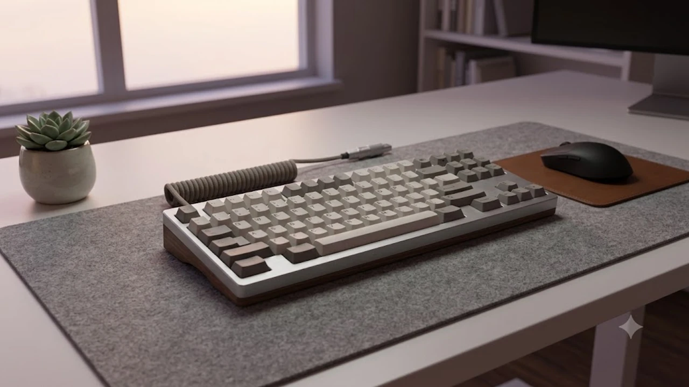

# 2026 저소음 무선키보드 TOP3 추천

사무실이나 정숙함이 필요한 카페에서 일할 때 타자 소음 때문에 눈치 본 경험, 다들 한 번쯤 있으실 겁니다. 예전에는 조용한 키보드라고 하면 밋밋한 펜타그래프나 멤브레인 키보드가 전부였지만, 지금은 상황이 완전히 달라졌습니다. 

손가락에 착 감기는 쫀득한 타건감은 그대로 유지하면서 소음만 수면실 수준으로 줄인 저소음 무선 기계식 키보드가 데스크테리어 시장의 중심에 섰습니다. 특히 최신 흡음 구조와 무선 연결 기술이 발전하면서 3만 원대 가성비 모델부터 20만 원대 풀 알루미늄 고급기까지 선택지가 넓어졌습니다. 

실제 사용자들 사이에서 타건음과 가성비로 입소문 난 인기 카테고리와 함께 [트렌드 상품 추천 TOP3](/posts/trending-picks/trending-picks-20260727/) 라인업을 둘러보시면 최신 데스크 셋업 흐름을 한눈에 파악할 수 있습니다. 2026년 기준 실구매 만족도가 높은 대표 모델 3종을 철저히 비교합니다.

---

## 1. 지금 저소음 무선키보드가 뜨는 이유

### 사무실 및 공유 오피스 소음 마찰 완벽 해결
자유로운 분위기의 오피스라도 청각적 피로감은 업무 효율을 떨어뜨리는 주범입니다. 기존 기계식 키보드의 '찰칵'거리는 청축이나 '달칵'거리는 갈축은 옆 사람에게 큰 스트레스를 주곤 했습니다. 최근 출시되는 저소음 리니어 스위치는 도서관 기준 소음 레벨인 30\~35dB 수준으로 소리를 줄여주므로 눈치 보지 않고 시원하게 타이핑할 수 있습니다.

### ASMR급 타건음 유행과 데스크테리어 열풍
SNS와 유튜브 쇼츠를 중심으로 '도각도각', '보글보글' 소리가 나는 타건음 영상이 수백만 조회수를 기록하고 있습니다. 단순히 문자를 입력하는 도구를 넘어, 일할 때 청각적·촉각적 즐거움을 주는 힐링 아이템으로 자리 잡았습니다. 

### 가스켓 구조와 다중 흡음재의 대중화
불과 1\~2년 전만 해도 수십만 원을 주고 커스텀해야 얻을 수 있었던 '가스켓(Gasket) 마운트' 설계가 3\~5만 원대 입문용 기성품에도 기본 적용되기 시작했습니다. 상하판 사이에 실리콘 패드를 넣어 통울림을 잡고 4\~5중 폼 흡음재를 깔아 잡소리를 완벽히 억제한 덕분에 적은 비용으로도 고급스러운 손맛을 누릴 수 있습니다.

---

## 2. TOP3 상품 스펙 비교

구매 전 세 가지 모델의 핵심 스펙과 가격대를 한눈에 비교해 보세요.

| 모델명 | 가격대 | 핵심 스펙 | 추천 대상 |
| :--- | :--- | :--- | :--- |
| **AULA F87 Pro (독거미)** | 3만 원대 \~ 5만 원대 | - 5중 레이어 포론/IXPE 흡음 구조 - 2.4GHz 무선 / BT 5.0 / C타입 유선 - 4,000mAh 대용량 배터리 | 압도적인 가성비와 쫀득한 타건감을 원하는 입문자 |
| **COX CK87 BT** | 7만 원대 \~ 9만 원대 | - 정갈한 텐키리스 오피스 디자인 - 핫스왑 지원 및 PBT 이중사출 키캡 - 3,000mAh 배터리 및 정교한 체리식 스테빌라이저 | 깔끔한 서체와 정돈된 사무용 디자인을 선호하는 직장인 |
| **Keychron Q1 Max** | 18만 원대 \~ 22만 원대 | - 풀 알루미늄 CNC 가공 바디 - 이중 가스켓 구조 및 QMK/VIA 매핑 지원 - 2.4GHz 무선 (1,000Hz 폴링레이트) 지원 | 흔들림 없는 타건감과 하이엔드 감성을 찾는 헤비 유저 |

---

## 3. 예산대별 추천 모델 3종 상세 분석

### [가성비 엔트리] AULA F87 Pro 3모드 가스켓 키보드

AULA F87 Pro는 일명 '독거미 키보드'로 불리며 키보드 시장의 판도를 바꾼 대작입니다. 부담 없는 가격에 커스텀 키보드급 타건감을 선사합니다.

* **실제 가격대**: 3만 원대 후반 \~ 5만 원대 초반
* **핵심 수치 스펙**:
  * **흡음 설계**: 5중 레이어(PoRon 포론 폼, IXPE 스위치 패드, PET 음향 패드 등) 적용
  * **배터리**: 4,000mAh (조명 OFF 기준 최대 200시간 지속)
  * **동작 반응**: 2.4GHz 무선 연결 시 1,000Hz 폴링레이트 지원
* **장점**:
  1. 5만 원 미만 제품에서 보기 힘든 '보글보글'하고 정갈한 타건음과 뛰어난 통울림 억제력.
  2. 무선 동글, 블루투스, 유선 연결을 모두 지원하며 PC와 맥(Mac) 전환 스위치가 측면에 위치해 조작이 편함.
* **단점**:
  1. 직구 또는 병행수입 수량이 많아 AS 기간이나 한글 각인 유무를 잘 따져보고 구매해야 함.
* **이런 사람에게 추천**: 5만 원 안팎의 예산으로 고급 커스텀 키보드의 감성을 느껴보고 싶은 키보드 입문자.

👉 [AULA F87 Pro 쿠팡에서 보기](https://www.coupang.com/np/search?q=AULA+F87+Pro&sourceType=affiliate&trackingCode=AF8691300)

---

### [중간급 메인스트림] COX CK87 BT 저소음 무선 기계식

국내 브랜드 콕스(COX)의 대표 스테디셀러 CK87의 무선 버전입니다. 사무실 환경에 잘 어우러지는 단정하고 고전적인 텐키리스 외형이 특징입니다.

* **실제 가격대**: 7만 원대 중반 \~ 9만 원대
* **핵심 수치 스펙**:
  * **스위치 핫스왑**: 3핀/5핀 범용 스위치 교체 100% 지원
  * **키캡 스펙**: PBT 이중사출 (체리 프로파일, 내마모성 우수)
  * **배터리**: 3,000mAh (연속 사용 약 120시간)
* **장점**:
  1. 군더더기 없는 베젤과 깔끔한 폰트 각인으로 과한 화려함(RGB)을 피하는 사무실 사용 환경에 최적.
  2. 윤활 처리된 체리식 스테빌라이저가 적용되어 스페이스바나 엔터키를 누를 때 찰랑거리는 잡음이 없음.
* **단점**:
  1. 가스켓 구조 특유의 쿠션감보다는 단단하고 정갈한 보드 타건감을 보여주어 푹신한 느낌을 찾는 이에게는 호불호가 갈림.
* **이런 사람에게 추천**: 과하지 않고 깔끔한 디자인, 확실한 국내 정품 A/S 유지를 최우선으로 생각하는 직장인.

👉 [COX CK87 BT 쿠팡에서 보기](