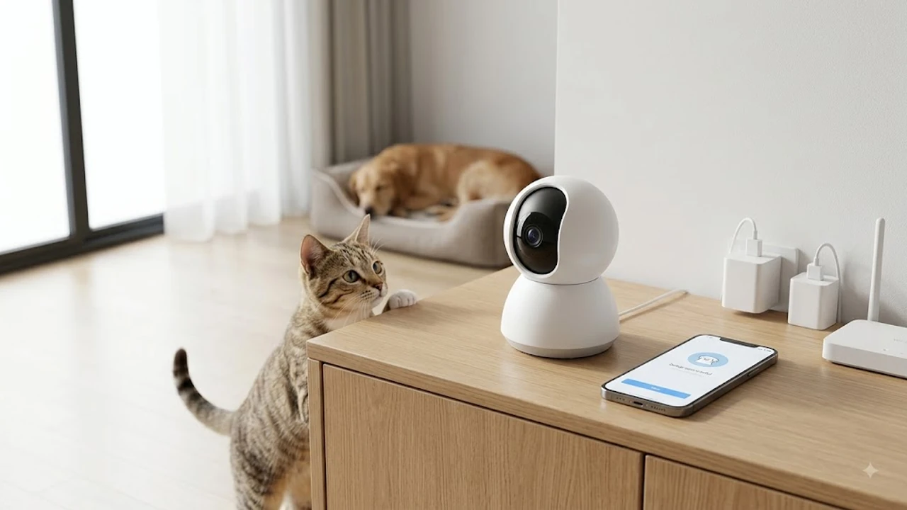

집을 비우고 출근하거나 여행을 떠날 때, 혼자 남겨진 반려동물이 밥은 잘 먹는지 거실 안전에 이상은 없는지 실시간으로 확인하려는 수요가 급증했습니다. 최근 출시된 스마트 홈캠과 펫캠은 단순 녹화를 넘어 사람과 반려동물의 움직임을 AI로 정밀 구분하고, 울음소리까지 감지해 스마트폰으로 즉시 알림을 보냅니다. 4만 원대 실속형부터 10만 원대 프리미엄 모델까지 사각지대 없이 집안을 관리해 주는 2026년 대표 스마트 홈캠 3종을 정리했습니다.

## 1. 지금 스마트 홈캠·펫캠이 뜨는 이유

1인 가구 증가와 반려동물 양육 인구 확대로 홈캠은 가정 내 필수 기기로 자리 잡았습니다. 복잡한 배선 공사 없이 Wi-Fi 연결만으로 3분 만에 설치가 완료되는 플러그 앤 플레이 방식이 표준으로 정착했습니다.

최근 기기들은 온디바이스 AI 칩셋을 탑재해 빛 반사나 커튼 흔들림 같은 환경 요인으로 인한 오알림을 차단합니다. 사람의 출입과 동물의 움직임을 개별 분류해 기록하고, 아기 울음소리나 반려견 짖는 소리를 감지해 타임라인에 표시합니다. 실내 재실 시 카메라 렌즈를 물리적으로 차단하는 프라이버시 셔터가 보편화되면서 해킹과 사생활 침해에 대한 우려도 크게 줄었습니다. 일상 관리 효율을 높여주는 [트렌드 상품 추천 TOP3](/posts/trending-picks/trending-picks-20260727/) 및 [창문 로봇청소기 TOP3 추천 가성비 비교](/posts/trending-picks/smart-window-cleaner-robot-top3-2026/) 흐름과 맞물려 실구매가 빠르게 늘고 있습니다.

## 2. TOP3 대표 상품 스펙 비교

:** 광범위한 타깃층을 대상으로 브랜드와 핵심 가치를 전달하는 단계
* **흥미 및 고려(MOFU):** 제품의 특장점을 비교 분석하고 잠재적 니즈를 구체화하는 단계
* **전환 및 구매(BOFU):** 최종 의사결정을 유도하고 결제 장벽을 최소화하는 단계

## 트래픽 획득 및 유입 전략

유입 단계에서는 유료 광고와 오가닉 트래픽의 균형 있는 포트폴리오 구성이 핵심입니다. 단기적인 전환 극대화와 장기적인 브랜드 자산 구축을 동시에 달성하기 위한 다채널 접근법이 요구됩니다.

* **검색 엔진 최적화(SEO):** 의도 기반 키워드 발굴 및 콘텐츠 구조화를 통한 지속 가능한 오가닉 트래픽 확보
* **퍼포먼스 광고 운용:** 메타, 구글, 네이버 등 주요 매체의 알고리즘 특성을 반영한 타깃 오디언스 세분화
* **콘텐츠 마케팅 전개:** 타깃 고객의 문제 해결을 돕는 심층 가이드와 사례 연구 중심의 콘텐츠 배포

## 데이터 추적 및 성과 측정 인프라

정확한 데이터 수집과 측정 체계가 뒷받침되지 않은 마케팅은 효율적인 리소스 배분이 불가능합니다. 웹과 앱 환경 전반에 걸쳐 유실 없는 이벤트 트래킹 아키텍처를 구축해야 합니다.

* **태그 관리 시스템(GTM):** 복잡한 하드코딩 없이 이벤트 및 전환 추적 코드를 중앙에서 통제
* **서버사이드 트래킹 도입:** 브라우저 쿠키 제한 환경에 대응하여 전환 API(CAPI)를 활용한 데이터 정합성 유지
* **기여도 모델링 분석:** 마지막 클릭 중심 분석에서 벗어나 다채널 터치포인트를 고려한 데이터 기반 기여도 평가

## 전환율 극대화(CRO) 및 리텐션 전략

유입된 트래픽을 실제 가치로 전환하고 고객 생애 가치(LTV)를 높이기 위해서는 랜딩 페이지 최적화와 개인화된 CRM 자동화가 필수적입니다.

* **랜딩 페이지 A/B 테스트:** 헤드라인, CTA 배치, 폼 구성 요소를 주기적으로 검증하여 이탈률 개선
* **CRM 자동화 시나리오:** 장바구니 이탈 알림, 개인 맞춤형 리인게이지먼트 메시지 트리거 설계
* **고객 코호트 분석:** 구매 주기 및 행동 패턴별 세분화를 통해 반복 구매율과 고객 충성도 증대