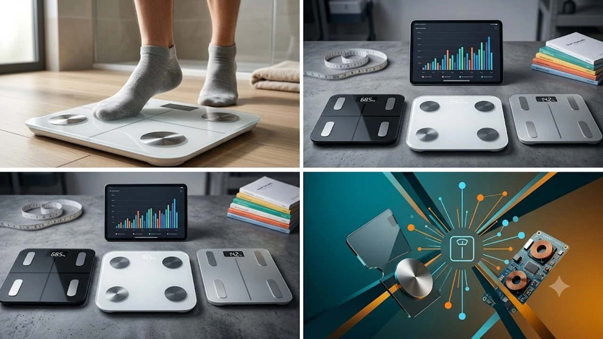

다이어트나 홈트를 할 때 일반 체중계 위에 올라가 체중만 재거나, 발판만 있는 스마트 체중계로 체지방률을 확인하다 보면 문득 의구심이 듭니다. 똑같이 운동하고 물 한 잔 마셨을 뿐인데 수치가 날마다 널을 뛰기 때문입니다. 

실제로 시중 판매 중인 저가형 발판 체중계는 하체로만 미세 전류를 흘려보내 상체 데이터는 통계 수치로 '추정'할 뿐입니다. 반면 손잡이가 달린 8극 체중계는 상체와 하체에 각각 전극을 대어 신체 부위별 임피던스를 직접 측정합니다. 

2026년 8월 현재, 피트니스 센터의 인바디 장비 못지않은 정밀도를 갖춘 8극 스마트 체중계 인기 모델 TOP3를 상세히 분석해 드립니다.

---

## 1. 지금 8극 스마트 체중계가 뜨는 이유

### 발판형(4전극)의 한계를 극복한 상·하체 정밀 측정
기존 발판형 스마트 체중계는 하체 전류 전달 값에 연령과 성별 평균 통계치를 대입해 상체 근육량이나 체지방을 예측했습니다. 이 때문에 상체 발달형 체형이나 하체 비만형 체형은 오차가 크게 발생했습니다. 손잡이 방식의 8극(상지 4극 + 하지 4극) 체중계는 오른팔, 왼팔, 오른다리, 왼다리, 복부 등 5개 부위를 독립 측정해 오차율을 줄인 신체 스캔 데이터를 제공합니다.

### 4만\~9만 원대로 내려온 프리미엄 기술의 대중화
과거 8점식 측정 기술이 적용된 가정용 체중계는 최소 20만 원에서 40만 원을 넘어서는 고가 장비였습니다. 최근 제조 기술 향상으로 6만\~9만 원대 라인업이 대거 등장했습니다. 헬스장에 매번 찾아가지 않아도 아침마다 집에서 눈바디 대신 정확한 근육량 추이를 모니터링하려는 유저들의 구매가 폭증하는 배경입니다.

체중 관리와 더불어 서서 일하거나 운동 후 피로를 풀어주는 [무선 종아리 마사지기 TOP3 가성비 비교](/posts/trending-picks/wireless-calf-massager-top3-2026/) 글도 함께 활용하면 홈케어 환경 구성에 도움 됩니다.

---

## 2. TOP3 8극 스마트 체중계 스펙 비교

| 모델명 | 가격대 | 핵심 스펙 | 추천 대상 |
| :--- | :--- | :--- | :--- |
| **요아이 스마트 8점식 체중계** | 6만 원대 | 8전극 / 20가지 측정 / 블루투스 5.0 | 입문용 가성비 8극 체중계 찾는 분 |
| **앳플리 아이그립X 체중계** | 9만 원대 | 8전극 / 29가지 분석 / Fitple 전용 앱 | 세련된 디자인과 리포트 추이가 필요한 분 |
| **인바디 다이얼 H30NWi** | 30만 원대 | Triple Frequency / Wi-Fi+BT / 병원급 알고리즘 | 오차 없는 피트니스 전문 데이터 원치 않는 분 |

---

## 3. 예산대별 추천 모델 3종 상세 분석

### [가성비형] 요아이 스마트 체성분 확인바디 8점식 체중계

* **가격대:** 6만 원대
* **핵심 스펙:**
  * 상지 4극 + 하지 4극 총 8개 정밀 전극 채택
  * BIA(생체 임피던스 분석) 기술 기반 20가지 체성분 항목 측정
  * 고선명 LED 디스플레이 및 연동 앱 자동 기록
* **장점:**
  1. 8극 방식 제품 중 접근성이 뛰어난 6만 원대 가격 설정
  2. 앱 반응 속도가 빠르고 부위별(팔, 다리, 복부) 체지방·근육량 직관적 표시
* **단점:**
  1. 손잡이 케이블 줄 감김 수동 집어넣기 방식이 다소 뻑뻑함
* **이런 사람에게 추천:**
  10만 원 미만 예산으로 발판형 체중계에서 벗어나 상·하체 정밀 측정을 시작하려는 다이어터.

👉 [요아이 스마트 8점식 체중계 쿠팡에서 보기](https://www.coupang.com/np/search?q=요아이+스마트+8점식+체중계&sourceType=affiliate&trackingCode=AF8691300)

---

### [밸런스형] 앳플리 아이그립X 핸드바 스마트 체중계

* **가격대:** 9만 원대
* **핵심 스펙:**
  * 8전극 핸드바 매립형 설계 (마그네틱 고정)
  * 29가지 체분석 데이터 및 부위별 체지방율 산출
  * 핏플리(Fitple) 전용 앱 연동 (삼성 헬스, 애플 건강 완벽 호환)
* **장점:**
  1. 손잡이가 체중계 본체에 자석 형태로 밀착되어 거치 공간 깔끔함
  2. 전용 앱의 데이터 그래프 가독성이 뛰어나며 가족 구성원 자동 인식 기능 탑재
* **단점:**
  1. 발판 유리가 백색 강화유리라 먼지가 다소 눈에 띔
* **이런 사람에게 추천:**
  인테리어를 해치지 않는 깔끔한 디자인과 체계적인 주간·월간 다이어트 그래프 리포트가 필요한 사용자.

👉 [앳플리 아이그립X 체중계 쿠팡에서 보기](https://www.coupang.com/np/search?q=앳플리+아이그립X+체중계&sourceType=affiliate&trackingCode=AF8691300)

---

### [프리미엄형] 인바디 다이얼 H30NWi

* **가격대:** 30만 원대
* **핵심 스펙:**
  * 다중 주파수(Triple Frequency) 8전극 정밀 측정
  * Wi-Fi 및 블루투스 고속 이중 통신 지원
  * 인바디(InBody) 독자 특허 체성분 분석 알고리즘
* **장점:**
  1. 스마트폰을 들고 측정하지 않아도 Wi-Fi를 통해 데이터가 서버로 자동 전송됨
  2. 보건소나 전문 헬스장 인바디 기계와 오차 범위가 최소화된 데이터 신뢰도
* **단점:**
  1. 입문형 모델 대비 3\~4배 이상 높은 가격대
* **이런 사람에게 추천:**
  바디프로필 준비생, 선수급 웨이트 트레이너, 측정 결과의 정확도를 최우선으로 두는 실속파.

👉 [인바디 다이얼 H30NWi 쿠팡에서 보기](https://www.coupang.com/np/search?q=인바디+다이얼+H30NWi&sourceType=affiliate&trackingCode=AF8691300)

---

## 4. 8극 스마트 체중계 구매 전 체크포인트

### 손잡이(상지 전극) 탑재 유무 확인
상품명에 '스마트 체중계' 또는 '체지방 체중계'라는 이름이 들어가 있더라도 핸드바가 없는 제품은 모두 4전극 방식입니다. 상체 데이터 정밀 측정을 원한다면 손잡이가 별도로 연결되어 손가락과 엄지손가락이 닿는 전극 부위가 명확히 존재하는지 체크해야 합니다.

### 연결 방식 (블루투스 vs Wi-Fi)
* **블루투스 전용:** 측정할 때마다 스마트폰 앱을 켜고 연결을 기다려야 하는 번거로움이 있지만 가격이 합리적입니다.
* **Wi-Fi 겸용:** 체중계에 올라서기만 하면 자동으로 데이터가 클라우드로 전송되어 앱을 매번 켜지 않아도 데이터가 누적됩니다.

### 앱 생태계 및 건강 데이터 연동
삼성 헬스(Samsung Health)나 애플 건강(Apple Health) 앱을 메인으로 사용 중이라면, 구매하려는 체중계의 전용 앱이 해당 플랫폼과 수치 동기화를 지원하는지 확인하는 편이 일상 데이터 관리에 유리합니다.

스마트한 헬스케어 기기와 함께 청결한 실내 환경을 원하신다면 [2026 스마트 쓰레기통 TOP3 추천 비교](/posts/trending-picks/smart-trash-can-top3-2026/)와 [트렌드 상품 추천 TOP3](/posts/trending-picks/trending-picks-20260727/) 페이지도 방문해 보시기 바랍니다.

---

> 이 포스팅은 쿠팡 파트너스 활동의 일환으로, 이에 따른 일정액의 수수료를 제공받습니다.

#트렌드상품 #쿠팡추천 #8극스마트체중계 #스마트체중계추천 #인바디체중계 #홈트필수템 #체지방측정기 #앳플리아이그립X #요아이체중계