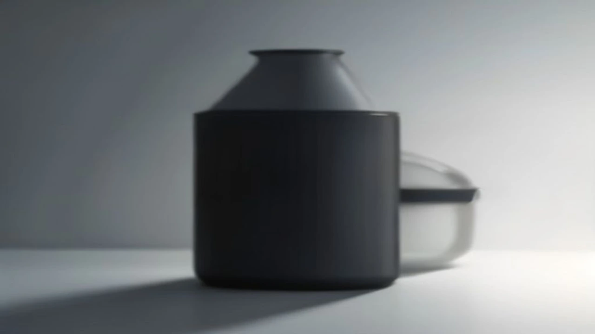

> 이 포스팅은 쿠팡파트너스 활동의 일환으로, 이에 따른 일정액의 수수료를 제공받습니다.

냄새, 초파리, 매일 버리는 번거로움. 음식물쓰레기 처리기 하나로 이 세 가지를 동시에 해결할 수 있다. 2026년 기준으로 가장 많이 팔리고 실제 사용자 만족도가 높은 제품 3가지를 용량·소음·냄새 제거 성능 기준으로 직접 비교했다.

## 2026 음식물처리기 구매 기준 3가지

### 처리 방식: 건조식 vs 분쇄식 vs 미생물식

건조·분쇄식은 전력 소비가 크지만 처리 속도가 빠르다(2~6시간). 미생물식은 전기 소모가 적고 냄새가 거의 없지만 초기 균 정착에 2~3주가 걸린다. 2인 이하 가구엔 1.5L 이하 소형 건조식, 3인 이상엔 3L 이상 대용량이 적합하다.

### 소음 기준: 40dB 이하가 주방 필수 조건

취침 중 가동을 원한다면 40dB 이하 제품이어야 한다. 일반 대화 소리가 약 60dB이므로, 40dB 이하면 냉장고 소음보다 조용하다. 2026년 출시 모델들은 대부분 35~45dB 구간에 포진해 있다.

### 냄새 차단: 활성탄 필터 교체 주기 확인 필수

활성탄 필터는 3~6개월 주기로 교체해야 성능이 유지된다. 교체 비용이 연 2만~5만 원 수준인 제품을 고르면 유지비 부담이 줄어든다.

## TOP3 제품 상세 비교

| 항목 | 루펜 S100 | 한경희 EWD-A200 | 스마트카라 400 Plus |
|---|---|---|---|
| **방식** | 건조·분쇄 | 건조·분쇄 | 건조·분쇄 |
| **용량** | 1.5L | 2.5L | 2.0L |
| **소음** | 43dB | 38dB | 35dB |
| **처리 시간** | 4~6시간 | 3~5시간 | 2~4시간 |
| **가격대** | 15~18만 원 | 25~30만 원 | 38~45만 원 |
| **필터 교체** | 6개월/2만 원 | 6개월/3만 원 | 12개월/4만 원 |
| **추천 대상** | 1~2인 가구 가성비 | 3~4인 중형 가구 | 냄새·소음 민감 가구 |

### 1위: 스마트카라 400 Plus — 소음·냄새 모두 1등

- **소음 35dB**: 국내 판매 모델 중 최저 수준. 취침 중 가동해도 거의 들리지 않는다.
- **특허 탈취 시스템**: 활성탄 + 히터 탈취 이중 구조로 냄새 차단율이 높다.
- **처리 시간 2~4시간**: 건조식 중 가장 빠른 편.
- **단점**: 가격이 40만 원 안팎으로 높다. 용량 2.0L는 4인 가구 이상엔 다소 부족.
- **타겟**: 냄새와 소음 모두 민감한 아파트 거주자, 영·유아 자녀 가구.

[스마트카라 400 Plus 쿠팡에서 보기](https://www.coupang.com/np/search?q=스마트카라+400+Plus&sourceType=affiliate&trackingCode=AF8691300)

### 2위: 한경희 EWD-A200 — 가성비 대용량

- **2.5L 대용량**: 3~4인 가구도 2~3일치를 한 번에 처리한다.
- **소음 38dB**: 냉장고 팬 소음과 비슷한 수준으로 일상 생활에 무리 없다.
- **가격 25~30만 원**: 스마트카라 대비 10만 원 이상 저렴하면서 성능은 준수하다.
- **단점**: 필터 교체 주기가 6개월로 연간 유지비가 약 6만 원.
- **타겟**: 3~4인 가족, 처리량이 많아 소형으로는 부족했던 가구.

[한경희 EWD-A200 쿠팡에서 보기](https://www.coupang.com/np/search?q=한경희+음식물처리기+EWD-A200&sourceType=affiliate&trackingCode=AF8691300)

### 3위: 루펜 S100 — 1~2인 가구 최저가 입문용

- **가격 15~18만 원**: 음식물처리기 입문 가격대.
- **1.5L 소형**: 1~2인 가구 일주일치 음식물쓰레기를 충분히 처리.
- **단점**: 소음 43dB로 3개 중 가장 큰 편. 야간 가동 시 소음이 느껴질 수 있다.
- **타겟**: 혼자 또는 둘이 사는 가구, 처음 음식물처리기 구매하는 분.

[루펜 S100 쿠팡에서 보기](https://www.coupang.com/np/search?q=루펜+S100+음식물처리기&sourceType=affiliate&trackingCode=AF8691300)

## 구매 전 꼭 확인할 설치 조건

### 전용 콘센트와 배수 연결 여부

건조·분쇄식은 별도 배수관 연결 없이 전원만 있으면 된다. 소비 전력은 300~500W 구간으로 일반 콘센트로 충분하다. 반면 싱크대 분쇄 일체형 제품은 배관 공사가 필요하므로 임차인에겐 부적합하다.

### 필터 교체 비용 2년 총 소유 비용 계산

제품 가격만 보지 말고 2년 기준 필터 교체 비용을 합산해야 실제 부담을 알 수 있다.
- 루펜 S100: 본체 17만 + 필터 4만(4회) = **21만 원**
- 한경희 EWD-A200: 본체 27만 + 필터 6만(4회) = **33만 원**
- 스마트카라 400 Plus: 본체 42만 + 필터 8만(2회) = **50만 원**

### 용량별 적정 가구 수 가이드

- **1.5L 이하**: 1~2인 / 주 2~3회 가동
- **2.0~2.5L**: 3~4인 / 주 3~4회 가동
- **3.0L 이상**: 5인 이상 또는 자취방 공유 인원 많은 경우

내부 링크로 더 많은 생활가전 정보를 확인할 수 있습니다. [무선 충전 맥세이프 보조배터리 TOP3 추천](/posts/trending-picks/magsafe-powerbank-top3-20260807/)도 함께 살펴보세요.

#음식물처리기추천 #스마트카라400 #루펜S100 #한경희음식물처리기 #트렌드상품 #쿠팡음식물처리기 #주방가전2026
