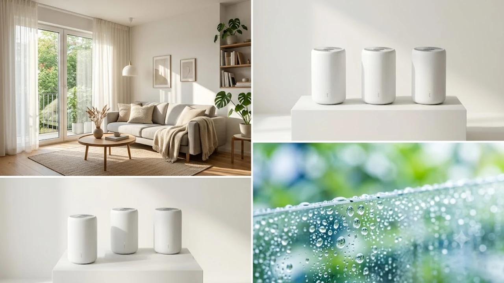

7월 말로 접어들면서 폭염과 함께 찾아온 습도 90%의 무더위는 가만히 있어도 땀이 흐르게 만듭니다. 빨래는 말라붙지 않고 꿉꿉한 냄새가 집안 전체를 감싸는 시기, 쾌적한 실내 환경을 가꾸려면 제습기는 더 이상 선택이 아닌 필수 가전입니다. 최근 시장을 이끄는 실시간 트렌드가 궁금하다면 이전 정리한 [트렌드 상품 추천 TOP3](/posts/trending-picks/trending-picks-20260727/) 글을 참고해도 좋습니다. 지금부터 2026년 여름, 전력 소비 절감과 압도적 성능을 무기로 검색 차트를 휩쓰는 스마트 인버터 제습기 3종을 정밀 비교해 드립니다.

---

## 1. 지금 스마트 인버터 제습기가 뜨는 이유

현재 국내 가전 시장에서 제습기 검색량이 급증한 배경에는 세 가지 핵심 요인이 자리 잡고 있습니다.

첫째, **체감 습도 90%를 넘나드는 기후적 원인**입니다. 장마가 지나간 후에도 이어지는 기습적인 소나기와 습한 기류 탓에 실내 곰팡이 균 확산 방지 및 의류 건조 니즈가 폭발했습니다.

둘째, **전기요금 인상에 따른 인버터 선호현상**입니다. 구형 정속형 제습기는 작동 내내 컴프레서가 최고 출력으로 돌아가 요금 폭탄을 맞기 쉽습니다. 반면 1등급 스마트 인버터 모델은 실내 습도에 따라 출력을 상시 조절하므로 하루 종일 켜두어도 누진세 부담이 적습니다.

셋째, **스마트홈(IoT) 모바일 연동의 일상화**입니다. 퇴근 30분 전 스마트폰 앱으로 미리 거실 제습기를 작동시켜 입실과 동시에 보송보송한 공기를 맞이하는 사용 패턴이 2030 가구를 중심으로 대세로 자리 잡았습니다. 최신 기기를 활용한 쾌적한 공간 연출은 [2026 데스크테리어 추천 TOP3 무선 셋업](/posts/trending-picks/deskterior-setup-top3-20260728/)에서도 큰 가치를 발휘합니다.

---

## 2. TOP3 스마트 인버터 제습기 스펙 비교

구매에 앞서 3개 대표 모델의 핵심 스펙을 한눈에 비교해 보세요.

| 모델명 | 가격대 | 핵심 스펙 | 추천 대상 |
| :--- | :--- | :--- | :--- |
| **샤오미 스마트 제습기 14L** | 20만원대 초반 | 일일 14L / 4.5L 물통 / 35dB 저소음 | 원룸, 자취생, 서재 전용 서브용 |
| **위닉스 뽀송 인버터 21L** | 40만원대 중반 | 일일 21L / 4.2L 물통 / UV 살균·자동건조 | 30평형대 거실, 메인 가전용 |
| **LG 휘센 타워 인버터 20L** | 70\~80만원대 | 일일 20L / 듀얼 인버터 / 신발·옷장 전용키트 | 프리미엄 위생 케어, 대형 가구 |

---

## 3. 예산대별 추천 모델 정밀 분석

### 1) [실속형] 샤오미 스마트 제습기 14L (CSJ0111DM)

초가성비 라인업에서 독보적인 자리를 차지한 샤오미 14L 모델입니다. 군더더기 없는 원통형 하얀색 디자인으로 집안 어느 곳에 두어도 깔끔하게 어우러집니다.

* **가격대:** 20만원대 초반
* **핵심 스펙:** 일일 제습량 14L, 수조 용량 4.5L, 소음 35\~38dB, 에너지효율 1등급
* **장점 1:** Mi Home 앱과의 완벽한 연동성. 습도 설정, 타이머, 키즈락 설정이 모바일 클릭 한 번으로 끝납니다.
* **장점 2:** 가격 대비 넉넉한 4.5L 대용량 물통을 채택해 자주 비우는 번거로움을 줄였습니다.
* **단점:** 국내 정식 A/S 센터망이 대기업 대비 부족해 고장 발생 시 접수가 다소 껄끄럽습니다.
* **이런 사람에게 추천:** 10평 안팎의 원룸 거주자, 서재나 옷방에 둘 보조 제습기를 찾는 알뜰족

👉 [샤오미 스마트 제습기 14L 쿠팡에서 보기](https://www.coupang.com/np/search?q=샤오미+스마트+제습기+14L&sourceType=affiliate&trackingCode=AF8691300)

---

### 2) [밸런스형] 위닉스 뽀송 인버터 21L (DX2H210-KWK)

국내 제습기 시장의 전통 강자 위닉스의 플래그십 기술이 집약된 모델입니다. 압도적인 제습 속도와 넓은 커버 범위를 제공하여 가장 높은 판매량을 기록 중입니다.

* **가격대:** 40만원대 중반
* **핵심 스펙:** 일일 제습량 21L, 수조 용량 4.2L, 연속 배수 지원, 33.5dB 저소음
* **장점 1:** 21L의 압도적 일일 제습량. 장마철 거실에 1시간만 가동해도 눅눅함이 즉시 사라집니다.
* **장점 2:** 사용 후 내부 습기를 자동으로 말려주는 '자동 건조' 기능과 UV LED 살균 모듈이 내장되어 곰팡이 냄새 걱정이 없습니다.
* **단점:** 본체 무게가 16.2kg으로 묵직하여 문턱이 있는 공간 간 이동 시 힘이 들어갑니다.
* **이런 사람에게 추천:** 30평대 아파트 거실 메인 제습기가 필요한 3\~4인 가구

👉 [위닉스 뽀송 인버터 21L 쿠팡에서 보기](https://www.coupang.com/np/search?q=위닉스+뽀송+인버터+21L&sourceType=affiliate&trackingCode=AF8691300)

---

### 3) [프리미엄] LG 휘센 타워 인버터 20L (DQ203PCEW)

가전 명가 LG전자의 기술력이 집약된 최고급형 제습기입니다. 강력한 제습력은 기본, 내구성과 부가기능 측면에서 완벽한 완성도를 자랑합니다.

* **가격대:** 70만원대 \~ 80만원대
* **핵심 스펙:** 일일 제습량 20L, 수조 용량 4.0L, 듀얼 인버터 탑재, UVnano 팬 살균
* **장점 1:** 듀얼 인버터 컴프레서 적용으로 알뜰한 전기세는 물론 저소음 모드 가동 시 32dB 수준의 정숙함을 보여줍니다.
* **장점 2:** 신발 건조 전용 Y자 호스 및 옷장 전용 T자 호스를 기본 제공하여 세심한 집중 케어가 가능합니다.
* **단점:** 경쟁사 대비 비싼 초기 구매 비용이 다소 부담스럽습니다.
* **이런 사람에게 추천:** 소음에 민감한 분, 신발/옷장 집중 관리가 필수인 가구, 최고의 A/S와 품질을 원하는 분

👉 [LG 휘센 타워 인버터 20L 쿠팡에서 보기](https://www.coupang.com/np/search?q=LG+휘센+타워+인버터+20L&sourceType=affiliate&trackingCode=AF8691300)

---

## 4. 구매 전 반드시 확인할 체크포인트

제습기 구매 버튼을 누르기 전, 다음 3가지 항목을 최종 점검해야 후회가 없습니다.

1. **사용 공간 대비 적정 일일 제습량(L)**
   * 제습기 용량은 물통 크기가 아닌 '하루 동안 집안에서 뿜어져 나오는 수분을 얼마나 빨아들이는가(일일 제습량)'입니다. 
   * 원룸·작은방: 10\~14L 수준
   * 20\~30평형대 거실: 16\~22L 대용량 선택 필수

2. **인버터 컴프레서 & 에너지 효율 1등급 유무**
   * 여름철 제습기는 12시간 이상 연속 가동하는 경우가 흔합니다. 정속형과 인버터의 한 달 전기요금 차이는 배 이상 벌어집니다. 반드시 '1등급 스마트 인버터' 문구를 확인해야 합니다.

3. **내부 자동 건조 및 위생 케어 시스템**
   * 제습이 끝난 후 내부 냉각핀에 수분이 남아있으면 내부에서 곰팡이가 번식해 쉰내가 발생합니다. 물통을 비우는 편의성 외에도 **자동 건조 기능**이나 **UV 살균 기능**이 탑재되었는지 확인하는 것이 청결한 공기 유지의 핵심입니다.

스마트 가전을 활용한 자동화 생활에 관심이 많다면 [2026 올인원 로봇청소기 TOP3 비교](/posts/trending-picks/2026-all-in-one-robot-vacuum-top3/) 포스팅도 함께 둘러보시길 바랍니다.

---

> 이 포스팅은 쿠팡 파트너스 활동의 일환으로, 이에 따른 일정액의 수수료를 제공받습니다.

#트렌드상품 #쿠팡추천 #스마트인버터제습기 #제습기추천 #위닉스뽀송 #LG휘센제습기 #샤오미제습기 #여름가전추천 #장마철필수템