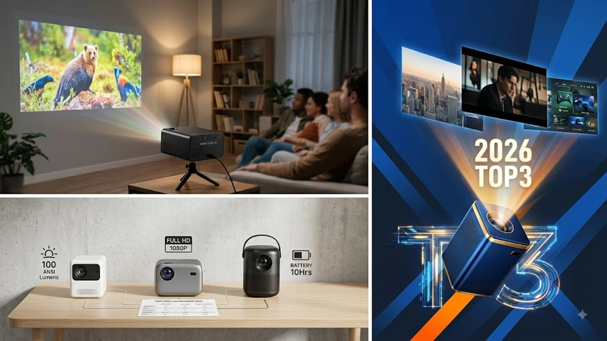

8월 들어 열대야와 휴가철이 겹치면서 야외 차박이나 침실 천장을 활용한 방구석 시네마 니즈가 폭발하고 있습니다. 스마트폰 6\~7인치 화면으로 영상이나 OTT를 보다가 눈 피로를 느끼거나, 주말에 영화관 느낌을 내고 싶을 때 미니 빔프로젝터만 한 선택지가 없습니다. 불과 1\~2년 전만 해도 화면이 어둡고 연결이 복잡해 장식품으로 전락하기 일쑤였지만, 2026년 현재 시장은 완전히 달라졌습니다. Wi-Fi만 켜면 넷플릭스가 바로 뜨고 180도 회전까지 되는 알짜배기 제품들이 쏟아져 나오는 중입니다.

최근에는 퇴근 후 지친 몸을 풀기 위해 [무선 종아리 마사지기 TOP3 가성비 비교](/posts/trending-picks/wireless-calf-massager-top3-2026/) 포스팅에서 소개한 안마기를 차고, 천장에 빔을 쏘아 유튜브나 OTT를 즐기는 홈 힐링족이 크게 늘었습니다. 구매 결정에 바로 도움 되도록 현시점 쿠팡에서 가장 반응이 뜨거운 3가지 미니 빔프로젝터를 엄선해 실사용 관점에서 분석해 드립니다.

---

## 1. 지금 미니 빔프로젝터가 뜨는 이유

### ① 180도 일체형 거치대와 오토 키스톤의 대중화
과거에는 프로젝터 높이를 맞추느라 삼각대를 세우고 두꺼운 책을 받치는 등 번거로움이 컸습니다. 하지만 최근 인기 기종들은 자체 스탠드가 180도 회전하여 침대 협탁에 놓기만 하면 천장에 바로 대형 화면을 띄울 수 있습니다. 여기에 기울어진 화면을 수초 만에 정사각형으로 잡아주는 오토 키스톤 기능이 기본 탑재되어 초기 세팅 시간을 대폭 줄여줍니다.

### ② 별도 기기 연결이 필요 없는 스마트 OS 내장
스마트폰 미러링 선을 꼬아가며 연결하거나 셋톱박스를 따로 꽂던 방식에서 벗어났습니다. 안드로이드 OS나 타이젠 OS가 기기 자체에 내장되어 Wi-Fi만 잡히면 넷플릭스, 쿠팡플레이, 유튜브, 티빙을 리모컨 하나로 즉시 구동합니다. 캠핑장이나 침대 위에서 거추장스러운 선 없이 단독으로 사용할 수 있는 편의성이 폭발적인 구매로 이어지고 있습니다.

### ③ 5만 원부터 시작하는 압도적 가성비
상향 평준화된 가성비 칩셋과 국내 대기업의 고급형 제품군으로 시장이 명확히 양분되면서 선택폭이 넓어졌습니다. 커피 몇 잔 값 수준인 5만 원 안팎으로 100인치 대화면을 구현할 수 있는 입문용 모델이 늘어남에 따라 자취생과 대학생, 차박 캠퍼 사이에서 필수 라이프스타일 아이템으로 자리 잡았습니다. 최신 인기 가전 트렌드가 궁금하다면 [트렌드 상품 추천 TOP3](/posts/trending-picks/trending-picks-20260727/)를 함께 참고해 보시는 것도 권장합니다.

---

## 2. TOP3 대표 모델 스펙 비교

현재 시장에서 가장 평가가 좋고 실속 있는 3개 모델을 가격대와 성능별로 정리한 명확한 비교표입니다.

| 모델명 | 가격대 | 핵심 스펙 | 추천 대상 |
| :--- | :--- | :--- | :--- |
| **HY320 / HY300 Ultra** | 3만\~7만 원대 | 안드로이드 11, 300 ANSI, 180도 회전 스탠드 | 부담 없는 가격으로 입문하고 싶은 자취생·차박족 |
| **완보(Wanbo) T2 Max HR** | 12만\~17만 원대 | 네이티브 1080p FHD, 450 ANSI, 내장 듀얼 스피커 | 화질과 음질 밸런스를 챙기고 싶은 실속파 독자 |
| **삼성전자 더 프리스타일 2세대** | 60만\~70만 원대 | 풀 오토 매직 스크린, 550 ANSI, 360도 입체 사운드 | 버벅임 없는 OTT 완벽 구동 및 고성능을 원하는 유저 |

---

## 3. 예산대별 추천 모델 3종 상세 분석

### ① 초가성비 입문용: HY320 / HY300 Ultra 스마트 미니 빔프로젝터

압도적인 가성비로 알리직구 및 쿠팡 로켓직구 시장을 쓸어담은 독보적 1위 입문용 기종입니다. 5만 원 안팎이라는 가격에 180도 회전 스탠드와 안드로이드 OS를 통째로 집어넣었습니다.

* **핵심 스펙:** 안드로이드 11 OS 내장, 약 250\~300 ANSI 루멘 밝기, 1280x720p HD 해상도 (1080p 디코딩 지원), 수직 오토 키스톤
* **장점 1:** 삼각대 없이 기기 몸통을 위로 꺾기만 하면 천장이 100인치 스크린으로 변합니다.
* **장점 2:** 기본 안드로이드 11 탑재로 유튜브와 OTT 앱 설치 및 구동이 자유롭습니다.
* **단점:** 원가 절감을 위해 내장 스피커 출력이 3W 수준으로 중저음이 부족하여 외부 블루투스 스피커 연동을 권장합니다.
* **추천 타겟:** 10만 원 미만 예산으로 빔프로젝터를 처음 접해보는 입문자, 야외 캠핑장에서 부담 없이 막 쓸 서브용 기기를 찾는 분.

👉 [HY320 미니 빔프로젝터 쿠팡에서 보기](https://www.coupang.com/np/search?q=HY320+미니+빔프로젝터&sourceType=affiliate&trackingCode=AF8691300)

---

### ② 실속형 밸런스: 완보(Wanbo) T2 Max HR 스마트 빔프로젝터

가성비 라인업 중 화질과 선명도 면에서 독보적인 완성도를 보여주는 모델입니다. 10만 원대 초중반 가격에서 진짜 1080p 네이티브 풀HD 화질을 선사합니다.

* **핵심 스펙:** 네이티브 1920x1080p FHD 해상도, 450 ANSI 루멘 밝기, 3Wx2 듀얼 스피커, 밀폐형 광학 엔진(먼지 유입 방지)
* **장점 1:** 폰트나 영상 자막이 뭉개지지 않고 또렷하게 표현되는 1080p 네이티브 해상도를 제공합니다.
* **장점 2:** 밀폐형 광렌즈 구조 덕분에 저가형 프로젝터의 고질병인 렌즈 내부 먼지 착착 현상을 방지합니다.
* **단점:** 일체형 180도 스탠드가 포함되어 있지 않아 천장 투사를 하려면 미니 삼각대나 헤드 조절용 거치대를 별도로 장착해야 합니다.
* **추천 타겟:** 자막이 많은 해외 드라마나 영화 위주로 시청하며 10만 원대 예산에서 깔끔한 1080p 화질을 챙기고 싶은 실속파.

👉 [완보 T2 Max HR 쿠팡에서 보기](https://www.coupang.com/np/search?q=완보+T2+Max+HR&sourceType=affiliate&trackingCode=AF8691300)

---

### ③ 프리미엄 플래그십: 삼성전자 더 프리스타일 2세대 (`SP-LFF3CLA`)

화면 보정의 스트레스를 제로로 만들어주는 프리미엄 스마트 빔입니다. 전원만 켜면 알아서 화면 각도, 초점, 수평을 모조리 잡아줍니다.

* **핵심 스펙:** 네이티브 1080p FHD, 타이젠 OS, 550 ANSI 루멘, 360도 5W 우퍼 탑재 사운드, 풀 오토 매직 스크린
* **장점 1:** 화면을 벽이나 천장에 쏘는 즉시 1초 만에 자리를 잡는 오토 초점/수평 알고리즘을 자랑합니다.
* **장점 2:** 삼성 스마트 TV용 타이젠 OS가 적용되어 국내 모든 OTT 앱이 고화질 라이선스 제약 없이 빠르고 쾌적하게 구동됩니다.
* **단점:** 야외 사용 시 전용 배터리 베이스를 별도로 구매해야 휴대성이 완성되며, 60만 원이 넘는 초기 구매 비용이 발생합니다.
* **추천 타겟:** 복잡한 수동 설정 없이 버튼 하나로 정교한 화면을 원하거나, 앱 조작 시 기기 렉 없이 원활한 반응 속도를 원하는 유저.

👉 [삼성 더 프리스타일 2세대 쿠팡에서 보기](https://www.coupang.com/np/search?q=삼성+더+프리스타일+2세대&sourceType=affiliate&trackingCode=AF8691300)

---

## 4. 구매 전 반드시 확인할 체크포인트

### ① '지원 해상도'와 '네이티브 해상도'의 차이 구분
상세 페이지에 '4K 지원'이라고 표기되어도 확인이 필요합니다. 이는 4K 영상 신호를 입력받아 재생할 수 있다는 의미일 뿐, 실제 출력 해상도는 720p(HD)나 480p인 경우가 많기 때문입니다. 영화 자막이나 가사를 깨끗하게 보려면 스펙표의 **'네이티브(Native) 해상도'**가 최소 FHD(1920x1080)인지 체크해야 합니다.

### ② 단순 루멘(Lumens)이 아닌 '안시루멘(ANSI Lumens)' 확인
5,000 루멘, 10,000 루멘 등의 표기는 LED 광원 자체의 이론상 밝기일 뿐입니다. 실제 스크린에 투사되는 밝기 기준은 미국표준협회 규격인 **ANSI Lumens**입니다. 암막 커튼을 친 방에서 무난하게 보려면 최소 200\~300 ANSI 이상, 불을 살짝 켜둔 상태에서도 보려면 500 ANSI 이상을 선택해야 답답함이 없습니다.

### ③ 와이드바인(Widevine) DRM 등급 및 정식 OTT 인증
안드로이드 OS가 깔려 있어도 정식 라이선스 인증을 받지 못한 저가형 빔프로젝터는 넷플릭스나 쿠팡플레이 실행 시 HD 고화질 재생이 제한되어 480p 저화질로 출력될 수 있습니다. 정식 인증 마크가 있는지, 에어 리모컨이나 포인터 기능을 지원하여 OTT 앱 조작이 매끄러운지 확인해야 합니다.

### ④ 소음 수치 및 방열 구조
빔프로젝터 내부에는 고열의 초소형 램프를 식히기 위한 쿨링팬이 계속 도릅니다. 침대 헤드보드처럼 머리 바로 옆에 두고 쓸 생각이라면 팬 소음이 35dB 이하인지, 구동 시 소음 불만이 적은지 점검하는 것이 실사용 불만을 줄입니다. 집안 청결과 쾌적한 환경까지 함께 챙기고 싶다면 [창문 로봇청소기 TOP3 추천 가성비 비교](/posts/trending-picks/smart-window-cleaner-robot-top3-2026/) 포스팅도 읽어보시면 도움이 됩니다.

---

> 이 포스팅은 쿠팡 파트너스 활동의 일환으로, 이에 따른 일정액의 수수료를 제공받습니다.

#트렌드상품 #쿠팡추천 #미니빔프로젝터 #빔프로젝터추천 #방구석시네마 #스마트빔 #가성비빔프로젝터 #차박아이템