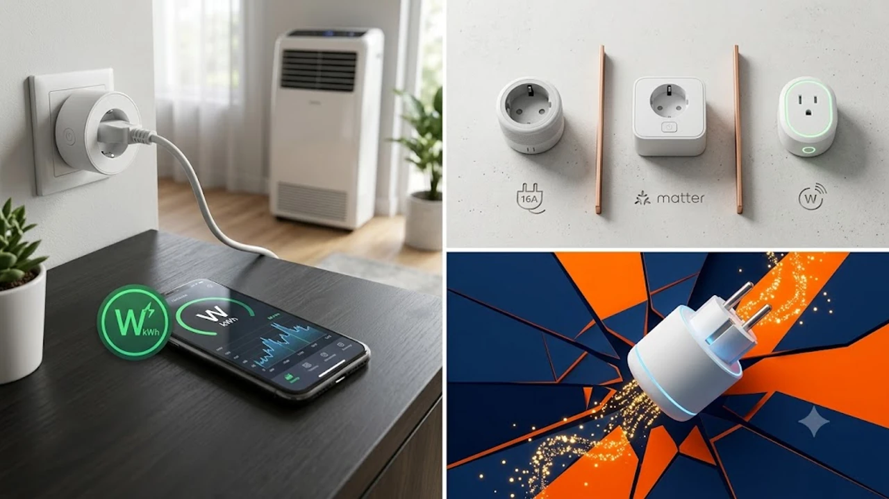

폭염과 늦여름 열대야로 에어컨을 종일 켜두면서 이번 달 전기세 고지서가 두려운 시기입니다. 낭비되는 대기전력을 잡고 실시간 소비전력까지 한눈에 파악해 누진세를 방어하는 가장 확실한 방법은 스마트 플러그를 설치하는 것입니다. 별도의 복잡한 배선 공사 없이 콘센트에 꽂기만 하면 일반 가전을 스마트 가전으로 바꿔주는 2026년 인기 모델 3종을 꼼꼼하게 비교 정리했습니다.

---

## 1. 지금 스마트 플러그가 뜨는 이유

8월 냉방기기 가동량이 정점을 찍으면서 실시간 소비전력(W)과 누적 전력량(kWh)을 모니터링하려는 수요가 폭발했습니다. 에어컨, 서큘레이터, PC 본체 등 전력 소모가 큰 기기들이 실제로 전기를 얼마나 소모하는지 확인해야 누진 구간 진입을 사전에 피할 수 있기 때문입니다.

동시에 글로벌 스마트홈 표준 규격인 **Matter(매터)**가 본격적으로 보급되면서 기기 연동성이 비약적으로 상승했습니다. 과거처럼 제조사 전용 앱에만 갇혀 있지 않고, 애플 홈킷(Siri), 구글 홈, 삼성 스마트싱스를 가리지 않고 자유롭게 묶을 수 있습니다. 

외출 시 불필요한 대기전력을 일괄 차단하고, 퇴근 시간에 맞춰 특정 기기 전원을 켜두는 자동화 루틴을 손쉽게 구성하려는 1인 가구와 직장인들의 필수 아이템으로 자리 잡았습니다. 책상 위 전자기기 전원을 한 번에 관리하는 용도로 [2026 무선 버티컬 마우스 추천 TOP3](/posts/trending-picks/wireless-vertical-mouse-top3-2026/)와 함께 데스크 셋업 필수품으로도 자주 언급됩니다.

---

## 2. TOP3 상품 스펙 비교

가장 인지도와 판매량이 높은 세 가지 모델의 핵심 사양을 비교했습니다.

| 모델명 | 가격대 | 핵심 스펙 | 추천 대상 |
| :--- | :--- | :--- | :--- |
| **티피링크 Tapo P110M** | 18,900원 | 16A (3,680W), Matter 공식 인증, 블루투스 4.2 온보딩 | 플랫폼 제약 없이 가성비 스마트홈을 구축하려는 분 |
| **헤이홈 스마트 플러그** | 21,900원 | 16A (3,680W), V0 난연 등급, 카카오홈/스마트싱스 연동 | 직관적인 한국어 전용 앱과 빠른 고객 지원을 선호하는 분 |
| **미니빅 플러그미니** | 26,900원 | 16A (3,680W), 과열/과전류 알림 및 로컬 자동화 지원 | 센서 연계 조건부 루틴과 화재 안전성을 최우선하는 분 |

---

## 3. 예산대별 추천 모델 3선

### 1) 티피링크 Tapo P110M — 가성비와 호환성을 모두 잡은 표준형
* **브랜드/모델명:** 티피링크(TP-Link) Tapo P110M
* **가격대:** 18,900원
* **핵심 스펙:**
  * 최대 정격 허용 용량: 16A (최대 3,680W)
  * 연동 플랫폼: Matter 인증 지원 (애플 홈킷, 구글 어시스턴트, 알렉사, 삼성 스마트싱스)
  * 연결 방식: Wi-Fi 2.4GHz + 블루투스 온보딩
* **장점:**
  * 차세대 스마트홈 표준 규격인 Matter를 지원해 아이폰 홈 앱이든 갤럭시 스마트싱스든 별도 허브 없이 즉시 연동됩니다.
  * 실시간 소비전력(W)과 일별/월별 누적 소비량(kWh)을 시각화 그래프로 상세히 제공하며, 전기 요금 단가를 입력해 예상 요금을 바로 계산합니다.
* **단점:**
  * 본체 가로 폭(72mm)이 다소 넓은 편이라 2구 벽면 콘센트나 멀티탭에 꽂을 때 옆 소켓에 대형 어댑터가 있으면 간섭이 발생합니다.
* **추천 대상:** 애플 기기와 안드로이드 기기를 함께 사용하거나, 2만 원 미만 예산에서 Matter 호환 플러그를 찾는 분.

👉 [티피링크 Tapo P110M 쿠팡에서 보기](https://www.coupang.com/np/search?q=티피링크+Tapo+P110M&sourceType=affiliate&trackingCode=AF8691300)

---

### 2) 헤이홈 스마트 플러그 — 국내 주거 환경에 최적화된 편의성
* **브랜드/모델명:** 헤이홈(HejHome) 스마트 플러그 (GKW-IC055)
* **가격대:** 21,900원
* **핵심 스펙:**
  * 최대 정격 허용 용량: 16A (최대 3,680W)
  * 연동 플랫폼: 헤이홈 전용 앱, 카카오홈, 네이버 클로바, 삼성 스마트싱스, 구글 홈
  * 소재 및 안전: V0 최고 등급 난연 PC 소재, 대기전력 0.5W 미만
* **장점:**
  * 국내 사용자 친화적인 한글 인터페이스 덕분에 IoT 기기 세팅이 낯선 초보자도 3분 안에 페어링을 마칠 수 있습니다.
  * 카카오톡 카카오홈 서비스와 직접 연동되어 별도의 AI 스피커 없이 카카오톡 메시지나 위젯으로 기기 전원을 손쉽게 켜고 끕니다.
* **단점:**
  * Matter 규격을 공식 지원하지 않기 때문에 애플 홈킷 단독 환경에서는 직결 연동이 불가능합니다.
* **추천 대상:** 카카오홈이나 네이버 클로바 중심의 환경을 선호하고, 국내 전담 고객센터의 빠른 사후 관리가 필요한 분.

👉 [헤이홈 스마트 플러그 쿠팡에서 보기](https://www.coupang.com/np/search?q=헤이홈+스마트+플러그&sourceType=affiliate&trackingCode=AF8691300)

---

### 3) 미니빅 플러그미니 — 정교한 자동화 루틴과 안전 기능 특화
* **브랜드/모델명:** 미니빅(minibig) 플러그미니
* **가격대:** 26,900원
* **핵심 스펙:**
  * 최대 정격 허용 용량: 16A (최대 3,680W 고용량 지원)
  * 안전 차단 기능: 과열 및 과전류 감지 시 0.1초 자동 전원 차단
  * 연동 플랫폼: 미니빅 전용 앱, 구글 홈, 시리 바로가기(단축어)
* **장점:**
  * 비정상적인 전력 급증이나 내부 발열을 실시간 감지해 전원을 즉시 차단하고 스마트폰 푸시 알림을 발송하므로 화재를 사전에 차단합니다.
  * 미니빅 허브 및 온습도·도어 센서와 결합하면 '실내 온도 28도 초과 시 플러그 가동'과 같은 조건부 로컬 루틴을 정교하게 구현할 수 있습니다.
* **단점:**
  * 비교 대상 모델 중 단품 구매 단가가 가장 높습니다.
* **추천 대상:** 전열기기나 대형 가전 연결 시 안전 차단 기능이 최우선이거나, 미니빅 센서 제품군과 함께 홈 자동화를 구축하려는 분.

👉 [미니빅 플러그미니 쿠팡에서 보기](https://www.coupang.com/np/search?q=미니빅+플러그미니&sourceType=affiliate&trackingCode=AF8691300)

스마트홈 기기 외에도 피로를 덜어주는 라이프스타일 추천 템이 궁금하다면 [무선 종아리 마사지기 TOP3 가성비 비교](/posts/trending-picks/wireless-calf-massager-top3-2026/)와 [트렌드 상품 추천 TOP3](/posts/trending-picks/trending-picks-20260727/) 글도 확인해 보세요.

---

## 4. 구매 전 반드시 확인할 체크포인트

### 1) 최대 정격 용량 16A(3,680W) 필수 확인
스마트 플러그를 고를 때 최우선 기준은 허용 전류량입니다. 시중 저가형 제품 중에는 10A(2,200W) 규격 모델이 섞여 있습니다. 에어컨, 전자레인지, 온풍기, 헤어드라이어 같은 고전력 가전을 10A 제품에 연결하면 과부하로 발열 및 화재 위험이 발생합니다. 반드시 **16A / 3,680W** 고용량 인증 규격인지 확인해야 안전합니다.

### 2) 2.4GHz 와이파이 단독 지원 환경
대다수 IoT 스마트 플러그는 5GHz 대역을 지원하지 않고 **2.4GHz Wi-Fi 주파수**로만 통신합니다. 공유기 설정에서 2.4GHz와 5GHz가 단일 SSID로 묶여 있는 통합 환경(밴드 스티어링)인 경우 초기 페어링 실패가 잦습니다. 기기 등록 전 공유기 설정에서 2.4GHz 대역을 분리해 두면 오류 없이 연결됩니다.

### 3) 콘센트 간섭과 본체 하우징 규격
멀티탭이나 2구 벽면 콘센트에 다른 가전 플러그와 나란히 꽂아야 한다면 본체 외형 크기를 반드시 계산해야 합니다. 플러그 몸통이 둥글고 두꺼운 모델은 인접 소켓 공간을 침범해 다른 코드를 꽂지 못하게 만듭니다. 콘센트 간격이 좁다면 슬림 사각 형태나 컴팩트 원형 제품을 선택해야 간섭이 없습니다.

### 4) 수동 물리 전원 버튼 탑재 여부
스마트폰 배터리가 방전되었거나 Wi-Fi 공유기 통신 장애가 발생했을 때 기기를 직접 켜고 끌 수 있는 물리 버튼이 측면에 위치해야 합니다. 수동 버튼이 있어야 비상시에도 코드를 콘센트에서 매번 힘주어 뽑아낼 필요 없이 즉각적인 전원 통제가 가능합니다.

---

> 이 포스팅은 쿠팡 파트너스 활동의 일환으로, 이에 따른 일정액의 수수료를 제공받습니다.

#트렌드상품 #쿠팡추천 #스마트플러그 #전력측정기 #IoT스마트홈 #티피링크Tapo #헤이홈스마트플러그 #미니빅플러그미니 #전기세절약 #대기전력차단