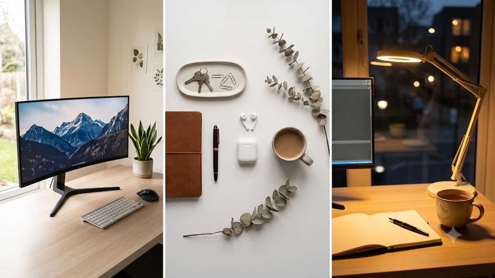

하루 8시간 이상 앉아서 일하다 보면 목과 허리에 가해지는 하중이 급격히 늘어납니다. 앉는 자세와 서는 자세를 번갈아 유지하는 작업 환경은 척추 부담을 덜고 작업 집중력을 유지하는 확실한 방법입니다. 시중에 나와 있는 수많은 제품 중 모터 구동 안정성, 프레임 내구성, 실사용자 평가를 기준으로 2026년 기준 실구매 가치가 검증된 전동 모션데스크 TOP 3를 정리했습니다.

모션데스크를 선택할 때는 모터 개수, 최저·최고 높이 범위, 흔들림 제어 능력을 반드시 확인해야 합니다. 상판 위에 모니터 암, 본체, 음향 장비를 함께 얹는다면 허용 하중과 프레임 구조가 제품 수명을 결정짓습니다.

## 1. 2026년 가성비 및 고성능 전동 모션데스크 TOP 3 비교

| 모델명 | 가격대 | 핵심 스펙 | 추천 대상 |
| :--- | :--- | :--- | :--- |
| **데스커 프리미엄 모션데스크 1400x700** | 589,000원 | 덴마크 LINAK 듀얼 모터 / 높이 조절 630\~1,280mm / 허용 하중 120kg | 흔들림 없는 마감과 안정적인 듀얼 모터를 원하는 재택근무자 |
| **루나랩 듀얼모터 전동 책상 1500x750** | 379,000원 | 듀얼 모터 (초당 35mm 이동) / 높이 조절 635\~1,285mm / 허용 하중 100kg | 넓은 상판 규격과 30만 원대 듀얼 모터 셋업을 찾는 유저 |
| **플렉시스팟 E7 프로 모션데스크 1400x700** | 459,000원 | C자형 프레임 듀얼 모터 / 높이 조절 580\~1,230mm / 허용 하중 125kg | 키가 작거나 넓은 하부 다리 공간이 필요한 정밀 작업자 |

## 2. 작업 효율을 극대화하는 전동 모션데스크 상세 분석

### 1) 데스커 프리미엄 모션데스크 1400x700 (DSMD714N)

국내 오피스 가구 시장에서 높은 점유율을 차지하는 브랜드의 상위 모델입니다. 덴마크 리낙(LINAK) 사의 모터 메커니즘을 적용해 구동 시 소음이 45dB 이하로 정숙하며, 작동 중 물체에 걸리면 즉각 멈추고 2cm 역방향 이동하는 롤백 센서를 기본 내장했습니다.

* **브랜드 / 모델명**: 데스커(DESKER) 프리미엄 모션데스크 (DSMD714N)
* **가격대**: 589,000원
* **핵심 스펙**:
  * 구동 방식: 리낙(LINAK) 프리미엄 듀얼 모터 (소음도 45dB 이하)
  * 높이 조절 범위: 630mm \~ 1,280mm
  * 최대 지지 하중: 120kg (상판 무게 제외)
* **장점**:
  * 3단 리프팅 컬럼 구조 덕분에 1,200mm 이상 최고 높이에서도 듀얼 모니터 암 흔들림이 거의 없습니다.
  * 상판 후면에 전선 정리 트레이와 배선 홀이 기본 가공되어 있어 멀티탭과 전원 어댑터 매립이 깔끔합니다.
* **단점**:
  * 동급 상판 규격의 보급형 브랜드 대비 판매 가격이 15만 원 이상 높습니다.
* **추천 대상**:
  * 듀얼 모니터와 대형 스피커를 거치하고 최고 높이에서도 흔들림 없는 타건감을 원하는 사용자.

👉 [데스커 프리미엄 모션데스크 1400 쿠팡에서 보기](https://www.coupang.com/np/search?q=데스커프리미엄모션데스크1400&sourceType=affiliate&trackingCode=AF8691300)

---

### 2) 루나랩 듀얼모터 전동 높이조절 책상 1500x750

가성비 라인업 중 듀얼 모터를 탑재해 뛰어난 구동력과 넉넉한 상판 면적을 제공하는 모델입니다. 4단계 높이 메모리 기능을 지원하는 디지털 컨트롤 패널을 갖췄습니다.

* **브랜드 / 모델명**: 루나랩(LUNALAB) 듀얼모터 전동 책상 1500
* **가격대**: 379,000원
* **핵심 스펙**:
  * 구동 방식: 고출력 듀얼 모터 (초당 35mm 이동 속도)
  * 높이 조절 범위: 635mm \~ 1,285mm
  * 최대 지지 하중: 100kg
* **장점**:
  * 30만 원대 가격에서 1,500 x 750mm 대형 상판 규격과 듀얼 모터 구성을 동시에 제공합니다.
  * 상판 표면이 스크래치와 오염에 강한 파우더 코팅 마감으로 제작되어 마우스패드 없이도 트래킹이 매끄럽습니다.
* **단점**:
  * 충돌 감지 센서 감도가 다소 둔감해 5kg 미만의 가벼운 장애물 충돌 시 즉각 정지가 지연될 수 있습니다.
* **추천 대상**:
  * 30만 원대 예산 안에서 가로 1500mm 이상의 넓은 작업 환경을 구축하고 싶은 구매자.

👉 [루나랩 듀얼모터 전동 책상 1500 쿠팡에서 보기](https://www.coupang.com/np/search?q=루나랩듀얼모터전동책상1500&sourceType=affiliate&trackingCode=AF8691300)

데스크 셋업 시 장시간 타이핑 작업을 병행한다면 [2026 무선 버티컬 마우스 추천 TOP3](/posts/trending-picks/wireless-vertical-mouse-top3-2026/) 글을 참고해 손목 부담을 줄여보세요.

---

### 3) 플렉시스팟 E7 프로 모션데스크 1400x700 (E7P)

글로벌 인체공학 가구 전문 브랜드 플렉시스팟의 상위 프레임 모델입니다. C자형 다리 구조를 채택해 책상 하부 무릎 공간이 넓으며, 최저 높이가 580mm까지 내려가 신장이 작은 사용자도 발바닥 밀착 착지 자세를 구현합니다.

* **브랜드 / 모델명**: 플렉시스팟(FlexiSpot) E7 Pro (E7P)
* **가격대**: 459,000원
* **핵심 스펙**:
  * 구동 방식: C자형 하중 분산 듀얼 모터 (초당 38mm 이동)
  * 높이 조절 범위: 580mm \~ 1,230mm (최저 높이 580mm 특화)
  * 최대 지지 하중: 125kg
* **장점**:
  * 최저 높이가 580mm로 낮아 신장 150\~160cm대 사용자도 발 받침대 없이 팔꿈치 90도 각도를 맞출 수 있습니다.
  * 프레임 두께가 두껍고 탄소강 소재를 사용해 125kg 고하중 장비를 적재해도 구동 속도 저하가 없습니다.
* **단점**:
  * 프레임 단독 무게만 34kg에 달해 초기 1인 자가 조립 난이도가 높습니다.
* **추천 대상**:
  * 165cm 이하의 신장으로 기존 720mm 규격 책상에서 어깨 뭉침을 겪었거나 하부 다리 공간을 여유롭게 쓰고 싶은 사용자.

👉 [플렉시스팟 E7 프로 모션데스크 쿠팡에서 보기](https://www.coupang.com/np/search?q=플렉시스팟E7프로모션데스크&sourceType=affiliate&trackingCode=AF8691300)

스탠딩 자세로 서서 일할 때 발생하는 다리 피로를 관리하고 싶다면 [무선 종아리 마사지기 TOP3 가성비 비교](/posts/trending-picks/wireless-calf-massager-top3-2026/) 포스팅을 확인하시기 바랍니다. 최신 데스크 셋업 기기 트렌드는 [트렌드 상품 추천 TOP3](/posts/trending-picks/trending-picks-20260828/)에서 추가로 확인할 수 있습니다.

## 3. 예산대별 최종 선택 가이드

* **30만 원대 가성비 완성형**: 넓은 1500mm 상판과 듀얼 모터를 합리적인 금액으로 구성하려면 **루나랩 듀얼모터 전동 책상**이 적합합니다.
* **40만 원대 인체공학 최적화**: 160cm대 이하 신장이거나 하부 다리 간섭을 최소화하고 싶다면 최저 높이 580mm를 지원하는 **플렉시스팟 E7 프로**를 권장합니다.
* **50만 원대 프리미엄 내구성**: 45dB 이하 저소음 리낙 모터와 흔들림 없는 고하중 안정성을 최우선으로 둔다면 **데스커 프리미엄 모션데스크**가 확실한 선택지입니다.

## 4. 모션데스크 구매 전 필수 체크포인트

* **싱글 모터 vs 듀얼 모터**: 싱글 모터는 구동 축을 연결해 한쪽 모터로 양쪽을 들어 올리므로 적재 하중이 70kg 안팎에 그치고 좌우 수평 틀어짐이 발생할 수 있습니다. 100kg 이상 장비를 안정적으로 지탱하려면 다리 양쪽에 독립 모터가 들어간 듀얼 모터 방식을 택해야 합니다.
* **최저 높이 실측**: 표준 규격 책상(720mm)에서 어깨가 들리는 체형이라면 최저 높이가 650mm 이하로 내려가는 프레임인지 확인해야 거북목과 승모근 긴장을 방지할 수 있습니다.
* **상판 하부 프레임 구조와 모니터 암 호환성**: 상판 뒷면 프레임이 모서리에 너무 붙어 있으면 클램프형 모니터 암 거치가 불가능합니다. 상판 뒷면과 지지 프레임 사이에 최소 70mm 이상의 여유 공간이 확보되어 있는지 점검해야 합니다.

---

> 이 포스팅은 쿠팡 파트너스 활동의 일환으로, 이에 따른 일정액의 수수료를 제공받습니다.

#트렌드상품 #쿠팡추천 #전동모션데스크 #모션데스크추천 #데스커모션데스크 #루나랩책상 #플렉시스팟 #스탠딩데스크 #홈오피스인테리어