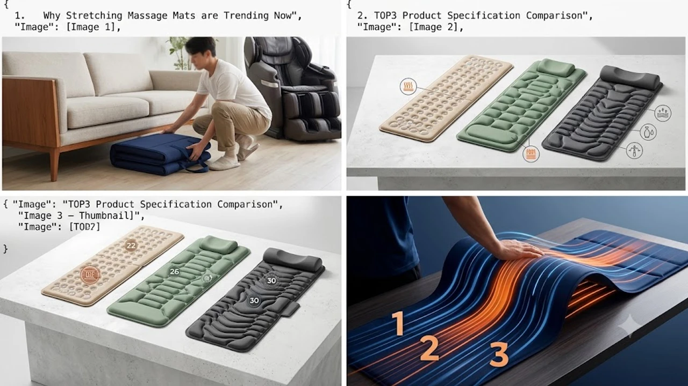

퇴근 후 집에 돌아오면 굳은 등과 뻐근한 허리 때문에 바닥에 그대로 눕고 싶어집니다. 하지만 200만\~300만 원을 훌쩍 넘는 대형 안마의자는 거실 공간을 너무 많이 차지하고, 이사할 때도 처치 곤란한 애물단지가 되기 십상입니다.

그 대안으로 바닥이나 침대에 펼쳐서 쓰고 3단으로 접어 틈새에 보관하는 스트레칭 안마매트가 실속형 헬스케어 기기로 큰 인기를 끌고 있습니다. 롤러가 뼈를 직접 때리는 자극 대신 강력한 공기압 에어셀이 부풀어 오르며 척추를 활처럼 펴주고 굳은 골반을 시원하게 비틀어줍니다.



---

## 1. 지금 스트레칭 안마매트가 뜨는 이유

대형 안마의자는 한 번 들이면 거실 한쪽을 통째로 차지하고 인테리어를 해칩니다. 반면 폴더블 스트레칭 안마매트는 사용 후 3단으로 접어 소파 밑이나 침대 옆 틈새에 깔끔하게 넣을 수 있습니다.

특히 9월 환절기와 명절 시즌이 다가오면서 부모님 선물용뿐만 아니라, 하루 종일 모니터 앞에 앉아 굽은 등과 뻐근한 허리로 고생하는 3040 직장인들의 내돈내산 수요가 급증하고 있습니다. 평소 오래 앉아 일하면서 [2026 무선 버티컬 마우스 추천 TOP3](/posts/trending-picks/wireless-vertical-mouse-top3-2026/) 같은 데스크 장비로 손목을 관리했다면, 퇴근 후에는 굳은 척추 전체를 풀어주는 루틴이 필수적입니다.

안마매트는 물리적 롤러가 아닌 다채널 공기압 에어셀 방식을 씁니다. 뼈가 약한 노년층도 결림이나 멍 걱정 없이 목 견인, 흉추 신전, 골반 트위스트 스트레칭을 매일 누워서 편안하게 받을 수 있습니다.

---

## 2. TOP3 상품 스펙 비교

온열 성능, 에어셀 구성, 가성비에서 가장 검증된 3가지 대표 모델 스펙을 표로 정리했습니다.

| 모델명 | 가격대 | 핵심 스펙 | 추천 대상 |
| :--- | :--- | :--- | :--- |
| **비타그램 온열 스트레칭 매트 (VGC-WAM5000)** | 9만\~10만원대 | 22개 공기압 에어셀, 등·허리 온열, 4가지 자동 모드, 무게 4.2kg | 가성비로 입문하려는 1인 가구 및 자취생 |
| **동국제약 스포테라 온열 에어셀 매트 (DK-101SMM)** | 19만\~21만원대 | 26개 듀얼 에어셀, 전신 3단계 온열(최고 45℃), 골반 집중 트위스트 | 부모님 선물 및 허리·골반 집중 이완을 원하는 분 |
| **클럭 스트레칭 마사지기 울트라 (MT-102)** | 34만\~38만원대 | 30개 고출력 에어셀, 목 집중 견인 8단계, 전신 7개 코스, 그래핀 온열 | 마사지샵 수준의 강한 척추 견인을 원하는 분 |


---

## 3. 예산대별 추천 모델 3종 상세 분석

### 1) 비타그램 온열 스트레칭 매트 (VGC-WAM5000)
- **가격대:** 9만\~10만원대
- **핵심 스펙:** 22개 집중 에어셀, 등/허리 온열 모드, 4단계 자동 프로그램, 접이식 버클 스트랩
- **장점:** 
  1. 10만 원 안쪽의 합리적인 가격대로 스트레칭 매트의 기본 기능을 군더더기 없이 구현했습니다.
  2. 4.2kg의 가벼운 무게와 슬림한 두께 덕분에 원룸이나 좁은 방에서도 보관 부담이 전혀 없습니다.
- **단점:** 목 견인 부위 에어셀의 팽창 높이가 상대적으로 완만해 강한 목 당김을 원하는 분에게는 자극이 다소 밋밋할 수 있습니다.
- **이런 분께 추천:** 10만 원 이하 예산으로 허리와 등 결림을 가볍게 풀고 싶은 입문자.
- [비타그램 온열 스트레칭 매트 쿠팡에서 보기](https://www.coupang.com/np/search?q=비타그램+온열+스트레칭+매트&sourceType=affiliate&trackingCode=AF8691300)

### 2) 동국제약 스포테라 온열 에어셀 매트 (DK-101SMM)
- **가격대:** 19만\~21만원대
- **핵심 스펙:** 26개 입체 듀얼 에어셀, 3단계 전신 온열(최고 45℃), 5가지 전신 케어 프로그램, 과열 방지 안심 타이머
- **장점:** 
  1. 척추 좌우를 번갈아 들어 올리는 롤링 트위스트 코스가 정교해 굳은 골반과 엉덩이 근육을 시원하게 정렬해 줍니다.
  2. 등뿐만 아니라 목부터 골반 라인까지 3단계로 온도를 맞출 수 있어 환절기 근육 긴장 완화에 탁월합니다.
- **단점:** 유선 리모컨 선 길이가 넉넉한 편은 아니라 누운 상태에서 조작 위치를 고정해두고 써야 합니다.
- **이런 분께 추천:** 부모님 효도 선물이나 밸런스 좋은 20만 원대 허리·골반 집중 케어 매트를 찾는 분.
- [동국제약 스포테라 온열```markdown
# 효과적인 디지털 마케팅 전략 수립 및 실행 가이드

디지털 마케팅 환경에서 데이터 기반의 의사결정과 체계적인 실행 프레임워크는 캠페인의 성패를 가르는 핵심 요소입니다. 유입부터 전환까지 전 과정을 최적화하기 위한 핵심 단계별 실행 가이드를 정리합니다.

## 검색 엔진 최적화(SEO) 및 생성형 검색(GEO) 전략

웹사이트로의 자연 유입(Organic Traffic)을 극대화하려면 테크니컬 SEO와 콘텐츠 최적화가 병행되어야 합니다.

* **구조화 데이터 적용**: Schema.org 마크업(JSON-LD)을 활용해 검색 엔진 로봇이 콘텐츠의 성격을 명확히 이해하도록 지원합니다.
* **코어 웹 바이탈 최적화**: LCP(최대 콘텐츠 렌더링 시간), CLS(누적 레이아웃 이동) 등을 개선하여 사용자 경험과 순위 점수를 동시에 확보합니다.
* **GEO(Generative Engine Optimization) 대비**: AI 검색 엔진의 답변 출처로 채택될 수 있도록 명확한 정의문, 신뢰도 높은 인용, 불릿 기반의 요약 구조를 구축합니다.

## 추적 스크립트 및 전환 데이터 정합성 관리

정확한 광고 성과 분석을 위해서는 유입 경로와 주요 액션에 대한 데이터 추적이 필수적입니다.

* **GTM(Google Tag Manager) 기반 이벤트 설정**: 버튼 클릭, 스크롤 깊이, 폼 제출 등의 사용자 인터랙션을 체계적인 태그와 트리거로 구성합니다.
* **서버 사이드 추적(CAPI) 연동**: 브라우저 쿠키 차단 환경에 대비해 Meta Conversions API 및 GA4 측정 프로토콜을 결합한 하이브리드 트래킹을 구현합니다.
* **전환 기여도 모델 검증**: 단일 클릭 기준이 아닌 멀티 터치 기여 모델을 분석하여 실제 전환에 기여한 핵심 터치포인트를 식별합니다.

## 오디언스 세그먼트 기반 퍼포먼스 광고 운영

잠재 고객의 구매 여정 단계에 맞춰 타깃을 세분화하고 맞춤형 크리에이티브를 제공합니다.

* **퍼널 단계별 예산 배분**: Top-of-Funnel(인지/유입)과 Bottom-of-Funnel(전환/리타게팅) 간의 최적 예산 비율을 설정합니다.
* **다이내믹 크리에이티브 테스트**: 카피 문구, 이미지 톤앤매너, CTA 버튼을 모듈화하여 최적의 전환율을 기록하는 조합을 실시간으로 도출합니다.
* **유사 타깃(Lookalike) 확장**: 고가치 전환 사용자 데이터를 기반으로 시드(Seed) 오디언스를 구축하여 타깃 풀을 확장합니다.

## 데이터 기반 리포팅 및 업무 자동화 파이프라인

반복적인 데이터 취합 업무를 줄이고 전략적 의사결정에 집중할 수 있는 자동화 환경을 구축합니다.

* **자동화 워크플로우 구축**: n8n, Zapier 등을 활용해 리드 유입 시 실시간 알림 발송 및 CRM 자동 등록 파이프라인을 연결합니다.
* **통합 대시보드 시각화**: Looker Studio 또는 태블로를 통해 매체별 지출, CPA, CVR, 리드 획득 단가를 단일 뷰에서 모니터링합니다.
* **정기 성과 검토 주기화**: 주간 단위 CPA 추이 점검과 월간 단위 채널별 효율성 재배분을 통해 광고 집행 비용의 효율성을 극대화합니다.