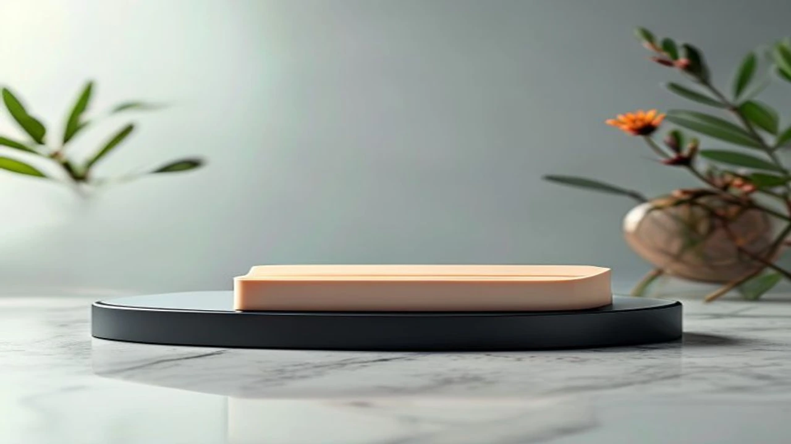
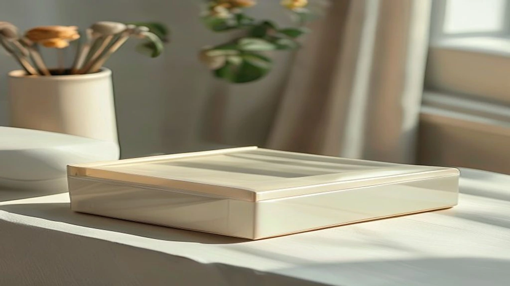

## 1. 지금 이 카테고리가 뜨는 이유 (시장 배경, 최신 트렌드)

2026년 7월 말, 평년보다 빨리 찾아온 역대급 폭염과 열대야로 실내 냉방 효율을 극대화하는 무선 에어 서큘레이터 수요가 폭증하는 중이다. 거실 에어컨의 찬 공기를 방 안쪽이나 주방까지 구석구석 전달하려면 단순 선풍기로는 한계가 명확하기 때문이다.

최근 소비 흐름의 핵심은 두 가지다. 첫째는 **초저소음 BLDC 모터의 표준화**다. 밤새 켜놓아도 18\~22dB 수준의 소음만 발생해 수면에 방해를 주지 않는다. 둘째는 **선 없는 무선 배터리의 편의성**이다. 전원 콘센트 위치에 얽매이지 않고 안방, 드레스룸, 베란다, 심지어 주말 캠핑장까지 그대로 들고 이동하는 라이프스타일이 정착했다. 

여기에 전기요금 인상 이슈까지 맞물리며 소비전력 20\~30W 수준인 BLDC 에어 서큘레이터는 에어컨의 최적 파트너로 평가받는다. 

---

## 2. TOP3 상품 스펙 비교

시장에 출시된 수많은 제품 중 성능, 소음, 가격, 소비자 평점을 다각도로 검증해 가성비, 밸런스, 프리미엄군 대표 모델 3개를 선별했다.

| 모델명 | 가격대 | 핵심 스펙 | 추천 대상 |
| :--- | :--- | :--- | :--- |
| **아이리스 PCF-HD15N** | 2만 원대 | AC 모터 / 소비전력 32W / 3단계 풍량 / 3D 각도 조절 | 소형 원룸 거주자, 초가성비 입문자 |
| **블랙앤데커 BXEF2102-A** | 6만 원대 | BLDC 모터 / 소비전력 24W / 24단계 풍량 / 22dB 초저소음 | 아이가 있는 가정, 가성비 스탠드형 선호자 |
| **루메나 FAN GRANDE 2** | 16만 원대 | BLDC 모터 / 10,000mAh 무선 배터리 / 18dB 극저소음 / 30단계 풍량 | 무선 이동성 우선, 감성 데스크테리어 선호자 |

실내 청정 및 청소 자동화 환경에 관심이 있다면 앞서 작성한 [[2026 올인원 로봇청소기 TOP3 비교](/posts/trending-picks/2026-all-in-one-robot-vacuum-top3/)] 가이드도 함께 참고하면 스마트홈 구축에 도움이 된다.

---

## 3. 예산대별 추천 (저가·중간·프리미엄 각 1개)

### 1) 저가형 (가성비 입문): 아이리스 PCF-HD15N

전체 직경이 작아 공간을 거의 차지하지 않으면서 직진성 강한 회오리바람을 뿜어내는 입문용 서큘레이터다.

* **핵심 스펙**: 소비전력 32W, 3단계 풍량 조절, 수동 상하 90도 각도 조절, 무게 1.4kg
* **장점**: 
  * 2만 원대 초반의 압도적 가성비로 부담 없이 구매 가능
  * kompakt한 크기 대비 직선 풍속이 강해 6\~8평 공간 공기 순환에 확실한 성능 발휘
* **단점**:
  * AC 모터 특성상 3단 가동 시 소음이 발생해 미세한 수면 환경에는 부적합
* **이런 사람에게 추천**: 원룸 자취생, 서재나 옷방 보조 냉방용 제품을 찾는 알뜰 소비자
* [아이리스 PCF-HD15N 쿠팡에서 보기](https://www.coupang.com/np/search?q=%EC%95%84%EC%9D%B4%EB%A6%AC%EC%8A%A4+PCF-HD15N&sourceType=affiliate&trackingCode=AF8691300)

### 2) 중간형 (밸런스 표준): 블랙앤데커 BXEF2102-A

스탠드형 디자인에 초고효율 BLDC 모터를 결합해 가정용으로 가장 무난하고 강력한 성능을 내는 모델이다.

* **핵심 스펙**: BLDC 모터, 소비전력 24W, 24단계 미세 풍량, 최소 소음 22dB, 좌우 자동 회전
* **장점**:
  * 1\~5단 저풍량 가동 시 소음이 거의 없어 열대야 수면용으로 최적
  * 24단계로 섬세하게 바람 세기를 제어할 수 있어 어린아이나 노약자가 있는 집에 적합
* **단점**:
  * 유선 전원 방식이라 이동 시 콘센트 연결 필요
* **이런 사람에게 추천**: 거실이나 안방에 고정해 두고 밤새 저소음으로 켜놓을 밸런스형 제품을 찾는 분
* [블랙앤데커 BXEF2102-A 쿠팡에서 보기](https://www.coupang.com/np/search?q=%EB%B8%94%EB%9E%99%EC%95%A4%EB%8D%B0%EC%BB%A4+BXEF2102-A&sourceType=affiliate&trackingCode=AF8691300)

### 3) 프리미엄형 (무선 올라운더): 루메나 FAN GRANDE 2

선이 없는 자유로움과 감성적인 세련된 디자인, 그리고 18dB의 극저소음을 모두 잡은 차세대 무선 에어 서큘레이터다.

* **핵심 스펙**: 10,000mAh 대용량 배터리, 최대 30시간 무선 가동, 18dB 극저소음, 30단계 풍량 조절, 분리형 안전망
* **장점**:
  * 완충 시 전원 선 없이 거실, 안방, 테라스, 캠핑장까지 자유롭게 들고 이동 가능
  * 나뭇잎 소리보다 작은 18dB 초저소음 설계로 예민한 사용자도 만족
* **단점**:
  * 16만 원대의 다소 높은 가격대 형성
* **이런 사람에게 추천**: 집안 곳곳을 이동하며 사용할 무선 제품이 필요하거나 야외 활동, 감성 인테리어를 중시하는 분
* [루메나 FAN GRANDE 2 쿠팡에서 보기](https://www.coupang.com/np/search?q=%EB%A3%A8%EB%A9%94%EB%82%98+FAN+GRANDE+2&sourceType=affiliate&trackingCode=AF8691300)

---

## 4. 구매 전 반드시 확인할 체크포인트

서큘레이터 구매 시 실패를 줄이려면 아래 3가지 수치를 체크해야 한다.

1. **모터 방식과 소음 수치 (dB)**: 밤에 켜둘 목적으로 구매한다면 반드시 **BLDC 모터** 제품을 골라야 한다. 사양표에서 최소 소음이 **25dB 이하**인지 확인하는 것이 수면 품질 확보의 기준이다.
2. **풍량 단계 및 미세풍 지원 여부**: 바람 단계가 3\~4단계로 단순한 제품은 자칫 바람이 너무 강하거나 약해서 불편하다. 최소 12단계 이상 미세 조절이 가능한 모델이 유용하다.
3. **분리 세척 구조**: 여름 내내 가동하면 날개와 안쪽 망에 먼지가 뭉친다. 전면망과 날개까지 도구 없이 손쉽게 분리되는 구조인지 꼭 체크해야 위생적으로 오래 사용한다.

#트렌드상품 #쿠팡추천 #트렌드상품추천 #무선서큘레이터 #에어서큘레이터 #서큘레이터추천 #여름가전추천 #BLDC서큘레이터